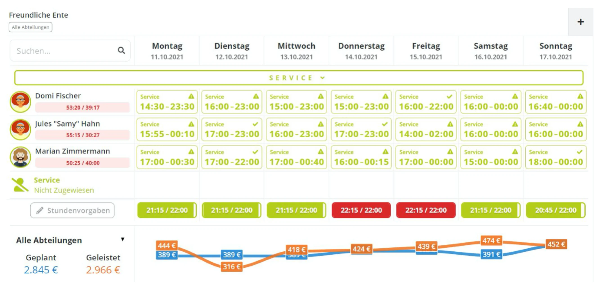
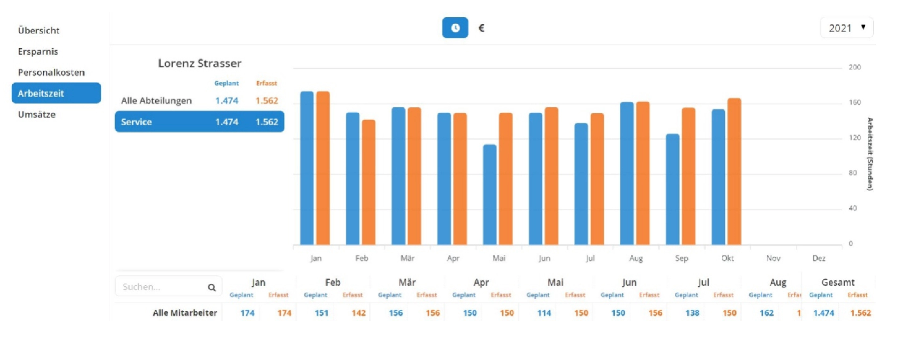
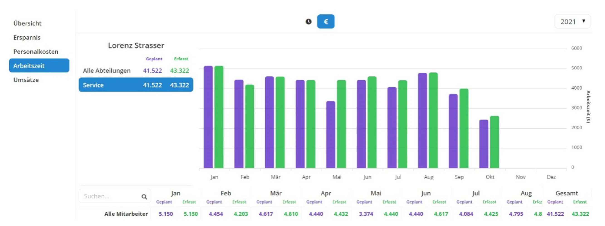

 *"Planen ist nichts anderes als schriftliches Denken mit Methode“* 

 *(Manfred Helfrecht)* 

## Wenn Planung auf Realität trifft

Ein gängiges Sprichwort lautet, dass ein Plan beim ersten Kontakt mit der Realität seinen Wert verliert. Das mag für das Militär gelten, es trifft jedoch nicht für die Dienstplanung komplexerer Unternehmen zu. **Denn ein Plan war nur dann wirklich gelungen, wenn er weitestgehend die spätere Wirklichkeit gespiegelt hat. Dazu aber muss er am Ergebnis überprüft werden.** Planung ist im Wesentlichen die gezielte Vorwegnahme von Ereignissen, die in der Zukunft liegen. In Hommage an Bertolt Brecht lässt sich auch sagen:

*
 Planen heißt bestimmen, was in der Zukunft eventuell geschehen wird. 
*

Dienstplanung bedeutet im konkreten Fall häufig, dass ein Planer Mitarbeitern Einsatzzeiten zuweist und dann froh ist, wenn alle Kollegen pünktlich zur Arbeit erschienen sind. Spätestens wenn das der Fall war und die Planung somit Vergangenheit geworden ist, wandert der Plan ins Altpapier. Selbst wenn der Planer die Arbeitseinsätze nach Zielvorgaben geplant hat, ist es nicht selbstverständlich ersichtlich, in welchem Umfang sich Planung und Wirklichkeit decken. **Hierzu ist der Blick in die Vergangenheit notwendig.** Nur mit Hilfe dieser Rückschau kann kontrolliert werden, ob sich die Mitarbeiter an die Vorgaben halten. Werden Planzeiten mit dem Mitarbeiterverhalten verglichen, kann auch erkannt werden, ob eventuelle Stundenvorgaben des Planers zu großzügig oder zu knapp bemessen sind.

> Bei den in der Folge gezeigten Beispielen verwenden wir die Abbildungen in unserer Software Pentacode. Aussagen von ähnlicher Kraft können Sie auch mithilfe von Excel erreichen, wenn auch nicht in grafischer Darstellung. **In unserem nächsten Blogartikel werden Sie deshalb die Möglichkeit haben, die entsprechende Formatvorlage für einen Dienstplan in Excel herunterzuladen.**

### Geplante und gestempelte Zeiten vergleichen

In Pentacode wird der Soll-Ist-Vergleich nicht nur im Vergleich von geplanten und tatsächlich aufgewandten Stunden, sondern auch auf Grundlage der minutengenau ermittelten Lohnkosten durchgeführt. Dadurch lässt sich bereits zum Zeitpunkt der Planung erkennen, wie hoch die Lohnkosten einer Abteilung oder auch des Gesamtunternehmens sein werden. An jedem abgeschlossenen Arbeitstag wird auch ersichtlich, **wie nahe der Plan an der Realität lag.**

Wie in unserem [vorangegangenem Blogartikel](/blog/zeiterfassung_dienstplanung) beschrieben, sind die geplanten Einsatzzeiten eines Mitarbeiters zum Zeitpunkt der Planung eine Investition in einen zu erwartenden Umsatz. Zu Kosten werden diese Zeiten erst, wenn Sie durch Arbeit in Anspruch genommen worden sind. Deshalb ist eine Vergleichsmethode unter der Berücksichtigung unterschiedlicher Lohnniveaus auch aussagekräftiger als eine Darstellung lediglich auf Basis von Stunden. So werden in Pentacode die Abweichungen zwischen geplanten und tasächlich geleisteten Arbeitszeiten in Stunden und in Euro (Arbeitgeberkosten) täglich dargestellt.

<figure>

<figcaption> Sie können auf einen Blick sehen ob sich der Arbeitsalltag auch nach der Planung richtet </figcaption>
</figure>

Die täglichen Ergebnisse werden in anderen Berichten der Software zusammengeführt und in aussagefähige Vergleiche gestellt. Die Werte werden dann unter anderem in Monatsergebnissen zusammengefasst und in Stunden und in Lohnsummen dargestellt.

<figure>

<figcaption> Darstellung der geleisteten Arbeitszeit in Stunden </figcaption>
</figure>

<figure>

<figcaption> Darstellung der geleisteten Arbeitszeit in Lohnsummen </figcaption>
</figure>

Diese Übersichten können Sie nach Abteilungen und nach einzelnen Mitarbeitern filtern. Damit ist es Ihnen möglich, „Ausreißer“ zu erkennen und in Zukunft gezielt und rechtzeitig eingreifen zu können.

**Durch die Kombination von gezielter Planung und smarter Zeiterfassung werden Sie mit erstaunlicher Einfachheit Ihre bisherigen Routinen „auf den Kopf“ stellen.**

**Und die Wirkung wird Sie in Erstaunen versetzen.**

## Fazit

Im Rahmen des Kundensupports lässt sich häufig erkennen, ob der Dienstplan von einem Bereichs- oder Abteilungsleiter oder vom Unternehmer selbst verfasst wurde. Bereichsleiter planen Arbeitszeiten oft „üppiger“ als dies der Unternehmer selbst tut. Ein Grund hierfür kann durchaus sein, dass sich der Bereichsleiter vor allem einem flüssigen operativen Ablauf verpflichtet fühlt. Unternehmer hingegen sind eher bereit, durch eine engere Planung operative Risiken einzugehen und dadurch Lohnkosten einzusparen.

Oftmals ist es jedoch auch der Fall, dass ein Abteilungsleiter nur zu geringe Kenntnis von der wirtschaftlichen Bedeutung der Planung hat. Er weiß meist einfach nicht, welchen Unterschied ein zeitversetzter Arbeitsbeginn der Mitarbeiter macht und wie wichtig ein zügiges „Aussteigen“ einzelner Kollegen ist, sobald es der Geschäftsverlauf zulässt. Gerade bei Fest- und Teilzeitbeschäftigten verringert dies in erheblichem Umfang leicht vermeidbare Überstunden. Und Überstunden kosten nicht nur Geld, sie sind auch eine Belastung für den Mitarbeiter.