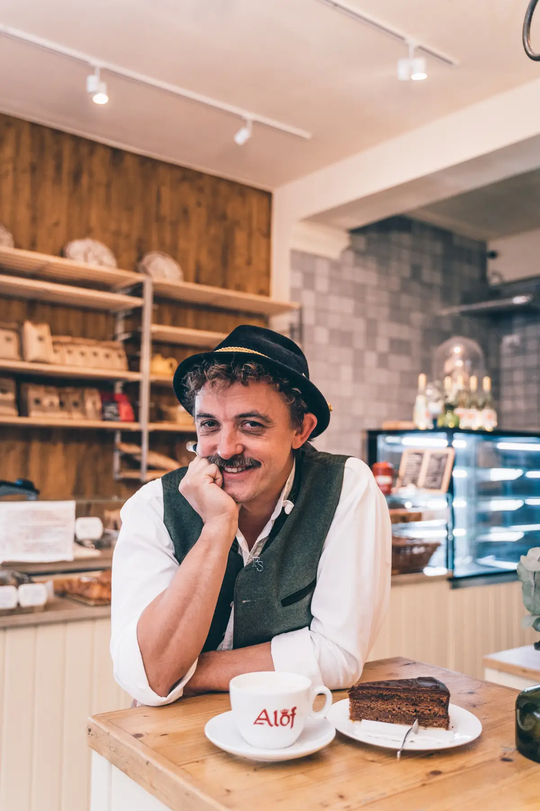

---
title:
    Back ma’s! - Vom Quereinsteiger zum Multigastronom mit smarter
    Personalplanung
slug: erfolgsgeschichte_baeckerei_alof
cover: Pentacode-konditorei-Alof-17.webp
coverAlt:
    "Fabian Stingl, Mitgründer der Bäckerei Alof, bereitet Kaffee an
    Siebträger-Maschine zu."
author: jtomski
publishDate: 2022-10-07
magazinCategories:
    - Das erfolgreiche Unternehmen
    - Das gesunde Team
    - Der zufriedene Kunde
---

Als Fabian Stingl, heute Multigastronom, 2010 mit Geschäftspartner Stefan Alof
die kleine aber feine Bäckerei und Konditorei Alof in München eröffnet, ahnt er
nicht, dass ihn neben der menschlichen Herausforderung der Personalführung bald
schon die Planung von rund 100 Mitarbeitern aufzufressen droht. Der Druck steigt
mit der Anzahl der Neueröffnungen. Dass die beiden Unternehmer heute gelassen
und zufrieden auf die Entwicklungen ihrer Betriebe blicken können, verdanken sie
auch smarter Personalplanung.

<figure class="float right">
  
  <figcaption>Im Alof-Angebot: Klassiker wie Sachertorte, aber auch vegane Trendkuchen.</figcaption>
</figure>

## Erst finden, dann führen

<cite>„Mit 100 Mitarbeitern hast du eine brutale Verantwortung. Der schwerste
Posten in Sachen Unternehmensführung ist einfach alles rund ums
Personal“</cite>, sagt Stingl und serviert uns dabei ein Stück Sachertorte, das
den Enthusiasmus der beiden Gründer für das klassische Bäcker- und
Konditor-Handwerk geschmacklich erahnen lässt. Die Bäckerei ist der erste und
älteste Betrieb, dem sich Stingl und Alof in Zusammenarbeit widmen. Erst soll es
eine Pizzeria werden, denn hippe Pizza-Spots liegen damals wie heute im Trend.

## Erfolg durch Authentizität

Nach einigen Überlegungen entscheiden sich die Unternehmer aber für die gute,
alte Bäckerkunst. **Kein Schnick-Schnack, dafür Authentizität und Anspruch.**
Gepaart mit einem kleinen Augenzwinkern (z.B. die beliebte Stigl-Breze mit Ei,
benannt nach dem Lieblingsfrühstück des Mitgründers) — das finden sowohl
Stammgäste als auch Laufkundschaft heute in der Bäckerei Alof. Ein Konzept, das
die Macher selbst verkörpern. Darum mag sich ein Besuch in dieser keinen
Wohlfühloase der Nachbarschaft auch immer ein bisschen anfühlen wie heimkommen.

<cite>„Genau so soll es sein“</cite>, bestätigt Fabian Stingl.

<figure>
  
  <figcaption>Geordnete Auslage, geordnetes Personalmanagement.</figcaption>
</figure>

## Chancen ergreifen – besonnen bleiben

Zu den zwölf Mitarbeitern in Café und Backstube kommen bald schon viele mehr
dazu. Denn Stingl wird vom Quereinsteiger aus der Filmbranche ebenso wie
Geschäftspartner Alof zum Vollblutgastronom, eröffnet einen Betrieb nach dem
anderen. Die Devise damals wie heute: Chancen ergreifen, die sich einem bieten.
Der Unterschied: **Heute haben sie mit Pentacode einen verlässlichen Partner an
der Seite, der die Abläufe in den Betrieben - Wirtshäuser, Kneipen, eine Kantine
und Co. - digital festhält, aufbereitet und jederzeit abrufbar macht.**

<cite>„Neben den rein menschlichen Herausforderungen ein Team zu führen, sind es
Zettelwirtschaft, Planung und Logistik, die dafür sorgen können, dass der
Arbeitstag eines Gastronomen nahezu 24 Stunden lang ist“</cite>, sagt Stingl aus
Erfahrung. <cite>„Es war einfach viel zu viel. Heute weiß ich, wie viel Lehrgeld
es kostet, wenn man naiv an sowas drangeht.“</cite>

## Ein zufriedener Gastgeber, ist ein guter Gastgeber

<figure class="float right width-30pc">
  
  <figcaption>Vom Quereinsteiger aus der Film-Branche zum Multigastronom: Fabian Stingl.</figcaption>
</figure>

Heute setzt Stingl auf mehr Fokus und damit weniger Unternehmungen. Und auf
Digitalisierung - weg vom „Firlefanz“ der Zettelwirtschaft. Pentacode spielt
dabei eine entscheidende Rolle. **Von der automatischen Dienstplan-Erstellung,
Zeiterfassung, Controlling bis hin zur Personalverwaltung: Während Bäcker und
Konditor Brot- und Tortenträume wahr machen und das Servicepersonal im Café
Cappuccino und Co. serviert, arbeitet Pentacode geräusch- und lückenlos im
Hintergrund.** Und ist dabei maximal intuitiv in der Anwendung.

So kommt es damals ohne große Schulungsprozesse in den Betrieben von Stingl und
Alof zum Einsatz. <cite>„Schon alleine, dass das langwierige Zusammenzählen von
Stundenzetteln wegfällt, ist ein echter Mehrwert. Die Zahlen sind strukturiert
und verlässlich. Das spart im Arbeitsalltag nicht nur Zeit, sondern beruhigt
mich als Unternehmer auch sehr.“</cite> Ein positives, persönliches Fazit, das
sich wiederum förderlich auf den geschäftlichen Erfolg auswirkt: <cite>„Mir
geht’s gut. Ich arbeite heute nicht mehr ganz so viel wie früher. Und unsere
Gastronomien stehen auch gut da. Das führt zu einer positiven Stimmung und das
merken natürlich auch die Gäste.“</cite>
