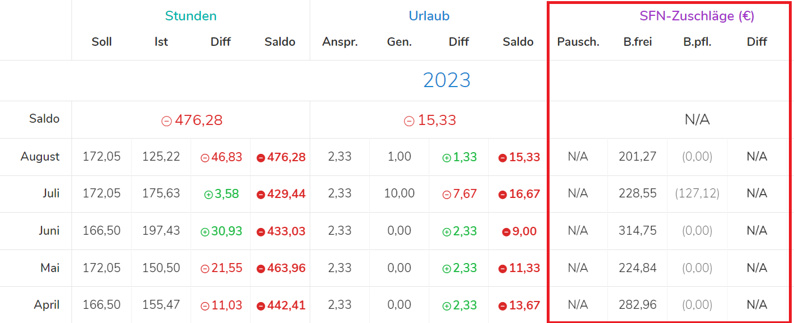

Wir sind weder Rechtsanwälte noch Steuerberater und dürfen deshalb keine rechtlichen oder steuerlichen Auskünfte geben. Das heißt jedoch nicht, dass wir vom strategischen Einsatz der SFN-Zuschläge nichts verstehen würden. Betrachten Sie die nun folgenden Tipps deshalb als Aufforderung, sich mit Ihrem Steuerberater zu besprechen, um von ihm eine verbindliche Auskunft zu erhalten.

## Tipp #1: Vorsicht bei Vertragsänderungen!

**Verändern Sie keine bestehenden Arbeitsverträge,** indem Sie Zuschläge von jetzt auf gleich in die Lohnauszahlung hinein rechnen und damit das Bruttogehalt senken. **Dies wäre brandgefährlich!**

Es ist davon auszugehen, dass Ihnen bei der nächsten Sozialversicherungsprüfung (zurecht) eine Abgabenkürzung unterstellt werden wird. In diesem Fall werden die Zuschläge dem ursprünglichen Lohn hinzugerechnet und Sie zahlen sowohl die daraus resultierenden Sozialabgaben wie auch die zusätzliche Lohnsteuer.

Um eine Hineinrechnung gefahrlos durchführen zu können, muss ein Beschäftigungsverhältnis für **mindestens zwei**, vorsichtshalber und deshalb am besten **drei Monate** unterbrochen sein. 

## Tipp #2: Nutzen Sie Zuschläge in Gehaltsverhandlungen

Sofern Sie Zuschläge noch nicht oder nur teilweise bezahlen: Nutzen Sie die Möglichkeiten, wenn die nächste Frage nach einer **Lohnerhöhung** gestellt wird.

Anstatt den Bruttolohn um insgesamt 200 € zu erhöhen, damit etwa die Hälfte beim Mitarbeiter ankommt, beginnen Sie besser mit Zuschlagszahlungen oder erhöhen bestehende Zuschläge, wenn hierzu noch „Luft“ ist. Damit entsteht Ihnen beim eben genannten Beispiel zwar ein Lohnaufwand von 100 Euro mehr, diese 100 Euro landen jedoch 1:1 beim Mitarbeiter.

## Tipp #3: Sie können Zuschlagszahlungen in der Höhe begrenzen.

Sie können mit dem Mitarbeiter vereinbaren, dass er, um beim Beispiel zu bleiben, Zuschläge bis zu einer Höhe von 100 € erhält. Auch diese können Sie ihm während des Jahres und unabhängig von seinen tatsächlichen Arbeitszeiten pauschal vorausbezahlen.

Sollte aus der Dokumentation am Jahresende hervorgehen, dass die Arbeitszeiten des Mitarbeiters keine Zuschläge von 1.200 € in Summe erreicht haben, gilt wie bereits beschrieben: Sie müssen die Differenz nachverbeitragen.

## Tipp #4: Vermeiden Sie Überbezahlung durch SFN-Pauschalen

Wenn Sie mit Mitarbeitern die Pauschalvorauszahlung von Zuschlägen vereinbart haben, ist ein gutes „Monitoring“ dringend erforderlich.

In Pentacode werden Anspruch und Vorauszahlungen fortlaufend saldierend in einer Übersicht dargestellt. Dadurch erhalten Sie die unmittelbare Kontrolle. Diese Übersicht kann aber auch von Ihrem Steuerberater erstellt werden. Dazu sollten Sie ihn auch verpflichten.

Denn falls Sie mit dem Mitarbeiter keine Begrenzung der Zuschläge nach oben vereinbart haben und Sie während des Jahres keine Übersicht haben, gerät die Lohnabrechnung im Dezember für Sie zum Zahltag.

In diesem Fall gilt, was bereits beschrieben wurde: Hat ein Mitarbeiter mehr Zuschläge erhalten, als ihm aufgrund seiner geleisteten und dokumentierten Arbeitsstunden zustehen, muss die Differenz "nachverbeitragt" werden. Für die Differenz sind damit Sozialabgaben und Lohnsteuer fällig.

Wenn einem Mitarbeiter aufgrund seiner geleisteten Arbeitsstunden hingegen mehr Zuschläge zustehen, als er bis zum Jahresende erhalten hat, muss die Differenz ausgezahlt werden. Der Auszahlbetrag ist jedoch sozialversicherungs- und lohnsteuerfrei.

<figure>

<figcaption> Pentacode übernimmt das Monitoring der Zuschläge ihrer Mitarbeiter vollautomatisch und punktgenau. </figcaption>
</figure>

## Fazit

Wenn Sie Zuschläge einfach so und ohne jede Einschränkung zahlen,
erhöht das die Lohnsumme zugunsten des Mitarbeiters.
**Das ist auch gut und freut den Mitarbeiter.**

Falls Sie Zuschläge jedoch mit Blick auf die Senkung von Lohnkosten und deshalb mit „Strategie“ verwenden wollen, ist es wichtig, in enger Absprache mit Ihrer Lohnbuchhaltung zu stehen.

Nicht jede Lohnbuchhaltung freut sich mit Ihnen, wenn Sie zur Zahlung von Zuschlägen übergehen. Manche Buchhalter betrachten das als eine Verkomplizierung ihrer Arbeit. Insbesondere, wenn Sie mit Vorauszahlungen arbeiten und deren Kontrolle benötigen, kann bei der Buchhaltung im Einzelfall auch Unlust aufkommen. Sie müssen deshalb nicht mit uns zusammenarbeiten, sie brauchen dann aber die Sachkenntnis und Unterstützung Ihrer Lohnbuchhaltung.

Pentacode verfertigt keine Buchhaltung, sie bereitet sie „nur“ so weit vor, dass die Daten fix und fertig ins Buchhaltungsprogramm importiert werden können. Wir kennen jedoch Agenturen, die über kompetente Kenntnis zu allen Möglichkeiten und eventuellen Fallstricken verfügen und sprechen hier gerne Empfehlungen aus.