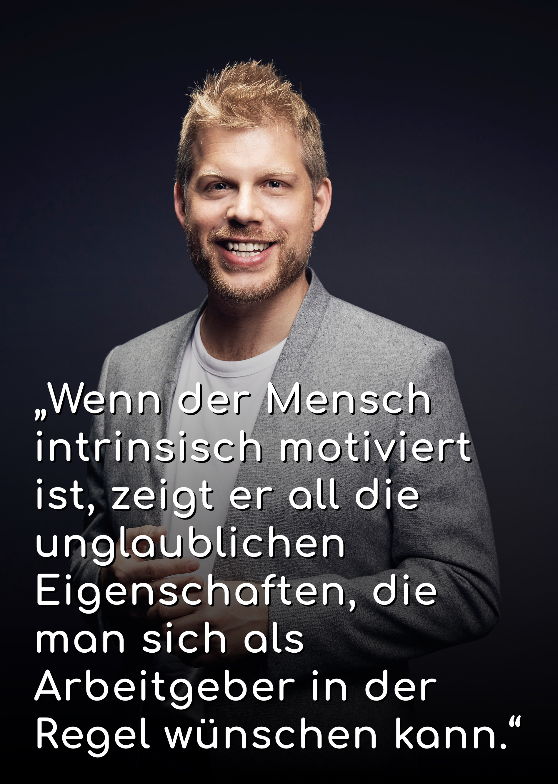

> Ähnlich wie im Spiel sind wir auch am Arbeitsplatz auf der Suche nach
> subjektiv empfundenem Fortschritt. Ähnlich wie im Spiel sind wir auch bei der
> Arbeit auf der Jagd nach unserem besseren Ich.
>
> <cite>- Roman Rackwitz</cite>

[Roman Rackwitz](https://www.romanrackwitz.de/), der führende Experte für
Gamification im deutschsprachigen Raum, weiß: Ein Unternehmen, das in Sachen
Mitarbeitermotivation ausschließlich auf hohe Löhne, Boni und Nettigkeiten wie
Obstkörbe und Partyexzesse setzt, wird nie sein volles Potential entfalten.
Stattdessen gilt es, Rahmenbedingungen zu schaffen, in denen das Gehirn jedes
Mitarbeitenden auf Hochtouren laufen kann. Und zwar völlig frei von
Wettbewerbsmentalität, einzig und allein aus dem inneren Willen heraus, einen
guten Job zu machen.





## Die unterschätzte Macht der inneren Einstellung

<cite>„Der Begriff ‚intrinsische Motivation‘ ist simpel erklärt: alles das, was du
tust, um es zu tun - nicht etwa, weil man dir etwas dafür gibt, sondern weil du
einfach Bock darauf hast - das tust du aus intrinsischer Motivation heraus“</cite>,
erklärt Rackwitz. <cite>„Ein ganz konkretes Beispiel: Ein Student, der in der Uni
sitzt, um Arzt zu werden, ist extrinsisch motiviert. Einer, der in der Uni
sitzt, weil der Professor die Inhalte so inspirierend vermittelt und die
Wissensaufnahme Freude macht, wird zu hohem Maße intrinsisch motiviert sein. Das
eine Szenario ist resultatgetrieben, das andere aktivitätsgetrieben. Wichtig
ist, dass man weiß: es gibt nicht das eine oder das andere Extrem. Es sind immer
Abstufungen. Ich werde es nie schaffen, jemanden zu 100 Prozent intrinsisch zu
motivieren. Dafür sind die Faktoren, die darauf Einfluss nehmen, viel zu
individuell. Aber hier kommt die gute Nachricht: **Wenn der Anteil an
intrinsischer Motivation bloß zu einem kleinen Prozentsatz steigt, ist das
bereits ein extremer Performance Treiber.**“</cite>

## Was hohe Bezahlung in puncto Motivation wertlos macht

Nun stellt sich die Frage: Wenn es so schwer ist, intrinsische Motivation
hervorzurufen, aber so leicht extrinsisch zu motivieren, warum sollte ich denn
als Arbeitgeber nicht einfach auf materielle Belohnung setzen? Vorausgesetzt
natürlich, ich habe das Budget dazu. <cite>„**Je mehr ich intrinsische Motivation
in den Fokus nehme, desto weniger Fluktuation habe ich im Team**. Mitarbeitende
bleiben lange im Unternehmen, mit ihnen das Wissen und die Ausgaben für
Recruiting Maßnahmen sinken deutlich“</cite>, fasst Rackwitz zusammen. Und wie
jedes Unternehmen, das regelmäßig auf die zähe Suche nach qualifizierten, neuen
Mitarbeitenden geht, weiß: der Begriff „war for talents“ kommt nicht von
ungefähr. <cite>„Mehr Urlaubstage, ein höherer Bonus, ein schicker Firmenwagen,
das alles kann die Konkurrenz auch bieten. Es kann also kopiert werden. Und das
macht es wertlos.“</cite> Unternehmen, die ihre Talente langfristig binden
möchten, sollten sich lieber fragen: **Was ist unser Alleinstellungsmerkmal mit
dem wir neue Kräfte anziehen können?** Und wie halten wir die guten Personalien im
Haus?





## Ein Selbstläufer für individuellen und unternehmerischen Wachstum

Die Antwort steckt statt in den quantitativen, in den qualitativen
Charakteristiken des Arbeitsumfeldes. Rackwitz erläutert: <cite>„Wer
Rahmenbedingungen schafft, die das menschliche Gehirn fordern und es dazu
anregen, sein volles Potential zu entfalten, der hält seine Teamspieler nicht
nur ständig am Ball, er sorgt auch dafür, dass der Output ganz von alleine
steigt und vor allem qualitativ besser wird.“</cite> Nebenher werde man
automatisch zu einem attraktiven Arbeitgeber, weil die Menschen, die für einen
arbeiten, das gerne tun und zu potentiellen Botschaftern werden. <cite>„Es ist
seit Jahrzehnten erforscht, aber wird leider in der Regel von Unternehmen
komplett ignoriert: **Wenn der Mensch intrinsisch motiviert ist, zeigt er all
die unglaublichen Eigenschaften, die man sich als Arbeitgeber in der Regel
wünschen kann.** Er ist kreativ, flexibel und extrem resilient. Ihn oder sie
wirft so schnell nichts aus der Bahn. Denn selbst, wenn ich scheitere, aber den
Weg dorthin schon als etwas Positives empfunden habe, weil ich daraus Schlüsse
ziehe, bin ich keinesfalls frustriert, sondern angeregt es wieder und wieder zu
probieren.“</cite> Ein intrinsisch motivierter Mensch wird also ziemlicher
Wahrscheinlichkeit nach aus der Situation lernen, seine Strategie anpassen und
in seinem Metier wachsen.

## Dienstleistung erfordert Motivation





Aber warum ist es so, dass Unternehmen klassischer Weise davon ausgehen, dass
Arbeitnehmer eine Lohnerhöhung einem Job, der fördert und fordert, vorziehen?
Rackwitz erklärt es mit dem Umbruch der Wirtschaftssysteme: <cite>„Im Zeitalter
der Industrialisierung war es egal wie motiviert ein Mitarbeiter war. Er saß in
der Fabrik und tat den ganzen Tag nichts anderes als Teil A an Ort B zu heben.
Heute ist kein maschineller Output mehr gefragt. Wir sind eine
Dienstleistungsgesellschaft geworden. Gefragt sind Kreativität, Designtalent,
Innovation, Marketinggespür, Psychologie. Es ist nicht mehr wichtig, was du
machst, sondern wie du es machst.“</cite> Nur wer intrinsisch motivierte und
damit kreative Mitarbeiter hat, die ein „growth mindset“ haben, also die innere
Einstellung, die das persönliche Wachstum über die schnelle, materielle
Zielerreichung stellt, kann sich als Dienstleister durch qualitativ guten Output
aus der Masse hervorheben.

## Die Erfahrung zeigt: Der Umbruch birgt Herausforderungen

Und wie schaffe ich nun als Arbeitgeber die Rahmenbedingungen, die intrinsische
Motivation begünstigen? Rackwitz: <cite>„Wir alle lieben Herausforderungen: wir wollen
unsere Zeit nicht verschwenden mit Dingen, die jeder machen kann, die uns nicht
weiterbringen. Wir wollen wachsen. Also müssen auch unsere Aufgaben mit uns
wachsen.“</cite> Jeder kennt es aus dem eigenen Leben, aus dem Bereich Sport und Hobby:
Spielt man Tennis und steigt auf, werden auch die Matches schwerer. Denn man hat
es mit besseren Gegnern zu tun. Im Modellbau würde man nie zweimal das gleiche
Modell bauen, sondern steigert sich stetig in Größe und Komplexität. <cite>„Wir machen
es uns freiwillig selber kontinuierlich schwerer“</cite>, kommentiert der
deutschsprachige Gamification Pionier. Aus der Zusammenarbeit mit vielen
Unternehmen für die er beratend tätig ist, weiß er: <cite>„Immer mehr Firmen merken,
dass wenn sie Prozesse maximal effizient gestalten, sparen sie zwar Ressourcen.
Aber die Gefahr ist groß, dass es für das menschliche Gehirn langweilig ist.“</cite>
Die Herausforderung lautet also: **Workflows soviel Struktur geben, dass sie
kalkulierbar sind, aber eben auch Raum zur kreativen Gestaltung zulassen.**

## Drei Faktoren zur Steigerung intrinsischer Motivation





Wir wissen nun: Die Aufgaben am Arbeitsplatz müssen mit den Mitarbeitenden
wachsen, damit er oder sie im Flow bleibt. Also im Zustand, der kontinuierlichen
Motivation und des Fortschritts. Rackwitz weiß, neben dem Punkt „Fortschritt“
gibt es zwei weitere Faktoren, die intrinsische Motivation begünstigen: <cite>„Wenn
man sehr motivierte Menschen befragt, warum sie motiviert sind, werden im Kern
immer diese Punkte artikuliert: 1. Ich will besser werden in dem was ich tue. 2.
Ich möchte eine gewisse Kontrolle haben über meinen Arbeitsalltag - selbst wenn
das n der Regel nur ein subjektives Empfinden ist - und 3. Mein Job muss einen
Impact haben. Letzterer ist ein ganz individueller Punkt und rangiert auf der
Skala der Sinnhaftigkeit von ‚Leben retten‘ bis ‚seinen Job gut machen, damit
andere ihren gut machen können.‘“</cite>

## Modernes Personalmanagement – ein Ausblick

Alle Untersuchungen rund um das Thema intrinsische Motivation und den Effekt den
sie auf den Erfolg jedes einzelnen und den des Unternehmens als Ganzes hat,
zeigt: **Modernes Personalmanagement muss sich weiterentwickeln** - weg von der
verwaltenden hin zur psychologischen Komponente. Denn auch, wenn es sicherlich
der einfache, weil naheliegende Weg ist: **Menschen viel zu bezahlen, reicht heute
nicht mehr aus, um die Besten für sich zu gewinnen. Man muss sie dazu befähigen,
ihrem besseren Ich nachzujagen – so wie im Spiel.** Welchen entscheidenden
Einfluss die Faktoren „Transparenz“ und „Zielvorgaben“ darauf haben, klären wir
in einem nächsten Beitrag.
