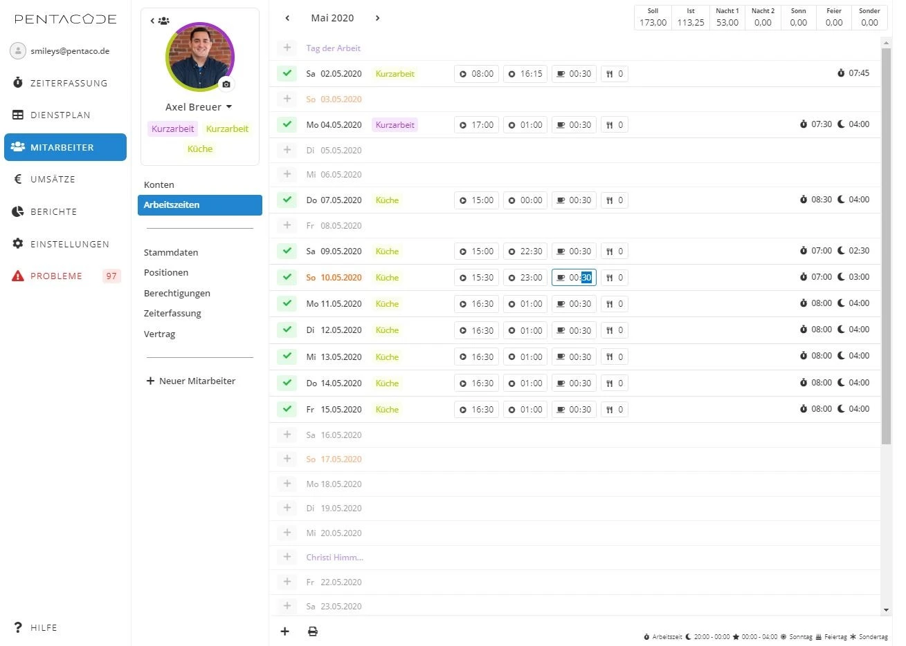
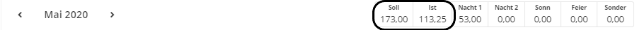
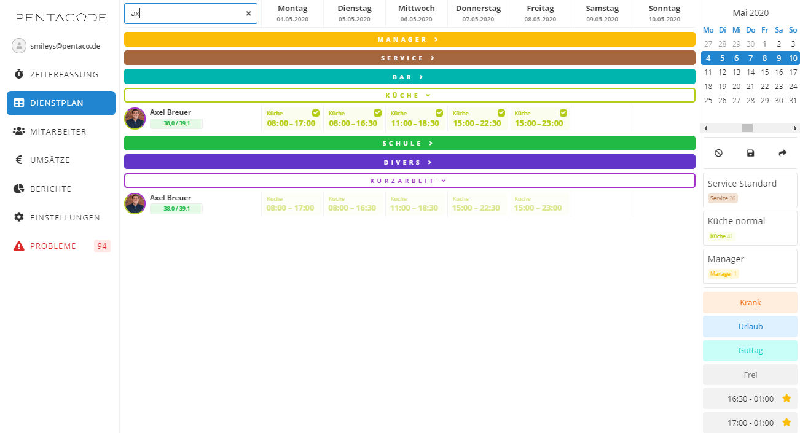
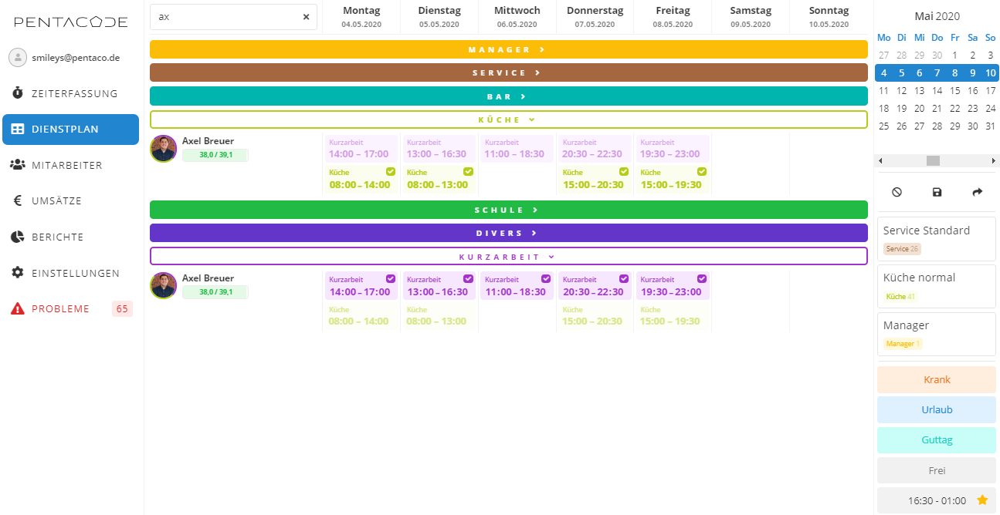
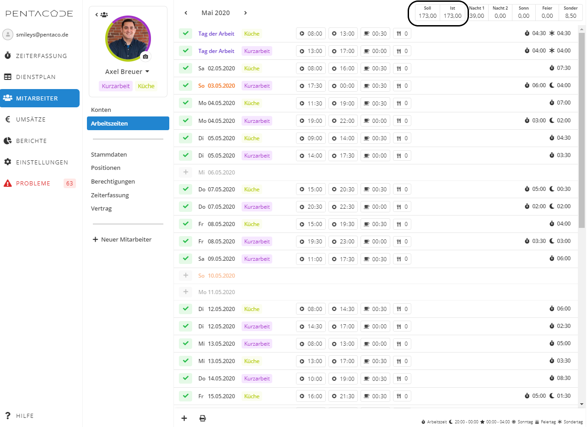

<code> „Wir sind nicht naiv, und wir haben einen langen Atem“ </code>
**(Daniel Terzenbach, Vorstand der Bundesagentur für Arbeit)**

Kurzarbeit war für die allermeisten Gastronomen bis zur Corona-Epidemie ein
Fremdwort. Kurzarbeit betraf Mitarbeiter in der Schwerindustrie und in der
Automobilherstellung, aber doch nicht Hotels und Restaurants. Mit der
behördlichen Schließung aller gastronomischen Betriebe, ein bisher absolut
einmaliger Vorgang, wurde die Kurzarbeit auch in unserer Branche zu einem
Massenphänomen.

Um den Unternehmen in wirtschaftlicher Notlage, und damit auch buchstäblich
allen Gastronomien in Deutschland, schnell Unterstützung zukommen zu lassen,
wurden die Hürden gesenkt und die Verfahrenswege stark gekürzt. Vor allem wurden
die normalerweise notwendigen Formalitäten vereinfacht, die bis Covid-19 zu
erfüllen waren und es wurde nur sehr oberflächlich geprüft, ob in einem Betrieb
wirklich unvorhersehbar und unverschuldet Arbeit weggefallen ist. Die Begründung
lag mit der behördlichen Schließung ja auf der Hand.

Die nur flüchtige Prüfung des Antrags und dessen schnelle Bewilligung bedeuten
jedoch nicht, dass die Staatskasse Geldgeschenke ausreicht. Die Bundesagentur
für Arbeit hat ein dreistufiges Verfahren zur Überprüfung: Zuerst bei der
Anzeige der Kurzarbeit, dann bei der monatlichen Abrechnung und schließlich bei
der Abschlussprüfung. Spätestens dann wird die Rechnung mit dem Wirt gemacht.

*„Wenn in einem Betrieb die Kurzarbeit endet, machen wir die Schlussrechnung. Da
schauen wir dann sehr genau hin… Außerdem suchen wir mit Analyse-Software … nach
Auffälligkeiten“.* (Daniel Terzenbach)

Während der Finanzkrise in den Jahren 2009 und 2010 meldeten 60.000 Firmen
Kurzarbeit an. In 1.500 Fällen bestand der Verdacht auf Falschangaben, 850 davon
wurden an die Staatsanwaltschaft und den Zoll abgegeben. Bis Ende Mai wurde in
diesem Jahr 840.000 Firmen Kurzarbeit bewilligt. Innerhalb weniger Monate
übertrifft damit die Anzahl der kurzarbeitenden Firmen in 2020 den Rekord der
beiden Krisenjahre um das 14-fache.

Die Gastronomie gilt bei Betriebsprüfern als „bargeldintensives Gewerbe“ und
historisch bedingt als „Risikoprüfung“, so der Fachjargon. Leider wird dem
Gastronomen noch heute öfter ein Mangel an Redlichkeit unterstellt, ein Vorwurf,
unter dem die vielen steuerehrlichen und sauber arbeitenden Unternehmer in
dieser Branche völlig zu Unrecht leiden. Diese sehen sich bei Steuerprüfungen
häufig Unterstellungen gegenüber, bei denen in einem anderen Zusammenhang
durchaus über Anzeige wegen Verleumdung nachgedacht werden könnte. Es werden
Rechtfertigungen und ein Belegwesen eingefordert, wie in diesem Maße bei kaum
einer anderen Branche. Man denke beispielsweise nur an die Ausbeuteschätzung
beim Kaffee.

Es bleibt zu sehen, mit welcher Geisteshaltung die Überprüfung der Kurzarbeit
durchgeführt werden wird. Denn eines sollte jedem klar sein: Jeder wird
überprüft werden. Umso wichtiger ist deshalb eine saubere Dokumentation.
Grundsätzlich gibt es zwei Möglichkeiten, Arbeitszeit und Kurzarbeit zu
dokumentieren: in Form des pauschalen Ausweises der Kurzarbeitszeit oder durch
das Führen eines „fiktiven Dienstplans“. Die Art der Dokumentation sollte in
jedem Fall mit dem Steuerberater abgesprochen werden. Zu Ihrer eigenen
Sicherheit sollten Sie dessen Hinweise zur Dokumentation von ihm in
schriftlicher Form erhalten.

Die hier gezeigten Abbildungen geben die Dokumentation in Pentacode wieder.
Andere Softwarelösungen werden vermutlich ähnliche Funktionen bieten. Sie können
das gewünschte Ergebnis jedoch auch mit Excel-Tabellen erreichen, wenn Sie diese
für Ihre Dienstplanung und Arbeitszeitdokumentation gewohnt sind.

## Pauschale Ermittlung der Kurzarbeit

1.	Sie ermitteln für jeden Mitarbeiter und täglich die tatsächliche Arbeitszeit





2.	Sie ermitteln am Ende des Monats die Differenz zwischen der Soll-Arbeitszeit
des Mitarbeiters und seiner tatsächlich geleisteten Arbeitszeit 





Im hier gezeigten Beispiel hätte der Mitarbeiter 173 Stunden arbeiten sollen,
hat jedoch nur 113,25 Stunden gearbeitet. Die Differenz - also 59,75 Stunden –
ist die Kurzarbeit.
Wenn Sie für Ihre Mitarbeiter ein „Jahresarbeitszeitkonto“ führen, sollten Sie
diesem die Kurzarbeitszeit hinzubuchen, um das Konto auf „0“ Über-/Minderstunden
auszugleichen.

## „Fiktiver Dienstplan“

Genauer und deshalb empfehlenswerter ist der tägliche Ausweis der Arbeits- und der Kurzarbeitszeiten. Wenn eventuelle SFN-Zuschläge Teil des Kurzarbeitsgeldes sein sollen, so ist diese Form der Dokumentation unerlässlich.
Wie dies aussehen könnte, soll dieses Beispiel zeigen. Aus Gründen der Übersichtlichkeit haben wir nur einen Mitarbeiter gefiltert.

1.	Sie schreiben wie gewohnt den Dienstplan





2.	Sie korrigieren die geplanten um die tatsächlichen Arbeitszeiten und weisen
die verbleibende Differenz täglich als Kurzarbeit aus





3.	Arbeitszeitkonto des Mitarbeiters
In Pentacode entsteht in der Folge das Arbeitszeitkonto des Mitarbeiters automatisch.





Hier werden Tag genau und differenziert innerhalb eines Tages die Arbeitszeiten
und Kurzarbeitszeiten dargestellt.
Sollten Sie mit Excel arbeiten, empfehlen wir Ihnen, eine entsprechende Liste zu
erstellen. Der Aufwand ist überschaubar, kann aber bei einer Prüfung Schaden
vermeiden. Und die Prüfung wird kommen. Ganz sicher.
Egal, mit welchem Medium Sie arbeiten, ob mit Pentacode oder Excel: Dieses Konto
sollten Sie unbedingt und in jedem Einzelfall vom jeweiligen Mitarbeiter
unterzeichnen lassen. Damit erfüllen Sie nicht nur eine Formvorschrift. Der
Mitarbeiter bestätigt mit seiner Unterschrift die Richtigkeit Ihrer
Arbeitszeitdokumentation und schützt Sie so im Prüfungsfall.

Buchstäblich Hopfen und Malz dürfte bei jenen verloren sein, die Daniel
Terzenbach als einen der typischen Fälle bezeichnet:
*„Jemand stellt noch schnell Familienangehörige ein, und das auch noch zu unüblichen und unglaublich hohen Löhnen, um dann für sie Kurzarbeitergeld zu kassieren“.*
Hier droht, wie Terzenbach sagt, *„…bei einem echten Betrug eine
Freiheitsstrafe…“.*

Bis bald!
Ihr Pentacode Team

(Alle Zitate von Daniel Terzenbach sind einem Interview von „Die Zeit“, Ausgabe
22/2020 vom 20.Mai 2020 entnommen)