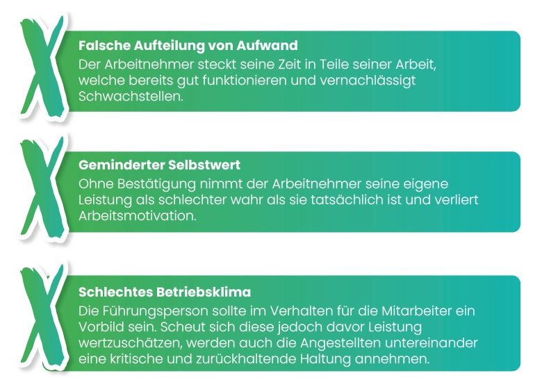

 *„Feedback ist das Frühstück der Champions“* 

 *Ken Blanchard*  

„Nicht geschimpft ist genug gelobt“ ist immer noch die vorherrschende Meinung in vielen Führungspositionen. Dabei haben wir besonders im deutschen Kulturkreis fast schon eine Aversion dagegen, gute Leistung gebührend zu loben. Feedback besteht oft vor allem aus dem Kritisieren dessen, was falsch gelaufen ist, Anerkennung ist rar gesät. Dabei ist Lob eine der **einfachsten und effizientesten Methoden, die Motivation und das Arbeitsengagement unserer Mitarbeiter zu fördern**. Und das ohne große Veränderungen oder Investitionen.

## Wertschätzung ist essenziell

Aufs erste wirken Lob und Wertschätzung wie ein Extra. Klar - Mitarbeiter freuen sich, wenn sie etwas Gutes hören, aber wirklich nötig ist es nicht. Doch mit dieser Annahme täuschen sich gefährlich viele Arbeitgeber und riskieren dabei besonders in Zeiten des Fachkräftemangels essenzielle Mitarbeiter.

**Denn fehlende Anerkennung und Wertschätzung werden regelmäßig von Mitarbeitern als der häufigste Kündigungsgrund angegeben!** Dadurch über-trifft zu geringe Wertschätzung sogar noch Stress in der Arbeit und ein zu niedriges Gehalt regelmäßig in Umfragen. Doch wie kann es sein, dass das Fehlen von wenigen positiven Worten eine so gravierende Auswirkung hat?

## Warum Lob so wichtig ist

Als soziale Spezies achten wir Menschen stetig auf die Reaktionen unseres Gegenübers und unserer Gruppe. Bekommen wir kein klares Feedback dazu, wie wir unsere Arbeit erfüllen, tappen wir im Dunkeln. Da unser Überleben früher maßgeblich von unserer sozialen Position und der Gunst anderer abhing, führt **das Ausbleiben von Feedback** bei Vielen **zu Unsicherheit** – unser Gehirn kann nicht feststellen, ob wir uns „richtig“ verhalten und uns somit sicher fühlen. Diese Unsicherheit zeigt sich dann in negativen Konsequenzen für Arbeitnehmer und Arbeitgeber:

<figure>
  
  <figcaption> </figcaption>
</figure>

**Fehlende Wertschätzung** sollte dabei auch klar als **schädlich** für [Autonomie](/blog/motivation_6_autonomie/) und Kompetenz der Mitarbeiter gesehen werden. Durch die Bestätigung guter Leistung geben wir dem Mitarbeiter das Recht, künftig mehr auf seine eigenen Fähigkeiten vertrauen zu können. Zusätzlich wird auch sein [Gefühl der Bedeutsamkeit](/blog/motivation_9_bedeutsamkeit/) gestärkt – denn wir vermitteln „du machst etwas Wichtiges!“. Ohne dieses Feedback wird er jedoch aus Unsicherheit vermehrt Bestätigung suchen und weniger autonom arbeiten können.

Deshalb sollten wir Anerkennung und Lob stets als **Hygienefaktor** sehen, also als Basis, die ein Mitarbeiter benötigt, um überhaupt motiviert arbeiten zu können. Was Hygienefaktoren auszeichnet - darüber haben wir [hier](/blog/motivation_2_hygienefaktoren/) geschrieben.

## Wie man richtig lobt

Wertschätzung zu äußern ist kein Hexenwerk, vielen fällt es jedoch trotzdem nicht einfach, aus der Angst aufdringlich zu wirken oder, dass der Mitarbeiter sich danach nur „auf seinen Lorbeeren ausruhen“ würde. Handeln wir beim Loben jedoch nach einigen Faustregeln, können wir diese Befürchtungen getrost beiseitelegen. 

### Authentisch loben

Lob sollte **nie erzwungen** sein, nur um Wertschätzung zu zeigen. Wir sollten Dinge loben, die uns tatsächlich positiv auffallen. So stellen wir sicher, dass wir uns nicht verstellen müssen und dass unser Lob auch tatsächlich seinen Wert behält. Gleichzeitig merken wir so auch ungemein schnell, welche Mitarbeiter regelmäßig Lob verdient haben und welche mit konstruktiver Kritik geweckt werden müssen.  

### Sicht für das Positive schärfen

Manchmal kann es uns besonders schwierig fallen, im Gewirr der täglichen Herausforderungen und Probleme gute Leistung wahrzunehmen. Hierzu ist es sinnvoll sich vor Feierabend ein paar Minuten zu nehmen, um sich die Fragen zu stellen: **Was ist heute gut gelaufen? Und wem kann ich dafür dankbar sein?** Nach einiger Zeit werden diese Fragen zum Automatismus und unser Blick für das Positive wird gestärkt. 

### Konkret und Leistungsorientiert

Aus der Verhaltenspsychologie wissen wir, dass es uns deutlich einfacher fällt Ereignisse zu verknüpfen, welche zeitlich zusammen auftreten. Wir sollten deshalb stets versuchen, Lob **sofort zu äußern**, wenn uns etwas positiv auffällt. Zudem sollte das Lob stets **konkret sein** und sich **auf die Leistung** eines Mitarbeiters **konzentrieren**. Vage Aussagen wie „gute Arbeit“ oder „Sie sind ein toller Mitarbeiter“ können gestellt wirken und beinhalten wenig Information um zukünftige Handlungen zu lenken.

## Fazit

Lob ist eine der einfachsten und wirksamsten Methoden, um Mitarbeiter zu motivieren, sie in ihren Fähigkeiten zu bestärken und sie an das Unternehmen zu binden. Kaum etwas anderes ist so unmittelbar wirksam wie ein ehrliches „Du hast … sehr gut gemacht – du bist eine Bereicherung für unseren Betrieb“. Gleichzeitig sollten wir immer darauf achten ein Gleichgewicht zu halten und **spendabel aber nicht verschwenderisch** mit unserer Anerkennung umzu-gehen. So stellen wir sicher, dass das Lob auch seinen Wert behält.

Falls Sie normalerweise eher eine Person weniger Wörter sind, laden wir Sie dazu ein, es einmal einige Tage zu versuchen und die Reaktion ihrer Mitarbeiter zu beobachten. Solange Sie keine leeren Worte und „Wertschätzung aus der Dose“ von sich geben, sind wir sicher, dass ihre Mitarbeiter die guten Worte mit viel Bereitschaft annehmen.

Ein netter Nebeneffekt: Anerkennung kann bewirken, dass Angestellte ihren Schutzschild etwas fallenlassen und auch **Kritik zukünftig besser annehmen**. Denn natürlich braucht auch Jeder konstruktives Feedback, wenn was nicht so gut gelaufen ist. Wie wir ein Verfehlen gut kommunizieren und dabei verhindern, dass unsere Angestellten die „Ohren versperren“ – dazu mehr im folgenden Artikel!

Ihr Pentacode Team!