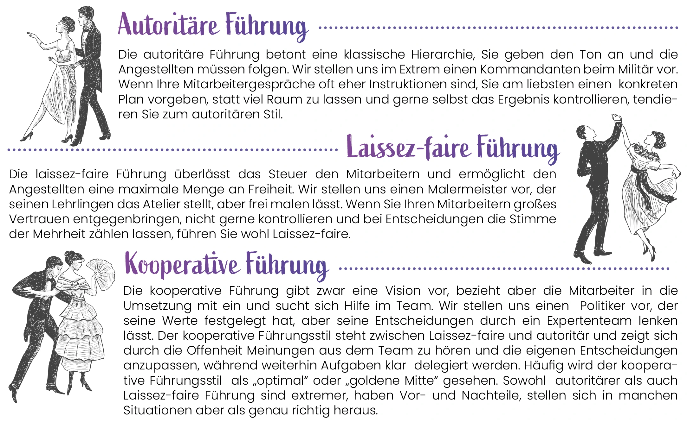

 *„Wie man in den Wald hineinruft,
so schallt es heraus!“* 

 *Redensart*  

Die Stimmung und Effizienz eines Teams werden maßgeblich von einer Person bestimmt – der Führungskraft. Die Art und Weise, wie ein Betrieb geführt wird, ist äußerst individuell. Dennoch hat die Psychologie einige **Führungsstile** identifiziert, in denen sich fast jede Führungskraft wiederfinden kann.

Warum Flexibilität im Führungsstil wichtig ist und wie man sie übt, darum soll es in diesem Artikel gehen. Doch zu allererst sollten wir unseren eigenen Führungsstil erst einmal ermitteln.

## Wie führen wir eigentlich?

Jeder von uns hat einen gewissen Führungsstil, zu dem wir am meisten tendieren. Trotzdem kann sich dieser auch von Situation zu Situation unterscheiden – warum das so auch gut ist, dazu weiter unten mehr. Wir unterscheiden klassisch zwischen **mehr und weniger kontrollierenden Führungsstilen**:





## Flexible Führung siegt

**Generell gilt: Nicht ein Führungsstil ist richtig – es kommt auf die aktuelle Situation an.**

*Im gängigen Arbeitsalltag* ist die kooperative Führung wohl am sinnvollsten. Die Mitarbeiter wissen stets, was zu tun ist und das Miteinbeziehen ihrer Meinung [fördert das Kompetenzgefühl](/blog/motivation_8_unterforderung/), sowie die Motivation. **Regelmäßiger Austausch trägt zu gutem Arbeitsklima bei**, man kann sich längere Diskussionen im Team leisten und gemeinsam Lösungen finden. 

*Unter starkem Zeitdruck oder bei Unklarheit* wäre eine kooperative Führung zu langsam und Diskussionen nicht zielführend. Die Führung sollte autoritärer werden, klar Aufgaben delegieren und die **Arbeitslast im Team erhöhen**. Die Situation sollte dabei immer gut im Team kommuniziert werden – so ist klar, dass die autoritäre Führung kein Dauerzustand, sondern der Situation geschuldet ist. 

*Beim Entwickeln und bei kreativen Projekten* kann die Führungskraft schnell die Angestellten zu stark einschränken und potenzielle Innovationen im Keim ersticken. Hier ist eine Laissez-faire Einstellung wertvoll, um den Mitarbeitern Freiraum zu geben ihr **eigenes Wissen und ihre Neugierde** einzubringen. Zudem verschafft sich die Führungskraft selbst viel Raum, um an eigenen Projekten zu arbeiten.

## Stilwechsel soll gelernt sein

Die eigene Führung flexibel zu gestalten, genug Freiraum zu bieten und das Team mit einzubeziehen, ohne seine Rolle als Vorgesetzter aufzugeben oder Entscheidungen unnötig in die Länge zu ziehen, ist eine extrem anspruchsvolle Aufgabe. Viele Vorgesetzte finden sich dabei eher **schnell zu weit auf der autoritären Seite**. Sollte das der Fall sein, kann man folgende Strategie in Erwägung ziehen:

Die **20% Methode** wurde ursprünglich von Technologiefirmen wie Google genutzt, um **Produktinnovation zu erhöhen**. Dabei wurde den Mitarbeitern jede Woche ein Tag (oder 20%) ihrer Arbeitszeit freigestellt, um an eigenen Projekten zu arbeiten. Natürlich können wir die Maschinerie eines IT-Riesenkonzerns nicht einfach nachahmen. Trotzdem: Auch nur ein Tag im Jahr, oder eine Stunde jede Woche, die Brainstorming und Innovation gewidmet sind, zwingen **Kontrolle los- und Innovation zuzulassen**. 

## Fazit

Das Maß an Kontrolle im eigenen Führungsstil beeinflusst maßgeblich das Unternehmen und die Motivation der Mitarbeiter. Indem wir erkennen, wo wir uns auf dem Spektrum befinden und beobachten, wie das eigene **Führungsverhalten an unterschiedliche Situationen angepasst** werden kann, sind wir  den meisten Führungskräften bereits einen Schritt voraus.

Die Führungskraft kann den Betrieb aber noch auf andere Weisen beeinflussen. Die **Vorbildfunktion** ist dabei ganz zentral. Warum es so wichtig für das soziale Klima ist, als Vorbild zu handeln, wie Mitarbeiter sich aneinander orientieren und wie wir soziale Normen in der Belegschaft in unserem Interesse nutzen können – dazu mehr im nächsten Artikel!

Ihr Pentacode Team!
