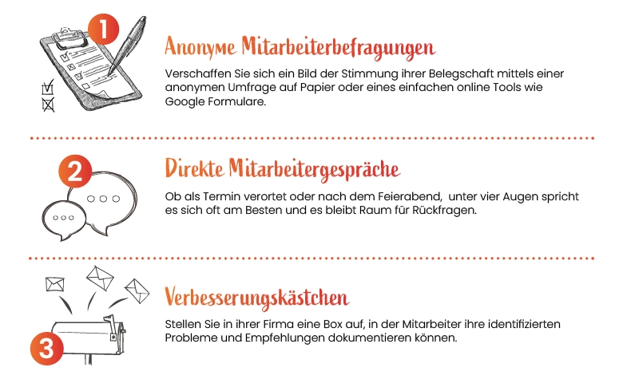

 *„Wenn du eine weise Antwort verlangst, musst du vernünftig fragen.“*  

 *Johann Wolfgang von Goethe*  

Egal wie ambitioniert, egal wie fleißig, egal wie geschult – am Ende des Tages ist jede Führungskraft auch nur ein Mensch. Und Menschen sind fehlbar.
So passiert es auch den Besten, dass sie **„blinde Flecken“** entwickeln. Wir können schließlich nicht unsere Augen und Ohren an allen Ecken und Enden des Unternehmens haben, müssen wir auch nicht – wir haben ja unsere Mitarbeiter.

In diesem Artikel befassen wir uns damit, wie wir mit **gezielter Kommunikation** zum einen das Wissen unserer Mitarbeiter besser nutzen und zum anderen unsere Mitarbeiter besser verstehen können. Denn unser Personal ist unsere größte Kostenstelle und Ressource – es wäre ja schade diese nicht voll zu nutzen.

## Das eigene Blickfeld erweitern

**Wie sieht der Alltag ihrer Verkäufer aus? Mit welchen Problemen haben sie täglich zu kämpfen? Womit könnte man ihnen helfen?**

Diese kleinen Fragen zeigen ihre Wirkung erst dann, wenn man sie auch jemanden aus dem tagtäglichen Verkauf stellt. Denn obwohl man durch eigene Arbeitserfahrung und Wissen aus dem Unternehmen vieles weiß – die **Dichte der Erfahrung** des Mitarbeiters und **deren Aktualität** (er stand ja noch heute hinter der Theke) ist nicht zu übertreffen. Diese Art der Befragung kann Ihnen viel Aufschluss über Auslastung, Teamstimmung, Kundenkontakt oder ein beliebiges anderes Thema geben.

Im Kontext der Mitarbeitermotivation wollen wir vor allem herausfinden, welche [Hygienefaktoren](/blog/motivation_2_hygienefaktoren) vielleicht noch nicht erfüllt sind, was sich unsere Mitarbeiter wirklich wünschen und **was sie antreibt**. Denn leider neigen wir dazu menschliche Motive zu vereinfachen bspw. „Unzufriedene Mitarbeiter wollen mehr Lohn“, da die **echten Beweggründe** jedes Mitarbeiters zu **komplex und individuell** sind. Schenken wir der Kommunikation mehr Aufmerksamkeit, nähert sich unser Bild jedoch der Realität an.

## Kommunikation mit System

Nun sind Führungskräfte aber auch keine Therapeuten, die sich stundenweise Zeit nehmen können, um die komplexen Motive ihrer Mitarbeiter zu verstehen, ein effizienteres System muss her: **die systematische Befragung.**

In großen Unternehmen mit Personalabteilungen sind regelmäßige Mitarbeiterbefragungen bereits die Norm. Umfragetools, Leistungsreports und Peer-Feedback hören sich dabei auch modern an, werden den mittelständischen Unternehmer mit hands-on Erfahrung aber unnötig viel Bürokratie und Arbeit aufbrummen. **Wir empfehlen mit kleinen Schritten zu starten** und diese an ihre Bedürfnisse anzupassen:

<figure>

</figure>

Jede dieser Methoden hat ihre Vor- und Nachteile. Anonyme Befragungen sind zeiteffektiver, Gespräch haben mehr Raum für Details. Am besten kombinieren und versuchen Sie eine Mischung aus allen dreien.

>  Egal welche Kommunikationsmethode, wir sollten immer darauf achten unsere Mitarbeiter nicht unter Druck zu setzen, Privatsphäre zu wahren und für Befragungen auch genug Raum zu machen. Sonst besteht die Gefahr, das Frust aufkommt und den Kommunikationserfolg zu Nichte macht!

## Es geht ums Wissen, nicht wollen!

Wenn Sie beginnen die Kommunikation zu suchen, werden sicherlich viele Wünsche bei Ihnen ankommen, die Sie nicht erfüllen können und wollen. Das ist auch gut so. Es geht hierbei nicht darum den Mitarbeiter 100% zufrieden zu stellen. Es geht darum **Informationen zu sammeln und Betrieb wie Mitarbeiter besser zu verstehen**. Diese Informationen werden nützlich sein, um die nötigen Stellschrauben der Motivation ausfindig zu machen. Zudem sammeln wir einen **„Startwert der Motivation“**, von dem aus wir einschätzen können, ob unser Aufwand sich auszahlt oder anderswo besser investiert wäre. Banal gesagt: **Information ist Macht, eine Macht die wir zu Gunsten der Mitarbeiter und des Unternehmens nutzen können.**

## Fazit

Egal wie Sie die Kommunikation gestalten, am Ende wird sich der Aufwand sicherlich lohnen, weil Sie nicht nur Neues erfahren, sondern ihren Mitarbeitern auch kommunizieren, dass **Sie ein offenes Ohr für sie haben**. Und auch wenn wir natürlich nicht jede subjektive Aussage direkt bare Münze nehmen, so versteckt sich in den gesammelten Antworten doch eine enorme Aussagekraft und echtes Potenzial.

Nachdem wir nun mehr Verständnis darüber haben, was unsere Mitarbeiter bewegt und treibt, ist unser nächstes Ziel dieses **Wissen zu nutzen und in Einklang mit den Unternehmenszielen zu bringen**. Wie wir unsere Mitarbeiter dazu bringen diese zu internalisieren und Motivation aufbauen, dazu mehr im nächsten Artikel.

 **Bis dahin wünschen wir Ihnen eine erfolgreiche Woche!** 

 **Ihr Pentacode Team** 
