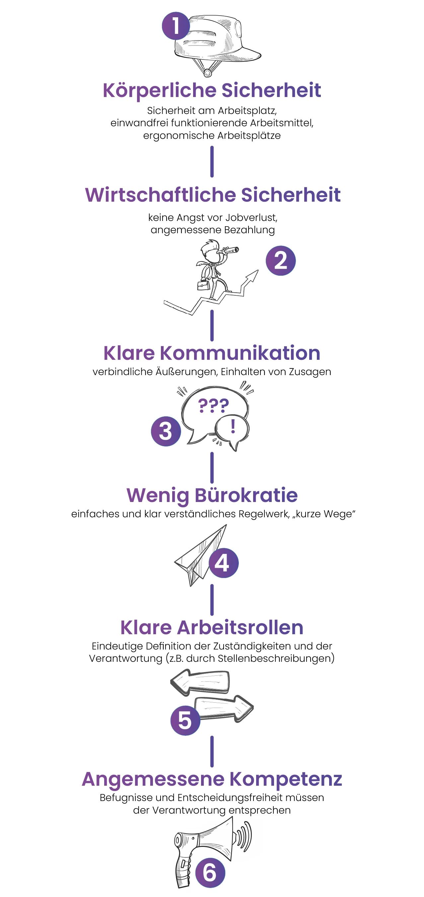

 *„Ich kann, was ich muss, weil ich will”*  

 *Immanuel Kant*  

Stellen Sie sich vor, Sie bekommen ein Stellenangebot in Ihrem Traumbetrieb: Ein freundliches Team, tolle Inhalte, ein guter Chef. Aber es gibt da ein Manko: Sie gefährden täglich Ihr Leben. Oder die Bezahlung ist unterirdisch. Oder Sie müssen zu unmenschlichen Zeiten arbeiten. Selbst wenn der Job an sich interessant ist, kann es Bedingungen geben, die für den Einzelnen absolute
No-Gos sind. Doch auch weniger dramatische Umstände können die Motivation und Leistungsbereitschaft der Mitarbeitern beeinträchtigen.

Um langfristige Motivation zu erzielen und den Leistungswillen zu steigern, ist es erst einmal notwendig, durch die richtigen **„Hygienefaktoren“** die Voraussetzungen zu schaffen. Um diesen Begriff verständlich zu machen, erlauben wir uns einen kurzen Blick in die psychologische Forschung.

## Die Geschichte der Motivationshygiene

Der Psychologe Frederick Herzberg forschte in den 60er Jahren zu Mitarbeitermotivation und stellte Angestellten dabei zwei Fragen: **"Was macht sie in der Arbeit zufrieden?"** und **"Was stellt sie unzufrieden bei der Arbeit?"**. Statt nur die Gegenpole der gleichen Antworten zu finden, stellte er fest, dass "Unzufriedenheit" und "Zufriedenheit" durch unterschiedliche Faktoren beeinflusst wurden. Er nannte die Punkte, die Unzufriedenheit vorbeugen, **Hygienefaktoren**, und die, die Zufriedenheit begünstigen, **Motivatoren**.

## Erst das Fundament legen

Herzberg konnte in seinem Experiment nicht nur die Unterschiede zwischen Hygienefaktoren und Motivatoren erkennen, sondern auch, wie sich beide beeinflussen. Die **Hygienefaktoren** alleine motivieren die Mitarbeiter noch nicht, aber sie **bilden das Fundament**, auf dem weitere Maßnahmen aufgebaut werden können. Solange die Mitarbeiter angaben, dass die Hygienefaktoren nicht erfüllt seien und es Punkte an der Arbeit gäbe, die sie unzufrieden machen, bauen die Motivatoren auch kaum Zufriedenheit und Motivation auf.

> **TAKE-HOME:**  Es ist also wichtig zu unterscheiden zwischen den Faktoren, die einen Mitarbeiter davor schützen, unzufrieden mit seiner Arbeitsumgebung zu sein (Hygienefaktoren), und den Faktoren, die ihn zufriedenstellen und zusätzlich motivieren (Motivatoren). An den Motivatoren zu schrauben macht erst Sinn, wenn die Hygienefaktoren erfüllt sind.

<figure class = "float-right">

<figcaption>  </figcaption>
</figure>

## Hygienefaktoren im Arbeitsalltag

Im Arbeitsalltag gibt es viele offensichtliche und weniger klare Faktoren, die Motivation bremsen können. Allen Überlegungen voran lässt sich eine einfach Frage stellen, um ihre Hygienefaktoren aufzudecken: Welche Bedingungen könnten bei Mitarbeitern ein Gefühl der Unsicherheit hervorrufen oder ihre **tägliche Arbeit schwerer machen, als es sein müsste?** 

Einige Klassiker haben wir Ihnen hier bereits aufgelistet, aber natürlich gibt es weitere Faktoren, die Barrieren darstellen und behoben werden sollten, um ein gutes Fundament für Motivatoren zu schaffen. Dazu gehören das Team und das Betriebsklima, Feedback und der Führungsstil. Mit diese  Themen werden wir in zukünftigen Newslettern genauer befassen. 

## Wie uns die "Motivationshygiene" hilft

Auch wenn es offensichtlich erscheint, dass Mitarbeiter Sicherheit, klare Kommunikation und überschaubare Bürokratie schätzen und das Gegenteil die Arbeit unbefriedigender gestaltet - die Erkenntnisse der Motivationspsychologie sind nicht banal. Sie finden auch in nur relativ wenigen Unternehmen eine konkrete Anwendung. Ohne gute Hygienefaktoren als Fundament läuft die Motivation von Mitarbeitern durch Gehaltserhöhung, Boni, Firmenwagen oder anderen „Incentives“ zum größten Teil in die Leere. Es kostet das Unternehmen Geld, ohne eine dauerhafte Wirkung zu erzielen.

Hygienefaktoren können vielfältig sein, doch Sie kennen Ihr Unternehmen und Ihre Mitarbeiter am besten. Schauen Sie sich also in Ihrem Betrieb um - sind die oben genannten Faktoren erfüllt? Fallen Ihnen andere Hygienefaktoren im Arbeitsumfeld auf, die passen oder verbessert werden können? Wenn alles passt, sollten Sie sich bewusst machen, dass dies nicht die Norm ist und stolz darauf sein. Sie können nun sehr einfach und sehr wirksam daran gehen, dass Ihre Mitarbeiter können, was sie müssen, weil sie wollen!

Ein letztes Wort zu Hygienefaktoren und welche Rolle die Bezahlung Ihrer Mitarbeiter für die Motivation wirklich spielt - darum geht es im nächsten Newsletter.

Bis dahin wünschen wir Ihnen eine schöne Woche!

Ihr Pentacode-Team