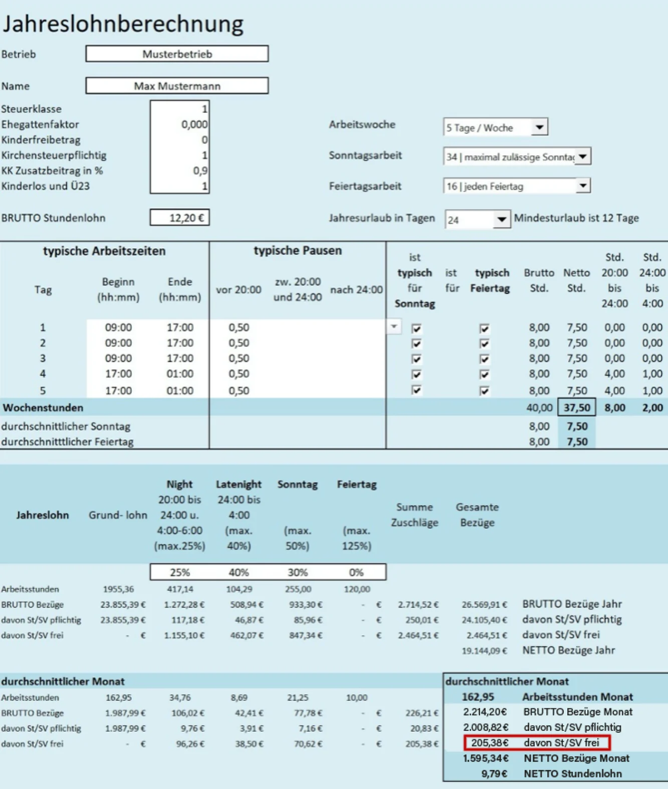

## Pauschale Vorauszahlungen von Zuschlägen

SFN-Zuschläge dürfen vom Grundsatz her lediglich für tatsächlich
gearbeitete Zeiten gezahlt werden. Dabei werden die Zuschläge dem vereinbarten Grundgehalt hinzugerechnet und führen so zu einer Erhöhung
des Netto-Auszahlungsbetrags an den Mitarbeiter.

Mit dem [vorausgegangenen Artikel](/blog/zuschläge_strategisch_nutzen) haben wir aufgezeigt, wie Zuschläge im Rahmen einer Lohnvereinbarung **hineingerechnet** werden können.
Mithilfe dieser Methode kann es Ihnen gelingen, eventuellen Netto-Erwartungen eines Mitarbeiters gerecht zu werden und dabei gleichzeitig und auf legale Weise die Lohnnebenkosten zu senken.

Die Zahlung von SFN-Zuschlägen hat für den Mitarbeiter jedoch einen Nachteil. Die Zuschläge schwanken abhängig von den tatsächlichen Arbeitszeiten. Die Anzahl der Stunden, die nachts und an Sonn- und Feiertagen gearbeitet werden, ändert sich im Normalfall von Monat zu Monat. Damit schwankt auch der Auszahlungsbetrag und beim Mitarbeiter landet mal mehr, mal weniger auf dem Konto.

Doch auch diese Schwankungen lassen sich durch die Vereinbarung einer sogenannten **„unterjährigen pauschalen Vorauszahlung“** vermeiden.
Dies ist dann zulässig, wenn es sich bei den Vorauszahlungen um **Abschläge** handelt.

Der Gesetzgeber erlaubt nämlich die Vorauszahlung von Zuschlägen während eines Jahres in Form von Abschlagszahlungen. Diese monatliche **Abschlagszahlung** kann unabhängig von den tatsächlich geleisteten Arbeitszeiten erfolgen.

Dies können Sie sich zunutze machen und zu einem gleichbleibenden Auszahlungsbetrag gelangen. Der Mitarbeiter erhält somit jeden Monat ein gleichbleibendes und für ihn verlässliches Monatsgehalt.

**Hierzu ein Beispiel:**

<figure>

<figcaption> **Als Kunde von Pentacode stellen wir Ihnen dieses Formular zur Vorausberechnung auf Nachfrage gerne zur Verfügung.**</figcaption>
</figure>

Sie ermitteln für diesen Mitarbeiter auf Grundlage der zu erwartenden Einsatzzeiten z.B. Zuschläge von durchschnittlich 200 € / Monat.

## Zuschläge & Aushilfen

Da SFN-Zuschläge sozialversicherungs- und lohnsteuerbefreit sind, können sie auch geringfügig Beschäftigten über die Lohngrenze von aktuell 520 € / Monat hinaus hinzugezahlt werden. Wie hilfreich dies sein kann, sei an einem Beispiel einer Verkäuferin einer Bäckerei gezeigt:

Sie beschäftigen diese Verkäuferin als Aushilfe, die immer sonntags bei Ihnen arbeitet. Hierfür erhält sie 15 Euro / Stunde. Bei einer Lohngrenze von 520 Euro können Sie die Mitarbeiterin für 34,5 Stunden im Monat beschäftigen.

Wenn Sie mit dieser Mitarbeiterin einen Stundenlohn von 12 € zuzüglich Sonntagszuschläge in Höhe von 25% vereinbaren, erhält sie 12 € Lohn + 3 € Zuschläge, also wieder 15 €.

Da die Zuschläge der Lohngrenze nicht hinzugerechnet werden, steht Ihnen diese Mitarbeiterin **nun über 43 Stunden / Monat zur Verfügung, ohne dass sich die Lohnnebenkosten**, in diesem Fall die Betragszahlung an die Bundesknappschaft, **erhöhen würden**.
 
Der Mitarbeiter erhält im Gegenzug statt 520 € einen Aushilfslohn von 649 €.

## Fazit

**Der Vollständigkeit halber muss gesagt werden, dass die Hineinrechnung von Zuschlägen ins Gehalt der Mitarbeiter für diese einen Nachteil hat.**

Da für Zuschläge keine Sozialversicherungsbeiträge abgeführt werden, verringern sich die Ansprüche an Arbeitslosengeld und Rente.
Über ein gesamtes Arbeitsleben von 45 Jahren hinweg führt dies zu einer Verringerung der Rentenansprüche. Die Art und Weise, in der sich die Gehaltszahlung an die Mitarbeiter zusammensetzt, bestimmen jedoch Sie als Arbeitgeber. Es bleibt dem Mitarbeiter überlassen zu entscheiden, ob er **in 30 Jahren etwas mehr Rente beziehen oder im Gegenzug heute 100 Euro mehr netto erhalten will.**