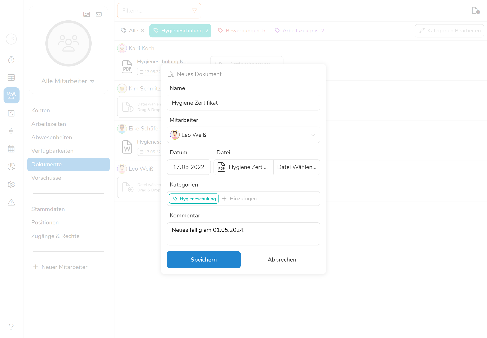
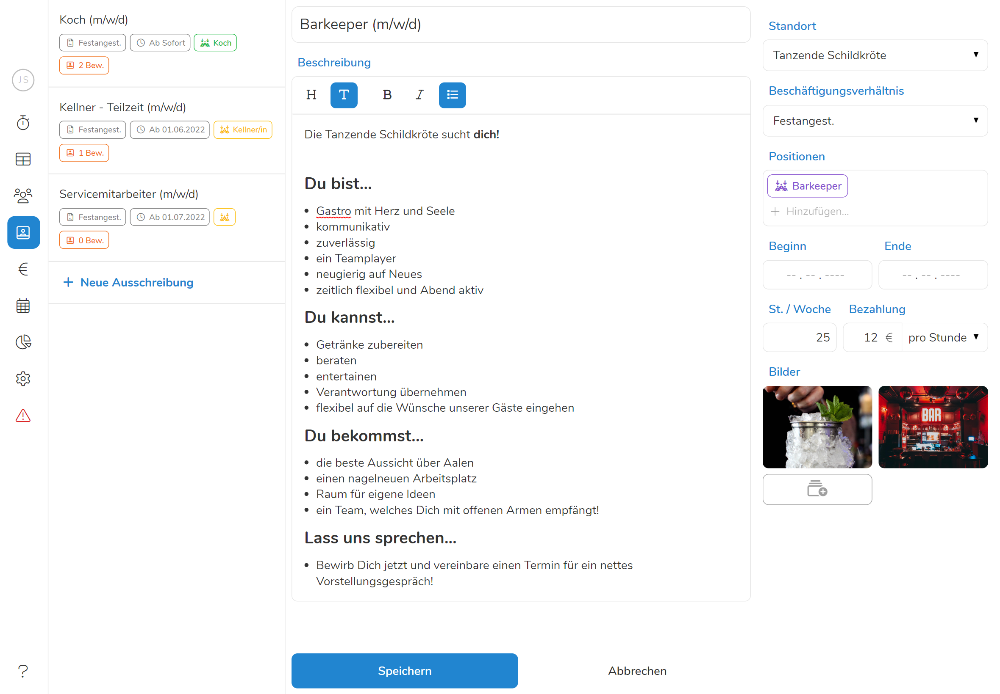
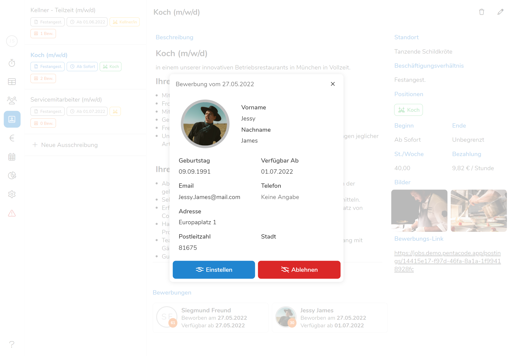

Der Sommer zieht ins Land, uns es sieht so aus als könnten wir dieses Jahr zum
ersten mal seit langem die warme Jahreszeit größtenteils ohne Einschränkungen
genießen! Aber während es nun viele in die Biergärten, an die Seen und in die
Berge zieht, sind unsere Entwickler weiterhin fleißig am Arbeiten 🤓. Und die
Arbeit trägt Früchte! Denn heute freuen wir uns erneut, ein weiteres großes
Update vorzustellen! Vom **Dokumentenarchiv** bis hin zu **Stellenausschreibungen**
und **Bewerbermanagement** - Pentacode v1.22.0 ist bis zum Rand bepackt mit neuen
Features, die Ihre Lieblings-Personalsoftware noch mächtiger machen als je zuvor!

## Dokumentenarchiv

Wer mag schon Papierkram? Keiner! Leider sind Dokumente verschiedenster Art auch
im Jahr 2022 weiterhin ein zentraler Bestandteil jeder Personalverwaltung.
Arbeitszeugnisse, Lohnabrechnungen, Arbeitszeitnachweise, und, und, und... alles
muss erfasst, sortiert, archiviert und (gefühlt) bis zum Hitzetot des Universums
aufbewahrt werden. **Für alle, die regelmäßig die Angst überkommt, hoffnungslos in
der eigenen Zettelwirtschaft zu versinken und nie wieder gefunden zu werden, haben
wir gute Neuigkeiten!**





Mit Pentacode haben wir dem Papier schon vor langer Zeit den Krieg erklärt:
Digitaler Dienstplan, digitale Stempeluhr und nun... **ein vollkommen digitales
[Dokumentenarchiv](../../hilfe/handbuch/mitarbeiter/dokumente/)**! **PDFs**,
**Word- oder Exceldateien**, **Bilder und Texte** - all das kann im neuen
Dokumentenarchiv gespeichert, kategorisiert und auf beliebige Zeit aufbewahrt
werden. Dabei werden Dokumente nicht nur automatisch Ihren Mitarbeitern
zugeordnet und chronologisch sortiert, sie können diese auch beliebig mit
Kategorien und Kommentaren versehen, über die Suchfunktion blitzschnell finden
und jederzeit herunterladen, teilen und (bei Bedarf) natürlich auch ausdrucken.

Und das Beste: **Alle gespeicherten Dokumente sind automatisch auch für die ihnen
zugeordnete Mitarbeiter sichtbar** und über den eigenen Mitarbeiterzugang jederzeit
einsehbar - aber natürlich nur, wenn Sie das möchten!

Damit ist nun endlich Ende mit der Zettelwirtschaft - und Sie können sich
zurücklehnen, die Papierschnitte heilen lassen und den digitalen Archivar
bei der Arbeit zusehen 🦋.

## Stellenausschreibungen & Bewerbungen





Auf Grund der Pandemie haben viele Betriebe vor allem in der Gastronomie schon
seit Monaten [mit Personalnot zu
kämpfen](https://www.sueddeutsche.de/wirtschaft/gastronomie-personalmangel-mindestlohn-1.5446657).
Grund hierfür waren vor allem die langen Schließungen und daraus folgende
Unsicherheit, die viele Angestellte dazu veranlasste, sich nach sichereren
Arbeitsplätzen umzuschauen oder ihre berufliche Laufbahn komplett zu überdenken.

Die Pandemie ist zwar nicht vorüber, aber dennoch ist inzwischen wieder ein
relativ großes Maß an Normalität eingekehrt, und mit wenigen Ausnahmen dürfen
Restaurants, Hotels, Einzelhandel und co. schon seit einiger Zeit wieder normal
öffnen. Aber nachdem es nun endlich wieder losgeht, haben diese Branchen mit
einem neuen Problem zu kämpfen: **Personalknappheit**. Die Mitarbeiter, die
aufgrund von Lockdowns und verminderten Umsätzen entlassen oder in die
Kurzarbeit geschickt wurden, haben zum großen Teil bereits andere Berufswege
eingeschlagen und können nicht so einfach reaktiviert werden.

Aber das heißt nicht, dass es nicht weiterhin genug willige, qualifizierte
Arbeitskräfte gibt - **sie müssen nur gefunden werden**! Und hier kommt wieder
einmal Pentacode ins Spiel...





Mit dem neuen [Recruiting-Modul](../../hilfe/handbuch/recruiting/) können Sie
nicht nur **Stellenauschreibungen erstellen und veröffentlichen**, sondern auch
**Bewerbungen direkt in Pentacode erfassen** und **geeignete Kandidaten** in
Sekundenschnelle **als Probemitarbeiter einstellen oder direkt in den
Personalstamm aufnehmen**. Sie erhalten einen öffentlichen Link, welchen Sie über
Social Media, per Emailverteiler oder als QR-Code auf Flyer gedruckt teilen
können - und Interessenten versenden ihre Bewerbungen ganz einfach über das in der
Anzeige eingebettete Formular. Diese Bewerbungen erscheinen dann unmittelbar und
vollautomatisch in Ihrem Pentacode Verwaltungszugang, wo dann nur noch die
besten Kandidaten auswählen müssen!

Das Recruiting-Modul ist aktuell noch in der **Beta-Phase** und wird in den
kommenden Wochen um einige Funktionen erweitert und noch weiter verbessert
werden! Und natürlich freuen wir uns wie immer außerordentlich über Ihr
Feedback, welches dann selbstverständlich in die weitere Entwicklung mit
einfließen wird.

>  Solange das Recruiting-Modul in der Beta-Phase ist, **ist das Erstellen und
> veröffentlichen von Stellenausschreibungen komplett gebührenfrei**! Nutzen Sie
> also die Gelegenheit, dieses neue Feature in Ihrem Betrieb kostenlos zu
> testen und dabei direkt ein paar neue Mitarbeiter zu finden!

## ... Und Mehr!

Die oben genannten Änderungen sind nur ein Teil der Verbesserungen, die wir in
dieser Version vorgenommen haben. Für eine ausführliche Auflistung der
Änderungen, werfen Sie gerne einen Blick in unser
[Änderungsprotokoll](/hilfe/aenderungsprotokoll/)!
