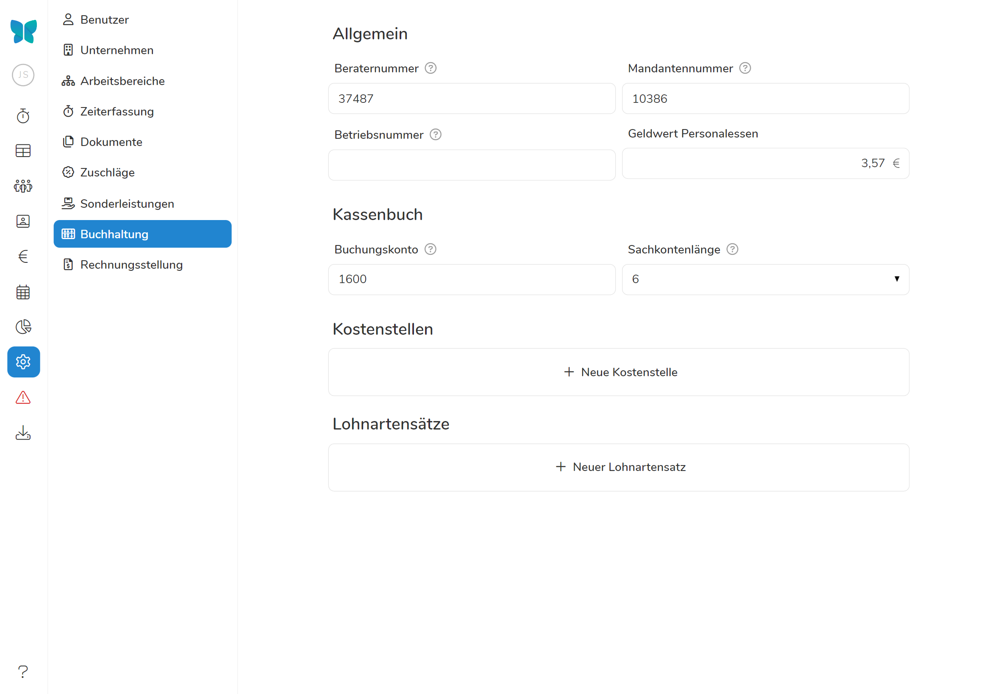
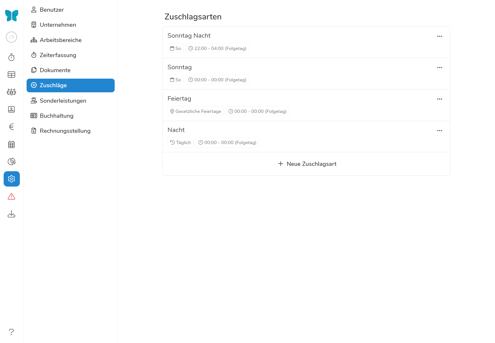

Auch wenn sich der Kampf mit der Buchhaltung manchmal wie eine Sysyphusarbeit anfühlt - die Aufbereitung und Dokumentation von Lohnberichten und co. ist ein integraler Teil des Unternehmertums, der (richtig unternommen) viele Früchte abwerfen kann. 
Mit Pentacode V. 1.24 helfen wir Ihnen den Bürokratiedschungel besser zu navigieren und wertvolle Zeit bei der Vorbereitung von Lohndaten zu sparen. Dabei werden Ihnen **eine gänzlich überarbeitete Datenexportfunktion, viele neue Individualisierungsoptionen sowie viele weitere Verbesserungen & Neuheiten** helfen die Früchte einer guten Buchhaltung einfacher zu ernten. 

## Datenexport

Der neue Datenexportreiter - das Herzstück unseres neuen Updates. Statt wie zuvor Stammdatenblatt, Lohnberichte, Arbeitszeiten und co. verteilt über die verschiedenen Funktionen Pentacodes suchen zu müssen, finden Sie nun alle benötigten Daten gut strukturiert an einem Ort - Sie müssen nur noch auf Download klicken.





Neu mit dabei: 
- Individualiserte Zeiträume, statt nur ganze Monate. 
- Direktes Verschicken von Lohndaten, Arbeitszeiten und co. per Email
- Speichern Sie Arbeitszeitnachweise direkt im Dokumentenarchiv des Mitarbeiters und lassen Sie diese sofort verifizieren
- Ein Mitarbeiter in mehreren Arbeitsbereichen? Exportieren Sie seine Lohndaten nach Bereichen separiert oder gemeinsam mit der neuen Filteroption

## Individualisierte Buchhaltung

Unter **Buchhaltung in den Einstellungen** finden Sie nun die Möglichkeit die Lohnartsätze noch weiter zu definieren und damit nun auch **das Grundgehalt, Zuschüsse, Provisionenen und Vorschüsse** in den Lohnbericht zu übertragen. Einmal angelegt sind die Lohnarten einfach einzelnen Mitarbeitern zuzuordnen und alle Daten werden in zukünftigen Datenexporten automatisch angegeben. 
Auch können Sie nun Kostenstellen definieren, die mitarbeiterübergreifend funktionieren - irrelevant wo der Mitarbeiter normalerweise zugeordnet ist, eine Schicht im Service kann im Lohnexport also immer unter die Kostenstelle "Service" fallen. 





## Individualisierte Zuschüsse und Sonderleistungen

Sie wollen für ungeliebte Schichten einen zusätzlichen Anreiz schaffen, besonders hart arbeitende Angestellte extra entlohnen oder ein dynamischeres Entlohnungmodel ausprobieren?
Mit den neuen **individualisierten Zuschüssen** bekommen Sie dafür das Werkzeug in die Hand - während Pentacode sich automatisch um die Berechnung im Hintergrund kümmert. 





Auch Sonderleistungen - egal ob Benzingeld, Materialkosten oder Weihnachtsgeld - können mit dem neuen Update komplett individualisiert werden. Auch diese werden mit dem neuen Update automatisch in den Lohn integriert, wenn Sie das wünschen. 

## Neue Buchhaltungsoptionen

Sie können nun eigene Kostenstellen anlegen und Mitarbeitern zuordnen - und Lohnartensätze genauer definieren. 
Gleichzeitig sind Provisionen, Essensgeld, Sonderzahlung und Zuschüsse nun auch in den Lohnabrechnungen integriert und erleichtern Ihnen den Export in ihr Lohnbuchhaltungsprogramm. 

## Und vieles mehr!

Es verstecken sich noch viele weitere kleine Verbesserungen in diesem Update - etwa ausgeklügeltere Filteroptionen, ein überarbeiteter Einstellungsbereich sowie neue informationsreichere Designs im Mitarbeitermenü. 

Generell ziehlt alles in diesem Update darauf ab die Vorbereitung für ihre Buchhaltung so automatisiert wie möglich zu gestalten. Zwar kann das Einstellen der verschiedenen Lohnarten, Kostenstellen und co. am Anfang etwa mühsam wirken - auf lange Zeit sparen Sie sich durch eine korrekte Vorbereitung des Lohndatenexports Zeit, Geld und Nerven. Und das sollte ja schließlich das Ziel eines jeden Unternehmers sein. 

Eine komplette Liste aller Neuigkeiten und Bugfixes finden Sie im [Änderungsprotokoll](/hilfe/aenderungsprotokoll/#1.24.0).

Ihr Pentacode Team
