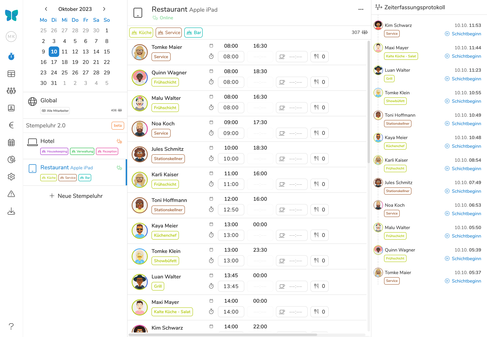
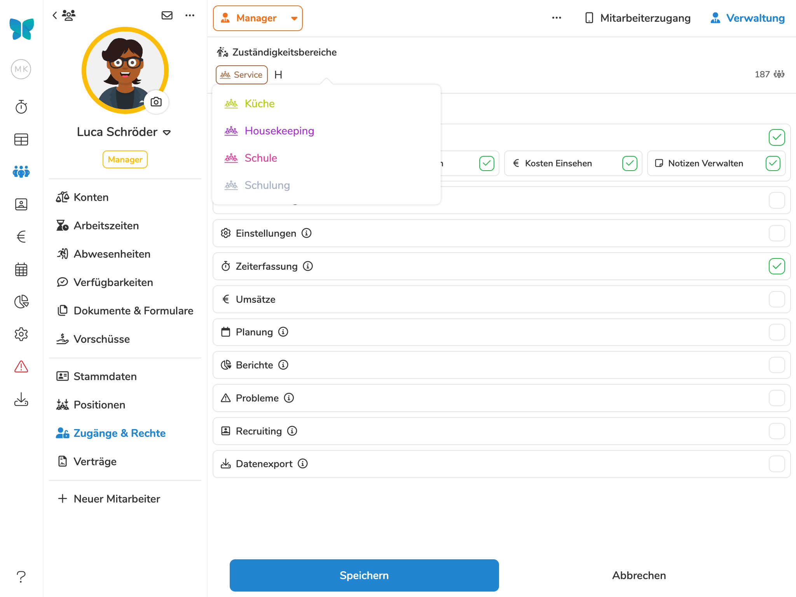

In der Arbeitswelt rückt die Zeiterfassung immer mehr in den Fokus. Eine präzise
und objektive Zeiterfassung gewährleistet nicht nur Transparenz und sorgt
für Fairness zwischen Arbeitgeber und Arbeitnehmer - Sie bietet außerdem die
Möglichkeit Personalkosten in Echtzeit im Blick zu behalten und Arbeitszeiten
besser zu planen und zu optimieren.

Auch der Gesetzesgeber ist ganz klar für die Einführung einer objektiven
Zeiterfassung, das zeigen unter Anderem das [Urteil des
Bundesarbeitsgerichts](/blog/bag_urteil_zeiterfassung/) und [aktuelle
Gesetzesentwürfe](/blog/neues_zum_gesetz_der_zeiterfassung/). Vor diesem
Hintergrund ist Pentacode stolz darauf, bereits eine der innovativsten Lösungen
in diesem Bereich anzubieten. Und jetzt legen wir mit Version 1.25 noch einen
drauf.

## Die Digitale Stempeluhr 2.0

Basierend auf den Erfahrungen und dem Feedback unserer treuen Nutzer haben wir
unsere [ditigale Stempeluhr](/hilfe/stempeluhr/) komplett neu entwickelt. Die
neue Version baut auf der bewährten Funktionalität und Bedienungsfreundlichkeit
der existierenden Version auf und führt einige viel nachgefragte neue Features ein.

Das optionale
[Beweisfoto](/hilfe/handbuch/einstellungen/zeiterfassung#beweisfotos) stellt
einen großen Schritt in Richtung Betrugssicherheit dar. Gepaart mit der
geografischen
[Standorterfassung](/hilfe/handbuch/einstellungen/zeiterfassung#standort-festhalten)
wird eine lückenlose Dokumentation jeder Arbeitsphase ermöglicht. Außerdem
können Mitarbeiter nun eine Nachricht beim Erfassen von Zeiten hinterlassen und
Mitarbeiteressen bei Schichtende selbstständig buchen.

>  Für alle, die an der bewährten Technik festhalten
> möchten: Die "alte" Stempeluhr bleibt vorerst in Betrieb, während wir die
> 2.0-Version weiter optimieren.

## Das neue Zeiterfassungs-Dashboard

Das Herzstück unserer v1.25 ist das runderneuerte
[Zeiterfassungs-Dashboard](/hilfe/handbuch/zeiterfassung/#das-zeiterfassungs-dashboard).
Ein zentrales Kontrollzentrum, in dem Sie alle Ihre Stempeluhren überwachen und
steuern und erfasste Arbeitszeiten und Pausen in Echtzeit nachvollziehen
können. Ein besonderer Bonus: Das minutengenaue Tracking des Verbindungsstatus
jeder Uhr, sodass Sie immer im Bilde sind, selbst wenn an einem Ort technische
Probleme auftreten. Zudem garantiert das neue
[Zeiterfassungsprotokoll](/hilfe/handbuch/zeiterfassung/#das-zeiterfassungsprotokoll)
höchste Transparenz für alle Beteiligten.

<figure>

<figcaption>
Das Zeiterfassungs-Dashboard ist Ihr zentrales Kontrollzentrum, in dem Sie alle
Ihre Stempeluhren überwachen und steuern können.
</figcaption>
</figure>

## Berechtigungen und Zugriffsbereiche noch präziser Steuern.

Die Sicherheit und Kontrolle der Daten stehen bei uns an erster Stelle. Deshalb
haben wir unser Berechtigungssystem erweitert: Jetzt können Sie genauer
definieren, wer Zugang zu welchen Standorten und Abteilungen hat. Diese
[Zuständigkeitsbereiche](/hilfe/handbuch/mitarbeiter/zugaenge-rechte/#zuständigkeitsbereiche-einschränken) bestimmen, welche Teile des Verwaltungsportals ein
Mitarbeiter einsehen und bearbeiten darf – von der Mitarbeiterliste bis hin zu
Exportfiltern. Es ist ein weiterer Schritt, um Ihre Daten sicher und
ordnungsgemäß zu verwalten.

<figure>

<figcaption>
Das Zeiterfassungs-Dashboard ist Ihr zentrales Kontrollzentrum, in dem Sie alle
Ihre Stempeluhren überwachen und steuern können.
</figcaption>
</figure>

## ... Und Mehr!

Die oben genannten Änderungen sind nur ein Teil der Verbesserungen, die wir in
dieser Version vorgenommen haben. Für eine ausführliche Auflistung der
Änderungen, werfen Sie gerne einen Blick in unser
[Änderungsprotokoll](/hilfe/aenderungsprotokoll/)!