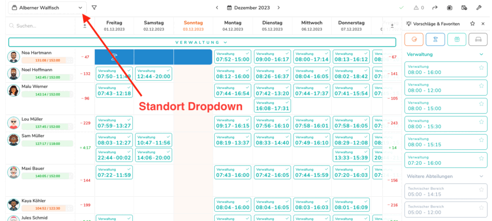
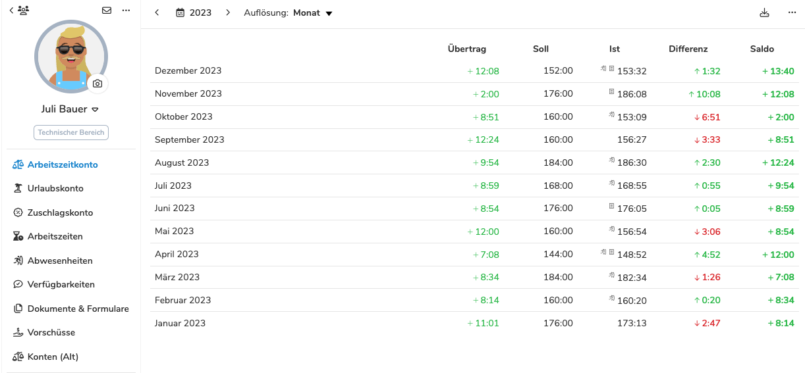

Die Dienstplanung ist das Herzstück von Pentacode. Sie erlaubt es Betrieben,
Einsätze und Schichten ihrer Mitarbeitenden effizient zu planen. Das spart Zeit und Geld 
und erhöht, unter Beteiligung der Mitarbeitenden durch Angabe ihrer Verfügbarkeit, 
zudem deren Zufriedenheit.

## Der überarbeitete Dienstplan

Im Dezember 2023 führten wir eine Umfrage durch, um unsere Kunden nach ihren Anforderungen, Wünschen
und den Stellen, an denen die Dienstplanung noch zwickt, zu fragen. Dadurch konnten wir 
Verbesserungspotenziale aufdecken und den [Dienstplan](/hilfe/handbuch/dienstplan/) neu und besser gestalten.
Die neue Version baut auf der bewährten Funktionalität und Bedienungsfreundlichkeit
der existierenden Version auf und führt einige viel nachgefragte neue Features ein.

Änderungen am Dienstplan können nun in Listenform eingesehen werden und ebenfalls einzeln rückgängig gemacht werden, 
so dass wirklich nur gewünschte Änderungen veröffentlicht werden. Zudem werden Probleme nun besser und detaillierter dargestellt,
was die Benutzerfreundlichkeit weiter erhöht.

>  Für alle, die vorerst an der gewohnten Ansicht festhalten
> möchten: Der "alte" Dienstplan bleibt bis auf Weiteres in Betrieb, während wir die
> überarbeitete Version weiter optimieren.

## Das neue Dienstplan-Layout

Das Herzstück von v1.26 ist das generalüberholte
Layout des Dienstplans. Dieses dient als zentrales Dashboard für den Dienstplaner,
um die Dienstplanung noch effizienter zu gestalten. Das neue Layout organisiert die einzelnen Standorte jetzt in einem Dropdown, durch das, auch bei vielen Standorten,
Übersichtlichkeit gegeben wird und jeder Standort schnell angewählt werden kann. 

Weiterhin ermöglicht das neue Layout die Auswahl beliebiger [Zeiträume](/hilfe/handbuch/dienstplan/#zeitraum-wechseln) (bis zu 5 Wochen). Das bedeutet, dass nun die Dienstplanung 
deutlich flexibler und beispielsweise auch von Mittwoch bis Dienstag (statt Montag bis Sonntag) ermöglicht wird.
Wenn Sie lieber den Dienstplan für 2 Wochen oder gar einen Monat schreiben wollen, ist dies mit dem neuen Layout ebenfalls kein Problem.
Auch [Dienstplan-Vorlagen](/hilfe/handbuch/dienstplan/#dienstplan-vorlagen) können mit dieser Funktion über beliebige Zeitäume angewendet werden. 

Damit trotz größerer Zeiträume die Übersichtlichkeit erhalten bleibt, können diverse Darstellungsoptionen an- und ausgeschaltet werden.
Eine dieser Optionen ist das Umschalten zwischen detaillierten und komprimierten Ansichten, welche mehr Schichten darstellt.
Andere Optionen umfassen:
1.  das Anzeigen der Stundensaldi zum Anfang und Ende der ausgewählten Periode,
2.  das Anzeigen der anfallenden Personalkosten basierend auf der Dienstplanung sowie
3.  das Ein- und Ausblenden der [Schichtvorschläge](/hilfe/handbuch/dienstplan/#schichtvorschl%C3%A4ge) und Favoriten.

<figure>

<figcaption>
Das neue Dienstplan-Layout beinhaltet ein Dropdown für die Standorte, Optionen für die Steuerung der Ansichten
und Entwicklung der Stunden-Saldi der Mitarbeitenden über den betrachteten Zeitraum.
</figcaption>
</figure>

## Neue Kontenansichten für Arbeitszeit-, Urlaubs- und SFN-Konten

Die Übersicht der Mitarbeiterkonten wurde im Rahmen von v1.26.0 in drei separate Übersichtsbereiche aufgeteilt.
Es gibt jetzt jeweils eine Ansicht für [Arbeitszeit-, Urlaubs- und SFN-Zuschlagskonto](/hilfe/handbuch/mitarbeiter/konten/).
Zudem lassen sich die beliebigen Zeiträume, die in den neuen Dienstplan Eingang gefunden haben, auch hier anwenden.
Die Auflösung der Saldierung lässt sich ebenfalls anpassen - so kann der Stand der Konten zu beliebigen Zeitpunkten nachvollzogen
und nun auch wochenbasierte Änderungen angesehen werden, nicht mehr nur (wie bisher) monats- und jahresbasierte.
Abschließend wurden die Konten so erweitert, dass sie sich nun zu [beliebigen Zeitpunkten zurücksetzen](/hilfe/handbuch/mitarbeiter/konten/#übertrag-bearbeiten-%2F-konten-zurücksetzen) lassen.

<figure>

<figcaption>
Die alte Kontenansicht wurde aufgeteilt in jeweils eigene Kontenansichten für
Arbeitszeit, Urlaub und SFN-Zuschläge.
</figcaption>
</figure>

>  Die alte Kontenansicht bleibt vorerst weiterhin erhalten und ist unter dem Menüpunkt "Konten (alt)" zu finden!

## Neue Optionen für Zuschläge
Als Vorraussetzung damit ein [Zuschlag](/hilfe/handbuch/einstellungen/zuschläge/) greift, konnte bisher eine Mindestdauer (hh:mm) im Zuschlagszeitraum angegeben werden. Jetzt ist auch eine prozentuale Angabe möglich.
Der Prozentwert bezieht sich hier auf die Gesamtarbeitszeit in der Schicht. Die beiden Optionen können auch kombiniert werden, so dass beide Vorraussetzungen erfüllt sein müssen, damit ein Zuschlag greift.
Weiterhin kann nun ebenfalls die Art der Vergütung des Zuschlags gewählt werden. Die bereits existierende Option "Prozent des Basislohns" wurde jetzt um Optionen für feste Stundensätze in der Zuschlagszeit und 
einen festen Betrag, der vergütet wird, erweitert.

## ... Und Mehr!

Die oben genannten Änderungen sind nur ein Teil der Verbesserungen, die wir in
dieser Version vorgenommen haben. Für eine ausführliche Auflistung der
Änderungen, werfen Sie gerne einen Blick in unser
[Änderungsprotokoll](/hilfe/aenderungsprotokoll/)!