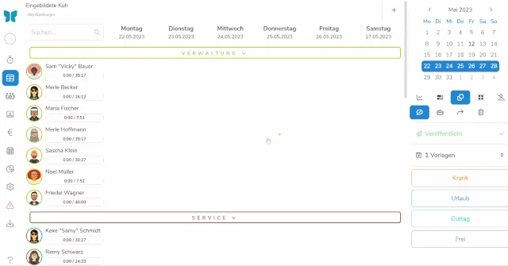
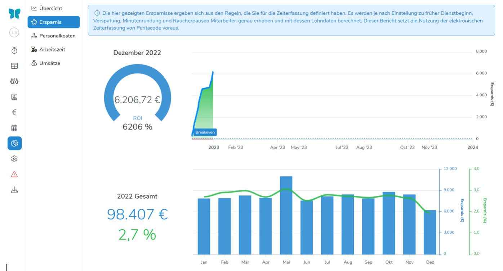

## Mehr Überstunden durch Arbeitszeiterfassung?

Die Einführung einer rechtlich einwandfreien und prüfungssicheren Erfassung von Arbeitszeiten wird in vielen Unternehmen eine unmittelbare Folge haben: eventuelle Überstunden werden schonungslos offengelegt. Selbst wenn diese Überstunden durch bestehende Routinen im Betrieb völlig unbeabsichtigt und bisher unbemerkt entstanden sind - sie schlagen sich nun plötzlich als Mehrarbeit nieder.

**Dabei lassen sich derartige Überstunden ganz einfach vermeiden!**

## Dienstplanung bei „Nine-to-five-Jobs“?

Sie führen einen Betrieb mit regelmäßigen Arbeitszeiten, klassischem Wochenend-Frei und am Feiertag wird zuhause geblieben? Oder eine Abteilung, für die dies gilt?

In diesem Fall gab es bisher keine Notwendigkeit einen Dienstplan zu führen. Jeder wusste, wann er zu kommen hatte und wann Schluss mit Arbeit war. Theoretisch muss auch in Zukunft kein Dienstplan geführt werden, praktisch aber sollten Sie dies unbedingt tun.

### Warum?

Weil auch in diesem Fall die rechtliche Verpflichtung zur Arbeitszeiterfassung gilt und nun durch Ein- und Ausstempeln plötzlich Überstunden auflaufen können, wo vorher doch alles im Lot war.

Wenn 15 Vollzeit-Mitarbeiter eines Unternehmens (oder einer Abteilung) pflichtbewusst und ohne Hintergedanken 10 Minuten zu früh zur Arbeit erscheinen, ergibt dies am Monatsende 3:40 Überstunden je Mitarbeiter. Am Ende des Jahres haben sich bei jedem Mitarbeiter über 40 Stunden angesammelt. Jeder einzelne der 15 Kollegen hat zusätzlich zu seinem Urlaub also mehr als eine Woche extra frei.

Das können Sie ganz einfach vermeiden. Legen Sie in Pentacode eine Vorlage an und ziehen Sie diese per „drag & drop“ in den Dienstplan. Das kostet Sie 3 Sekunden Ihrer Zeit und Sie haben das Problem ungewollter und ungeplanter Überstunden für immer gelöst.

<figure class="full-width">

<figcaption> Wenige Sekunden und die Woche ist geplant </figcaption>
</figure>

Die Stempelzeiten Ihrer Mitarbeiter können nun mit dem Dienstplan abgeglichen werden und der Dienst beginnt wie von Ihnen geplant.

### Ist das rechtlich so in Ordnung?

Ja, ist es. Ein geplanter Arbeitsbeginn ist keine Empfehlung des Arbeitgebers, sondern eine Dienstanweisung. Sollte ein Mitarbeiter früher kommen wollen,
um in aller Ruhe eine Tasse Kaffee zu trinken ehe er z.B. das erste Telefonat annimmt, kann er das natürlich tun. Sie können auch dafür bezahlen,
müssen aber nicht.

**Dasselbe gilt für ein Zuspätkommen** - wird eine Schichtplanung nicht eingehalten und der Mitarbeiter verspätet sich? Sie sind im Recht ausschließlich erarbeitete Stunden zu vergüten.

## Dienstplanung bei Mehrschichtbetrieben

Wenn Sie ein Unternehmen mit Mehrschichtbetrieb führen, haben Sie gewiss bereits eine Routine für die Dienstplanung. Egal, ob die Dienstpläne noch handschriftlich oder mithilfe von Excel oder bereits einer Online-Dienstplanung geführt werden, die Umstellung erfordert nur einen minimalen Aufwand. Ab dem Zeitpunkt der Umstellung wird der Effekt derselbe sein und unmittelbar eintreten. Der Unterschied in Euro hängt lediglich von der Anzahl der Mitarbeiter ab.

Die Wirkung können Sie nur unterlaufen, wenn Sie keinen Dienstplan führen. Oder der Zeiterfassung die Anweisung geben, geplante Arbeitszeiten zu ignorieren. In diesem Fall überlassen Sie es bewusst Ihren Mitarbeitern, die Arbeitszeit und Arbeitsdauer selbst zu bestimmen.

Sollte es sich nicht um Vertrauensarbeitszeit handeln, hätten Sie in diesem Fall die Kontrolle über einen Teil der Lohnsumme in Ihrem Betrieb Ihren Mitarbeitern überlassen.

## Die wirtschaftliche Wirkung in Summe

Der Mechanismus der automatischen Überprüfung greift für alle Unternehmen, völlig unabhängig von deren Größe und Komplexität. Er greift auch sofort und ohne einen einzigen Handschlag an zusätzlicher Arbeit. Es handelt sich also um Früchte, die so niedrig hängen, dass sie ohne Aufwand geerntet werden können.

In dieser Grafik wird der exakte Wert an eingesparter Arbeitszeit gezeigt.
Es handelt sich hier um ein Unternehmen mit Mehrschichtbetrieb,
180 Mitarbeitern und Sitz in Bayern.

<figure>

<figcaption> Jedes Unternehmen kann durch Schichtplanung Lohnkosten sparen </figcaption>
</figure>

Dieses Unternehmen hat in 2022 Arbeitszeit im Wert von über 98.000 € eingespart. Ohne die Überprüfung der gestempelten Arbeitszeiten durch die geplanten Zeiten wären in diesem Unternehmen die Personalkosten durch aufgelaufene Überstunden oder erhöhte Auszahlungsbeträge um 2,7 % höher gelegen.

Systemweit sparen Unternehmen mit Pentacode im Durchschnitt 2,6 % an ungewollter oder unbeabsichtigter Arbeitszeit ein. Wie hoch die Einsparung am Ende sein wird, hängt allein von den Regeleinstellungen ab, die Sie als Unternehmer für die Zeiterfassung vornehmen.

Verfügt das verwendete Zeiterfassungssystem also über die beschriebenen Eigenschaften, wird es Sie als Unternehmer selbständig und hoch wirksam dabei unterstützen, unbeabsichtigte Arbeitszeiten zu vermeiden und damit überflüssige Arbeitsstunden zu verringern.

Eine leistungsfähige HR-Software bringt natürlich noch andere Zugewinne.
Aber kein Zugewinn wird in absehbarerer Zeit größere Bedeutung haben als kompetentes Zeitmanagement.

## Fazit

Die eben beschriebene Methode ist das „Einsteigermodell“ für eine wirtschaftlich wirksame Dienstplanung. Die einzige Voraussetzung ist, dass überhaupt ein Dienstplan geführt wird.

**Sie führen jedoch ein Unternehmen mit ausgedehnten Öffnungszeiten? Verschiedene Schichten beginnen zeitversetzt? Bei Betriebszeiten von eventuell 7 Tage pro Woche?**

In diesem Fall sollte ein Dienstplan mehr sein als nur ein Info-Blatt für Mitarbeiter zu deren Arbeitseinsätzen.

Die Arbeitszeit der Mitarbeiter ist meist das wertvollste - und damit auch teuerste - Wirtschaftsgut eines Unternehmens. Eine gelungene Dienstplanung sollte deshalb mehr bieten als den Überblick, ob ausreichend Mitarbeiter eingeteilt worden sind. Denn der Unternehmenserfolg beginnt gerade bei komplexeren Betrieben bei der gezielten Planung. Vor allem in Zeiten wie diesen.

*Wie Sie mit der Planung von Arbeitszeiten den wirtschaftlichen Erfolg Ihres Unternehmens maßgeblich beeinflussen können, zeigen wir Ihnen im nächsten Blogartikel „Planung nach Kennzahlen – oder: Malen nach Zahlen für den Dienstplaner“.*