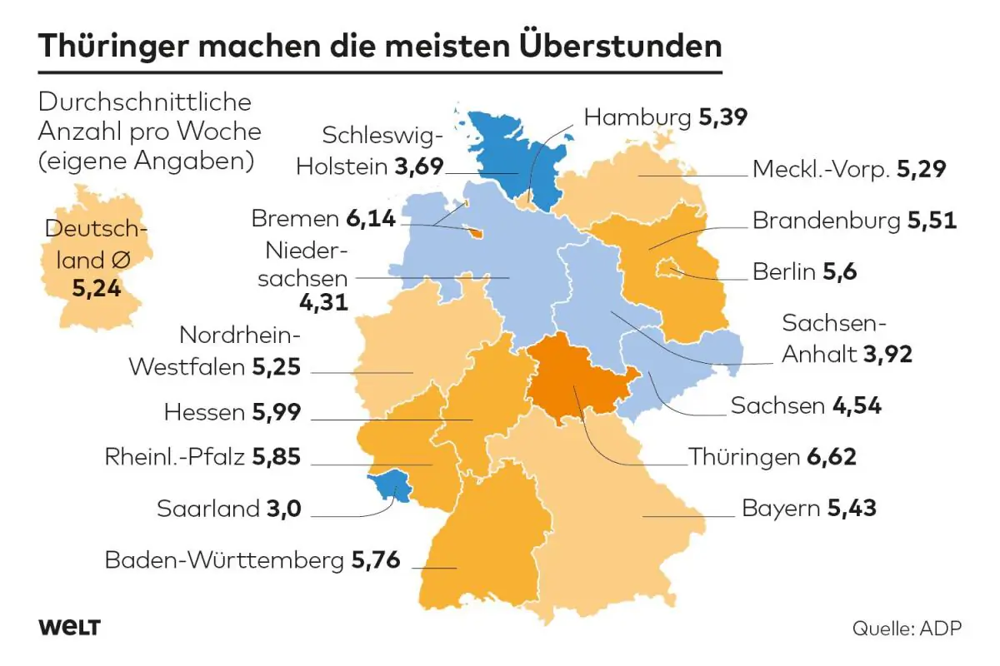
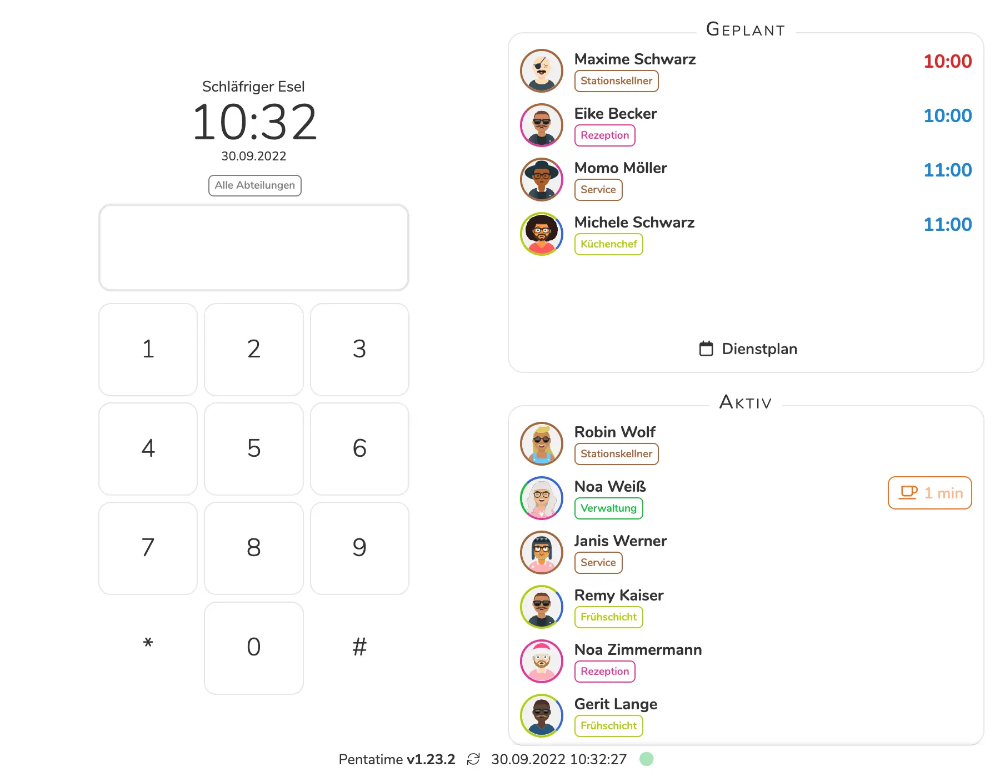

Der 13. September 2022 wird für viele Unternehmen in Deutschland eine Zäsur
darstellen. Völlig überraschend und deshalb mit „Wumms“ [hat das
Bundesarbeitsgericht entschieden](../bag_urteil_zeiterfassung), **dass die Arbeitszeiten von Arbeitnehmern zu
erfassen wären**. Bisher war in vielen Unternehmen ein „Geben und Nehmen“ üblich,
soll heißen, ein Mitarbeiter macht mal Überstunden und erhält dafür Ausgleich
durch Privilegien und Freiräume. Das hat sich nun erledigt. Was das für Sie und
Ihr Unternehmen bedeutet? Im Moment noch weniger, als Sie möglicherweise
befürchten. 

## Wie es dazu kam

Erlauben Sie der Vollständigkeit halber an dieser Stelle einen kurzen Rückgriff.
Der Europäische Gerichtshof (EuGH) hat im Mai 2019 ein [höchstrichterliches
Urteil](../eugh_urteil) gefällt, das für alle Länder der EU verbindlich ist. **Diesem Urteil
zufolge sind alle diese Länder verpflichtet, Gesetze einzubringen, aufgrund
derer den Arbeit-gebenden Unternehmen vorgeschrieben wird, Systeme zur Erfassung
der Arbeitszeiten von Arbeitnehmer einzuführen.** Dabei hat der EuGH den Ländern
großen Spielraum für die Ausgestaltung dieser Gesetze überlassen. Allerdings hat
weder die letzte Regierung unter Merkel, noch die aktuelle Ampelkoalition bisher
an der Umsetzung gearbeitet.

Bis heute ging deshalb vor allem von Arbeitgebern die Initiative aus, wenn in
einem Unternehmen die elektronische Erfassung der Arbeitszeiten Ihrer
Mitarbeiter eingeführt wurde. Dies geschah nicht selten gegen den Widerstand von
Gewerkschaften, die hier die Gefahr von Kontrolle und Überwachung sahen. Das
Mitwirkungs- oder Abwehrrecht von Arbeitnehmervertretern bezieht sich allerdings
nicht auf technische Einrichtungen. Die Entscheidung für oder gegen eine
Zeiterfassung lag somit ausschließlich beim Unternehmen.

<figure class="float right">
  
  <figcaption>Arbeitgeber sind ab sofort zur Einführung einer objektiven Zeiterfassung verpflichtet - so entschied das Bundesarbeitsgericht am 13.09.2022</figcaption>
</figure>

**Was bisher einem Unternehmen initiativ überlassen war, wurde durch das
BAG-Urteil zur umfassenden Verpflichtung aller Arbeitgeber in Deutschland.**
Auslöser des BAG-Urteils ist die Klage eines Betriebsrats einer sozialen
Einrichtung in Nordrhein-Westfalen. Dieser wollte höchstrichterlich festgestellt
haben, „dass für ihn ein Mitbestimmungsrecht zur initiativen Einführung einer
elektronischen Zeiterfassung besteht“. Dabei ging es ihm „um die genaue
Erfassung von Arbeitszeit und Überstunden“. Der BAG verneinte den Anspruch auf
ein Initiativrecht, stellte jedoch fest, dass Arbeitgeber verpflichtet sind, ein
Arbeitszeiterfassungssystem einzuführen.

In der kurz gehaltenen Pressemitteilung heißt es: <cite>"Der Arbeitgeber ist nach § 3
Abs. 2 Nr. 1 ArbSchG verpflichtet, ein System einzuführen, mit dem die von den
Arbeitnehmern geleistete Arbeitszeit erfasst werden kann."</cite>

Es ist nun dem Gesetzgeber überlassen, die Normen und Regeln festzulegen, nach
denen Arbeitszeiten erfasst werden müssen. Die letztendliche Ausgestaltung wird
sich am EuGH-Urteil vom Mai 2019 orientieren. Dieses Urteil legt die Kriterien
„objektiv“ und „einsehbar“ fest, lässt den einzelnen Ländern bei der Festlegung
der Regelungen jedoch großen Spielraum. Wie diese Regelungen in Deutschland
aussehen werden, bleibt also noch zu sehen. Tatsache ist jedoch, dass jeder
Arbeitgeber seit dem 13.09.2022 zur Einführung einer objektiven Zeiterfassung
verpflichtet ist.

## Was bedeutet dies nun für deutsche Unternehmen?

Die Verpflichtung zur minutiösen Erfassung unterbindet faktisch
Mehr-Arbeitszeiten, die bisher „unter den Tisch gefallen“ sind. Dass dies fast
immer im Einverständnis zwischen Arbeitgeber und Arbeitnehmer geschehen ist –
egal. Dass dies betriebsintern oft durch „Peilung über den Daumen“ geregelt
werden konnte – auch egal.

Bei manchen Unternehmen wird die elektronische Zeiterfassung sichtbar machen,
dass Mitarbeiter eigentlich weniger arbeiten als vereinbart. Bei vielen jedoch
wird eine exakte Zeiterfassung dazu führen, dass mehr Stunden auf dem Konto des
Mitarbeiters auflaufen werden. Das betrifft im Besonderen
dienstleistungsintensive Branchen mit ausgedehnten Betriebszeiten und
Mehrschicht-Betriebe.

<figure class="float left">
  
  <figcaption>Deutsche Angestellte machten im Jahr 2021 insgesamt 1,7 Milliarden Überstunden (Laut einer Statistik, des Instituts für Arbeitsmarkt- und Berufsforschung)</figcaption>
</figure>

Laut einer aktuellen Untersuchung durch das Institut für Arbeitsmarkt- und
Berufsforschung wurden in 2021 1,7 Milliarden Überstunden angehäuft. Davon
werden knapp 52% nicht bezahlt. Legt man lediglich den gesetzlichen Mindestlohn
zugrunde, entsprechen die unbezahlten Überstunden einer Lohnsumme von mehr als
11 Milliarden Euro.

Der globale Personaldienstleister ADP hat 10.000 Arbeitnehmer zu ihrem
Arbeitsalltag befragen lassen. Dazu gehörten Fragen zu geleisteten Überstunden.
Diese schwanken zwischen den einzelnen Bundesländern erheblich. Im Durchschnitt
leisteten Arbeitnehmer pro Woche 5,24 Stunden an Mehrarbeit.

Legt man diesen Zahlen zugrunde, dass etwa 52% der Überstunden unerkannt „unter
den Tisch gefallen“ sind, heißt dies, dass im Durchschnitt 6,8% der monatlich
geleisteten Arbeitszeit nicht bezahlt wurden.

## Was dies alles für Sie als Unternehmer unmittelbar bedeutet

Um es salopp zu sagen: Zumindest im Augenblick nicht viel und es gibt keinen
Grund zur Panik. **Sie sollten sich auch von niemandem drängen lassen, sofortige
Entscheidungen zu treffen.**

Seit dem 13. September treibt das das BAG-Urteil nun den Gesetzgeber vor sich
her. Im Koalitionsvertrag von SPD, Grünen und FDP heißt es noch sehr vage: <cite>„Im
Dialog mit den Sozialpartnern prüfen wir, welchen Anpassungsbedarf wir
angesichts der Rechtsprechung des EuGH zum Arbeitszeitrecht sehen. Dabei müssen
flexible Arbeitszeitmodelle (z.B. Vertrauensarbeitszeit) weiterhin möglich
sein.“</cite>

Die Ampelkoalition wird sich nun daranmachen, Änderungen des Arbeitszeitgesetzes
zu prüfen. Dies ist auch notwendig, da dieses Gesetz über 30 Jahre alt ist und
Regelungen vorsieht, die in Zeiten digitaler Anwendungen nicht mehr angemessen
sind. Es bleibt also erst einmal zu sehen, welche Normen und Regeln in Zukunft
zur Geltung kommen werden.

<figure class="float right">
  
  <figcaption>Digitale Zeiterfassungssysteme wie Pentacode werden in Zukunft vermutlich in jedem Unternehmen zu finden sein.</figcaption>
</figure>

Im Moment gibt es einen Richter, aber noch keine Kläger. Und es gibt auch noch
niemanden, der abseits eines Gerichtsprozesses Kontrollen durchführen würde.
Diese Situation ändert sich jedoch dann, wenn Ihre Mitarbeiter eine Stempeluhr
einführen wollen. Denn dann **müssen** Sie eine Stempeluhr einführen.

Und sollten Sie sich mit einem Mitarbeiter vor Gericht treffen und dieser
Arbeitsstunden, Urlaub oder sonstige Ansprüche einfordern, die irgendetwas mit
„Zeit“ zu tun haben, wären Sie wahrscheinlich froh, wenn Sie eine
Arbeitszeitdokumentation hätten, die nicht angreifbar ist.

In der Zwischenzeit jedoch und solange das nicht passiert, können Sie weiterhin
ruhig durchatmen. Die zukünftigen Gesetze, Regeln und Normen aber werden kommen
und wenn sie dann da sind, sollten Sie gewappnet sein. Idealerweise nutzen Sie
die verbleibende Zeit, um sich einen gründlichen Überblick zu den geeigneten
Systemen zu verschaffen und rechtzeitig neue Routinen in Ihrem Betrieb einzuüben.
Denn wenn es schnell gehen muss, geht es oft nicht so gut wie es könnte.

Um nochmals auf die 5,24 Überstunden zurückzukommen, die pro Woche
durchschnittlich anfallen: Das klingt nach viel und das ist viel, **aber** – und das
ist die gute Nachricht: Dies lässt sich auch nach Einführung einer
Arbeitszeiterfassung beherrschen.

Wie bei jedem Problem gibt es mehrere Lösungen, wobei nicht alle gleich gut
sind. Welche Maßnahmen in Zukunft ergriffen werden sollten, um den noch
kommenden Gesetzesansprüchen gerecht zu werden und welche Methoden und
„Werkzeuge“ hierfür am besten geeignet sind, erfahren Sie in unserem nächsten
Artikel. Bis dahin!
