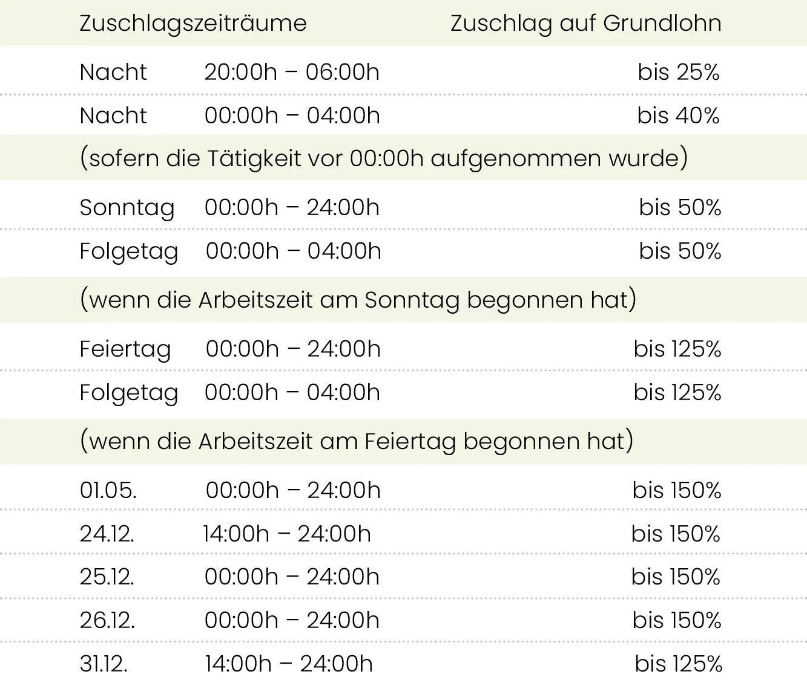
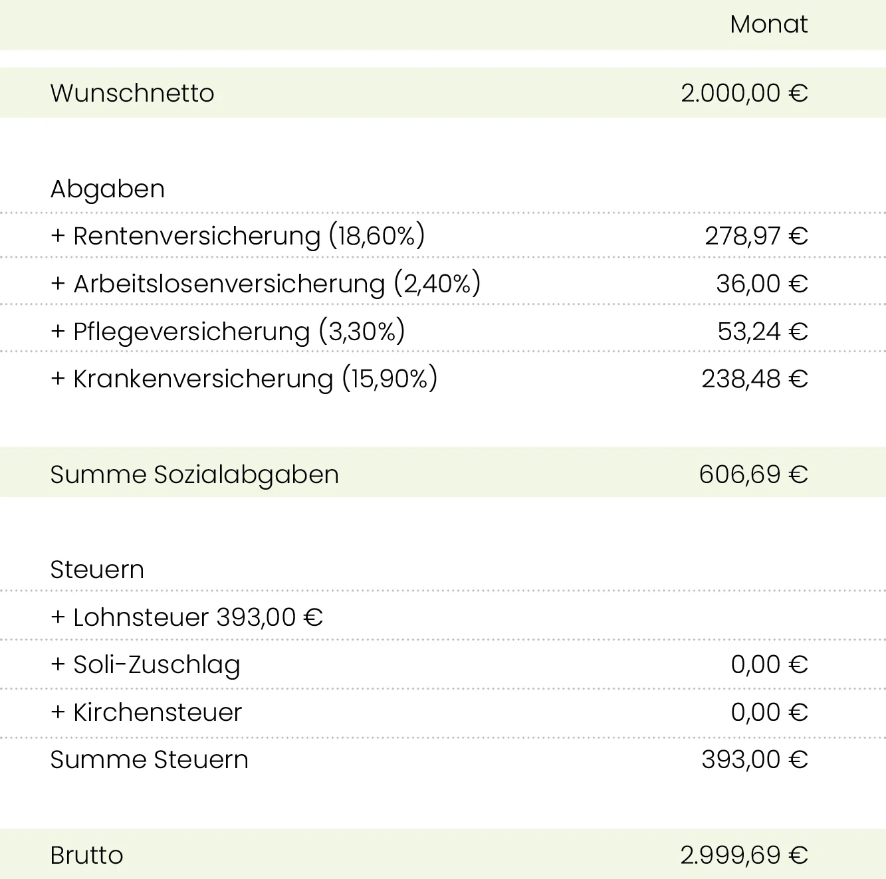
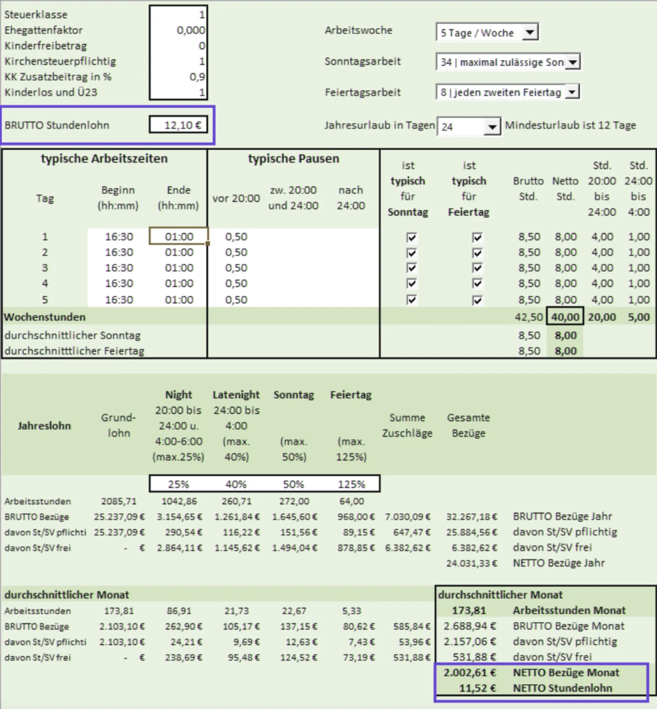

In den [vorangegangenen Blogartikeln](/blog/zeiterfassung_dienstplanung/) haben wir beschrieben, wie sich Stundenaufwand und damit Personalkosten senken lassen, indem Arbeitszeiten gezielt geplant und überwacht werden. Diesen Effekt können Sie möglicherweise noch weiter verstärken, indem Sie die **Lohnkosten je Mitarbeiter senken.** Dies können Sie „schmerzfrei“ für die Mitarbeiter erreichen, denn **keiner wird auch nur auf einen Cent seines Auszahlungslohns verzichten müssen.** Der Standort Deutschland bietet Ihnen hierzu Möglichkeiten, um die Sie Unternehmer in anderen europäischen Ländern nur beneiden können.

## Zuschlagszahlungen

„SFN-Zuschläge“ sind Zuzahlungen zum Lohn für Sonn-, Feiertags- und Nachtarbeit, die sozialversicherungs- und lohnsteuerfrei beim Mitarbeiter landen.

Wenn Sie einen Mehrschicht-Betrieb führen, wissen Sie wahrscheinlich von der Möglichkeit der Sonn-, Feiertags- und Nachtzuschläge und haben diese bereits eingeführt. Sollte dies nicht der Fall sein, können Sie überlegen, **beim nächsten Gespräch über eine Lohnerhöhung auf diese Möglichkeit zurückzugreifen.**

Die folgende Materie mag vielleicht etwas trocken erscheinen, es lohnt sich jedoch, bei diesem Thema „dranzubleiben“.

Knapp gefasst bieten Ihnen die Regelungen zu den **SFN-Zuschlägen die Möglichkeit, Lohnanteile netto auszuzahlen, ohne dass Sie oder der Mitarbeiter Sozialabgaben oder Lohnsteuer abführen müssten.** Im Rahmen der gesetzlichen Grenzen kommt jeder Euro Zuschlag ohne Abzüge beim Mitarbeiter an.

Ein Euro Arbeitgeberaufwand entspricht somit einem Euro Nettolohn für den Arbeitnehmer. Bei jedem Euro ausbezahlter SFN Zuschläge spart der Arbeitgeber den gesamten Sozialversicherungsbeitrag ein, also ca. 40%, plus die persönliche Lohnsteuer, die bei einem Festangestellten meist bei 15-25 % liegt.

Einen Überblick über die Standardmöglichkeiten und -grenzen der SFN-Zuschläge erhalten Sie in dieser Tabelle. In manchen Branchen können Zuschlagshöhen und Zuschlagszeiträume geringfügig abweichen.

<figure>

<figcaption> Wie der Name schon sagt, können SFN-Zuschläge Sonn- Feiertags und Nachts ausgezahlt werden </figcaption>
</figure>

## Zuschläge & Nettolohn

In vielen Branchen streben Mitarbeiter ein möglichst hohes Nettogehalt an.
Viele formulieren diese Netto-Erwartung auch entsprechend eindeutig.

Nehmen wir als Beispiel einen Mitarbeiter, der vollzeitbeschäftigt 40 Stunden pro Woche arbeitet und 29 Jahre alt, unverheiratet, ohne Kinder und konfessionslos ist. Dieser Mitarbeiter möchte ein Nettogehalt von 2.000 €.

Sehen wir uns zuerst einmal eine „normale“ Lohnberechnung an.

**Diese sieht wie folgt aus:**

<figure>

<figcaption> Auch für Niedriglohn fallen hohe Lohnabgaben an </figcaption>
</figure>

Dieser Mitarbeiter erhält also einen Stundenlohn von brutto 17,34 €, netto kommen bei ihm 11,90 € an.

Sehen wir uns nun eine Lohnberechnung für denselben Mitarbeiter an, bei dem die SFN-Zuschläge in seinen Nettolohn **hineingerechnet** werden. 

Sie **vereinbaren** mit einem Mitarbeiter also einen **durchschnittlich zu erwartenden Nettolohn.**

Nehmen wir bei diesem Mitarbeiter an, dass er regelmäßig in der Zeit von 16:30 Uhr bis 1 Uhr und dabei an 34 Sonntagen und an 8 Feiertagen pro Jahr arbeitet.

**So sieht dessen Nettolohnberechnung aus:**

<figure>

<figcaption> **Als Kunde von Pentacode stellen wir Ihnen dieses Formular zur Vorausberechnung auf Nachfrage gerne zur Verfügung.** </figcaption>
</figure>

In diesem Fall erhält der Mitarbeiter etwas mehr als 530 € an sozialversicherungs- und lohnsteuerfreien Zuschlägen. Ein Arbeitnehmer-Brutto von 12,10 € je Stunde führt deshalb zu einem Nettogehalt von 11,52 €.

Unter Hinzurechnung der Arbeitgeberanteile zur Sozialversicherung und unter Berücksichtigung der Lohnsteuerprogression **erspart dieses Modell dem Arbeitgeber etwa 335 € / Monat bei gleichem Auszahlungsbetrag** an den Mitarbeiter.

Dieses Beispiel ist nur dahingehend überzeichnet, als es einen reinen Abendbetrieb widerspiegelt. Doch selbst wenn Sie einen Betrieb führen, der auch tagsüber geöffnet hat und sich die Arbeitszeiten eines Mitarbeiters nachts deshalb verringern: **der Effekt wird erheblich sein und kann an jährlichen Einsparungen schnell einen 5-stelligen Wert erreichen.**

## Fazit

Da Sie Ihren Betrieb kennen und somit einen Überblick über die gängigen Einsatzzeiten Ihrer Mitarbeiter haben, lässt sich dieses Modell sehr passgenau auf Ihr Unternehmen umlegen.

Die Zahlung von Zuschlägen hat für die Mitarbeiter jedoch einen Nachteil: Zuschläge dürfen nur für tatsächlich geleistete und entsprechend dokumentierte Arbeitsstunden gezahlt werden. **Abhängig von den jeweiligen Einsatzzeiten kann dies bei Mitarbeitern zu möglicherweise stark schwankenden Auszahlungslöhnen führen.**

 *Wie Sie auch diese Klippe „umschiffen“ können, zeigen wir Ihnen in unserem nächsten Artikel.* 
