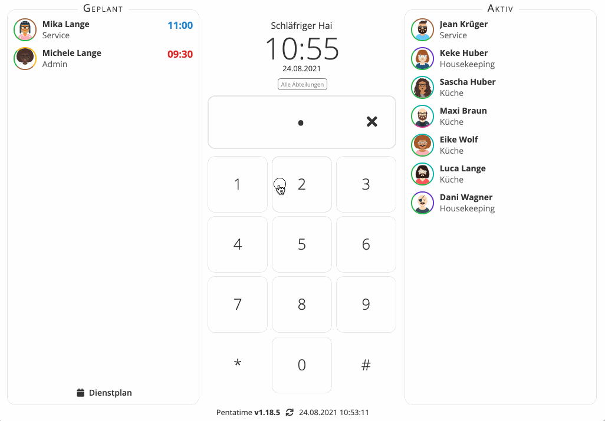
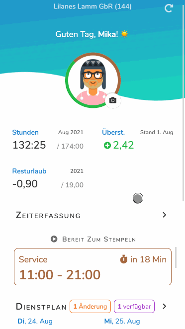

Pentacode Version 1.19.0 ist hier! Dieses Update bringt einige langerwartete Features und Verbesserungen.

## Dienstplannotizen

Das Erstellen von Dienstplänen ist meist eine routinemäßige Angelegenheit. Aber selbst im "langweiligsten" Betrieb gibt es immer wieder besondere Ereignisse oder Aktionen, die in der Dienstplanung berücksichtigt werden müssen. Hierfür gibt es in Pentacode nun die **Dienstplannotizen**! Dienstplannotizen sind ganz einfach und schnell über die Dienstplanansicht
erstellt und können eine beliebigen Zeitraum, sowie beliebige Abteilungen umfassen!





Diese Notizen werden dann automatisch den betroffenen Mitarbeitern zu den relevanten Zeitpunkten angezeigt, also zum
Beispiel beim Anmelden in der Stempeluhr, im persönlichen Dienstplan in der Mitarbeiterapp und bei der Planung von
Abwesenheiten. Dienstplannotizen sind somit nicht nur ein mächtiges Planungstool, sondern auch eine wunderbar
unkomplizierte Möglichkeit, bestimmte Ereignisse und Anforderungen an Ihre Mitarbeiter zu kommunizieren!

## Schichtwahl & Schichttausch





Einer der wohl zeitraubendsten und oft auch frustierenden Aspekte bei der Dienstplanung ist herauszufinden, wer wann verfügbar ist oder wer welche Schichten übernehmen kann und will. Dies ist vor allem dann eine schwierige Aufgabe, wenn Arbeitszeitanforderungen und Verfügbarkeit von Mitarbeitern sich häufig ändern oder ein großer Teil der Arbeitskräfte Aushilfen sind.

Wäre es nicht toll, wenn Sie einfach Ihre Personalanforderungen definieren und Ihre Mitarbeiter sich dann selbständig die gewünschten Schichten auswählen könnten? Genau das ist mit Pentacode v1.19.0 nun möglich! Anstatt Schichten Ihren Mitarbeitern direkt zuzuweisen, können Sie diese Schichten nun einfach im Dienstplan unter "Nicht Zugewiesen" ablegen. Diese Schichten werden dann automatisch den geeigneten Mitarbeitern auf Basis von Verfügbarkeit und Qualifikation angeboten und die Mitarbeiter müssen nun nur noch die gewünschten Arbeitseinsätze per Mitarbeiter-App übernehmen. Pentacode stellt automatisch sicher, dass Schichten nicht doppelt vergeben werden oder es zu Schichtüberlappungen oder Konflikten mit Abwesenheiten kommt.

Aber es kommt noch besser! Falls ein Mitarbeiter eine ihm bereits zugewiesene Schicht nicht antreten kann, kann er diese nun ganz einfach über die Mitarbeiterapp zum Tausch freigeben. Die Schicht wird dann wiederum anderen verfügbaren Mitarbeitern zur Auswahl angeboten. So können Ihre Mitarbeiter selbständig und unkompliziert Schichten tauschen, ohne dass Sie selbst koordinierend eingreifen müssen!

Und keine Sorge, sowohl die selbstständige Schichtwahl als auch das Angebot zum Schichttausch sind nur mit ausdrücklicher Berechtigung erlaubt. Diese Berechtigung können Sie ganz flexibel für alle oder einzelne Ihrer Mitarbeiter vergeben.

> Die selbstständige Schichtwahl und Schichttausch sind nur verfügbar, wenn sie die Pentacode Mitarbeiter-App nutzen. Sollte diese noch nicht für Ihr Unternehmen freigeschaltet sein, wenden Sie sich bitte an unseren Support!

## ... Und Mehr!

Die oben genannten Änderungen sind nur ein Teil der Verbesserungen, die wir in dieser Version vorgenommen haben. Für
eine Ausführliche Auflistung der Änderungen, werfen Sie gerne einen Blick in unser
[Änderungsprotokoll](/hilfe/aenderungsprotokoll/)!