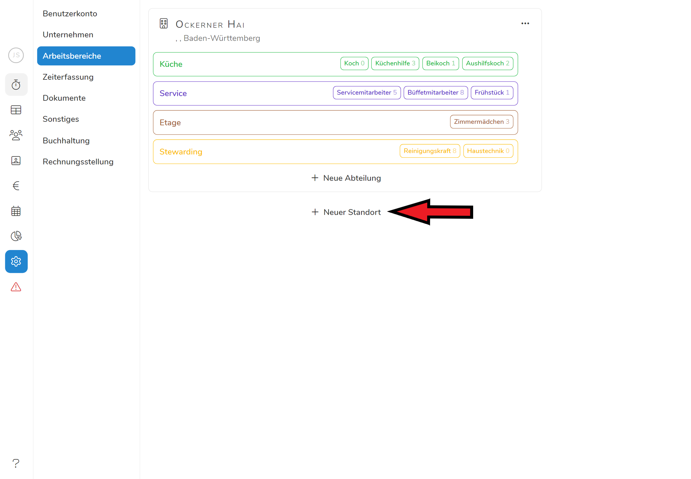
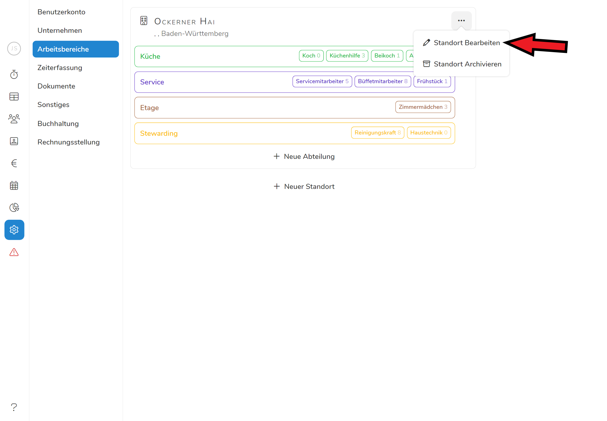
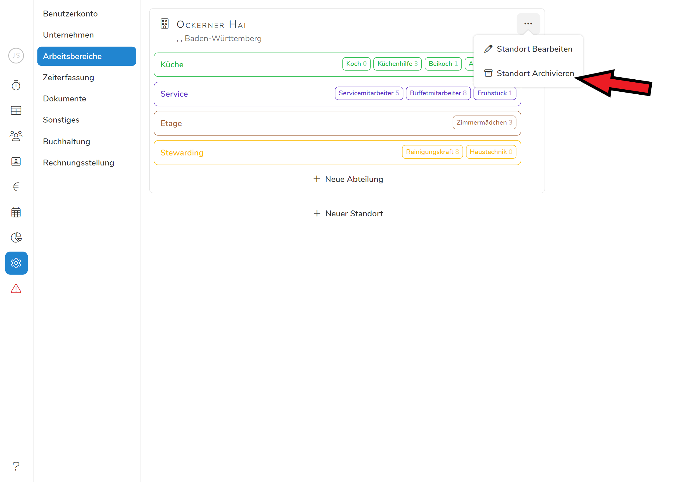
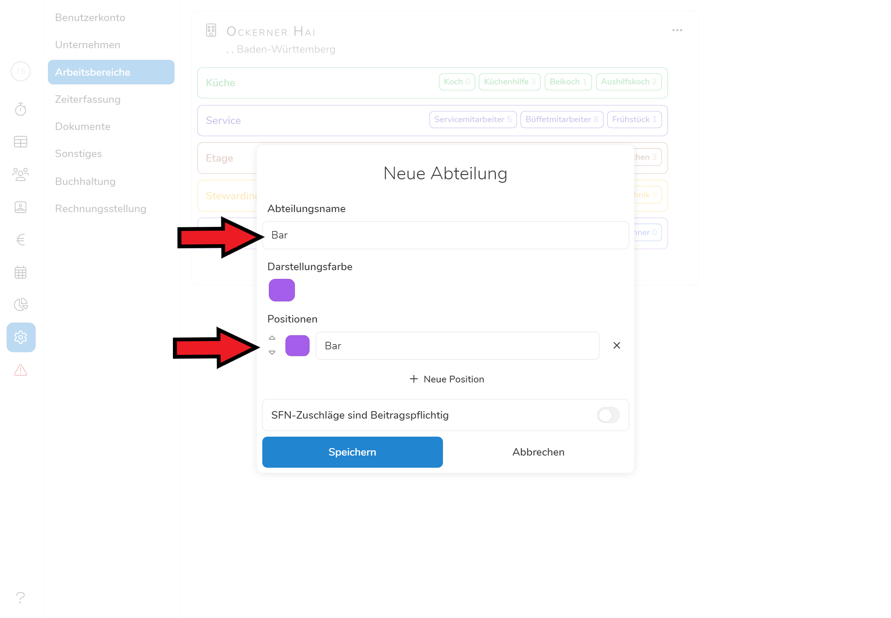
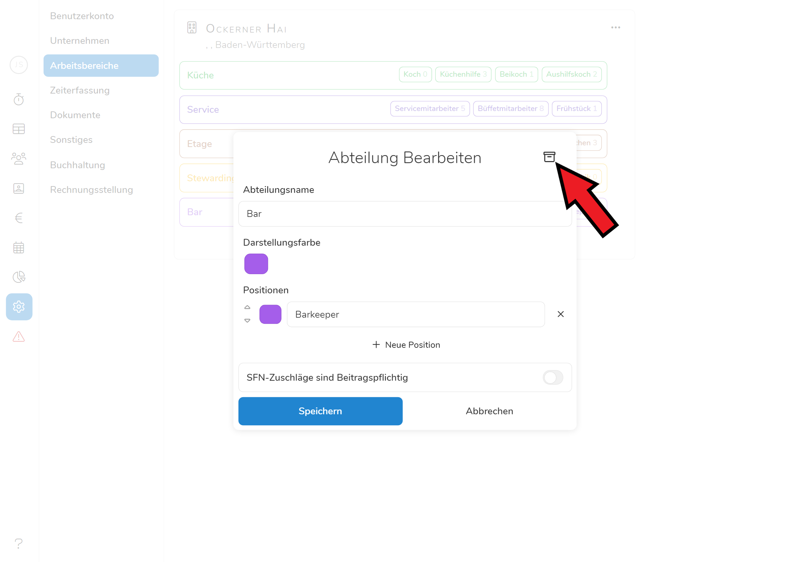
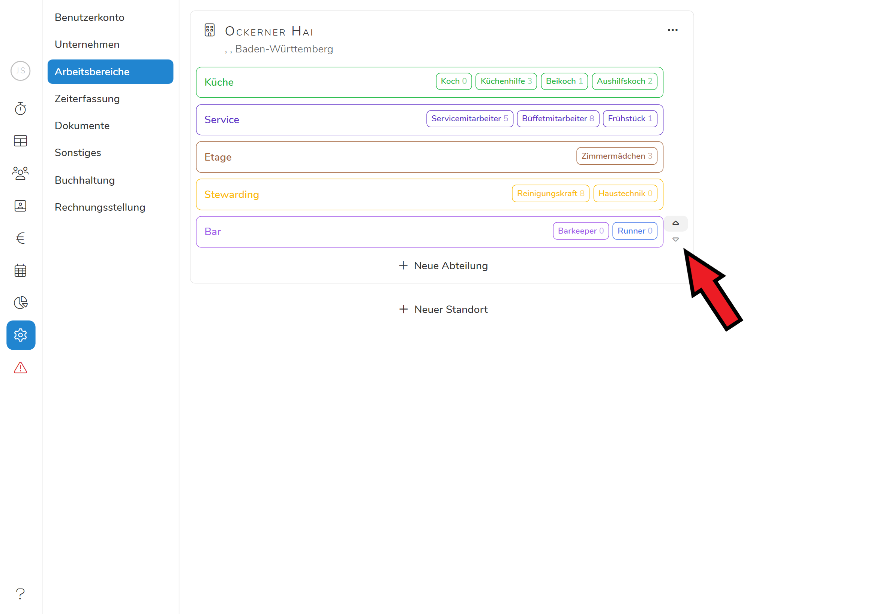

Mit "**Arbeitsbereiche**" umschreiben wir, was in vielen Unternehmen auch als **Abteilungen** bezeichnet wird.

Im Menüpunkt "**Arbeitsbereiche**" legen Sie **Standorte** und deren **Abteilungen** an und können diese bearbeiten. 

Wenn Sie mit Pentacode in Ihrem Unternehmen beginnen, werden Sie aufgefordert einen Standort und eine Abteilung anzulegen, wenn sie "an Bord gehen".

## Neuer Standort

Sie können weitere Standorte anlegen, indem Sie auf "+ Neuer Standort" klicken. Es öffnet ein Dialogfenster, in dem Sie die Standortdaten eingeben.





Wenn Sie den Standort angelegt haben, legen Sie für diesen Standort die entsprechenden Abteilungen an.

Der neue Standort und seine Abteilungen erscheinen unter dem Menüpunkt "Alle Mitarbeiter" unter "[**Positionen**](/hilfe/handbuch/mitarbeiter-alle/positionen/)". Dort legen Sie fest, welche Mitarbeiter in welchen Standorten und deren Abteilungen eingesetzt werden.

## Standort bearbeiten

Durch Anklicken des -Symbols am rechten oberen Eck können Sie Angaben zu einem Standort ändern oder ergänzen, indem Sie **"Standort Bearbeiten"** wählen.





## Standort archivieren

Wenn Sie einen Standort **nicht mehr benötigen** sollten und auch nicht wollen, dass dieser weiterhin in Ihrer Datenbank erscheint, können Sie ihn über das -Symbol **archivieren**. Der Standort ist dann nicht mehr sichtbar, alle Daten, also alle Angaben zu Mitarbeitern, Arbeitszeiten und Kassenbuch bleiben jedoch erhalten.





Sollten Sie einen archivierten Standort wiederherstellen wollen, wenden Sie sich bitte an unseren Support.

## Neue Abteilung

Um eine neue Abteilung zu erstellen, klicken Sie auf "**+Neue Abteilung**".

Jede Abteilung muss **mindestens eine Position** ausweisen. Sollten Sie innerhalb einer Abteilung nicht nach Positionen unterscheiden, empfehlen wir als **Positionsbezeichnung** den **Abteilungsnamen** zu verwenden.





Sie können zusätzlich auswählen ob SFN Zuschläge für Mitarbeiter in dieser Abteilung beitragspflichtig sind. Standardmäßig gelten diese als beitragsbefreit. 

## Abteilung bearbeiten

Wenn Sie auf eine Abteilung klicken, öffnet diese und kann wie oben beschrieben bearbeitet werden.

## Abteilung archivieren

Wenn Sie eine Abteilung **nicht mehr benötigen** sollten und auch nicht wollen, dass diese weiterhin im Dienstplan gezeigt wird, können Sie diese **archivieren**.

Öffnen Sie hierzu die Abteilung und klicken Sie auf das Symbol





Sollten Sie eine archivierte Abteilung wiederherstellen wollen, wenden Sie sich bitte an unseren Support.

## Reihenfolge der Abteilungen ändern

Die Abteilungen sind in der **Reihenfolge** gelistet, in der Sie die Abteilungen beim Einrichten Ihrer Datenbank angelegt haben. In dieser Reihenfolge erscheinen sie auch im **Dienstplan**.

Sie können diese **Reihenfolge** jederzeit **ändern**, indem sie mit einem **Mouse -over** die Abteilung über die **Pfeile** am rechten Rand nach oben oder unten **verschieben**.



