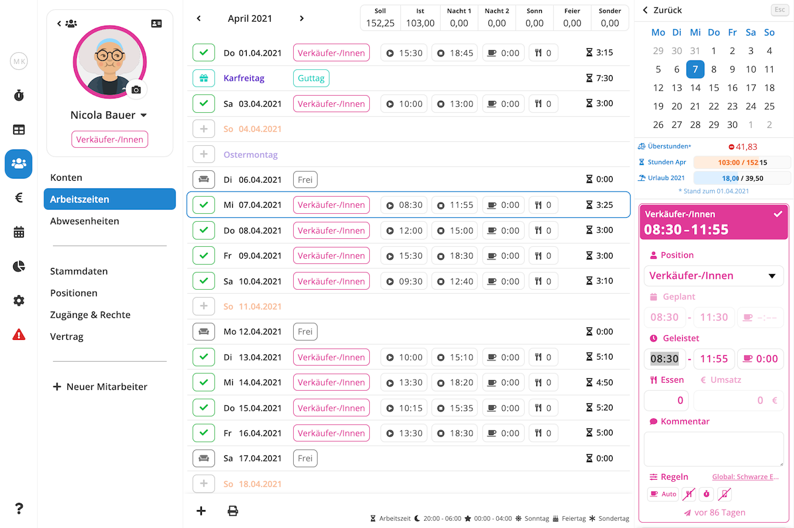

Das **Arbeitszeitblatt** zeigt Ihnen die geplanten und geleisteten eines Mitarbeiters eines Monats in einer
übersichtlichen Listenansicht. Hier können Sie Arbeitszeiten erfassen, Abwesenheiten bearbeiten, Soll- und Iststunden
vergleichen und vieles mehr. Um zum Arbeitszeitblatt eines Mitarbeiters zu gelangen, navigieren Sie zu der Ansicht
[Mitarbeiter / Arbeitszeiten](https://manage.pentacode.app/employees/all/time) und wählen dort den gewünschten
Mitarbeiter.





## Navigation

### Zeitraum Wählen

Um in einen bestimmten Monat zu gelangen, klicken Sie auf den aktuell angezeigten Monat und wählen dort den gewünschten
Zeitraum aus den Dropdown, oder verwenden Sie die  und
 buttons um in den nächsten oder vorherigen Monat zu springen.

>  **Tipp:** Verwenden Sie Ihre Tastatur, um noch schneller zwischen Monaten zu wechseln! Mit
> der  Taste springen Sie in den vorherigen Monat, die  Taste bringt Sie in den nächsten
> Monat.

### Tag Oder Arbeitszeiteintrag Wählen

Um einen Arbeitszeiteintrag zu bearbeiten oder einen neuen Eintrag zu erstellen müssen Sie zunächst den entsprechenden
Eintrag bzw den entsprechenden Tag selectieren. Dies tun Sie ganz einfach, indem Sie mit der Maus auf die gewünschte
Zeile klicken. Ist an dem entsprechenden Tag bereits ein Eintrag vorhanden, wird dieser automatisch zur Bearbeitung selectiert. Falls der Tag noch leer ist, öffnet sich automatisch das Menü zu Erstellung eines neuen Eintrags.

>  **Tipp:** Verwenden Sie Ihre Tastatur, um noch schneller zwischen Einträgen und Tagen zu
> wechseln! Mit der  Taste springen Sie in die nächste Zeile, mit der  Taste selectieren Sie
> die vorherige Zeile.

## Arbeitszeit Erfassen

So erstellen Sie einen neuen Eintrag über das Arbeitszeitblatt:

1. [Selectieren](#tag-oder-arbeitszeiteintrag-wählen) Sie zunächst den Tag, in dem Sie eine Arbeitszeit erfassen möchten.
2. Falls bereits ein Eintrag and diesem Tag vorliegt, wird dieser automatisch zu Bearbeitung geöffnet. In diesem Fall
   müssen Sie zunächst  wählen. Ist der Tag noch leer, können Sie diesen Schritt überspringen.
3. Es öffnet sich ein Menü auf der rechten Seite. Wählen Sie hier die Option . Falls
   der Mitarbeiter mehreren Arbeiteisbereichen zugewiesen ist, wird Ihnen für jeden mögliche Position ein separater Button
   angezeigt. Wählen Sie die Position, für die Sie eine Arbeitszeit erfassen möchten.
4. Es öffnet Sich ein Formular, in dem Sie nun Schichtbeginn- und Ende, sowie verschiedene andere Felder ausfüllen
   können. Mehr zu den einzelnen Feldern und was sie genau bedeuten erfahren Sie unter [Das Schichtformular](#das-schichtformular);
5. Ihren Eingaben werden automatisch gespeichert. Wenn Sie möchten können Sie den Eintrag nun schließen, indem sie den
    button klicken oder  auf Ihrer Tastatur
   drücken.

>  **Tipp:** Falls Sie bereits Arbeitszeiten für diesen Mitarbeiter erfasst haben, erstellt
> Pentacode automatisch **Schichtvorschläge** anhand von üblichen Arbeitszeiten und Arbeitsbereichen. Mehr zu
> Schlichtvorschlägen erfahren Sie im [ Dienstplan](/hilfe/handbuch/dienstplan#schichtvorschläge)
> Hilfeartikel.

## Arbeitszeit Bearbeiten

So bearbeiten Sie einen existierenden Arbeitszeiteintrag:

1. [Selectieren](#tag-oder-arbeitszeiteintrag-wählen) Sie den Eintrag, den Sie bearbeiten möchten.
2. Es öffnet Sich ein Formular, in dem Sie nun Schichtbeginn- und Ende, sowie verschiedene andere Felder bearbeiten
   können. Mehr zu den einzelnen Feldern und was sie genau bedeuten erfahren Sie unter [Das Schichtformular](#das-schichtformular);
3. Ihren Eingaben werden automatisch gespeichert. Wenn Sie möchten können Sie den Eintrag nun schließen, indem sie den
    button klicken oder  auf Ihrer Tastatur
   drücken.

## Das Schichtformular

Das Schichtformular ist eine einheitliche Bearbeitungsansicht, in der sie Plan- und Istzeiten einer Schicht sowie
Pausen, Mitarbeiteressen und einiges mehr bearbeiten können.

### Position

Unter dem Punkt  **Position** können Sie über ein Dropdown-Menü den Arbeitsbereich festlegen, in dem die Schicht stattfinden soll. Die verfügbaren Optionen beschränken sich selbstverständlich auf die dem Mitarbeiter zugewiesenen [Arbeitsbereiche](/hilfe/handbuch/arbeitsbereiche).

### Geplante Zeiten

Über die ersten beiden Felder dem Punkt  **Geplant** können Sie den geplanten Schichbeginn sowie
das geplante Schichtende eintragen. Diese Felder sind nur bearbeitbar, falls der Eintrag in der Zukunft liegt und für
den zugewiesenen Mitarbeiter und Arbeitsbereich die Zeiterfassung per Stempeluhr oder Mitarbeiter-App aktiviert ist.

>  **Hinweis:** Die geplante Start- und Endzeit dient lediglich der Dienstplanung in
> Verbindung mit der Zeiterfassung via Digitaler Stempeluhr oder Mitarbeiter-App und **führt
> nicht automatisch zu Erfassung von geleisteten Arbeitszeiten**..

### Geplante Pausen

Über das rechte Eingabefeld unter der Überschrift  **Geplant** können Sie die geplante Pause für eine Schicht eintragen. Dieses Feld ist nur bearbeitbar, falls der Pausenmodus **Geplant** oder **Geplant + Manuell** für diese Schicht gewählt ist. Mehr über diese Pausenmodi und wie geplante Pausen zur Anwendungen finden, erfahren Sie in dem Hilfeartikel [ Einstellungen /  Zeiterfassung](/hilfe/handbuch/einstellungen/zeiterfassung).

### Geleistete Zeiten und Pause
