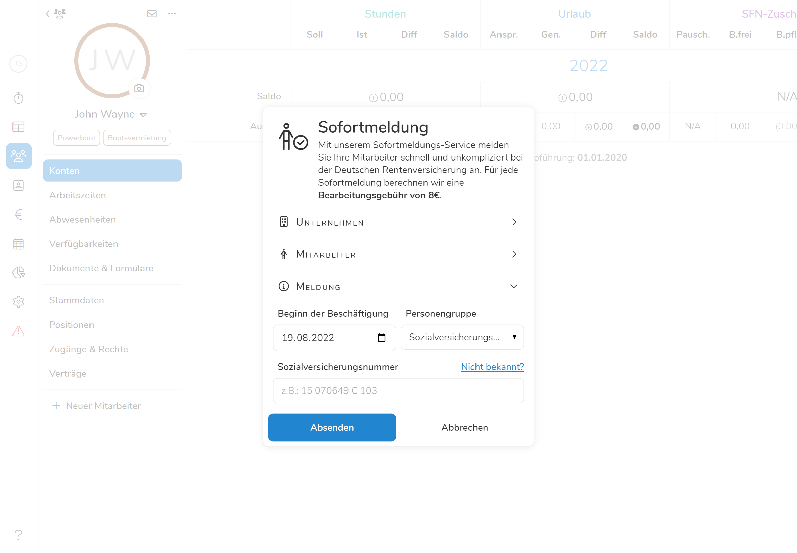

## Neuen Mitarbeiter Anlegen

Um einen neuen Mitarbeiter anzulegen, wählen Sie zunächst den Punkt  im
Hauptmenü und klicken Sie dort auf den Button . Es öffnet sich ein
Dialogfenster, das Sie Schritt für Schritt durch den Prozess führt:

### 1. Stammdaten

Hier können Sie allgemeine Informationen zum Mitarbeiter erfassen. Mehr Informationen zum Thema Mitarbeiter-Stammdaten
finden Sie unter [Mitarbeiter/Stammdaten](../stammdaten/).

Klicken Sie auf , um zum Punkt [Positionen](#2-positionen) zu gelangen.

### 2. Positionen

Hier können Sie die Arbeitsbereiche definieren in denen der Mitarbeiter eingesetzt werden kann/soll. Mehr Informationen
zum Thema Arbeitsbereiche finden Sie unter [Einstellungen/Arbeitsbereiche](../../einstellungen/arbeitsbereiche.md).
Zugewiesene Positionen können später jederzeit unter [Mitarbeiter/Positionen](../positionen/) bearbeiten.

Klicken Sie auf , um zum Punkt [Vertrag](#3-vertrag) zu gelangen.

### 3. Vertrag

Hier hinterlegen Sie die Vertragsdaten des Mitarbeiters, wo Sie das Beschäftigungsverhältnis, Lohn/Gehalt, Sollstunden,
Urlaubsanspruch und vieles mehr definieren können. Details zu den einzelnen Feldern und deren Auswirkungen finden Sie
unter [Mitarbeiter/Vertrag](../vertrag/#felder--eigenschaften). Auch die Vertragsdaten können später jederzeit unter
dem Menüpunkt [Mitarbeiter/Vertrag](../vertrag/#vertrag-bearbeiten) angepasst werden.

Klicken Sie auf , um zum Punkt [Zugänge &
Rechte](#4-zugänge--rechte) zu gelangen.

### 4. Zugänge & Rechte

Hier können Sie entscheiden, ob Sie dem Mitarbeiter Zugriff auf bestimmte Bereiche und Funktionen in Pentacode geben
wollen.

Falls Sie dies tun möchten, aktivieren Sie den Button .
Für das Erstellen eines Mitarbeiterzugangs wird eine Emailadresse benötigt. Geben Sie diese also ein, falls Sie
dies nicht bereits unter [1. Stammdaten](#1-stammdaten) getan haben. Optional können Sie auch eine Nachricht eingeben,
die in der Einladungs-Email an den Mitarbeiter angezeigt werden soll. Klicken Sie nun auf 
um festzulegen, welche [Berechtigungen](#5-berechtigungen) der Mitarbeiter erhalten soll.

Falls Sie dem Mitarbeiter keinen Zugriff auf Pentacode geben möchten, deaktivieren Sie einfach den  Button. Sie können nun den Vorgang abschließen, indem Sie auf den
Button  klicken.

### 5. Berechtigungen

Falls Sie im vorherigen Schritt die Option 
gewählt haben, können Sie nun definieren, welche Berechtigungen der Mitarbeiter genau erhalten soll. Mehr Informationen
zum Thema Berechtigungen finden Sie unter [Mitarbeiter/Zugänge & Rechte](../zugaenge-rechte/).

Wenn Sie die Berechtigungen des Mitarbeiters zu Ihrer Zufriedenheit eingerichtet haben, können Sie nun den Vorgang
abschließen, indem Sie auf den Button  klicken.

## Mitarbeiter Auf Probe

Bevor eine Person als voller Mitarbeiter eingestellt wird, ist es in vielen Branchen üblich, ihn einen oder mehrere Tage
"auf Probe" arbeiten zu lassen. So kann sichergestellt werden, dass ein Mitarbeiter auch wirklich in das Unternehmen
passt und für die vorgesehenen Aufgaben geeignet ist.

Um einen Mitarbeiter "auf Probe" anzulegen, gehen Sie genauso vor wie unter [Neuen Mitarbeiter
Anlegen](#neuen-mitarbeiter-anlegen) beschrieben. Allerdings aktivieren Sie nun den Button  in der linken oberen Ecke. Die Punkte
**Vertrag** und **Zugänge & Rechte** können in diesem Fall übersprungen werden.

Mitarbeiter mit dem Status "Auf Probe", können bereits für [Dienste eingeplant](../../dienstplan/) werden und sogar
über die [Digitale Stempeluhr](../../stempeluhr/) Zeiten erfassen. Sonstige Features wie das Arbeitszeitkonto,
Abwesenheiten oder das Dokumentenarchiv sind für Probemitarbeiter nicht verfügbar.

### Probemitarbeiter Voll Einstellen

Um einen Probemitarbeiter in einen vollen Mitarbeiter umzuwandeln, gehen Sie wie folgt vor:

1. Wählen Sie den Punkt  im Hauptmenü
   und wählen dort den gewünschten Mitarbeiter über das Dropdown-Menu
    in der linken oberen Ecke.
2. Klicken Sie den Button  unter dem Namen
   des Mitarbeiters.
3. Bestätigen Sie die Aktion durch einen Klick auf den -Button.
4. Es öffnet sich automatisch das Formular zum [Erstellen eines neuen Vertrages](../vertrag/#neuer-vertrag).
   Geben Sie hier die gewünschten Vertragsdaten ein und klicken Sie auf .

## Sofortmeldung 

Da Sie jeder von Ihnen eingestellte Mitarbeiter -- ab dem ersten Tag -- bei der Rentenversicherung meldepflichtig ist, fällt besonders bei häufig wechselndem Personal viel Arbeit an. Dank der Sofortmeldungsfunktion können Sie das Melden eines neuen Mitarbeiter nun **in wenigen Minuten direkt über Pentacode** erledigen und gehen sicher, **stets rechtlich korrekt** zu arbeiten. Sie benötigen dazu nur einige Daten des Mitarbeiters, welche Sie einfach über die Personalfragebogen Funktion anfragen können. 

> Für jede Sofortmeldung fällt eine Bearbeitungsgebühr von 8€ an, welche mit ihrer nächsten regulären Monatsabrechnung anfällt. Ihre Zeitersparnis und die Sicherheit bei -- Betriebskontrollen -- nichts zu befürchten zu haben, ist aber unbezahlbar.

-- Auf Probe auch meldepflichtig oder?

### Sofortmeldung bei neuen Mitarbeitern 

Sobald Sie einen neuen Mitarbeiter angelegt haben wird sich ein Dialogfeld öffnen, welches Sie fragt ob Sie diesen neuen Mitarbeiter direkt bei der Rentenversicherung melden wollen. Bestätigen Sie diese Anfrage öffnet sich ein weiteres Fenster, in dem Sie einige Daten für die Krankenkasse ausfüllen müssen. Diese Felder werden im Folgenden genauer beschrieben:





#### Unternehmen

Hier tragen Sie die Daten ihres Unternehmens ein. Wenn Sie unter [**Einstellungen**](/hilfe/handbuch/einstellungen/unternehmen) ihre Unternehmensdaten bereits angegeben haben, werden diese automatisch in die Sofortmeldung übertragen. 

#### Mitarbeiter

Hier sind die Meldedaten des Mitarbeiters anzugeben. Wenn Sie während der Anmeldung des Mitarbeiters das Stammdatenblatt schon ausgefüllt haben, werden auch diese Daten automatisch übernommen. 

#### Meldung

Die Rentenversicherung braucht desweiteren das Datum des **Beginns der Beschäftigung** sowie die **Versicherungsgruppe** des Mitarbeiters und die **Sozialversicherungsnummer**.

> **Tipp**  Wenn Sie die Sozialversicherungsnummer des Mitarbeiters nicht wissen, klicken Sie auf **Nicht bekannt** neben dem Feld. Füllen Sie nun die weiteren Daten des Mitarbeiters aus um die Zuordnung zu ermöglichen.

Anschließend müssen Sie die Sofortmeldung noch bestätigen, dann wird diese unter der Bearbeitungsgebühr an die Rentenversicherung weitergeleitet. 

### Mitarbeitern nachmelden

Sollten Sie noch Mitarbeiter haben, welche noch nicht bei der Rentenversicherung gemeldet sind, können Sie auch diese noch nachmelden. Wählen Sie dazu den Mitarbeiter aus und klicken auf das  **Symbol** über dem Profilbild. Wählen Sie nun  **Sofortmeldung** und verfahren wie unter [Sofortmeldung bei neuen Mitarbeitern](#sofortmeldung-bei-neuen-mitarbeitern) beschrieben. 

### Meldebescheinigung

Nachdem Sie die Sofortmeldung eines Mitarbeiters erfolgreich abgeschlossen haben, fertigt Pentacode automatisch eine Meldebescheinigung an und speichter diese im **Dokumentenarchiv** des Mitarbeiters. Diese dient sowohl Ihnen als Nachweis der verpflichteten Meldung als auch ihrem Mitarbeiter. Damit dieser jedoch Zugriff auf die Meldebescheinigung erhält, muss er ein Profil in der [Mitarbeiterapp](/hilfe/handbuch/mitarbeiter-app/) besitzen und Sie müssen ihm den [Zugang zu seinem Dokumentenarchiv](/hilfe/handbuch/mitarbeiter/zugaenge-rechte/) gewähren. 
 
## Mitarbeiter Entlassen

Wenn ein Mitarbeiter Ihr Unternehmen dauerhaft oder vorübergehen verlässt, können Sie diesen über die "Mitarbeiter
Entlassen" Funktion aus dem Stamm der aktiven Mitarbeiter entfernen. Dies hat mehrere Auswirkungen:

- Der aktuelle [Vertrag](../vertrag/) wird zum Stichtag beendet.
- Der Mitarbeiter erscheint nicht mehr im Dienstplan und den verschiedenen Mitarbeiter-Listen.
- Dem Mitarbeiter werden automatisch alle Mitarbeiter- und Verwaltungszugange entzogen.

So entlassen Sie einen Mitarbeiter:

1. Wählen Sie den Punkt  im Hauptmenü
   und wählen dort den gewünschten Mitarbeiter über das Dropdown-Menu
    in der linken oberen Ecke.
2. Öffnen Sie das Aktions-Menü über den -Button und
   wählen Sie dort die Option .
3. Geben Sie das Datum ein, ab dem der Mitarbeiter ausgeschieden sein soll. Dieses kann sowohl
   in der Zukunft als auch in der Vergangenheit liegen. Wenn Sie ein Datum in der Zukunft wählen,
   wird das Ausscheiden des Mitarbeiters "vorgemerkt" und der Mitarbeiter bleibt bis zum entsprechenden
   Datum verfügbar.
4. Bestätigen Sie die Aktion durch einen Klick auf den -Button.

## Mitarbeiter Wiedereinstellen

Ausgeschiedene Mitarbeiter werden nicht komplett aus dem System entfernt,
sondern sind weiterhin auffindbar und können sogar [wieder eingestellt](#mitarbeiter-wiedereinstellen) werden!
So stellen ausgeschiedenen Mitarbeiter erneut ein:

1. Wählen Sie den Punkt  im Hauptmenü
   und wählen dort den gewünschten Mitarbeiter über das Dropdown-Menu
    in der linken oberen Ecke.
   **Achtung:** Ausgeschiedene Mitarbeiter werden in der Liste erst aufgeführt, wenn sie einen
   Suchbegriff in das Suchfeld eingeben. Geben Sie also einfach den Namen (oder einen Teil des Namens)
   des Mitarbeiters in das Suchfeld ein, um den ausgeschiedenen Mitarbeiter zu finden.
2. Öffnen Sie das Aktions-Menü über den -Button und
   wählen Sie dort die Option .
3. Bestätigen Sie die Aktion durch einen Klick auf den -Button.
4. Es öffnet sich automatisch das Formular zum [Erstellen eines neuen Vertrages](../vertrag/#neuer-vertrag).
   Geben Sie hier die neuen Vertragsdaten ein und klicken Sie auf .

## Mitarbeiter Löschen

So löschen Sie einen Mitarbeiter:

1. Wählen Sie den Punkt  im Hauptmenü
   und wählen dort den gewünschten Mitarbeiter über das Dropdown-Menu
    in der linken oberen Ecke.
2. Öffnen Sie das Aktions-Menü über den -Button und
   wählen Sie dort die Option .
3. Bestätigen Sie die Aktion durch einen Klick auf den -Button.

>  **Achtung:** Durch das Löschen eines Mitarbeiters werden nicht nur dessen
> Stammdaten, sondern auch alle erfassten Arbeitszeiten, Abwesenheiten und andere mitarbeiterbezogene Bewegungsdaten
> gelöscht. **Diese Aktion kann nicht rückgängig gemacht werden!** Wenn Sie einen Mitarbeiter als ausgeschieden
> markieren wollen, empfehlen wir, die [Mitarbeiter entlassen](#mitarbeiter-entlassen) Funktion zu nutzen.
