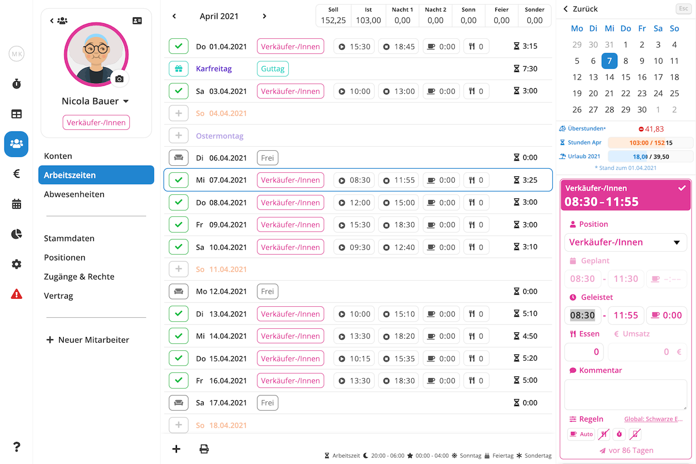

Das **Arbeitszeitblatt** zeigt Ihnen die geplanten und geleisteten eines Mitarbeiters eines Monats in einer
übersichtlichen Listenansicht. Hier können Sie Arbeitszeiten erfassen, Abwesenheiten bearbeiten, Soll- und Iststunden
vergleichen und vieles mehr. Um zum Arbeitszeitblatt eines Mitarbeiters zu gelangen, navigieren Sie zu der Ansicht
[Mitarbeiter / Arbeitszeiten](https://manage.pentacode.app/employees/all/time) und wählen dort den gewünschten
Mitarbeiter.





## Navigation

### Zeitraum Wählen

Um in einen bestimmten Monat zu gelangen, klicken Sie auf den aktuell angezeigten Monat (linke obere Ecke) und wählen
dort den gewünschten Zeitraum aus dem Dropdown, oder verwenden Sie die  und  Buttons um in den nächsten oder vorherigen Monat zu springen.

>  **Tipp:** Verwenden Sie Ihre Tastatur, um noch schneller zwischen Monaten zu wechseln! Mit
> der  Taste springen Sie in den vorherigen Monat, die  Taste bringt Sie in den nächsten
> Monat.

### Tag Oder Arbeitszeiteintrag Wählen

Um einen Arbeitszeiteintrag zu bearbeiten oder einen neuen Eintrag zu erstellen müssen Sie zunächst den entsprechenden
Eintrag bzw den entsprechenden Tag selectieren. Dies tun Sie ganz einfach, indem Sie mit der Maus auf die gewünschte
Zeile klicken. Ist an dem entsprechenden Tag bereits ein Eintrag vorhanden, wird dieser automatisch zur Bearbeitung selectiert. Falls der Tag noch leer ist, öffnet sich automatisch das Menü zu Erstellung eines neuen Eintrags.

>  **Tipp:** Verwenden Sie Ihre Tastatur, um noch schneller zwischen Einträgen und Tagen zu
> wechseln! Mit der  Taste springen Sie in die nächste Zeile, mit der  Taste selectieren Sie
> die vorherige Zeile.

## Neue Arbeitszeit Erfassen

So erstellen Sie einen neuen Eintrag über das Arbeitszeitblatt:

1. [Selektieren](#tag-oder-arbeitszeiteintrag-wählen) Sie zunächst den Tag, in dem Sie eine Arbeitszeit erfassen möchten.
2. Falls bereits ein Eintrag and diesem Tag vorliegt, wird dieser automatisch zu Bearbeitung geöffnet. In diesem Fall
   müssen Sie zunächst  wählen. Ist der Tag noch leer, können Sie diesen Schritt überspringen.
3. Es öffnet sich ein Menü auf der rechten Seite. Wählen Sie hier die Option . Falls
   der Mitarbeiter mehreren Arbeiteisbereichen zugewiesen ist, wird Ihnen für jeden mögliche Position ein separater Button
   angezeigt. Wählen Sie die Position, für die Sie eine Arbeitszeit erfassen möchten.
4. Es öffnet Sich ein Formular, in dem Sie nun Schichtbeginn- und Ende, sowie verschiedene andere Felder ausfüllen
   können. Mehr zu den einzelnen Feldern und was sie genau bedeuten erfahren Sie unter [ Schichtformular](/hilfe/handbuch/schichtformular).
5. Ihren Eingaben werden automatisch gespeichert. Wenn Sie möchten können Sie den Eintrag nun schließen, indem sie den
    button klicken oder  auf Ihrer Tastatur
   drücken.

>  **Tipp:** Falls Sie bereits Arbeitszeiten für diesen Mitarbeiter erfasst haben, erstellt
> Pentacode automatisch **Schichtvorschläge** anhand von üblichen Arbeitszeiten und Arbeitsbereichen. Mehr zu
> Schlichtvorschlägen erfahren Sie im [ Dienstplan](/hilfe/handbuch/dienstplan#schichtvorschläge)
> Hilfeartikel.

## Arbeitszeit Bearbeiten

So bearbeiten Sie einen existierenden Arbeitszeiteintrag:

1. [Selektieren](#tag-oder-arbeitszeiteintrag-wählen) Sie den Eintrag, den Sie bearbeiten möchten.
2. Es öffnet Sich ein Formular, in dem Sie nun Schichtbeginn- und Ende, sowie verschiedene andere Felder bearbeiten
   können. Mehr zu den einzelnen Feldern und was sie genau bedeuten erfahren Sie unter [ Schichtformular](/hilfe/handbuch/schichtformular).
3. Ihren Eingaben werden automatisch gespeichert. Wenn Sie möchten können Sie den Eintrag nun schließen, indem sie den
    button klicken oder  auf Ihrer Tastatur
   drücken.

>  **Tipp:** Um beim Selektieren eines Eintrags direkt in ein bestimmtes Feld zu springen,
> klicken Sie einfach auf den entsprechenden Wert in der Listenansicht. Also wenn Sie z.B. die Pausenzeit bearbeiten
> wollen, klicken Sie einfach auf den Pausenwert und Sie landen direkt im entsprechenden Eingabefeld wo Sie Ihre Änderung
> vornehmen können.

## Arbeitszeit Löschen

Zum Löschen eines Arbeitszeiteintrags gehen Sie wie folgt vor:

1. [Selektieren](#tag-oder-arbeitszeiteintrag-wählen) Sie den Eintrag, den Sie bearbeiten möchten. Es öffnet sich die
   Tagesansicht auf der rechten Seite.
2. Bewegen Sie die Maus über die farbige Box direkt über dem Bearbeitungsformular und klicken Sie das  Symbol im rechten oberen Eck.
3. Der Eintrag ist nun gelöscht. Wenn Sie möchten können Sie die Tagesansicht nun schließen, indem sie den
    button klicken oder  auf Ihrer Tastatur
   drücken.

## Freien Tag oder Guttag Eintragen

1. [Selektieren](#tag-oder-arbeitszeiteintrag-wählen) Sie zunächst einen leeren Tag, den Sie als freien Tag erfassen möchten.
2. Es öffnet sich ein Menü auf der rechten Seite. Klicken Sie hier auf den  oder  button oder klicken Sie die  Taste auf Ihrer Tastatur für "Frei" oder die  Taste für "Guttag".
3. Der Eintrag wird automatisch gespeichert. Wenn Sie möchten können Sie die Tagesansicht nun schließen, indem sie den
    button klicken oder  auf Ihrer Tastatur
   drücken.

>  **Hinweis:** Freie Tage dienen nur als Platzhalter/Planhilfe und haben keinen Einfluss auf
> das Arbeitszeitkonto oder die Zeiterfassung.

## Urlaub oder Krankeit Eintragen

1. [Selektieren](#tag-oder-arbeitszeiteintrag-wählen) Sie zunächst einen Tag aus dem Zeitraum, für den Sie einen Urlaub
   oder eine Krankheit eintragen wollen.
2. Es öffnet sich ein Menü auf der rechten Seite. Klicken Sie hier auf den  oder  button oder klicken Sie die  Taste auf Ihrer Tastatur für "Urlaub" oder die  Taste für "Krank".
3. Es öffnet sich ein Dialog, in dem Sie den Abweisenheits-Zeitraum und die zu buchenden Fehltage eintragen können.
   Details zu diesem Dialog und generelle Informationen zur Erfassung von Abwesenheiten finden Sie im [ Abwesenheiten](/hilfe/handbuch/abwesenheiten) Hilfeartikel.

>  **Hinweis:** aus Gründen der Übersichtlichkeit haben wir die Abwesenheitsarten **Kind
> Krank** und **Krank in KuG** and dieser Stelle weggelassen. Sie können diese im Bereich [Mitarbeiter /
> Abwesenheiten](https://manage.pentacode.app/employees/all/absences/) erfassen.

### Zeitbuchung

Sie können dem Arbeitszeitkonto eines Mitarbeiter auch **Stunden** summarisch **hinzubuchen** oder in **Abzug** bringen.

Wählen Sie dafür "**Zeitbuchung**" und die Art der Buchung über den Dropdownpfeil.





### Urlaubsbuchung

Über "**Urlaubsbuchung**" können Sie einem Mitarbeiter über den Dropdown-Pfeil **Urlaubstage hinzugeben** oder **abbuchen**.

Wählen Sie hierzu die gewünschte Buchungsart und geben Sie die Anzahl der Tage ein, die entsprechend gebucht werden soll.





Wenn Sie Urlaubstage abziehen, geht Pentacode davon aus, dass diese **Urlaubstage ausbezahlt** werden. Es erscheint deshalb das Feld "**€ Bezahlt**" mit dem **aktivierten** Button. Die gebuchten Urlaubstage werden dem Urlaubskonto des Mitarbeiters in Abzug gebracht und für die Lohnabrechnung als auszuzahlender Urlaub zugeführt.

Wenn Sie dies nicht wollen, müssen Sie den Button **manuell deaktivieren**.

Wenn Sie Urlaub hinzubuchen, erscheint dieser Button nicht.

## Arbeitszeiten Drucken

Durch das Anklicken des -Symbols am linken unteren Rand wählen Sie zwischen zwei Möglichkeiten, das Arbeitszeitkonto des Mitarbeiters **auszudrucken**.





### Arbeitszeiten Nachweis

Der "**Arbeitszeiten Nachweis**" listet die täglichen Arbeitszeiten mit ihrem jeweiligen Anfang und Ende, den Ruhepausen und die Dauer des Arbeitstages.

Am rechten oberen Rand finden Sie die **Soll- und Ist-Arbeitszeiten** des Monats einander gegenübergestellt und die **Differenz** ausgewiesen

In der Spalte "**AZ**" ist die **tatsächliche Arbeitszeit** nach Abzug der Pausen zu sehen, in der danebenliegenden Spalte "**BEZ**" die Anzahl der **bezahlten Stunden**.





Im Regelfall sind die Angaben in beiden Spalten identisch. Wenn Sie hingegen **Pausen bezahlen**, werden diese den bezahlten Stunden unter "**BEZ**" hinzu addiert.

> Wir empfehlen Ihnen, das Arbeitszeitkonto auszudrucken und vom **Mitarbeiter unterzeichnen** zu lassen.

> Dieser Ausdruck dient zum einen als **Nachweis** bei Überprüfungen durch die jeweiligen Prüfungsbehörden. Zum anderen bestätigt der Mitarbeiter mit der Unterschrift die Richtigkeit der Dokumentation. Dies dient Ihrem Schutz vor späteren Anfechtungen.

### Lohnabrechnung

Der Ausdruck "**Lohnabrechnung**" weist neben den Angaben des "Arbeitszeiten Nachweis" auch die eventuellen Sonn-, Feiertags- und Nachtarbeitsstunden, sowie die Anzahl eventueller Mahlzeiten aus.





Am Fußende sehen Sie die **Zusammenfassung** nach Stunden und die daraus resultierenden jeweiligen **Euro**-Beträge. Die Lohnangaben beziehen sich dabei auf das **Arbeitgeber-Brutto**.

Dieser Nachweis dient vor allem Ihrer **internen** Dokumentation und ist nicht zwingend geeignet, den Mitarbeitern ausgehändigt zu werden.

> Im Falle einer Prüfung ist es empfehlenswert, dem Prüfer für eine Stichprobenkontrolle einzelne Ausdrucke der "Lohnabrechnung" zu überlassen. Die offensichtliche Transparenz, Richtigkeit und Glaubwürdigkeit Ihrer Dokumentation durch Pentacode kann den Prüfungsvorgang u.U. erheblich beschleunigen.
