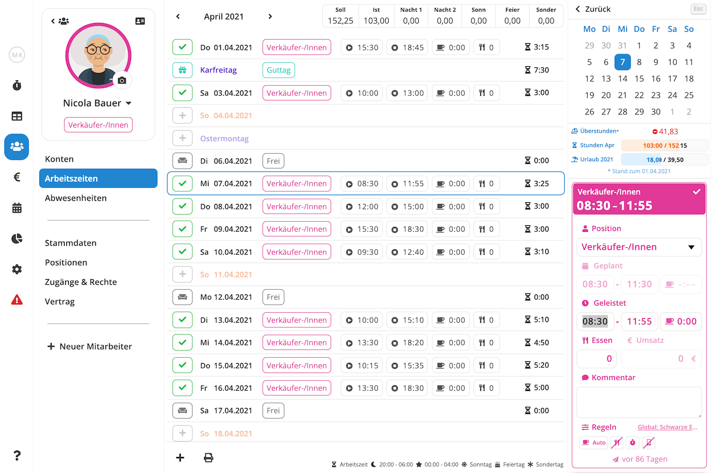

Das Planen, Erfassen und Dokumentieren von Arbeitszeiten gehört zu den Kernaufgaben von Pentacode. In diesem Artikel
erfahren Sie unter anderem, wie Sie die Arbeitzeiten Ihrer Mitarbeiter einsehen, manuell erfassen, bearbeiten und
exportieren können.

## Arbeitszeiten Übersicht

Die Arbeitszeitenübersicht zeigt Ihnen in tabellarischer Form alle geleisteten Arbeitszeiten und -tage eines Monats, sowie verschiedene andere Informationen wie gebuchte Mitarbeiteressen, angefallene Fehltage inklusive berechneter Fehlstunden und eventuelle Zuschläge. Außerdem können Sie von dieser Ansicht aus Arbeitszeiten, Fehlzeiten und andere lohnabrechnungsrelevante Daten exportieren. Mehr dazu unter [Arbeitszeiten Exportieren](#arbeitszeiten-exportieren).

Um zur Arbeitszeiten-Übersicht zu gelangen, wählen Sie den Punkt **Mitarbeiter** aus dem Hauptmenü und dort den Unterpunkt **Arbeitszeiten**.





## Das Arbeitszeitblatt

Das **Arbeitszeitblatt** zeigt Ihnen die geplanten und geleisteten 
monatlichen Arbeitszeiten eines Mitarbeiters in einer
übersichtlichen Listenansicht. Hier können Sie Arbeitszeiten erfassen, Abwesenheiten bearbeiten, Soll- und Ist-Stunden
vergleichen und vieles mehr. Um zum Arbeitszeitblatt eines Mitarbeiters zu gelangen, navigieren Sie zunächst zur [Arbeitszeiten-Übersicht](#arbeitszeiten-übersicht) und wählen dort den gewünschten Mitarbeiter.





>  **Tipp:** Verwenden Sie Ihre Tastatur, um noch schneller zwischen Monaten, Tagen und
> Einträgen zu wechseln! Mit der  Taste springen Sie in den vorherigen Monat, die  Taste
> bringt Sie in den nächsten Monat. Mit der  Taste springen Sie in die nächste Zeile, mit der
>  Taste selektieren Sie die vorherige Zeile.

## Neue Arbeitszeit Erfassen

So erfassen Sie eine neue Arbeitszeit für einen Mitarbeiter:

1. Gehen Sie in das [Arbeitszeitblatt](#das-arbeitszeitblatt) des gewünschten Mitarbeiters und klicken Sie dort auf den
   Tag, in dem Sie eine Arbeitszeit erfassen möchten.
2. Falls bereits ein Eintrag an diesem Tag vorliegt, wird dieser automatisch zur Bearbeitung geöffnet. In diesem Fall
   müssen Sie zunächst  wählen. Ist der Tag noch leer, können Sie diesen Schritt überspringen.
3. Es öffnet sich ein Menü auf der rechten Seite. Wählen Sie hier die Option . Falls
   der Mitarbeiter mehreren Arbeitsbereichen zugewiesen ist, wird Ihnen für jeden mögliche Position ein separater Button
   angezeigt. Wählen Sie die Position, für die Sie eine Arbeitszeit erfassen möchten.
4. Es öffnet Sich ein Formular, in dem Sie nun Schichtbeginn- und Ende, sowie verschiedene andere Felder ausfüllen
   können. Mehr zu den einzelnen Feldern und was sie genau bedeuten erfahren Sie unter [Felder &
   Eigenschaften](#felder--eigenschaften).
5. Ihre Eingaben werden automatisch gespeichert. Wenn Sie möchten können Sie den Eintrag nun schließen, indem sie den
    button klicken oder  auf Ihrer Tastatur
   drücken.

>  **Tipp:** Falls Sie bereits Arbeitszeiten für diesen Mitarbeiter erfasst haben, erstellt
> Pentacode automatisch **Schichtvorschläge** anhand von üblichen Arbeitszeiten und Arbeitsbereichen. Mehr zu
> Schlichtvorschlägen erfahren Sie im [ Dienstplan](/hilfe/handbuch/dienstplan#schichtvorschläge)
> Hilfeartikel.

## Arbeitszeit Bearbeiten

So bearbeiten Sie einen existierenden Arbeitszeiteintrag:

1. Gehen Sie in das [Arbeitszeitblatt](#das-arbeitszeitblatt) des gewünschten Mitarbeiters und klicken Sie dort auf den
   Eintrag, den Sie bearbeiten möchten.
2. Es öffnet Sich ein Formular, in dem Sie nun Schichtbeginn- und Ende, sowie verschiedene andere Felder bearbeiten
   können. Mehr zu den einzelnen Feldern und was sie genau bedeuten erfahren Sie unter [Felder &
   Eigenschaften](#felder--eigenschaften).
3. Ihre Eingaben werden automatisch gespeichert. Wenn Sie möchten können Sie den Eintrag nun schließen, indem sie den
    button klicken oder  auf Ihrer Tastatur
   drücken.

>  **Tipp:** Um beim Selektieren eines Eintrags direkt in ein bestimmtes Feld zu springen,
> klicken Sie einfach auf den entsprechenden Wert in der Listenansicht. Also wenn Sie z.B. die Pausenzeit bearbeiten
> wollen, klicken Sie einfach auf den Pausenwert und Sie landen direkt im entsprechenden Eingabefeld wo Sie Ihre Änderung
> vornehmen können.

## Felder & Eigenschaften

Wenn Sie eine Arbeitszeit zur Bearbeitung wählen oder eine neue Arbeitszeit erfassen wird Ihnen ein
Bearbeitungsformular präsentiert, wo Sie Sie Plan- und Ist-Zeiten einer Schicht sowie Pausen, Mitarbeiteressen und
einiges mehr bearbeiten können. Im Folgenden möchten wir kurz auf die enthaltenen Felder und deren Bedeutung eingehen.





### Position

Unter dem Punkt  **Position** können Sie über ein Dropdown-Menü den Arbeitsbereich festlegen, in dem die Schicht stattfinden soll. Die verfügbaren Optionen beschränken sich selbstverständlich auf die dem Mitarbeiter zugewiesenen [Arbeitsbereiche](/hilfe/handbuch/arbeitsbereiche).

### Geplant

Unter dem Punkt  **Geplant** können Sie den geplanten Schichtbeginn, das geplante Schichtende sowie die geplante Pause bearbeiten.

>  **Hinweis:** Dieser Bereich sind nur bearbeitbar, falls der Eintrag in der Zukunft liegt und für
> den zugewiesenen Mitarbeiter und Arbeitsbereich die Zeiterfassung per Stempeluhr oder Mitarbeiter-App aktiviert ist.

#### Schichtbeginn und -ende

Über die ersten beiden Felder können Sie den geplanten Schichbeginn sowie das geplante Schichtende eintragen. Diese
Zeiten, zusammen mit den [Zeiterfassungs-Regeln](/hilfe/handbuch/einstellungen/zeiterfassung) für diese Schicht,
bestimmen, wann sich der Mitarbeiter per Stempeluhr oder Mitarbeiter-App, ein- bzw. ausstempeln darf und können später als Vergleich zu den tatsächlich gearbeiteten Zeiten herangezogen werden (siehe [Berichte / Arbeitszeit](/hilfe/handbuch/berichte/arbeitszeit) und [Dienstplan / Soll-Ist-Vergleich](/hilfe/handbuch/dienstplan#soll-ist-vergleich)).

>  **Tipp:** Lassen Sie eines oder beide dieser Felder leer, um eine Schicht mit offenem Beginn
> bzw Ende zu planen. Dies ist zum Beispiel dann nützlich, wenn ein Mitarbeiter zu einer bestimmten Zeit zur Schicht
> erscheinen soll, das Schichtende aber vom Tagesgeschäft abhängt und spontan entschieden wird.

#### Pause

Über das rechte Eingabefeld (erkennbar durch das  Symbol) können Sie die geplante Pause für eine
Schicht eintragen. Dieses Feld ist nur bearbeitbar, falls der Pausenmodus **Geplant** oder **Geplant + Manuell** für
diese Schicht gewählt ist. Mehr über diese Pausenmodi und wie geplante Pausen zur Anwendungen kommen, erfahren Sie in
dem Hilfeartikel [ Einstellungen / 
Zeiterfassung](/hilfe/handbuch/einstellungen/zeiterfassung#pausenberechnung).

### Geleistet

Unter dem Punkt  **Geleistet** können Sie den tatsächlichen Schichtbeginn, das tatsächliche Schichtende sowie die genommene Pause bearbeiten.

>  **Hinweis:** Dieser Bereich sind nur bearbeitbar, falls der Eintrag in der Vergangenheit
> liegt oder für den zugewiesenen Mitarbeiter und Arbeitsbereich die Zeiterfassung per Stempeluhr oder Mitarbeiter-App
> deaktiviert ist.

#### Schichtbeginn und -ende

Über die ersten beiden Felder können Sie den tatsächlichen Schichbeginn sowie das tatsächliche Schichtende eintragen.
Anhand dieser Zeiten errechnet Pentacode automatisch die geleistete Arbeitszeit und eventuell anfallende Zuschläge.

Bei der **Zeiterfassung per Digitaler Stempeluhr oder Mitarbeiter-App** werden diese Zeiten automatisch befüllt, sobald der
Mitarbeiter sich in die entsprechende Schicht ein- oder ausstempelt, können aber im nachhinein jederzeit bearbeitet werden.

Ist die Zeiterfassung per Digitaler Stempeluhr oder Mitarbeiter-App **nicht aktiviert**, müssen Sie die geleisteten Arbeitszeiten immer manuell eintragen.

#### Pause

Über das rechte Eingabefeld (erkennbar durch das  Symbol) können Sie die genommene Pause für eine
Schicht bearbeiten. Dieses Feld wird automatisch befüllt, sobald die Schicht beendet wurde, kann aber im nachhinein
jederzeit bearbeitet werden.

>  **Hinweis:** Falls für die aktuelle Schicht der
> [Pausenmodus](/hilfe/handbuch/einstellungen/zeiterfassung#pausenberechnung) **Automatisch** bzw. **Automatisch +
> Manuell** gewählt ist, befüllt Pentacode dieses Feld automatisch basierend auf der Länge geleisteten Arbeitzeit.
> **Dies passiert aber nur dann, wenn noch keine Pause eingetragen wurde!** Das heißt sollten Sie Schichtbeginn oder
> -ende im Nachhinein bearbeiten wird das Pausenfeld **nicht** automatisch mit der neuen Pausenzeit überschrieben. Sie
> können eine Neuberechnung der automatischen Pause aber veranlassen, indem Sie den aktuellen Wert aus dem
> Pausenfeld löschen und das Feld anschließend per Mausklick oder Tabulator-Taste verlassen.

### Mitarbeiteressen

Im Feld  **Essen** können Sie eingeben, wie viele Mitarbeiteressen für die aktuelle
Schicht gebucht werden sollen. Falls in den geltenden Zeiterfassungsregeln das [automatische Buchen von
Mitarbeiteressen](/hilfe/handbuch/einstellungen/zeiterfassung/#buchung-von-mitarbeiteressen) eingestellt ist, wird
dieses Feld automatisch befüllt, kann aber nachträglich jederzeit bearbeitet werden.

### Umsatz

Über das Feld  **Umsatz** können Sie erfassen, wie viel Umsatz der Mitarbeiter während
der Schicht eingenommen hat. Dieser Wert wird für die Berechnung der Provision herangezogen.

>  **Hinweis:** Diese Feld ist nur dann bearbeitbar, wenn im Vertrag des Mitarbeiters
> eine Provision hinterlegt ist.

### Kommentar

Über das  **Kommentar**-Feld können Sie einen Kommentar für die Schicht hinterlegen.

### Zeiterfassungs-Regeln

Unter dem Punkt  **Regeln** sehen Sie den für diese Schicht geltenden
[Zeiterfassungs-Regelsatz](/hilfe/handbuch/einstellungen/zeiterfassung) mit einer Zusammenfassung der enthaltenen
Einstellungen in Form von Symbolen. Durch einen Klick auf den Regelsatz-Namen (auf der rechten Seite) gelangen Sie
direkt zur Bearbeitungsansicht des Regelsatzes, wo Sie die genauen Einstellungen einsehen und Änderungen vornehmen
können (sofern Sie die nötigen Berechtigungen haben).

>  **Tipp:** Sie wissen nicht, was die angezeigten Symbole bedeuten? Indem Sie mit der Maus über
> ein Symbol fahren, erscheint nach kurzer Zeit ein Hinweis zu diesem Symbohl.

## Arbeitszeit Löschen

Zum Löschen eines Arbeitszeiteintrags gehen Sie wie folgt vor:

1. Gehen Sie in das [Arbeitszeitblatt](#das-arbeitszeitblatt) des gewünschten Mitarbeiters und klicken Sie dort auf den
   Eintrag, den Sie löschen möchten.
2. Bewegen Sie die Maus über die farbige Box direkt über dem Bearbeitungsformular und klicken Sie das  Symbol im rechten oberen Eck.
3. Der Eintrag ist nun gelöscht. Wenn Sie möchten können Sie die Tagesansicht nun schließen, indem sie den
    button klicken oder  auf Ihrer Tastatur
   drücken.

## Freien Tag oder Guttag Erfassen

1. Gehen Sie in das [Arbeitszeitblatt](#das-arbeitszeitblatt) des gewünschten Mitarbeiters und klicken Sie dort auf
   einen leeren Tag, den Sie als freien Tag oder Guttag erfassen möchten.
2. Es öffnet sich ein Menü auf der rechten Seite. Klicken Sie hier auf den  oder  button oder drücken Sie die  Taste auf Ihrer Tastatur für "Frei" oder die  Taste für "Guttag".
3. Der Eintrag wird automatisch gespeichert. Wenn Sie möchten können Sie die Tagesansicht nun schließen, indem sie den
    button klicken oder  auf Ihrer Tastatur
   drücken.

>  **Hinweis:** Freie Tage dienen nur als Platzhalter/Planhilfe und haben keinen Einfluss auf
> das Arbeitszeitkonto oder die Zeiterfassung.

## Urlaub oder Krankeit Erfassen

1. Gehen Sie in das [Arbeitszeitblatt](#das-arbeitszeitblatt) des gewünschten Mitarbeiters und klicken Sie dort auf
   den Tag des Urlaubs- oder eine Krankheitsbeginns.
2. Es öffnet sich ein Menü auf der rechten Seite. Klicken Sie hier auf den  oder  button oder drücken Sie die  Taste auf Ihrer Tastatur für "Urlaub" oder die  Taste für "Krank".
3. Es öffnet sich ein Dialog, in dem Sie den Abweisenheits-Zeitraum und die zu buchenden Fehltage eintragen können.
   Details zu diesem Dialog und generelle Informationen zur Erfassung von Abwesenheiten finden Sie im [ Abwesenheiten](/hilfe/handbuch/mitarbeiter/abwesenheiten#neue-abwesenheit-erfassen) Hilfeartikel.

>  **Hinweis:** aus Gründen der Übersichtlichkeit haben wir die Abwesenheitsarten **Kind
> Krank** und **Krank in KuG** an dieser Stelle weggelassen. Sie können diese im Bereich [Mitarbeiter /
> Abwesenheiten](https://manage.pentacode.app/employees/all/absences/) erfassen.

## Zeitbuchungen

Abgesehen vom Erfassen von Arbeitszeiten können Sie die Arbeitsstunden für einen Mitarbeiter auch direkt hinzubuchen
oder abziehen. Dies erfolgt über eine sogannte **Zeitbuchung**. Um eine Zeitbuchnung vorzunehmen, klicken Sie auf den
-Button in der rechten unteren Ecke des [Arbeitszeitblatts](#das-arbeitszeitblatt) des
Mitarbeiters und wählen die Option "Zeitbuchung".

Zeitbuchungen dienen vornehmlich dazu, Korrekturen am [Arbeitskonto](/hilfe/handbuch/mitarbeiter/konten) eines
Mitarbeiters vorzunehmen, die nicht über das Erfassen von Arbeitszeiten oder Fehltagen abgebildet werden können. Beim
Abbuchen von Stunden, können Sie außerdem angeben, ob die abgezogenen Stunden bezahlt werden, also ob sie in der
Lohnabrechnung des entsprechenden Monats aufgeführt werden sollen oder nicht.

### Datum

Über das Datumsfeld können Sie festlegen, an welchem Tag die Zeitbuchung eingetragen werden soll. Der genaue Tag der
Buchung ist in der Regel nicht enscheidend (wichtig ist nur, welchem Monat die Buchung zugeordnet wird), kann aber für
eine bessere Nachvollziehbarkeit in der Dokumentation hilfreich sein.

### Betrag

Hier können Sie den Betrag der Buchung in Industriestunden (also in Dezimaldarstellung) festlegen und ob der Betrag
abgezogen oder hinzugebucht werden soll. Um den Betrag zum Abzug zu bringen wählen Sie **Abbuchung** aus dem Dropdown. Um Stunden hinzuzubuchen, wählen Sie **Gutschrift**.

### Kommentar

Optional können Sie einen Kommentar für die Buchung hinterlegen. Dieser kann der besseren Dokumentation und
Nachvollziehbarkeit dienen und erscheint neben dem Arbeitzeitblatt auch in der
[Arbeitszeiten-Übersicht](#arbeitszeiten-übersicht), im [Arbeitszeitnachweis](#arbeitszeit-nachweis) und in der
[Lohnabrechnung](#lohnabrechnung-individuell) und [Lohnabrechnung-Übersicht](#lohnabrechnung-übersicht). Wenn kein
Kommentar hinterlegt ist, erscheint der Eintrag lediglich als "Zeitbuchung".

### Arbeitszeit-Abbuchung Bezahlen

Ist unter **Betrag** die Option **"Abbuchung"** gewählt, kann unter dem Punkt **Bezahlt** festgelegt werden, ob die
abgebuchten Stunden bezahlt werden sollen. Ist diese Option gewählt, erscheint die Buchung in der
[Lohnabrechnung](#lohnabrechnung-individuell) und [Lohnabrechnung-Übersicht](#lohnabrechnung-übersicht) mit dem
angegebenen Betrag.

>  **Beispiel:** Ein Mitarbeiter hat eine wesentliche Menge an Überstunden angesammelt. Um das
> Arbeitszeitkonto auszugleichen und die geleisteten Überstunden auszubezahlen, wählen Sie die Option **Abbuchung**, geben
> den auszubezahlenden Stundenbetrag ein und wählen Sie die Option **bezahlt**.

## Urlaubsbuchungen

Ähnlich wie [Zeitbuchungen](#zeitbuchungen) können Urlaubsbuchungen verwendet werden, um Korrekuten am [Urlaubskonto](/hilfe/handbuch/mitarbeiter/konten) eines Mitarbeiters vorzunehmen. Um eine Zeitbuchnung zu erfassen, klicken Sie auf den
-Button in der Rechten unteren Ecke des [Arbeitszeitblatts](#das-arbeitszeitblatt) des
Mitarbeiters und wählen die Option "Urlaubsbuchung".

### Datum

Über das Datumsfeld können Sie festlegen, an welchem Tag die Urlaubsbuchung eingetragen werden soll. Der genaue Tag der
Buchung ist in der Regel nicht enscheidend (wichtig ist nur, welchem Monat die Buchung zugeordnet wird), kann aber für
eine bessere Nachvollziehbarkeit in der Dokumentation hilfreich sein.

### Betrag

Hier können Sie den Betrag der Buchung in Tagen festlegen und ob der Betrag abgezogen oder hinzugebucht werden soll. Um
den Betrag zum Abzug zu bringen wählen Sie **Abbuchung** aus dem Dropdown. Um Stunden hinzuzubuchen, wählen Sie
**Gutschrift**. Abbuchungen **veringern** der Urlaubsanspruch des Mitarbeiters, während eine Gutschrift den
Urlaubsanspruch des Mitarbeiters **erhöht**.

>  **Tipp:** Sie können neben ganzen Urlaubstagen auch beliebige Brüche mit bis zu zwei
> Nachkommastellen eingeben.

### Kommentar

Optional können Sie einen Kommentar für die Buchung hinterlegen. Dieser kann der besseren Dokumentation und
Nachvollziehbarkeit dienen und erscheint neben dem Arbeitzeitblatt auch in der
[Arbeitszeiten-Übersicht](#arbeitszeiten-übersicht) und in der [Lohnabrechnung](#lohnabrechnung-individuell) und
[Lohnabrechnung-Übersicht](#lohnabrechnung-übersicht) (sofern die Option [bezahlt](#urlaub-ausbezahlen) ausgewählt wurde). Wenn
kein Kommentar hinterlegt ist, erscheint der Eintrag lediglich als "Urlaubsbuchung".

### Urlaub Ausbezahlen

Ist unter **Betrag** die Option **"Abbuchung"** gewählt, kann unter dem Punkt **Bezahlt** festgelegt werden, ob die
abgebuchten Urlaubstage bezahlt werden sollen. Ist diese Option gewählt, erscheint die Buchung in der
[Lohnabrechnung](#lohnabrechnung-individuell) und [Lohnabrechnung-Übersicht](#lohnabrechnung-übersicht) mit dem equivalenten
**Fehlstundenbetrag**. Der berechnete Fehlstundenbetrag ist der Betrag der durchschnittlichen Tages-Arbeitsstunden der
letzten 13 Wochen, multipliziert mit dem Betrag der abgebuchten Tage.

>  **Beispiel:** Ein Mitarbeiter hat eine größere Menge an Resturlaub der aus Zeitgründen
> nicht vollständig in Anspruch genommen werden kann. Um das
> Urlaubskonto auszugleichen und den nicht genommenen Urlaub auszubezahlen, wählen Sie die Option **Abbuchung**, geben
> die Menge von abzubuchenden Urlaubstagen ein und wählen Sie die Option **bezahlt**.

## Arbeitszeiten Exportieren

Pentacode bietet Ihnen einige Optionen, die Arbeitszeiten eines oder aller Ihrer Mitarbeiter zu exportieren, sei es für
Archivierungszwecke, zur Überprüfung durch den Mitarbeiter oder für die Übermittlung in die Lohnbuchhaltung.





### Arbeitszeiten Nachweis

Der "**Arbeitszeiten Nachweis**" listet die täglichen Arbeitszeiten mit ihrem jeweiligen Anfang und Ende, den Ruhepausen
und die Dauer des Arbeitstages.

Am rechten oberen Rand finden Sie die **Soll- und Ist-Arbeitszeiten** des Monats einander gegenübergestellt und die
**Differenz** ausgewiesen. In der Spalte "**AZ**" ist die **tatsächliche Arbeitszeit** nach Abzug der Pausen zu sehen,
in der danebenliegenden Spalte "**BEZ**" die Anzahl der **bezahlten Stunden**. Im Regelfall sind die Angaben in beiden
Spalten identisch. Wenn Sie hingegen **Pausen bezahlen**, werden diese den bezahlten Stunden unter "**BEZ**" hinzu
addiert.

Um den Arbeitszeiten-Nachweis eines **einzelnen Mitarbeiters** auszudrucken, gehen Sie in das
[Arbeitszeitblatt](#das-arbeitszeitblatt) des Mitarbeiters, klicken den -Button in
der linken unteren Ecke und wählen die Option "Arbeitszeitnachweis".

Um den Arbeitszeiten-Nachweis **aller Mitarbeiter** auszudrucken, gehen Sie in die
[Arbeitszeiten-Übersicht](#arbeitszeiten-übersicht), klicken den -Button in
der rechten oberen Ecke und wählen die Option "Arbeitszeitnachweis".

> Wir empfehlen Ihnen, die Arbeitszeitnachweise jedes Monats auszudrucken und von Ihren Mitarbeitern **unterzeichnen**
> zu lassen.
> Dieser Ausdruck dient zum einen als **Nachweis** bei Überprüfungen durch die jeweiligen Prüfungsbehörden. Zum anderen
> bestätigt der Mitarbeiter mit der Unterschrift die Richtigkeit der Dokumentation. Dies dient Ihrem Schutz vor späteren
> Anfechtungen.





### Lohnabrechnung Individuell

Der Ausdruck "**Lohnabrechnung Individuell**" weist neben den Angaben des "Arbeitszeiten Nachweis" auch die eventuellen Sonn-,
Feiertags- und Nachtarbeitsstunden, sowie die Anzahl eventueller Mahlzeiten aus. Am Fußende sehen Sie die
**Zusammenfassung** nach Stunden und die daraus resultierenden jeweiligen **Euro**-Beträge. Die Lohnangaben beziehen
sich dabei auf das **Arbeitgeber-Brutto**. Dieser Nachweis dient vor allem Ihrer **internen** Dokumentation und ist
nicht zwingend geeignet, den Mitarbeitern ausgehändigt zu werden.

Um die indviduelle Lohnabrechnung eines **einzelnen Mitarbeiters** auszudrucken, gehen Sie in das
[Arbeitszeitblatt](#das-arbeitszeitblatt) des Mitarbeiters, klicken den -Button in
der linken unteren Ecke und wählen die Option "Lohnabrechnung".

Um die indivuellen Lohnabrechnungen **aller Mitarbeiter** auszudrucken, gehen Sie in die
[Arbeitszeiten-Übersicht](#arbeitszeiten-übersicht), klicken den -Button in
der rechten oberen Ecke und wählen die Option "Lohnabrechnung Individuell".

> Im Falle einer Prüfung ist es empfehlenswert, dem Prüfer für eine Stichprobenkontrolle einzelne Ausdrucke der "Lohnabrechnung" zu überlassen. Die offensichtliche Transparenz, Richtigkeit und Glaubwürdigkeit Ihrer Dokumentation durch Pentacode kann den Prüfungsvorgang u.U. erheblich beschleunigen.

### Lohnabrechnung Übersicht

In der Lohnabrechung-Übersicht, sind die Arbeitsstunden und -tage, sowie Zuschlagsstunden, Mitarbeiteressen und das/der
aktuelle Gehalt/Lohn in einer tabellarischen Ansicht zusammengefasst. Dieser Ausdruck ist vor allem für die Übermittlung
an Ihr Lohnbüro gut geeignet und dient als Alternative zum direkten Export/Import in Ihr Lohnbuchhaltungs-Programm.

Um die Lohnabrechung-Übersicht eines Monats auszudrucken, gehen Sie in die [Arbeitszeiten-Übersicht](#arbeitszeiten-übersicht), klicken dort den -Button und wählen die Option "Lohnabrechnung-Übersicht".





>  **Tipp:** Falls sie Ihre Lohnabrechnung nicht vom ersten bis zum letzten Tag des Monats,
> sondern **monatsübergreifend** vornehmen, können Sie bei der Lohnabrechnung-Übersicht auch einen abweichenden Zeitraum
> wählen, also zum Beispiel vom 15. eines Monats bis zum 14. des Folgemonats.

### Export In Buchhaltungsprogramme

Neben den oben genannten Ausdrucken können Sie lohnabrechnungs-relevante Bewegungsdaten auch in verschieden
Lohnbuchhaltungs-Programme exportieren. Klicken Sie hierzu den -Button in der
[Arbeitszeiten-Übersicht](#arbeitszeiten-übersicht) und wählen Sie das gewünschte Format. Folgende Programme werden
aktuell unterstützt:

- Agenda
- Lodas
- Datev Lohn & Gehalt
- Addison
- Lexware
- LohnAG

>  **Hinweis:** Mit der Ausnahme von **LohnAG** erfordert der Export in Buchhaltungsprogramme
> die Erstellung von **Lohnartensätzen**. Mehr Informationen zur Konfiguration von Lohnarten finden Sie unter
> [Einstellungen/Buchhaltung](/hilfe/handbuch/einstellungen/buchhaltung#lohnarten).
