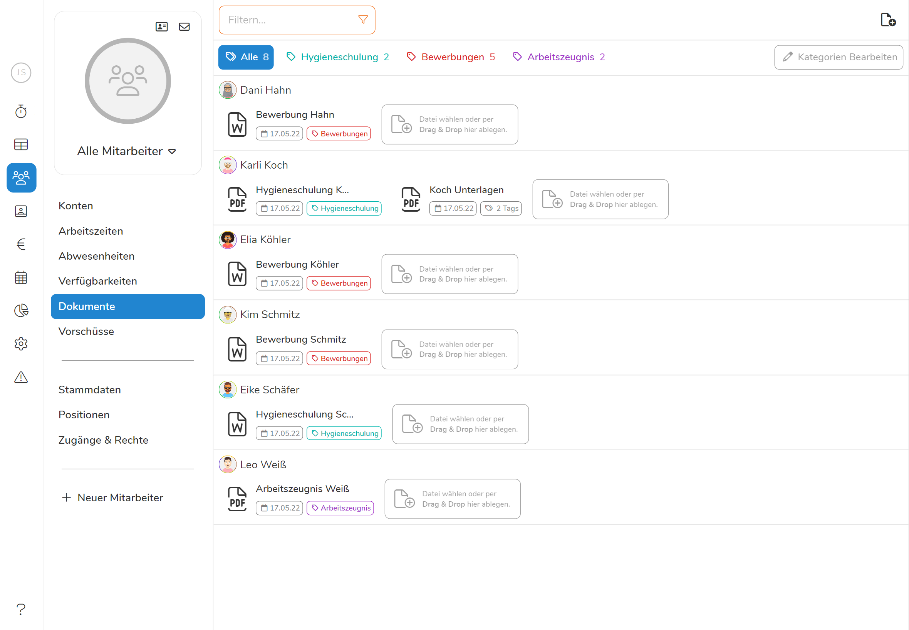
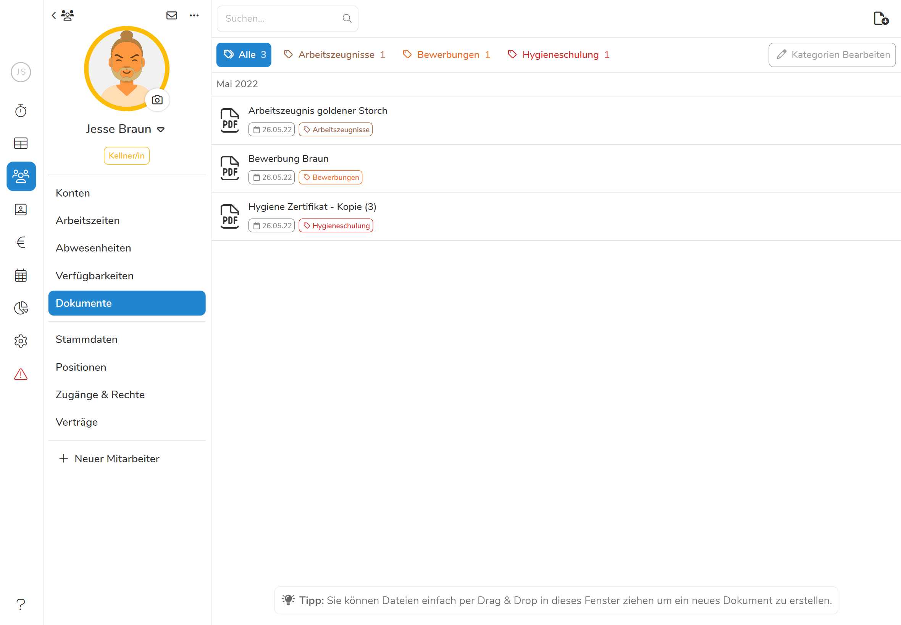
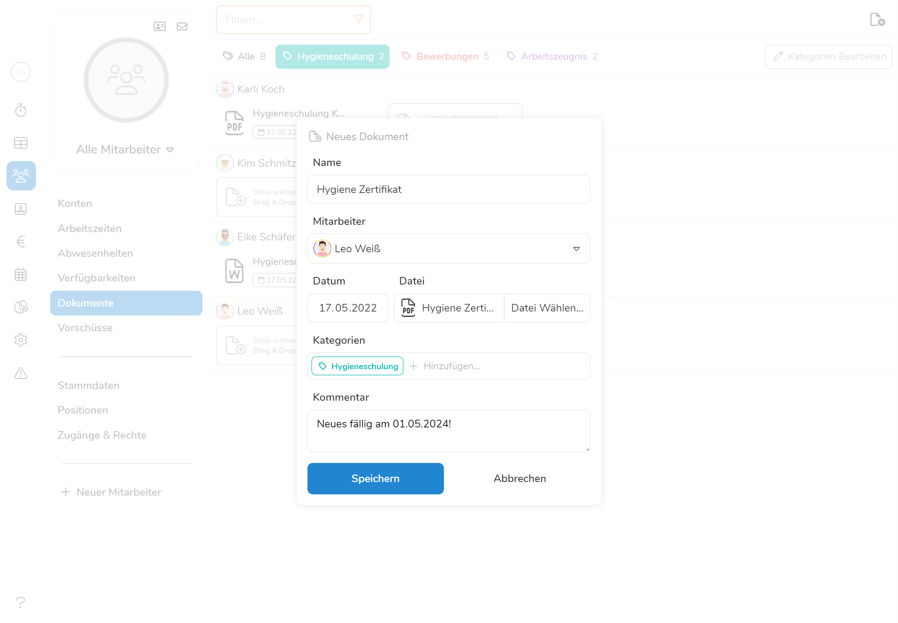
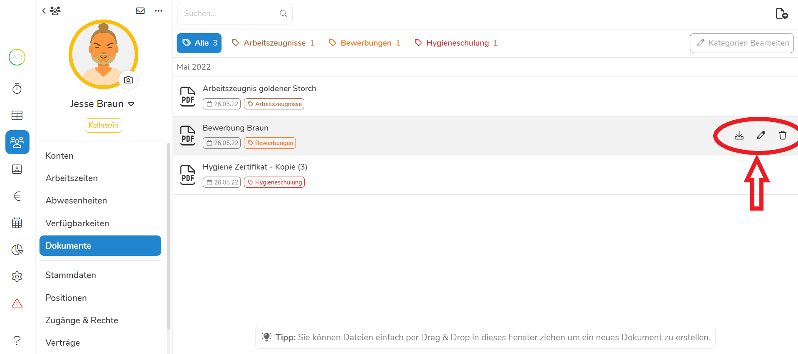
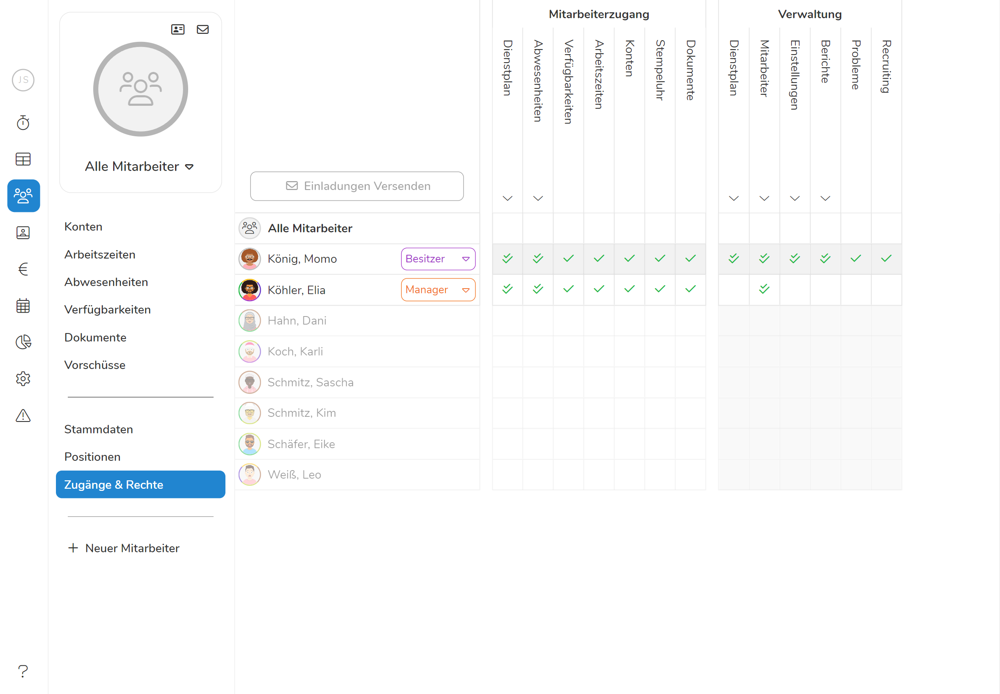

Das **Dokumentenarchiv** bietet Ihnen die Möglichkeit die **Dokumente ihrer
Mitarbeiter direkt in Pentacode zu speichern und von überall verfügbar zu
haben**. So bietet es sich an, Lebensläufe, Arbeitszeugnisse, Bescheinigungen
oder ähnliche Dateien hier abzuspeichern um auf ein ausgedrucktes Archiv
weitestgehend verzichten zu können. So sparen Sie sich Mühe und Papier, da Sie
in Sekundenschnelle stets über das gesuchte Dokument verfügen können. 

## Dokumentenübersicht

In die Dokumentenübersicht gelangen Sie über den Reiter **Mitarbeiter** im
Hauptmenü und den Unterpunkt **Dokumente**. Die Dokumentenübersicht zeigt ihnen
eine sortierte Liste ihrer gespeicherten Dokumente. Unter jedem Mitarbeiter
erscheinen dabei die ihm zugeteilten Dateien mit Namen, Datum und
Dokumentenkategorie. Von hier aus können Sie Dateien einsehen, indem Sie auf das
gewünschte Dokument klicken, worauf sich diese in ihrem Browserfenster öffnet.
Sie können zudem neue Dateien hinzufügen oder nach bestimmten Mitarbeitern oder
Dokumentenkategorien filtern. 

  

## Einzelansicht

Sie gelangen in die Einzelansicht der Dokumente eines Mitarbeiters, indem Sie
den Namen in der Dokumentenübersicht anklicken. Hier haben Sie die Möglichkeit
noch einmal **übersichtlicher** alle Dateien des Mitarbeiters zu durchforsten,
explizite Dokumente zu suchen oder auch neue Dateien hinzufügen. Von hier aus
können Sie die Dateien des ausgewählten Mitarbeiters auch auf ihrem PC sichern,
bearbeiten oder löschen ohne die Datei zuvor öffnen zu müssen. Bewegen Sie dazu
ihren Cursor über eines der Dokumente und folgen den Anweisungen
[hier](#dokumente-bearbeiten).

  

## Dokumente hinzufügen

Um ein neues Dokument hinzuzufügen klicken Sie auf den -**Button** in der rechten oberen Ecke der Übersicht
oder direkt unter dem Namen des Mitarbeiters. Sie werden anschließend
aufgefordert die gewünschte Datei auf ihrem PC auszuwählen - dazu wählen Sie
erst links das Verzeichnis aus, in dem das Dokument auf ihrem PC gespeichert ist
und anschließend die Datei, welche Sie hochladen wollen. Alternativ können Sie
die Datei auch einfach per **Drag & Drop** in das Dokumentenfeld des
Mitarbeiters ziehen. Sobald Sie das getan haben, wird sich ein
[Dialogfeld](#dokumenteneigenschaften) öffnen, in welchem Sie weitere
Dokumenteneigenschaften festlegen können. 

> Tipp  Haben Sie eine Datei gerade erst von ihrem
> Mitarbeiter erhalten bspw. über den Anhang einer E-Mail, wird diese im
> Verzeichnis **Dieser PC/Downloads** gespeichert und kann von hier in Pentacode
> importiert werden.

### Dokumenteneigenschaften

Sobald Sie die gewünschte Datei auf ihrem PC ausgewählt haben öffnet sich ein
Dialogfeld. In diesem können Sie zum einen den Namen ändern, unter dem Pentacode
das Dokument speichert. Unter **Mitarbeiter** kann zudem der Mitarbeiter
geändert werden, dem das Dokument zugeordnet wird (sollte man sich in der
Übersicht verklickt haben). Unter **Datei** ist das ausgewählte Dokument zu
sehen und unter **Datum** ist standardmäßig das aktuelle Tagesdatum eingegeben.
Im Textfeld **Kommentar** kann, wie der Name schon sagt, dem Dokument ein
Kommentar mit zusätzlichen Informationen hinzugefügt werden.

#### Kategorien hinzufügen

Besonders relevant ist das Feld **Kategorie**, hier kann das Dokument einer oder
mehrerer Kategorien zugeteilt werden, welche es später einfacher machen nach
diesem Dokument zu **filtern** und es schnell zu finden. Tippen Sie dazu einfach
den Namen der gewünschten Kategorie in das Textfeld, bis diese auftaucht. Wenn
Sie eine neue **Kategorie erstellen** und das Dokument dieser zuordnen wollen,
geben Sie den Namen der neuen Kategorie ein und drücken Sie auf den
-**Button** mit dem Namen der Kategorie daneben. Jetzt ist das
Dokument den ausgewählten Kategorien zugeordnet und es ist einfach danach zu
[filtern](#kategorienfilter)

 


## Dokumente abrufen 

Nachdem Sie nun zahlreiche Dokumente ihrer Mitarbeiter auf Pentacode
digitalisiert gesichtert haben, möchten Sie natürlich auch wieder auf diese
zugreifen. Klicken Sie dazu einfach auf die Datei in der
[Dokumentenübersicht](#dokumentenübersicht) oder
[Einzelansicht](#einzelansicht). Die gewählt Datei wird sich darauf direkt im
Browserfenster öffnen.

>Tipp  Mit  +  und  +  können Sie Dokumente beim Einsehen vergrößern und
>verkleinern.  

## Dokumente filtern

Ein großer Vorteil eines digitalisierten Archivs ist die Geschwindigkeit, in der
Sie das gesuchte Dokument unter Tausend finden können. Pentacode bietet Ihnen
dabei zwei mögliche **Filteroptionen**: Nach Mitarbeiterkriterien und nach
Dokumentenkategorien

### Mitarbeiterfilter

Wenn Sie nur die Dokumente eines bestimmten Teils ihrer Belegschaft sehen
wollen, können Sie den Mitarbeiterfilter nutzen. Gehen Sie dazu in die
Dokumentenübersicht und wählen  **Filtern...** neben dem -**Button** im rechten oberen Eck aus. Nun können Sie durch Ab- und
Anwählen verschiedener **Beschäftigungsverhältnisse** und **Arbeitsbereiche**
nur die Gruppe an Mitarbeitern auswählen, deren Dokumente Sie einsehen möchten.
Sobald Sie wieder die Dokumente aller Mitarbeiter sehen wollen, scrollen Sie im
Filtern-Dialogfenster ganz nach unten und drücken Sie auf **Filter
zurücksetzen**. 

### Kategorienfilter

Beim Suchen bestimmter Dokumententypen werden Ihnen die Kategorien nützlich, die
sie einer Datei zugeordnet haben beim [hinzufügen](#kategorien-hinzufügen).
Wählen Sie dazu die mit den  markierten Kategorien am oberen
Rand der Dokumentenübersicht aus. Durch Anklicken einer der Kategorien sehen Sie
nur noch die Dateien, welche dieser Kategorie zugeordnet sind. Um wieder zu
allen Dokumenten zurückzukehren drücken Sie auf den 
**Alle-Button**

### Filter kombinieren

Die Mitarbeiter- und Kategorienfilter können auch kombiniert werden, wenn Sie
nach einer Art von Dokument in einer Gruppe ihrer Belegschaft suchen.
>**Beispiel:** Sollte eine Behörde alle Hygieneschulungen ihrer Köche einsehen
>wollen, stellen Sie den **Filter** auf **Küche** und die Kategorie auf
>**Hygieneschulung** und schon haben Sie alle relevanten Bescheinigungen
>aufgelistet. 

  

## Dokumente bearbeiten

Um eine Datei zu **bearbeiten**, suchen Sie diese in der Dokumentenübersicht und
rufen Sie sie auf. Drücken Sie nun auf den -**Button** im
rechten oberen Eck, um wieder in das [Dialogfeld](#dokumenteneigenschaften) zu
gelangen, in dem Sie Namen, Kategorien und Kommentar des Dokuments bearbeiten
können. Innerhalb von Pentacode können Sie den Inhalt (z.B den Text in einem
Word-Dokument) einer Datei nicht ändern, dazu müssen Sie das Dokument
[speichern](#dokumente-sichern) und lokal auf ihrem PC bearbeiten.

## Dokumente sichern

Wenn Sie eine Kopie eines Dokuments auf ihrem Gerät **speichern** wollen, öffnen
Sie die Datei und klicken Sie auf den -**Button**. Nun
wird das Dokument standardmäßig in ihrem Verzeichnis **Dieser PC/Downloads**
gespeichert. 

## Dokumente löschen

Sollten Sie eine Datei von Pentacode **löschen** wollen, öffnen Sie die Datei
und klicken Sie auf den -**Button** im rechten oberen Eck. Zur
Sicherheit werden Sie jedoch noch einmal gefragt, ob Sie die Datei wirklich
löschen wollen. Sobald Sie nun auf **Löschen** klicken, ist das Dokument
unwiederruflich gelöscht.

  

## Dokumentenzugriff

Im Menüpunkt **Zugänge und Rechte** können Sie ihren Mitarbeitern in
verschiedenen Stufen Zugriff auf das Dokumentenarchiv gewähren. Sollen die
Mitarbeiter nur Zugriff auf ihre eigenen Dokumente haben, reicht ein
**Mitarbeiterzugriff**. Soll jedoch das Dokumentenarchiv mitbearbeitet werden,
ist auch das möglich mit einem **Managerzugriff**.

### Mitarbeiterzugriff

In vielen Fällen macht es Sinn ihren Mitarbeitern Zugriff auf ihre eigenen
Dokumente zu gewähren. So haben sie die Möglichkeit diese einzusehen - nicht
aber die Dokumente anderer Mitarbeiter. Gehen Sie dazu unter **Mitarbeiter** auf
**Zugänge und Rechte** und kreuzen Sie das Kästchen **Dokumente** unter
**Mitarbeiterzugang** an. Von nun an kann die ausgewählte Person in ihrer
Mitarbeiterapp die für sie gespeicherten Dokumente einsehen aber keine weiteren
hinzufügen oder bestehende löschen.

>**Tipp**  Über das Dokumentenarchiv können Sie
>mitarbeiterspezifisch auch To-Do Listen, Meetingmitschriften oder selbst
>ausgestellte Arbeitszeugnisse zur Verfügung stellen - ihrer Fantasie sind keine
>Grenzen gesetzt

### Managerzugriff

Sollten Sie einem Manager Zugriff auf die Verwaltung der Dokumente gewähren
wollen, geht das auch ganz einfach über **Zugänge und Rechte**. Setzen Sie dazu
einen Haken bei **Mitarbeiter** unter **Verwaltung** - somit wird der Zugriff
auf Dokumente in Kombination mit vielen weiteren Verwaltungsfunktionen gewährt.
Sie können den Zugang auch nur für die Dokumentenverwaltung spezifizieren, indem
Sie den Reiter **Mitarbeiter** ausklappen und alle Haken bis auf **Dokumente**
entfernen. Von nun an kann dieser Manager die Dokumente aller Mitarbeiter
einsehen, bearbeiten und löschen sowie Neue hinzufügen.

>**Achtung**  Ein Manager mit Berechtigung auf das
>Dokumentenarchiv hat Zugriff auf eventuell private Daten der Mitarbeiter - eine
>Aufklärung zum Umgang mit vertraulichen Daten ist also vorauszusetzen. 

  

## Kategorien bearbeiten

Wenn Sie ihre Dokumentenkategorien verwalten und die Farbgebung der Kategorien
verändern wollen, drücken Sie in der **Dokumentenübersicht** auf  oben rechts im Fenster. Dieser leitet Sie zu
den **Einstellungen** weiter. Klicken Sie
[hier](/hilfe/handbuch/einstellungen/dokumente) für mehr Informationen.

