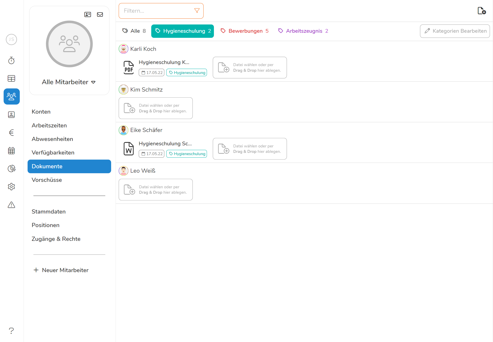

Das **Dokumentenarchiv** bietet Ihnen die Möglichkeit die **Dokumente ihrer Mitarbeiter direkt in Pentacode zu speichern und von überall verfügbar zu haben**. So bietet es sich an, Lebensläufe, Arbeitszeugnisse, Bescheinigungen oder ähnliche Dateien hier abzuspeichern um auf ein ausgedrucktes Archiv weitestgehend verzichten zu können. So sparen Sie sich Mühe und Papier, da Sie in sekundenschnelle stets über das gesuchte Dokument verfügen können. 





#### Dokumente hinzufügen

Sie können entweder direkt in der gesamten Mitarbeiterliste durch den -**Button** oder im Profil des einzelnen Mitarbeiters unter **Dokumente** eine Datei hinzufügen. Sie werden anschließend aufgefordert die gewünschte Datei auf ihrem PC auszuwählen. Alternativ können Sie die Datei auch einfach per Drag & Drop in das Dokumentenfeld des Mitarbeiters ziehen. Sobald Sie das getan haben, wird sich ein Dialogfeld öffnen, in welchem Sie den Namen der Datei ändern können. Auch können Sie ein Datum, Kategorien zum filtern, sowie einen Kommentar anfügen.





>  **Achtung:** Pentacode unterstütz nur Dokumente mit einer Dateiengröße von bis zu 5MB.

#### Dokumente abrufen und filtern
Nachdem Sie ein Dokument einmal hochgeladen haben, können Sie von jedem Gerät aus darauf zugreifen. Sollten Sie jedoch eine bestimmte Art von Dokument suchen, hilft ihnen die **Kategorie** unter der Sie das Dokument angelegt haben. Klicken Sie dazu auf die Kategorie der gewünschten Datei oberhalb der Dokumentenliste um nur Dokumente dieser Art einzusehen - unter  **Alle** können Sie wieder alle Dateien einsehen. Genau wie in den weiteren Mitarbeiterfunktionen können Sie auch die Dokumente unter dem -**Button** nach Mitarbeiterabteilungen sortieren. Nachdem Sie eine Datei angeklickt haben öffnet sich diese direkt in ihrem Browser und Sie können sie einsehen. 

> **Beispiel:** Sollte eine Behörde alle Hygieneschulungen ihrer Köche einsehen wollen, stellen Sie den **Filter** auf **Küche** und die Kategorie auf **Hygieneschulung** und schon haben Sie alle relevanten Bescheinigungen aufgelistet. 





#### Dokumente sichern

Wenn Sie eine Kopie der Datei auf ihrem Gerät **speichern** wollen, klicken Sie auf den -**Button**.

#### Dokumente bearbeiten

Sollten Sie **Änderungen** an Dateinamen, Kategorie oder Kommentar vornehmen wollen, klicken Sie auf den -**Button**.

#### Dokumente löschen

Sollten Sie die Datei von Pentacode **löschen** wollen, klicken Sie auf den -**Button** (zur Sicherheit werden Sie jedoch noch einmal gefragt, ob Sie die Datei wirklich löschen wollen). 

### Dokumentenzugriff gewähren 

#### Mitarbeiterzugriff

In vielen Fällen macht es Sinn ihren Mitarbeitern Zugriff auf ihr Dokumentenarchiv zu gewähren. So haben auch diese die Möglichkeit ihre eigenen Dokumente - nicht aber die anderer Mitarbeiter - einzusehen. Gehen Sie dazu unter **Mitarbeiter** auf **Zugänge und Rechte** und kreuzen Sie das Kästchen **Dokumente** unter **Mitarbeiterzugang** an. Von nun an kann die ausgewählte Person in ihrer Mitarbeiterapp die für sie gespeicherten Dokumente einsehen aber keine hinzufügen oder löschen.

#### Managerzugriff

Sollten Sie einem Manager Zugriff auf die Verwaltung der Dokumente gewähren wollen, geht das auch ganz einfach über **Zugänge und Rechte**. Setzen Sie dazu einen Haken bei **Mitarbeiter** unter **Verwaltung** - somit wird der Zugriff auf Dokumente in Kombination mit vielen weiteren Verwaltungsfunktionen gewährt. Oder spezifizieren Sie den Zugang nur für die Dokumentenverwaltung, indem Sie den Reiter **Mitarbeiter** ausklappen und alle Haken bis auf **Dokumente** entfernen. Von nun an kann dieser Manager die Dokumente aller Mitarbeiter einsehen, bearbeiten und löschen sowie Neue hinzufügen.





> **Achtung** Ein Manager mit Berechtigung auf das Dokumentenarchiv hat Zugriff auf eventuell private Daten der Mitarbeiter - eine Aufklärung zum Umgang mit vertraulichen Daten ist also vorauszusetzen. 

#### Kategorienfarbe ändern

Wenn Sie bestimmten Dokumentkategorien eine besondere Farbe zuteilen wollen ist das unter [Einstellungen](hilfe/handbuch/Einstellungen/dokumente)

-- Bei Managerberechtigung keine direkte Auswahl von Dokumente möglich

>  **Tipp**: Tragen Sie unter **Kategorie** die Art der Datei ein z.B Lebenslauf oder Mitarbeiterzeugnis - nach dieser können Sie **filtern** und sich die Suche einfacher machen. Sie können dabei auch eine Datei mehreren Kategorien zuordnen. Sie können die Anzeigefarbe der Kategorien auch unter **Einstellungen - Dokumente** ändern.
