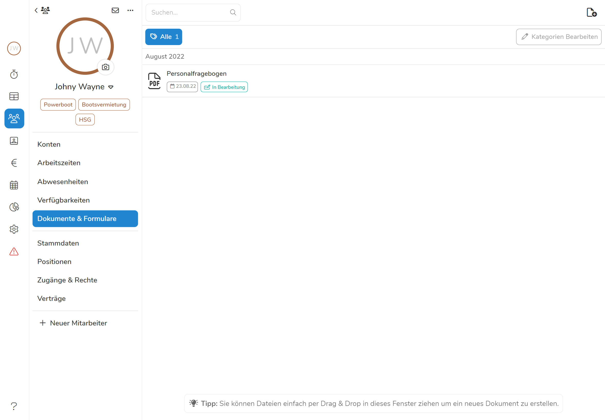

Das Übertragen der **Sozialversicherungs- und Lohndaten** neuer Mitarbeiter nimmt besonders in Betrieben mit häufig wechselnder Belegschaft viel Zeit in Anspruch. Mit Hilfe von **Personalfragebögen** können Sie neuen Mitarbeitern ein Formular zuschicken, in welchem sie ihre Daten angeben können und diese direkt und sicher bei Ihnen landen. So sparen Sie sich Zeit die Lohndaten einzufordern und müssen sie auch nicht mehr händisch übertragen, was Fehler vermeidet. Wenn Sie nun noch die [Sofortmeldungsfunktion]() nutzen, werden die Daten automatisch an die Rentenversicherung weitergeleitet ohne, dass Sie auch nur einmal Sozialversicherungsnummer und co. übertragen müssen. 

## Personalfragebogen erstellen

So erstellen Sie für einen Mitarbeiter einen Personalfragebogen:

1. Wählen Sie den gewünschten Mitarbeiter aus und gehen zu **Dokumente & Formulare**.
2. Klicken Sie auf das **-Symbol** in der oberen rechten Ecke.
3. Wählen Sie **Personalfragebogen** aus. 
4. Fügen Sie einen Kommentar und eine Kategorie hinzu, falls gewünscht und klicken Sie auf **Speichern**

Der vorläufige Personalfragebogen ist nun im Dokumentenarchiv des Mitarbeiters gespeichert und noch mit dem Zusatz **Entwurf** versehen.

>**Tipp**:  Versehen Sie den Personalfragebogen mit einer Kategorie, die Sie am besten auch 'Personalfragebogen' nennen. So finden Sie auch unter vielen Dokumenten immer schnell das richtige. 

## Ausfüllen und freigeben

Sobald Sie nun auf den Personalfragebogen klicken, der unter den Dokumenten des Mitarbeiters gespeichtert ist, öffnet sich dieser und steht Ihnen zum Ausfüllen bereit. Tragen Sie nun die nötigen Informationen zu ihrem Betrieb, dem Vertragsverhältnis mit dem Mitarbeiter, sowie Vergütung und Arbeitszeit ein und klicken Sie auf . Der Mitarbeiter wird nun informiert und kann den Personalfragebogen unter **Dokumente** in der **Mitarbeiterapp** mit seinen Daten ausfüllen. 

> **Wichtig!** Sie müssen dem Mitarbeiter unter [Zugänge & Rechte](/hilfe/handbuch/mitarbeiter/zugaenge-rechte/) erlauben auf seine Dokumente zuzugreifen, sonst ist es ihm nicht möglich den Personalfragebogen zu bearbeiten.

{{<figure caption="Der Vermerk 'In Bearbeitung' bedeutet, dass der Mitarbeiter kontaktiert wurde, den Fragebogen jedoch noch nicht ausgefüllt und zurückgeschickt hat.}}



## Überprüfungen und Fertigstellen

Nachdem der Mitarbeiter seine Daten eingetragen und deren Vollständigkeit durch eine Unterschrift bestätigt hat, wird der Personalfragebogen mit dem Vermerk **Ausgefüllt** markiert. Nun können Sie den Fragebogen noch einmal final überprüfen und fertigstellen. Klicken Sie dazu auf den Fragebogen und kontrollieren die Daten in den Feldern ein letztes Mal. Wenn der Bogen fehlerfrei ausgefüllt ist, müssen Sie ihn nur noch unterschreiben. Klicken Sie dazu auf das Feld in der unteren linken Ecke über **Unterschrift Arbeitgeber**. Um den Fragebogen zu speichern klicken Sie auf **Fertigstellen**. 

> **Info**  Der Mitarbeiter kann die von [Ihnen ausgefüllten Daten](#ausfüllen-und-freigeben) nur einsehen und nicht bearbeiten - die Angaben zum Vertragsvehältnis liegen also einzig bei Ihnen.

Nachdem Sie den Personalfragebogen fertiggestellt haben, wird eine nicht mehr bearbeitbare Kopie in den Dokumenten des Mitarbeiters gespeichert. Zusätzlich werden die Daten in das **Stammdatenblatt** des Mitarbeiters übertragen. Diese können mit Hilfe der [Sofortmeldefunktion]() direkt an die Rentenversicherung weitergeleteit werden. 