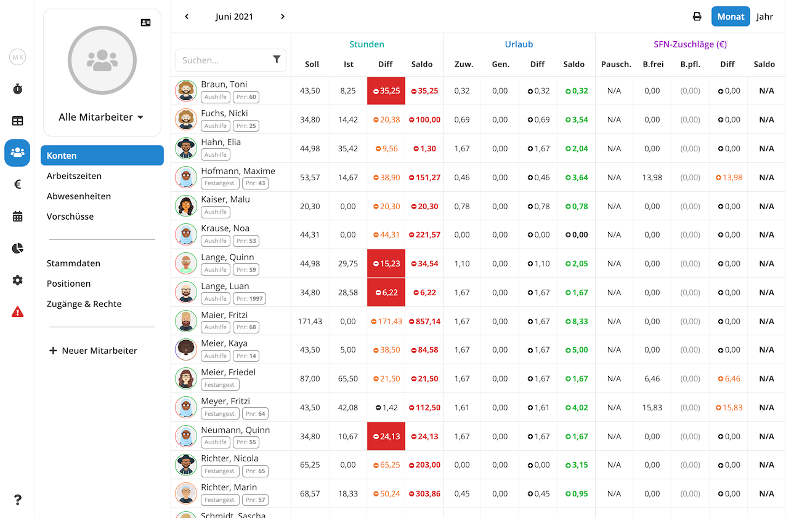
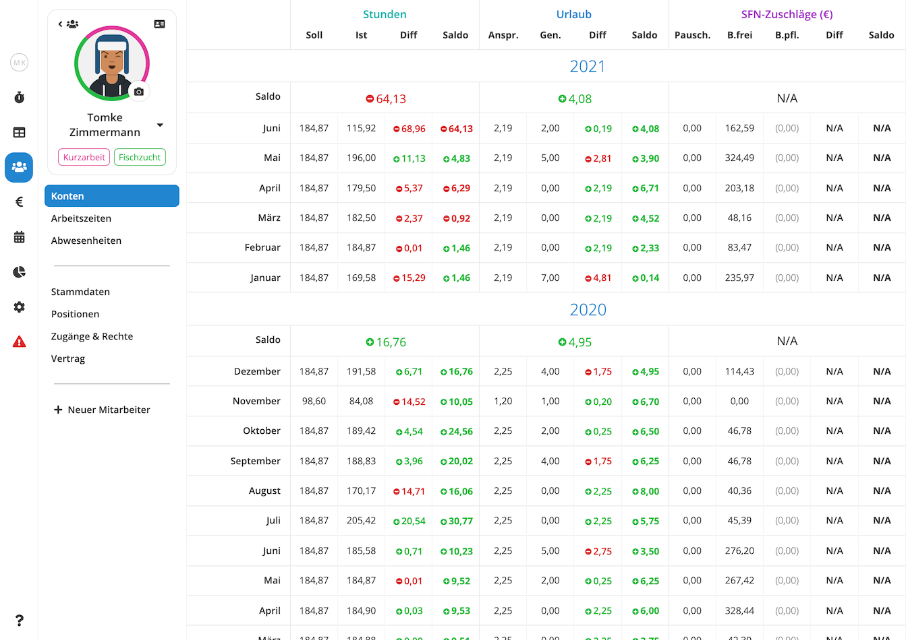

Basierend auf den hinterlegten Vertragsdaten, erfassten Arbeitszeiten und Urlauben kann Pentacode automatisch aggregierte Werte wie Überstunden und Resturlaubsansprüche für Sie berechnen und diese in fortlaufend saldierenden Konten zusammenfassen. Pentacode unterscheidet zwischen drei verschiedenen Kontenarten.

## Stundenkonto

In diesem Konto werden die [**Soll-Zeiten**](/hilfe/handbuch/mitarbeiter/vertrag/#arbeitszeit), die ein Mitarbeiter
arbeiten soll, den tatsächlich **geleisteten Arbeitszeiten** gegenübergestellt und **Über- oder Minderstunden**
ausgewiesen.

Die Gegenüberstellung erfolgt auf **Monatsbasis**, wobei der **laufende Monat** nur die jeweils **aufgelaufenen und
geloggten** Arbeitszeiten ausweist. Lediglich **geplante** Arbeitszeiten werden in dieser Übersicht **nicht**
berücksichtigt.

Da das Arbeitskonto weder geplante noch in der Zukunft zu leistende Arbeitszeiten ausweist, wird das laufende Jahr nur
**bis zum aktuellen Monat** dargestellt.

## Urlaubskonto

In diesem Konto werden die **erworbenen** [Urlaubsansprüche ](/hilfe/handbuch/mitarbeiter/vertrag/#urlaub-und-fehltage)
den **genommenen** Urlaubstagen **gegenübergestellt** und Über- oder Unterschreitungen ausgewiesen.

In den **ersten sechs Monaten** des Jahres wird der **Urlaubsanspruch** nur bis zum jeweils **aktuellen Monat** dargestellt.

## SFN-Konto

Das Konto **SFN-Zuschläge** weist die Summe der monatlichen Zuschläge für Nacht-, Sonn- und Feiertagsarbeit des Mitarbeiters aus.

In der Spalte "**B.Frei**" werden die **beitragsfreien** Zuschläge erfasst, in der Spalte "**(B.pfl.)**" jene Zuschläge, die durch Krank oder Urlaub **beitragspflichtig** abgerechnet werden müssen.

Sollte der Mitarbeiter **Zuschläge** unterjährig als **pauschale Vorauszahlung** erhalten, werden diese unter
**"Pausch."** gelistet. In diesem Fall werden die monatlichen **Über- oder Unterzahlungen** unter **"Diff"** ausgewiesen
und als fortlaufender **Saldo** gezeigt.

Für die Saldierung werden standardmäßig ausschließlich die **betragsfreien** Zuschläge berücksichtigt. Wenn Sie bei der
Saldierung auch die Beitragsplichtigen Zuschläge mit einberechnen wollen, können Sie dies unter [Einstellungen /
Sonstiges](/hilfe/handbuch/einstellungen/sonstiges#saldierung-sfn-konten) einstellen.

Die Gegenüberstellung erfolgt auf **Monatsbasis**, wobei der **laufende Monat** nur die Zuschläge ausweist, die auf
Grund der **erfassten Arbeitszeiten** errechnet werden. **Geplante Arbeitszeiten** werden **nicht** berücksichtigt.

Zur lohnsteuer- und sozialversicherungsrechtlich **korrekten Behandlung von Über- oder Unterzahlung** bei
Pauschalvorauszahlungen von SFN-Zuschlägen wenden Sie sich bitte an Ihre **Lohnbuchhaltung**.

## Monatsübersicht

In der Monats-Kontenübersicht sehen Sie die Kontostände aller Mitarbeiter jeweils für einen einzelnen Monat. Diese
Ansicht ist zum Beispiel dafür hilfreich, einen schnellen Überblick über die aktuellen Kontoständer Ihrer Mitarbeiter zu
erhalten, oder um zu sehen, wer in einem Monat besonders viele Über- oder Mindestunden angehäuft hat.

Sie gelangen in die Monats-Kontenübersicht, indem Sie im Hauptmenü den Punkt **Mitarbeiter** und dort den Unterpunkt **Konten** wählen.





## Jahresübersicht

Die Konten-Jahresübersicht zeigt Ihnen wie der Name schon sagt die Konten all Ihrere Mitarbeiter jeweils für ein ganzes
Jahr an. Aus Platzgründen kann hier jeweils nur eine der Kontenarten angezeigt werden. Sie können zwischen den
verschiedenen Konten wechseln, indem sie die gewünschte Kontenart über das Menü in der Kopfzeile wählen.

In die Jahresübersicht gelangen Sie, indem Sie zunächst zur [Monatsansicht](#monatsübersicht) navigieren und dort in der rechten oben Ecke von der Option "Monat" auf "Jahr" wechseln.





## Kontenblatt

Im Kontenblatt eines Mitarbeiters sehen Sie den gesamten Kontenverlauf vom Zeitpunkt des Beschäftigungsbeginns bis hin zum aktuellen Monat. Um zum Kontenblatt eines Mitarbeiters zu gelangen, navigieren Sie zunächst zur [Monatsübersicht](#monatsübersicht) oder [Jahresübersicht](#jahresübersicht) und wählen dort den gewünschten Mitarbeiter.





## Übertrag Bearbeiten

## Konten Drucken

Wenn Sie bei einem Mitarbeiter sein Jahreskonto ausdrucken wollen, fahren Sie mit der Maus auf das entsprechende Jahr. Mit diesem "**Mouse over**" erscheint in der Kopfzeile des betreffenden Jahres das -Symbol.





Der Ausdruck erfolgt, wenn Sie das -Symbol anklicken.

Wählen Sie für den Ausdruck am besten **Querformat**.
