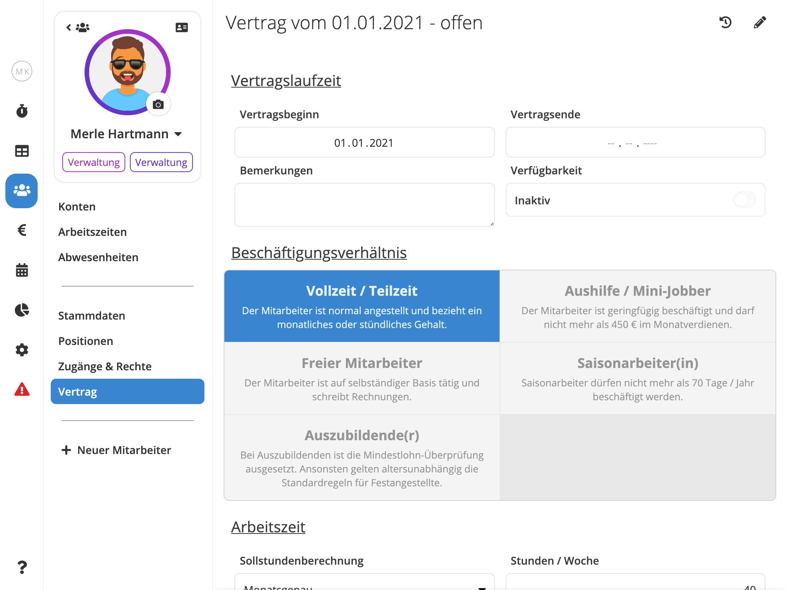

Im Menüpunkt **"Vertrag"** geben Sie die **arbeitszeit**- und **lohnrelevanten Angaben** zum Mitarbeiter ein. Achten Sie hier bitte auf die Richtigkeit und Vollständigkeit der Angaben. Die Berechnung aller Konten eines Mitarbeiters, die gesamte Lohnvorbereitung und der Export der Daten beziehen sich auf die hier hinterlegten Daten.

Bitte stellen Sie sicher, dass die hier hinterlegten Angaben zu jedem Zeitpunkt den Vereinbarungen entsprechen, die Sie mit dem Mitarbeiter laut Arbeitsvertrag getroffen haben.





## Felder & Eigenschaften

### Vertragsbeginn und -ende

Geben Sie bei **Vertragsbeginn** das Datum ein, zu dem das Beschäftigungsverhältnis des Mitarbeiters in Ihrem Unternehmen begonnen hat.

Unter **Vertragsende** ist das Datum einzusetzen, zu dem das Beschäftigungsverhältnis endet. Lassen Sie diese Feld leer, um einen unbefristeten Vertrag zu erfassen.

### Bemerkungen

**Bemerkungen** bezeichnet einen Textbereich, in den Sie **Notizen** zum Mitarbeiter hinzufügen können.

### Verfügbarkeit

Wenn Sie den Button bei "**Inaktiv**" setzen, bleibt der Mitarbeiter **im Dienstplan sichtbar**, kann jedoch **nicht geplant** werden. "Inaktiv" **unterbricht** jedoch **nicht** die Fortberechnung der verschiedenen Konten eines Mitarbeiters.

### Beschäftigungsverhältnis

Wählen Sie die Art des Beschäftigungsverhältnisses durch Anklicken des betreffenden Feldes.

Die Überwachung von Lohngrenzen, die Meldung bestimmter Probleme und der Export der Daten in die Lohnbuchhaltung beziehen sich auf das gewählte Beschäftigungsverhältnis.

### Sollstundenberechnung

Für die Berechnung der **Sollarbeitszeit** eines Mitarbeiters stehen Ihnen 5 unterschiedliche Modi zur Wahl.

#### Wochenfaktor

Bei der Wahl "**Wochenfaktor**" erscheint das Eingabefeld **Wochenstunden**.

Geben Sie hier die Anzahl der **Wochenstunden** ein, die ein Mitarbeiter laut Arbeitsvertrag zu leisten hat.

Die Soll-Arbeitszeit des Mitarbeiters errechnet Pentacode automatisch. Die Anzahl der Wochenstunden wird mit dem Faktor 4,35 multipliziert .

Die monatliche Soll-Arbeitszeit bei einem Festangestellten mit einer 40-Stunden Woche beträgt somit 40 x 4,35 = 174 Stunden pro Monat. **Diese Stundenanzahl gilt gleichbleibend für jeden Monat**.

#### Monatsgenau

Bei der Wahl "Monatsgenau" erscheint das Eingabefeld **Wochenstunden**.

Geben Sie hier die Anzahl der **Wochenstunden** ein, die ein Mitarbeiter laut Arbeitsvertrag zu leisten hat.

Bei dieser Auswahl errechnet sich die **Soll-Arbeitszeit** des Mitarbeiters anhand der **Länge eines Monats**. Sie schwankt somit von Monat zu Monat.

Um einen Festangestellten mit einer 40-Stunden Woche als Beispiel zu nehmen: Dessen monatliche Soll-Arbeitszeit liegt in einem Monat mit 30 Tagen bei 171,43 Stunden, in einem Monat mit 31 Tagen bei 177,14 Stunden und im Februar (sofern kein Schaltjahr) bei 160 Stunden.

#### Monatsgenau Ohne Feiertage

Eingabe und Berechnung der monatlichen Soll-Arbeitszeit entsprechen "**Monatsgenau**".

Bei dieser Auswahl errechnet sich die Soll-Arbeitszeit des Mitarbeiters anhand der Länge eines Monats. Sie schwankt somit von Monat zu Monat.

Pentacode kennt die **gesetzlichen Feiertage** des Bundeslands, in dem sich Ihr Unternehmen oder die betreffende Filiale Ihres Unternehmens befindet. Fällt in einem Monat ein gesetzlicher **Feiertag** auf einen **Wochentag**, so wird die monatliche **Soll-Arbeitszeit** um den Feiertag **gekürzt**.

#### Feste Wochentage

Bei der Wahl "Feste Wochentage" erscheinen Eingabefelder zu den **sieben Wochentagen**.

Geben Sie hier die Stunden ein, die ein Mitarbeiter an den betreffenden Tagen arbeiten soll. Diese Auswahl ist im Besonderen zu empfehlen, wenn ein Mitarbeiter **feste Arbeitstage** hat und diese in ihrer Länge auch noch voneinander abweichen. Dies trifft häufig für Mitarbeiter in der Verwaltung zu, bei denen z.B. der Freitag ein verkürzter Arbeitstag ist.

Die **Soll-Arbeitszeit** des Mitarbeiters errechnet sich über die **Häufigkeit**, in der ein bestimmter Wochentag in einem Monat auftritt.

Bei tagesabhängig unterschiedlichen Arbeitszeiten hat diese Art der Berechnung Wirkung bei Krank und Urlaub. Wird z.B. ein Mitarbeiter, der am Freitag nur 4 Stunden arbeitet, an einem Freitag krank oder nimmt an diesem Tag Urlaub, so werden für sein Arbeitszeitkonto wie auch für die Lohnabrechnung nur 4 Stunden berechnet.

#### Feste Wochentage abzgl. Feiertage

Eingabe und Berechnung der monatlichen Soll-Arbeitszeit entsprechen "Feste Wochentage".

Bei diesem Modus wird jedoch ein **Feiertag**, der auf einen Arbeitstag des Mitarbeiters fällt, von seiner **Soll-Arbeitszeit** in **Abzug** gebracht. Hierbei wird **Tag-genau unterschieden**.

Fällt ein Feiertag z.B. auf einen Freitag, an dem der Mitarbeiter nur 4 Stunden arbeitet, so werden auch nur 4 Stunden berechnet.

### Jahresarbeitszeitkonto

Pentacode überwacht die Einhaltung des gesetzlichen Mindestlohns. Eine versehentliche Unterschreitung des Mindestlohns könnte eintreten, wenn z.B. ein Mitarbeiter mit Festlohn Überstunden leistet. Sein Festlohn geteilt durch die Anzahl der Arbeitsstunden im betreffenden Monat kann einen Stundenlohn ergeben, der unter dem gesetzlichen Mindestlohn liegt.

In diesem Fall erhalten Sie in Pentacode eine _Problem Meldung_.

Dieses Problem können Sie vermeiden, indem Sie mit dem Mitarbeiter die Führung eines **Jahresarbeitszeitkontos** vereinbaren.

Setzen Sie in diesem Fall den Button bei "**Jahresarbeitszeitkonto Vereinbart**".

Über- und Minderstunden werden in Pentacode grundsätzlich und für alle Mitarbeiter (also selbst bei Aushilfen) saldiert und in den einzelnen Jahresarbeitszeitkonten in die Zukunft vorgetragen.

> **Rechtswirksam wird ein Jahresarbeitszeitkonto jedoch erst, wenn dessen Führung mit dem Mitarbeiter schriftlich vereinbart ist.** Sollte dies bei Ihnen noch nicht der Fall sein, so senden wir Ihnen gerne eine entsprechende Vereinbarung als Ergänzung zum bestehenden Arbeitsvertrag zu. Wenden Sie sich hierzu einfach an unseren Support.

### Fehlstundenberechnung

Wenn Sie "**Feste Wochentage**" als Berechnungsmethode gewählte haben, werden die **Fehlstunden** für den **jeweiligen Tage** ermittelt.

Für die Einstellungen "**Wochenfaktor**" und "**Monatsgenau**" stehen Ihnen für die Berechnung von Fehlzeiten bei Krank und Urlaub **zwei Möglichkeiten** zur Verfügung

#### Feste Stundenzahl

Wenn Sie "**Feste Stundenzahl**" wählen erscheint ein **Eingabefeld**, in das Sie die Anzahl der **Arbeitsstunden** eingeben, die der Mitarbeiter **täglich** leisten soll. Bei einem Mitarbeiter mit 40-Stunden-Woche und 5 Arbeitstagen wären das z.B. 8 Stunden.

Bei dieser Einstellung wird jeder Tag, an dem der Mitarbeiter als Krank oder in Urlaub im Dienstplan eingetragen ist, mit 8 Stunden bewertet. Dies gilt sowohl für die Berechnung im Arbeitszeitkonto wie auch für die Lohnfortzahlung in der Buchhaltung.

#### 13-Wochen Durchschnitt

Bei dieser Einstellung errechnet Pentacode den **Wert eines Urlaub- oder Kranktages** an der Arbeitszeit, die der Mitarbeiter im **Durchschnitt der letzten 13 Wochen** gearbeitet hat.

Sollte der Mitarbeiter sozialversicherungsfreie Zuschläge erhalten, werden auch die Zuschläge errechnet, die er im Durchschnitt der letzten 13 Wochen erhalten hat. Da diese Zuschläge im Lohnfortzahlungsfall beitragspflichtig abzurechnen sind, werden sie auch getrennt als beitragspflichtige Zuschläge ausgewiesen.

Pentacode unterscheidet bei der Berechnung zwischen Wochen-, Sonn und Feiertagen. Dies hat zur Folge, dass bei einem Krank- oder Urlaubstag, der auf einen Wochentag fällt, keine Sonn- oder Feiertagszuschläge hinzugerechnet werden. Diese wären ansonsten beitragspflichtig abzurechnen.

>  **Hinweis:** Wenn Sie mit Pentacode beginnen, ist es empfehlenswert, in den **ersten drei Monate**n mit der Einstellung "**Feste Stundenzahl**" zu beginnen. Die Einstellung "13-Wochenschnitt" ist zu Beginn ungeeignet, da in den ersten Wochen der Zeitraum, auf den Pentacode zurückgreifen kann, zu kurz ist, um einen verlässlichen Durchschnitt zu errechnen.
>
> **Eventuell merken Sie sich ein Datum vor, zu dem Sie diese Einstellung auf** "**13-Wochenschnitt**" **verändern wollen**.

### Lohn und Gehalt

#### Lohn/Gehalt (brutto)

Geben Sie unter **"Alle Arbeitsbereiche"** das Standardgehalt des Mitarbeiters ein.

Wird ein Mitarbeiter **nach Stunden** bezahlt, wählen Sie im Dropdown-Menü **Stunden**, handelt es sich um einen **festen Monatslohn**, wählen Sie **Monat**.

#### Provision

Wenn ein Mitarbeiter **Umsatzprovision** erhält, geben Sie unter Provision den Prozentsatz ein. **Voraussetzung** für die Berechnung der Provision ist die **Erfassung** des individuellen **Umsatzes** im Hauptmenüpunkt "[**Zeiterfassung**](/hilfe/handbuch/zeiterfassung/tagesuebersicht/#provision)".

Wenn sich die Provision auf den Netto-Umsatz bezieht, ist dort der Netto-Umsatz des Mitarbeiters einzugeben. Bezieht sie sich auf den Brutto-Umsatz, entsprechend der Brutto-Umsatz.

#### Lohnartensatz

Über den Lohnartensatz wird der **Export** der Daten in die Lohnbuchhaltung organisiert.

Mit dem Drop-down-Pfeil können Sie unter den Lohnarten wählen, die sie unter "Einstellungen" und dort "[**Buchhaltung**](/settings/accounting)" angelegt haben.

> In der Standardeinstellung von Pentacode finden Sie den Lohnartensatz "\[Nichts Gewählt\]". Wir empfehlen Ihnen, diesen beizubehalten. Der **Lohnartensatz**, den Pentacode für den Export wählt, orientiert sich damit immer am **Beschäftigungsverhältnis** des Mitarbeiters.

Dies bedeutet: Wechselt ein Mitarbeiter z.B. von "Aushilfe/Mini-Jobber" auf "Vollzeit/Teilzeit", wechselt Pentacode auch automatisch den Lohnartensatz. Wenn sie einen bestimmten Lohnartensatz gewählt haben, muss für den Export der Lohnartensatz manuell entsprechend korrigiert werden.

#### Ein Mitarbeiter - mehrere Löhne

Wenn Sie Mitarbeiter haben, die in verschiedenen Abteilungen bei unterschiedlichen Löhnen arbeiten, kann dies in Pentacode automatisch berücksichtigt werden.

Wählen Sie in diesem Fall beim betreffenden Mitarbeiter unter **"+ Gehalt hinzufügen"** die entsprechende Abteilungen hinzu und weisen Sie dieser den jeweiligen Lohn zu. Die jeweils gearbeiteten Stunden werden getrennt ausgewiesen und unterscheidbar exportiert.

> **ACHTUNG!** Für die Ermittlung des Lohns im Falle der **Lohnfortzahlung** bei Krank und Urlaub wird grundsätzlich der Lohn herangezogen, den sie unter **"Alle Arbeitsbereiche"** angelegt haben.

### Zusatzleistungen

Wenn Sie einem Mitarbeiter über das Gehalt hinaus noch Zusatzleistungen zukommen lassen, z.B. Kindergartenzuschuss, Fahrtgeld, Messergeld u.a.m., können Sie diese hier vermerken.

Wenn Sie auf das "**+ Zusatzleistung hinzufügen**" klicken, öffnet ein Eingabefeld, in das Sie Art und Höhe der einzelnen Zusatzleistungen eingeben.

Die Zusatzleistungen, die Sie hier vermerken, werden für den Lohnexport **nicht** berücksichtigt. Sie sind als feste Werte ohnehin im jeweiligen Buchhaltungssystem hinterlegt.

Pentacode ermittelt jedoch die Lohnkosten, um Ihnen in Echtzeit und lange vor Fertigstellung der Lohnabrechnung einen Überblick zu geben. Die hier angelegten Zuschüsse werden in die Vorausberechnung der Lohnkosten integriert.

Bitte beachten Sie bei der Eingabe, dass Sie bei sozialversicherungspflichtigen Zuschüsse auch den jeweiligen Sozialversicherungsbeitrag hinzufügen.

### Urlaubsanspruch

Geben Sie bei "**Urlaubsanspruch (pro Jahr)**" die vereinbarte Anzahl der Urlaubstage/Jahr ein, die mit dem Mitarbeiter
vereinbart sind.

### Urlaubszuwachs

Der Urlaubsanspruch definiert den Gesamtanspruch eines eines Mitarbeiters auf ein komplettes Jahr. Für die forlaufende Saldierung des [Urlaubskontos](/hilfe/handbuch/mitarbeiter/konten#urlaubskonto) muss allerdings noch definiert werden, wie sich der monatliche Urlaubszuwachs aus dem Gesamtanspruch ergibt. Pentacode bietet Ihnen hier zwei Möglichkeiten.

#### Nach Arbeitsstunden

Wenn Sie bei Urlaubszuwachs "**Nach Arbeitsstunden**" wählen, wird der Urlaubsanspruch während eines Monats **fortlaufend auf Basis der gearbeiteten Stunden** berechnet.

#### Monatlich

Wählen Sie "**Monatlich**", wächst dem Mitarbeiter sein monatlicher Urlaubsanspruch zu **Beginn** eines Monats zu.

Scheidet der Mitarbeiter während eines Monats aus, wird der Urlaubsanspruch, der im Monat des Ausscheidens entstanden ist, in Abhängigkeit von seinen Arbeitsstunden prozentual errechnet.

### Zuschläge

Wenn Sie einem Mitarbeiter Zuschläge zahlen, können Sie die Höhe der Zuschläge für jeden Mitarbeiter individuell festlegen. In der Standardeinstellung von Pentacode sind die Zuschläge mit ihren gesetzlich erlaubten Höchstwerten ausgewiesen.

Sie können die Zuschläge individuell nach unten anpassen.

#### Zuschläge kumulieren

In der **Standardeinstellung** von Pentacode werden Sonn- und Feiertagszuschläge mit den Nachtzuschlägen **kumuliert**. Dies heißt, dass der Mitarbeiter an Sonn- und Feiertagen auch Nachtzuschläge erhält.

Sollte die Kumulierung **nicht** gewünscht sein, ist der Button zu **deaktivieren**. In diesem Fall werden dem Mitarbeiter an einem Sonn- oder Feiertag die **Sonn- und Feiertagszuschläge** hinzugerechnet, **nicht** jedoch die **Nachtzuschläge**.

### Monatliche SFN-Pauschale

Sollten Sie **Zuschläge pauschal im Voraus** bezahlen, so aktivieren Sie den Button bei "**... bezahlen**" und geben Sie im Eingabefeld, das in der Folge erscheint, die Höhe der monatlichen Pauschalvorauszahlung ein.

Im Konto "[SFN-Zuschläge](/hilfe/handbuch/mitarbeiter-einzeln/konten/#sfn-zuschläge)" werden die Vorauszahlungen mit den Zuschlägen in €, die laut Arbeitszeiterfassung entstanden sind, monatlich abgeglichen und fortlaufend saldiert.

> Eine unterjährige Überzahlung ist sozialversicherungs- und lohnsteuerrechtlich nicht von Bedeutung. Für die korrekte Behandlung der am Jahresende saldierten Über- oder Unterzahlung von Zuschlägen setzen Sie sich bitte mit Ihrem Steuerberater oder Ihrer Lohnbuchhaltung in Verbindung.

## Vertrag Bearbeiten

**"Vertrag Bearbeiten"** heißt in Pentacode, dass **Angaben** in einem bestehenden Vertrag **ergänzt oder verändert** werden.

Um Angaben zu ändern oder zu ergänzen, überschreiben Sie diese einfach und speichern dann.

> **WICHTIG!** Wenn Sie Angaben ergänzen oder verändern, reichen diese **Änderungen** in die **Vergangenheit** zurück. Insbesondere alle **arbeitszeit- und lohnrelevanten Werte** zu einem Mitarbeiter werden somit **neu berechnet**.

Diese Vergangenheit reicht bis zum Beginn des aktuell gültigen Vertrags zurück.

## Neuer Vertrag

**"Neuer Vertrag"** heißt in Pentacode, dass **arbeitszeit**- oder **lohnrelevante Absprachen** mit dem Mitarbeiter **neu vereinbart** wurden, z.B. der Lohn geändert oder Arbeitszeit oder Urlaub neu geregelt wurden.

Wenn Sie "Neuer Vertrag" wählen, öffnet der bestehende Vertrag. Geben Sie bei **Vertragsbeginn** den Zeitpunkt ein, ab dem die Änderungen Gültigkeit haben sollen.

Sollten Sie vergessen haben, einen Vertrag rechtzeitig zu ändern, ist das kein Problem. Sie können auch einen Vertragsbeginn eingeben, der in der Vergangenheit liegt. Pentacode rechnet automatisch zurück.

Sie müssen im "alten" Vertrag nur jene Positionen überschreiben, die im neuen Vertrag abweichen und speichern.

> **WICHTIG!** Für die Richtigkeit der Berechnungen in Pentacode ist es wichtig, dass die Angaben zum Mitarbeiter identisch mit den aktuell gültigen arbeitsvertraglichen Vereinbarungen sind.

**Wenn Sie einen neuen Vertrag anlegen, sorgt Pentacode dafür, dass der alte Vertrag automatisch mit Beginn des neuen Vertrags endet.**

## Vertragsunterbrechung

**"Vertragsunterbrechung"** bedeutet die **Aussetzung** eines bestehenden Vertragsverhältnis über einen **bestimmten Zeitraum**.

Typische Gründe für eine Vertragsunterbrechung sind z.B. Elternzeit, unbezahlter Urlaub oder eine längere Krankheit.

Geben Sie in diesem Fall einfach Beginn und Ende der Unterbrechung ein.

Während des Zeitraums der Aussetzung sind die Arbeitskonten des Mitarbeiters "eingefroren" und die **Berechnung der "Sollarbeitszeit" wird ausgesetzt**.

Soll der **Urlaubsanspruch** während der Vertragsaussetzung **weiter berechnet** werden, so setzen Sie hierfür den Button bei "**Urlaubsanspruch Läuft Weiter**". Dies trifft zum Beispiel im Fall einer längeren Erkrankung zu.

Sofern Sie SFN-Zuschläge pauschal vorauszahlen, können Sie durch das Aktivieren des Buttons die Vorauszahlung bei einer Unterbrechung anteilig kürzen.

## Vertragshistorie

Über den  Button am rechten oberen Rand erhalten Sie eine Liste mit den Verträgen, die Sie
in der Vergangenheit mit dem Mitarbeiter abgeschlossen haben.

## Ausgeschiedene Mitarbeiter erneut einstellen

Wenn ein Mitarbeiter bereits einmal in Ihrem Unternehmen gearbeitet hat und Sie ihn erneut einstellen, können Sie dies auf sehr einfache und mühelose Weise bewerkstelligen.

Gehen Sie zuerst auf "**Mitarbeiter**", filtern Sie dort über das -Symbol die Mitarbeiter nach "**Ausgeschieden**" und suchen Sie nach dem Namen.

Wenn Sie den Mitarbeiter durch Anklicken wählen, finden Sie alle Angaben der Vergangenheit vor.

Gehen Sie nun durch die einzelnen Menüpunkte und passen Sie diese eventuell an. Sie müssen dabei nur die Angaben ändern, die sich in der Zwischenzeit verändert haben.

> **Wichtig**: Sie werden in jedem Fall die Personalnummer ändern müssen, da diese neu vergeben werden wird.

Wenn Sie schließlich auf Vertrag klicken, öffnet der Vertrag, der zuletzt Gültigkeit hatte.

Gehen Sie nun auf "Neuer Vertrag" und legen Sie diesen an. Für detaillierte Hinweise klicken Sie bitte [hier](/hilfe/handbuch/mitarbeiter-einzeln/vertraege/#neuer-vertrag).

Das war's. Der Mitarbeiter ist nun wieder ein Angestellter Ihres Unternehmens.

## Vertrag beenden

Wenn das Beschäftigungsverhältnis eines Mitarbeiters endet, muss auch der Vertrag in Pentacode beendet werden.

Öffnen Sie in diesem Fall den Vertrag des Mitarbeiters, klicken Sie auf das -Symbol und wählen Sie "**Vertrag bearbeiten**".

Geben Sie dann unter "**Vertragsende**" das Datum ein, zu dem der Vertrag mit dem Mitarbeiter endet.

Ab dem Folgetag ist der Mitarbeiter **archiviert**. Sie finden ihn wieder, indem Sie auf Mitarbeiter klicken, über das -Symbol den Haken bei "**Ausgeschieden**" setzen und den Namen eingeben.
