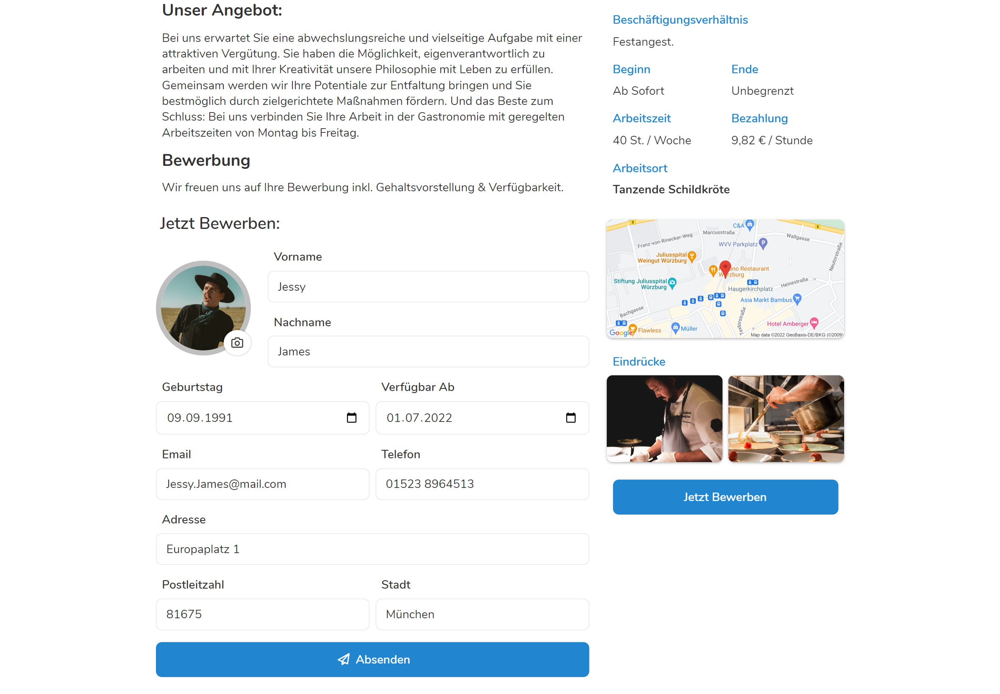

Die Recruiting Funktion hilft Ihnen dabei, Stellen auszuschreiben, Bewerber zu
verwalten und diese auch gleich einzustellen. Durch die direkte Integration in
Pentacode wird dabei der Bewerbungsprozess für Sie, als auch für den Bewerber
deutlich vereinfacht.

## Ausschreibungsübersicht

Um in die Ausschreibungsübersicht zu gelangen klicken Sie auf den -**Button** im Hauptmenü. Hier können Sie nun auf einen
Blick all ihre **Stellenausschreibungen** einsehen und verwalten. Links sehen
Sie eine Liste mit allen Stellenausschreibungen, wobei nur Titel und die
wichtigsten Informationen angezeigt werden. Klicken Sie auf eine der
Ausschreibungen, öffnet sich diese im mittigen Fenster und Sie können den Text,
sowie alle Details der Ausschreibung einsehen. 


 


## Ausschreibung erstellen

Wenn Sie nun eine neue Ausschreibung erstellen wollen, klicken Sie dazu auf
**Neue Ausschreibung**. Nun öffnet sich mittig ein Textfeld für den
**Beschreibung** ihrer auszuschreibenden Stelle. Rechts können Sie die genaueren
Details der Ausschreibung [siehe hier](#ausschreibungdetails) definieren und den
Interessenten mit Bildern einen ersten Eindruck des Arbeitsumfeldes bieten.  

-- Verlassen ohne speichern ist löschen

### Titel und Text

Wenn Sie nun eine neue Ausschreibung geöffnet haben, können Sie im oberen
Textfeld **Ausschreibungs-Titel** den Namen ihrer Stelle eingeben. Dabei ist zu
empfehlen diesen kurz und prägnant zu halten. Genaue Details zur Stelle führen
Sie dann in der **Beschreibung** aus. Schreiben Sie dazu ins mittige Textfeld. 

#### Beschreibung stylisieren

Überhalb des Textfeldes für die Beschreibung der Stelle finden Sie mehrere
Buttons um den Text zu stylisieren und ansprechender zu gestalten. Sind sie
**blau** dargestellt sind sie **aktiviert**, bei weiß hingegen deaktiviert.
- Mit dem **H-Button** können Sie **Unterüberschriften** in die Beschreibung
  einbauen - besonders nützlich um Teile der Beschreibung von einander
  abzugrenzen.
- Mit dem **T-Button** wechseln Sie wieder auf normalen **Fließtext**, nachdem
  Sie eine Unterüberschrift eingefügt haben.
- Mit dem **B-Button** schreiben Sie Text **fett** um bestimmte Wörter oder
  Paragraphen besonders hervorzuheben.
- Mit dem ***I*-Button** schreiben Sie Text ***kursiv***, damit der Leser ein
  besonderes Augenmerk auf diese Teile wirft. 

### Ausschreibungdetails

Da Sie nun den schriftlichen Teil der Ausschreibung ausgeführt und stylisiert
haben, können Sie noch die **organisatorischen Details** festlegen. Diese
Einstellungen befinden sich auf der rechten Seite. Ausgefüllt geben diese zum
einen dem Bewerber einen besseren Überblick über die Arbeitsbedingungen. Zum
anderen erleichtern sie Ihnen auch direkt die Einstellung eines geeigneten
Bewerbers, da relevante Daten für Vertrag und Stammdaten des Mitarbeiters
übertragen werden.

#### Standort

In der Leiste **Standort** können Sie auswählen für welchen Standort ihres
Unternehmens die Stelle ausgeschrieben werden soll. Klicken Sie dazu auf den
kleinen Pfeil und wählen Sie den gewünschten Standort aus.

#### Beschäftigungsverhältnis

Hier können Sie die Vertragsart auswählen die Sie mit dem gesuchten Mitarbeiter
abschließen wollen. Wenn Sie auf den kleinen Pfeil drücken, können Sie zwischen
Festangestellter, Aushilfe, Auszubildender, freier Mitarbeiter und
Saisonarbeiter wählen.

#### Positionen

Unter Positionen können Sie auswählen in welcher Position der Angestellte
zukünftig arbeiten soll. Auch hier können Sie über das Drop-down Menü wieder die
gewünschten Positionen auswählen, wobei Sie einer Bewerbung mehrere Positionen
zuschreiben können. Mehr Informationen zum Thema Positionen und Abteilungen
finden Sie unter [Einstellungen/Arbeitsbereiche](../einstellungen/arbeitsbereiche/).

#### Beginn und Ende

Bei Beginn können Sie den gewünschten **Anfang** des Arbeitsverhältnisses
angeben. Sollten Sie diese Stelle **ab sofort** füllen wollen, lassen Sie das
Textfeld einfach frei. Unter Ende können Sie zudem die Befristung des
Arbeitsverhältnisses angeben. Sollten Sie die Stelle **unbefristet**
ausschreiben wollen, lassen Sie auch dieses Feld frei.

#### Wochenstunden und Bezahlung

Unter **St. / Woche** können Sie die geplanten Wochenstunden für diese Stelle
angeben. Während Sie unter **Bezahlung** den veranschlagten Lohn angebene. Geben
Sie dazu in das Textfeld, welches standardmäßig mit dem Mindestlohn gefüllt ist,
die gewünschte Entlohnung ein. Rechts davon können Sie nun entscheiden ob dieser
Betrag **pro Stunde** oder **monatlich** ausgezahlt wird. 

> **Keine Panik**  Alle in der Ausschreibung
> spezifizierten Details können **nachträglich** noch adjustiert werden. Sie
> dienen lediglich der ersten Information der Bewerber und dem schnellen
> Einstellen in Pentacode. 

#### Bilder

Mit zusätzlichen Bildern können Sie ihre Ausschreibung noch attraktiver
gestalten und den Bewerbern einen ersten Eindruck der Stelle vermitteln. Klicken
Sie dazu auf den -**Button** unter
**Bilder**. Nun wird sich ein Dialogfeld öffnen, das sie auffordert die
gewünschte Bilddatei auf ihrem PC auszuwählen. Wählen Sie dazu links das
Verzeichnis, in dem Sie das Bild gespeichert haben und wählen es mit einem
Doppelklick aus. 

> **Achtung**  Achten Sie darauf während des Erstellens
> einer Ausschreibung nicht das **Recruiting** Fenster zu verlassen, da sonst
> die nicht gespeicherte Stelle gelöscht wird. 

### Ausschreibung bearbeiten

Nachdem Sie nun erfolgreich eine Ausschreibung erstellt haben, wollen Sie diese
eventuell korrigieren oder abändern. Wählen Sie dazu in der
**Ausschreibungsübersicht** eine Ausschreibung aus und klicken auf den -**Button** im rechten oberen Eck. Es wird sich anschließend mittig
das gleiche Fenster öffnen wie beim [Erstellen](#ausschreibung-erstellen) der
Ausschreibung. Hier können Sie nun Inhalt und Details der Stelle verändern. Wenn
Sie mit dem Bearbeiten fertig sind, drücken Sie auf  im unteren Teil des Fensters. 

### Ausschreibung löschen

--- Farblicher Text 

Wenn Sie eine Ausschreibung nicht mehr benötigen, etwa weil Sie einen geeigneten
Bewerber gefunden haben, lassen sich diese auch leicht wieder löschen. Wählen
Sie dazu einfach eine Ausschreibung in der Ausschreibungsübersicht aus und
klicken auf den -**Button**. Nun werden Sie aufgefordert die
Aktion zu bestätigen - indem Sie auf den roten 
Button drücken. 

## Bewerbungen

Nachdem Sie nun ihre Ausschreibungen erstellt und verwaltet haben, geht es nun
darum die Stelle zu veröffentlichen und die Bewerber zu verwalten. Dazu bietet
ihnen Pentacode pratkische Link zum publizieren der Ausschreibung, ein eigenes
Bewerbungsformular und eine Funktion zum Einstellen auf Probe.

### Bewerbungslink

Sobald Sie eine Ausschreibung erstellt haben generiert Pentacode automatisch
einen Bewerbungslink. Über diesen können sich potenzielle Angestellte die Stelle
anschauen und sich bei Interesse gleich bewerben. Sie können den Link sehen,
indem sie in der Ausschreibungsübersicht eine Ausschreibung auswählen. Nun wird
im unteren rechten Eck unter **Bewerbungs-Link** der Link angezeigt. Mit einem
Rechtsklick und der Option *Adresse des Links kopieren* können Sie diesen
zwischenspeichern und mit der Tastenkombination  + 
nun beliebig einfügen. Über den Dienst **QR.io** ist es ihnen auch möglich den
Link in einen QR-Code umzuwandeln, den Sie auch auf Flyern drucken können.

// Verweis auf andere Seiten legitim?

> **Tipp**  Posten Sie den Bewerbungslink am Ende ihrer
> Ausschreibungen auf ihrem Social-Media Kanälen, Jobbörsen oder per QR-Code
> direkt in ihrem Betrieb. **Pentacode macht den Rest - den Link müssen Sie aber
> noch selber publizieren**.

### Bewerberansicht

Nachdem ein interessierter Bewerber auf ihre Ausschreibung gestoßen ist und den
Bewerbungslink angeklickt oder eingescannt hat, gelangt er in die
Bewerberansicht. Hier sieht er zum einen Titel, Inhalt und Details der Stelle,
zum anderen kann er sich über ein Formular direkt bewerben. In diesem Formular
wird er gebeten seine Daten anzugeben - darunter zählen Vor- und Nachnamen,
Geburtsdatum, Email Adresse, Telefonnummer, Verfügbarkeit und Wohnadresse. Zudem
kann er ein Bild von sich hochladen, um es der Bewerbung beizufügen. Mit einem
Klick auf  landet die Bewerbung nun direkt in ihrem
Pentacode Verewaltungszugang. 

 
 


### Bewerber verwalten

Nachdem Sie den [Bewerbungslink](#bewerbungslink) publiziert haben, sollten Sie
schnell die ersten Bewerbungen erhalten. Diese sind an der **orangenen** Zahl in
der Ausschreibungsübersicht oder nach dem Auswählen einer Ausschreibung ganz
unten im mittigen Fenster zu sehen. Sobald Sie auf eine dieser Bewerbungen
drücken, öffnet sich ein Fenster mit den Daten des Bewerbers. 

 
 


### Bewerber einstellen

#### Auf Probe