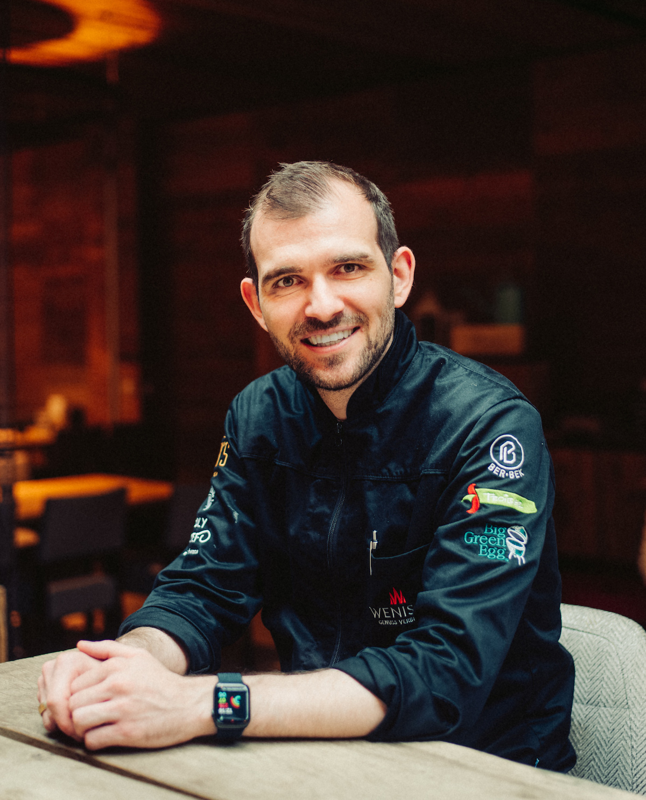
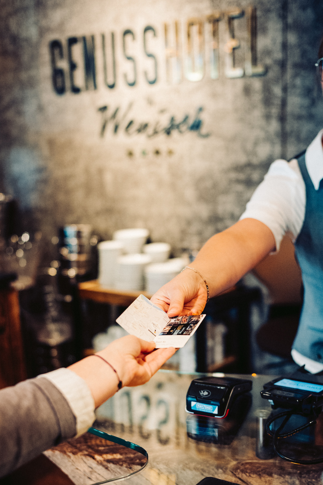
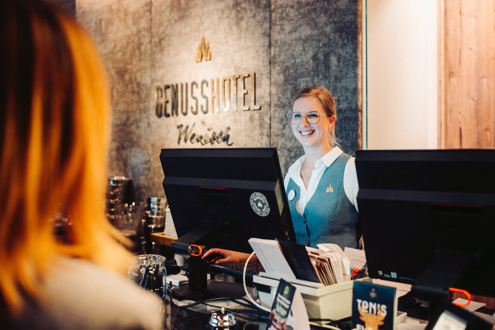
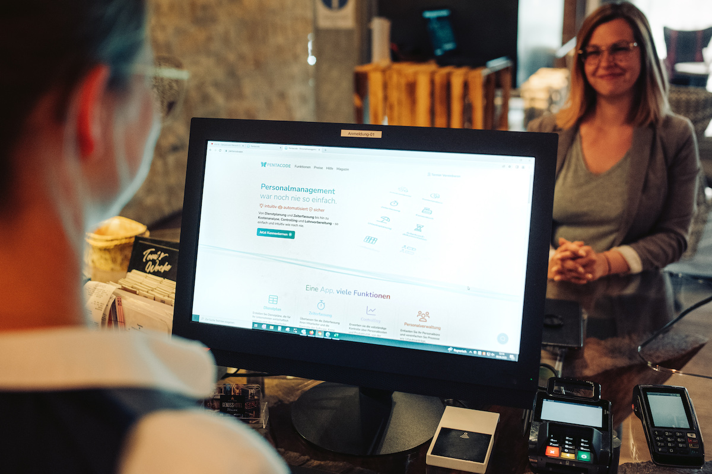

Ein Hotel, vier Metzgereien mit eigener Produktion, zwei Gastronomien mit
Eventkonzept und ein Festzelt auf Bayerns zweitgrößtem Volksfest - Wer mit Anton
Wenisch am Tisch sitzt und sich über die Genuss-Vision seiner Familie unterhält,
merkt schnell: **Dieser Mann weiß wo er hinwill**. Und er weiß woher er kommt.
Demütig sein, sein Handwerk von der Pike auf beherrschen, mit dem Team auf
Augenhöhe arbeiten, den Zeitgeist erkennen und mit ihm gehen - alles das seien
Attribute, die den Familienbetrieb seit den 60er Jahren stetig wachsen lässt.
Wir haben uns mit dem gelernten Koch und Jungunternehmer über das Erfolgsrezept
der Familie, den Brückenschlag zwischen Alt und Neu und einer sehr modernen
Vision des Personalmanagements unterhalten.

## Liebe zum Detail und Genuss an jeder Ecke: Willkommen bei Familie Wenisch!





Wir treffen Anton <cite>„Toni“</cite> Wenisch an einem Donnerstagvormittag hinter der Bar des
Toni’s. Es ist viel los - Mittagstisch - und natürlich packt der Chef mit an.
Der Familienvater führt das Wirtshaus in der dritten Generation. Sein Opa
eröffnet in den 60er Jahren erst eine kleine Metzgerei, dann das Hotel. Immer
mehr Zimmer kommen hinzu. Von Anfang an angebunden und ein klarer Fokus: das
Wirtshaus. <cite>„Wir sind in erster Linie Gastronomen“</cite>, betont Wenisch während er
Getränke für die vielen Mittagsgäste vorbereitet. <cite>„Unsere Stärke war immer schon
die Familie. Der Zusammenhalt und die Liebe zur Gastronomie. Und der Drang sich
weiterzuentwickeln.“</cite> Die Familiengeschichte ist geprägt von Demut, die Anton
Wenisch und seine Brüder Christoph und Stefan bis heute begleitet: Der Opa
flieht aus dem Sudetenland und landet in Straubing. <cite>„Damals hatte er nichts
mehr. Außer einem Messer, das ihm jemand geschenkt hat. Das macht einen schon
demütig, wenn man bedenkt, dass unser Großvater mit dieser Ausgangslage das
alles hier in Gang gesetzt hat.“</cite>

## Ausbildung und Handwerk als starkes Fundament





Das Thema Demut prägt nicht nur den Vater der jungen Wenisch Männer, die als
gelernte Metzgermeister, Köche und Servicekräfte heute alle Betriebe des
Genuss-Imperiums leiten. Es prägt natürlich auch deren Erziehung. <cite>„Unser Vater
hat immer gesagt: Ihr könnt schon auch ein Studium machen. Aber die Grundlage
muss die Ausbildung sein. Denn du musst mit dem Koch, dem Spüler, der
Servicekraft auf Augenhöhe sein. Nur so schaffst du es, die Leute hinter dich zu
bringen“</cite>, erzählt Toni Wenisch. Gleichzeitig habe schon die Ausbildungszeit bei
ihm eine fundierte Leidenschaft für das Handwerk entfacht und ihm dabei geholfen
eine Vision zu entwickeln. <cite>„Egal was du erreichst, du solltest nie vergessen, wo
du herkommst. Und wer daran beteiligt war.“</cite>

## Generationswechsel: Traditionen aufgreifen, aber das eigene Profil schärfen

Das neue Kapitel startet 2014 mit dem Anstoß zur Weiterentwicklung des
Gasthauses und Hotels hin zum Genussort. Drei Jahre lang tüftelt Toni Wenisch
mit seiner Familie und fachkundigen Partnern am Anbau, an der Marke und an dem
ganzheitlichen Konzept, das verstärkt auf sinnliches Erleben und Eventcharakter
setzt. 2017 kommt die Wiedereröffnung. <cite>„Das ist mein Baby“</cite>, fasst der gelernte
Koch zusammen. Trotz all dem jungen Spirit, den frischen Ideen und neuen Wegen,
wissen die Brüder bis heute zu schätze, dass sie aus der Erfahrungen der
vorherigen Generationen schöpfen können: <cite>„Unsere Eltern stärken uns immer den
Rücken. Sie haben das alles aufgebaut und einen immensen Erfahrungsschatz auf
den wir zurückgreifen können. Das bestimmt auch die Werte, auf denen die
Betriebe aufgebaut sind: Tradition, Leidenschaft, Zusammengehörigkeit, Handwerk
… alles Dinge, die in der Vergangenheit wichtig waren, und die wir in die
heutige Zeit transferieren wollen.“</cite> Und alles Dinge, die mit Genuss in
Verbindung stehen. So kommt es zum Slogan „Genuss verbindet“. <cite>„Stadthotels
gibt’s viele. Im Wenisch soll jeder - auch der Businessgast - sich ein bisschen
wie im Urlaub fühlen. Deswegen legen wir großen Wert auf besondere
Gastronomieerlebnisse. Das ist unsere Nische, unser USP, der uns von anderen
Stadthotels klar abgrenzt.“</cite>





## Ein Genuss-Ort für jeden: Zielgruppen erkennen und alle willkommen heißen





Jeder der einmal im Toni’s zu Gast war, wird es unterschreiben: Es herrscht eine
ganz besondere Atmosphäre. <cite>„Das Schöne ist, unsere Gäste kommen zum Einen durch
das Hotel aus der ganzen Welt - China, Frankreich, USA. Aber uns besuchen auch
Monteure aus dem bayerischen Umland regelmäßig. Unsere Eventkonzepte sprechen
wieder ganz unterschiedliche Zielgruppen an: Wir haben Hochzeiten, Vereine,
Sonntagsbrunch, also klassische Familientreffen, das Weinfest als Datenight und
das alles mischt sich mit dem Straubinger Wirtshaus Publikum. Diese bunte
Mischung macht nicht nur dem Gast, sondern auch uns im Service unheimlich Spaß.
Man muss sich immer wieder neu einstellen und ist immer anders gefordert.“</cite> Nicht
mehr nur eine Zielgruppe ansprechen, sondern Erlebnisinseln zu schaffen, sodass
für jeden etwas dabei ist - das sei der Anspruch vom Toni’s, so der junge Chef.
Bei all den Zukunftsvisionen müsse man aber natürlich auch darauf achten, dass
alles erschwinglich bleibt: für den Gast, aber auch für den Betrieb. Gut zu
wirtschaften bedeutet für Wenisch vor allem auch den Fokus auf kluges,
zukunftsorientiertes und vorausschauendes Personalmanagement zu legen. Wer
Personal motiviert und schlau einsetzt statt „Pi mal Daumen“ und Kosten, wie
Umsätze zu jeder Zeit abrufbar hat, der kann seinen Gewinn unmittelbar
beeinflussen, so die Erfahrung der Wenischs. Und er sorgt nebenbei noch dafür,
dass seine Mitarbeitenden immer motiviert bleiben und ihr Bestes geben.

## Erfolgsrezept: Personalmanagement das "menschelt" und vorausschauend wirtschaftet

<cite>„Du darfst die Leute nicht unter-, aber auch nicht überfordern - die Zeiten sind
vorbei, in denen man die Kapazitäten bis zum Anschlag ausgereizt hat.
Unterforderung ist aber auch gefährlich, weil der Reiz so verloren geht“</cite>, fasst
Wenisch zusammen. <cite>„Wir lösen das unter anderem durch ein jährliches
Personalentwicklungsgespräch, in dem wir uns gemeinsam Zeit für die
Arbeitsbeziehung nehmen.“</cite> Ein gesundes Team, zufriedene Mitarbeiter – das sind
wichtige Säulen des Erfolgs, weiß der gelernte Koch. <cite>„Niemand schafft etwas
alleine. Wenn ein Betrieb wachsen will, braucht er gute Mitarbeiter. Und die
brauchen zwar eine Vision und Strukturen, aber sie müssen auch Raum haben, damit
sie sich in ihrem Rahmen einbringen können.“</cite> Der Respekt vor dem menschlichen
Bedürfnis nach Erholung werde immer wichtiger in der Planung der Kapazitäten, so
Wenisch. "Früher haben sich die Mitarbeiter die Überstunden auszahlen lassen.
Heute nehmen sie lieber den zusätzlichen Urlaub. Das muss man erkennen und
respektieren. Deswegen machen wir zum Beispiel sonntags nach unserem Brunch zu.
So kann jeder im Team fest mit dieser Erholungszeit rechnen, kann sich Zeit
nehmen für die Familie, auf ein Konzert gehen - alles Dinge, die sonst in
unserer Branche sehr schwer zu planen sind. Es ist wichtig, dass man versteht,
was der Mitarbeiter heute will. Zeit wird immer wichtiger als Geld.“





## Die Vorteile der Prozessdigitalisierung: Fortschritt auf Augenhöhe mit Pentacode

Alte Denkmuster beiseite legen bedingt für die Wenisch Brüder neben der
stärkeren Gewichtung des Faktors Mensch auch eine Optimierung der Prozesse hin
zur digitalen Unternehmensplanung. Und das birgt insbesondere auch beim
Personalmanagement große Potentiale, so die Erfahrung der Jungunternehmer.
„Unsere Mutter ist Bilanzbuchhalterin, sie hat den Background, den meine Brüder
und ich nicht haben. Wir sind aber Digitalfans und da haben wir online
recherchiert, wie man möglichst alle Prozesse digital abdecken kann. So kamen
wir zu Pentacode. Die All-in-one Lösung ohne jegliche Schnittstelle hat uns
sofort überzeugt. Was uns besonders gefallen hat: dass der Gründer Herr Strasser
wie wir ein Mensch der Praxis ist. Er hat ein unglaubliches Wissen und teilt das
auch gerne. Es ist eine Geschäftsbeziehung auf Augenhöhe.“</cite> Nicht nur bei rund
150 Mitarbeitern - eine schnelle und unkomplizierte Erstellung von Dienstplänen
sei ein enormer Vorteil. Ebenso wie ein sehr intuitiver Umgang mit dem Tool, so
Wenisch. <cite>„Wir haben eine sehr gemischte Teamstruktur, als auch ältere
Mitarbeiter. Auch die haben sich bei der Implementierung leichtgetan. Sicher
auch, weil sie durch die Software zu jeder Zeit vor Augen haben, wie es mit
Urlaubstagen und Co. aussieht. Sie können ja immer in die App schauen oder sich
den Stand ausdrucken. Das schafft Vertrauen.“





## Viel richtig gemacht: Der Familienbetrieb als gutes Beispiel für gesundes Wachstum

Auch für die Geschäftsleitung ist der Umgang mit Pentacode zur täglichen Routine
geworden, die den Unternehmenserfolg unmittelbar ablesbar und damit
beeinflussbar macht. <cite>„Als gelernter Koch hatte ich mit Zahlen so gar nichts am
Hut. Dahingehend hat mir Pentacode sehr geholfen. Weil ich einfach jeden Tag
ablesen kann, was meine Ausgaben und Umsätze sind und hab nicht erst Monate
später den Durchblick. Das ist ein unglaublicher Vorteil. Seit der Nutzung von
Pentacode haben wir unsere Personalkosten im Griff und konfrontieren uns jeden
Tag mit den Kosten und Einnahmen und ich kann nur sagen, dass unsere Ergebnisse
sehr gut sind. Wir haben eine extrem gute Quote.“</cite> Wenn es um schnelle und
unmittelbare Einflussnahme auf den Unternehmenserfolg geht, lautet Anton
Wenisch's Tipp also klar: <cite>„Die Personalkosten kannst du bereits ab dem nächsten
Tag umstellen. Und der Gewinn wird sich mit den Personalkosten, die du im Griff
hast sofort verändern.“</cite> Die Erfolgsgeschichte rund um das Genuss-Imperium der
Familie Wenisch macht deutlich: Höhere Gewinne, zufriedene Mitarbeiter und eine
verlässliche Personalplanung, die leicht und schnell von der Hand geht, schaffen
mehr Zeit und Raum, um an Zukunftsvisionen zu feilen. <cite>„Wir wollen keine
Schlösser bauen. Sondern wir wollen etwas auf einem gesunden Fundament
erschaffen und es trotzdem sehr gut machen. Das ist glaube ich das, was uns
hierhergebracht hat.“</cite> Wir von Pentacode freuen uns, dass wir die Familie Wenisch
auf ihrem Weg in die Zukunft ein Stück weit begleiten dürfen.
