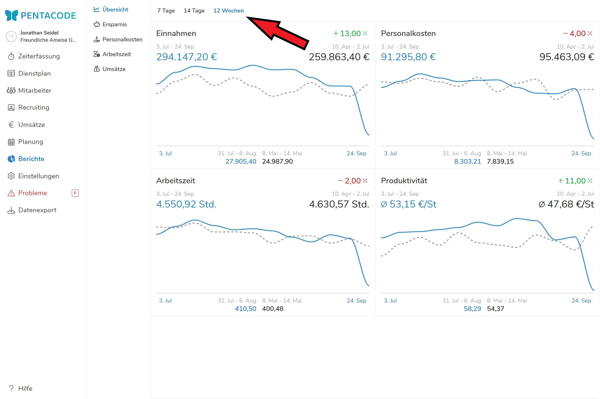
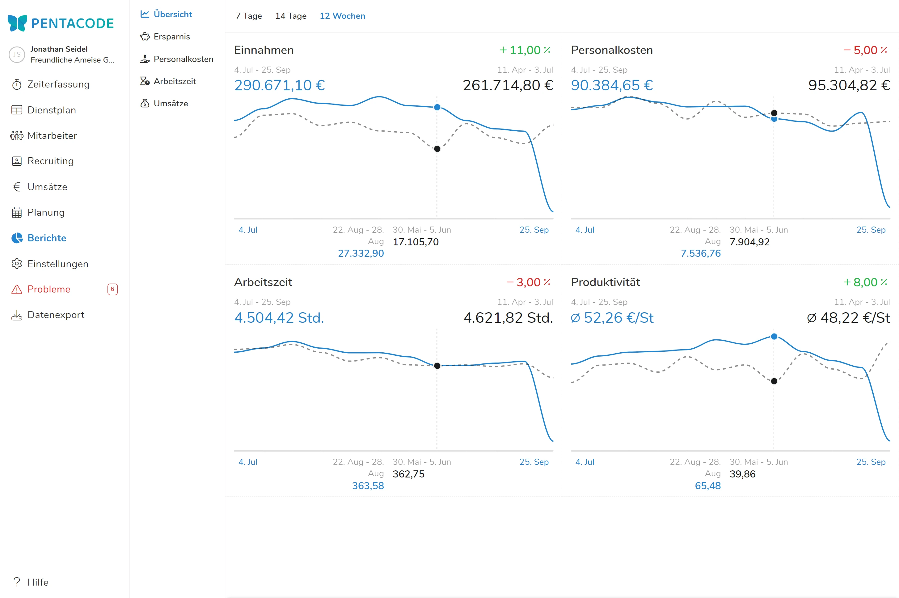

Im Menüpunkt "Übersicht" werden wesentliche Kennzahlen in ihrer Entwicklung einander gegenüber gestellt.
Die Graphen können Sie schnell auf Veränderungen im Geschäftsbetrieb und der Wirtschaftlichkeit des Unternehmens hinweisen.

## Vergleichszeitraum wählen

In der Kopfzeile können Sie den Zeitraum wählen, über welchen die Kennzahlen verglichen werden.

Die **gestrichelte Linie** zeigt den **historischen Zeitraum** an, die durchgehende **blaue Linie** den Zeitraum, der mit dem jeweils **gestrigen Tag** geendet hat. Die €-Angabe in Blau zeigt entsprechend den aktuellen Zeitraum, in Schwarz den historischen Vergleichszeitraum.





Im vorliegenden Beispiel wurde als Zeitraum 12 Wochen gewählt. Dies entspricht **zwei Quartals-Zeiträumen**.

Durch ein "Mouse over" über eine der Grafiken können Sie **einzelne Tage** einander **gegenüberstellen**.  **Tag und Datum** erscheinen dabei in der **Fußzeile** der Grafik. Der gewählte Vergleich erscheint dabei **parallel** auch auf allen weiteren Grafiken.





Im vorliegenden Beispiel wird der 28. August mit dem 5. Juni verglichen. Die beiden Daten liegen exakt 12 Wochen auseinander.

## Begriffsbestimmungen

### Einnahmen

bezeichnet **alle Umsatzarten**, die Sie in Pentacode erfasst haben. Für die Vollständigkeit und damit Richtigkeit dieser Anzeige ist es von Bedeutung, dass idealerweise alle Umsätze, also **auch kleinteilige Erlöse** Ihres Unternehmens erfasst sind.

Mindestens die Umsätze, die Sie in der Erlöszuordnung Abteilungen zugewiesen haben, sind hierfür bereits in [Umsatzgruppen]\(/handbuch/umsaetze/umsatzgruppen/) angelegt. Wenn es für Sie bei der Eingabe einfacher sein sollte, kleinteilige Erlöse als Summe einzugeben und nicht als Einzelpositionen, so legen Sie hierfür am besten eine eigene Umsatzgruppe an und bezeichnen diese z.B. mit "Divers" oder "Sonstiges".

Daneben macht die **Zusammenfassung** kleinteiliger Erlöse die Darstellung Ihrer Umsätze nach Herkunft **übersichtlicher** und aussagekräftiger.

### Personalkosten

geben die **Gesamtkosten** von Löhnen und Gehältern wieder und beinhalten die Arbeitgeberanteile zur Sozialversicherung. Nicht eingeschlossen sind die Umlagen U1 und U2, sowie Beiträge zur Berufsgenossenschaft.

### Arbeitszeit

umfasst **alle** in Pentacode **erfassten Arbeitszeiten**. Aus Gründen der Genauigkeit werden die Arbeitszeiten in Industrieminuten (also im Hundertstel) berechnet.

### Produktivität

ist die, für die Beurteilung der **Leistungsfähigkeit** eines Unternehmens, wohl bedeutendste Kennzahl. Produktivität bezeichnet hier den **Umsatz**, der **pro Arbeitsstunde** erzielt wird. Diese Kennzahl ist weit bedeutender als die in den meisten Fällen verwendeten Personalkosten in % vom Umsatz. Produktivität ist eine Lohn-unabhängige Kennzahl und bezieht sich bei der hier gezeigten Betrachtung nicht auf Einzelleistungen, sondern deren wirtschaftliche Wirkung in Summe und in €. Sie zeigt als Ergebnis somit den Umfang des **Outputs** an, ohne dass die Art dieses Outputs genauer definiert werden müsste.
