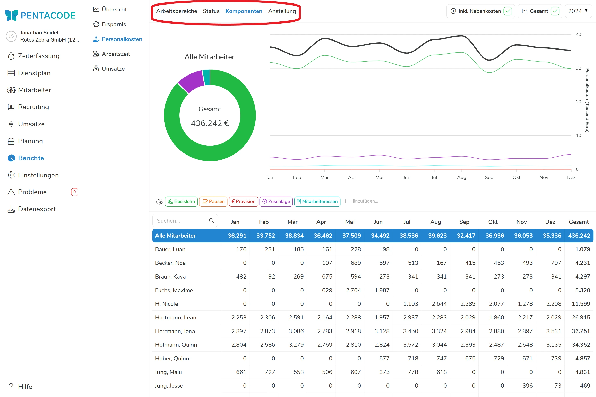
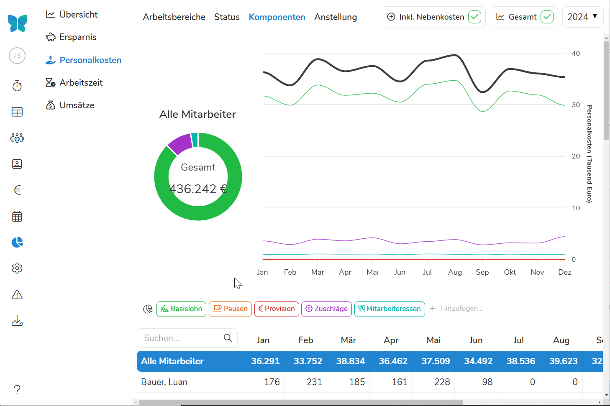
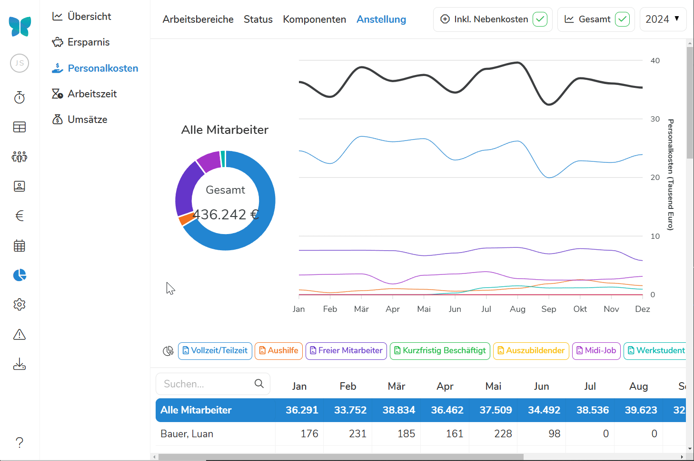

Der Menüpunkt "**Personalkosten**" zeigt Ihnen grafisch Ihrer Aufwendungen für Lohn und Gehalt in **Summe** und in der **Zusammensetzung**. Ob die Lohnkosten die **Arbeitgeberbeiträge** zur Sozialversicherung beeinhalten, können Sie unter [Nebenkosten](#inkl-nebenkosten) bestimmen.

>  **Wichtig:** Die Personalkosten werden anhand der durch die Mitarbeiter geleisteten Arbeit (inklusive Überstunden) ermittelt - nicht Anhand der tatsächlich ausgezahlten Löhne.

## Ansicht

Sie können als Ansicht zwischen "**Arbeitsbereiche**", "**Status**", "**Komponenten**" und "**Anstellung**" wählen. Zusätzlich können Sie noch die Zusatzeinstellungen "**Nebenkosten**" und "**Gesamtkosten**" ein- oder ausblenden. **In der oberen rechten Ecke wählen Sie das Jahr für den Personalkostenbericht aus.**





### Arbeitsbereiche
Arbeitsbereiche zeigen die Aufteilung der Lohnkosten auf die verschiedenen [Abteilungen und Standorte]\(/handbuch/einstellungen/arbeitsbereiche/) des Unternehmens. In der Filterleiste unter der Kreis- und Liniengrafik können Sie einstellen auf welche Arbeitsbereiche die Berichte aufgeteilt werden sollen. 

### Status
Die Statusansicht zeigt die Zusammensetzung der Personalkosten anhand des Arbeitsstatus des Mitarbeiters - also reguläre Arbeitstage, Urlaubstage, Krankheitstage und zusätzliche Optionen. In der Filterleiste unter der Kreis- und Liniengrafik können Sie einstellen auf Mitarbeiterstati die Berichte aufgeteilt werden sollen. 

### Komponenten 
Die Komponentenansicht zeigt die Personalkosten aufgeteilt auf die verschiedenen Teile der Bezahlung. Darunter zählen etwa Basislohn, Zuschläge und bezahlte Pausen. In der Filterleiste unter der Kreis- und Liniengrafik können Sie einstellen auf welche Komponenten der Bezahlung die Berichte aufgeteilt werden sollen. 





### Anstellung
Die Anstellungsansicht zeigt die Personalkosten aufgeteilt auf die [Beschäftigungsverhältnis]\(/handbuch/mitarbeiter/vertrag/). In der Filterleiste unter der Kreis- und Liniengrafik können Sie einstellen welche Beschäftigungsverhältnisse in die Berichte einfließen sollen. 

### Inkl. Nebenkosten
Standardmäßig sind die Arbeitsgebernebenkosten für Sozialversicherung in den Personalkostenbericht mit einberechnet. Sie können diese jedoch deaktivieren, indem Sie den Haken bei "**Inkl. Nebenkosten**" in der oberen rechten Ecke abwählen. Sie werden sehen, dass sich einzelne Positionen, sowie die Gesamtkosten um die Nebenkosten reduzieren. 

>  **Achtung** Die Umlagen U1 und U2, sowie die Beiträge zur Berufsgenossenschaft werden nicht als Nebenkosten mitberechnet.

### Gesamtkosten
Die normalerweiße in schwarz dargestellte Gesamtkostenlinie können Sie mit einem Klick auf   "**Gesamt**" deaktivieren. 

## Tortendiagramm Jahres-Summe

Die "Tortengrafik" zeigt die während des Jahres fortlaufend **auflaufende Jahreslohn-Summe**. Ein "Mouse over" über die farbig abgesetzten Tortenstücke zeigt Ihnen die einzelnen unter [Ansicht](#ansicht) bestimmten Komponenten der Personalkosten.

## Liniendiagramm Monats-Summen

Die "Liniengrafik" zeigt die Aufteilung der monatlichen Personalkosten über das ausgewählte Jahr. Ein "Mouse over" zeigt die genaue Aufteilung mit Summen für jede unter [Ansicht](#ansicht) bestimmte Komponente der Personalkosten.





## Einzelne Mitarbeiter

In der Standardeinstellung werden immer die Lohnkosten für **alle** Mitarbeiter gezeigt.

Unter dem Graphen wird Ihnen eine Liste aller Mitarbeiter und ihrer individuellen Lohnkosten angezeigt. Durch Anklicken eines einzelnen Mitarbeiters erhalten Sie nur die Darstellung seiner Lohnkosten als Graphen. Wenn Sie einen bestimmten Mitarbeiter suchen, können Sie zudem dessen Namen in die Suchleiste über der Mitarbeiterliste eingeben. 

