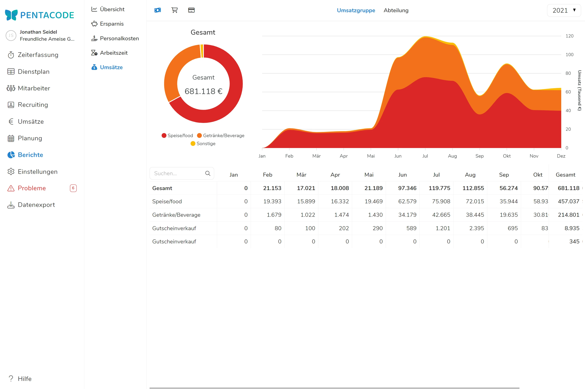
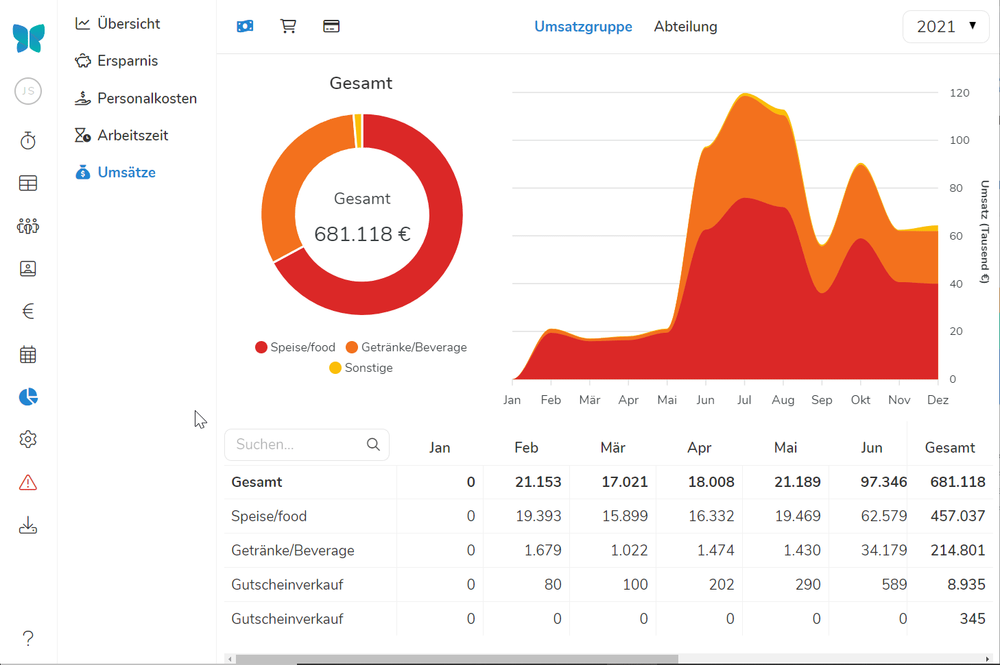
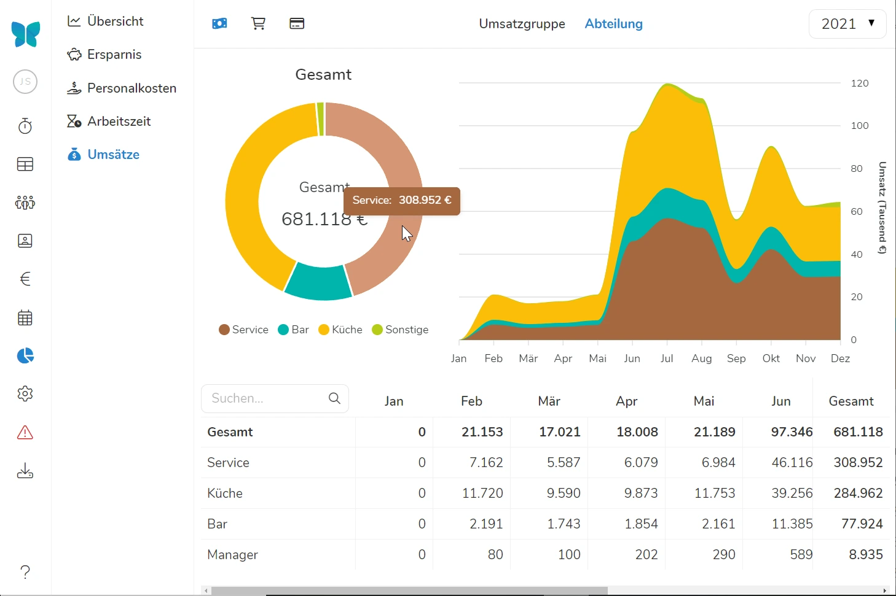

Wenn Sie unter "Berichte" auf "Umsätze" klicken, sehen Sie in der Standardeinstellung die **Umsätze** in ihrer Herkunft **nach Erlösart**.

Die Umsätze und deren Zusammensetzung werden in kaufmännischer Rundung auf **ganze €-Beträge** detailliert als Zahlen ausgewiesen.

Aus Gründen der Übersichtlichkeit werden bei der grafischen Darstellung alle kleinteiligen **Umsätze**, die mit **weniger als 5%** zum Gesamtumsatz beitragen, automatisch zu "**Sonstiges**" zusammengefasst.





## Nach Abteilungen

Indem Sie auf "Abteilung" klicken, sehen Sie, in welchem Umfang die **einzelnen Abteilungen** zum Gesamtumsatz beigetragen haben.

**Voraussetzung** hierfür ist die entsprechende Zuweisung unter [**Erlöszuordnung**]\(/handbuch/umsaetze/erloeszuordnung/).





Die Tortengrafik zeigt zudem anschaulich, dass im Beispielfall die Abteilung "Service" fast 50% zum Gesamtumsatz beigetragen hat.

Bei einem Mouse-over erscheinen auch hier die hinter der Grafik liegenden €-Beiträge.





>  **Grafiken dienen der Veranschaulichung!** Im hier gezeigten Beispiel macht die Darstellung auf einen Blick erkennbar, dass die Beiträge der Abteilungen sehr monatsabhängig sind und Schwankungen unterliegen. Ein Abgleich mit dem [Personalkostenbericht]\(/handbuch/berichte/personalkostenberichte/) kann Abklärung bringen, woran diese Schwankung liegen könnte. Jedenfalls sind Sie mit einem einzigen Blick auf den Graphen dem Ursprung ein Stück näher. 

