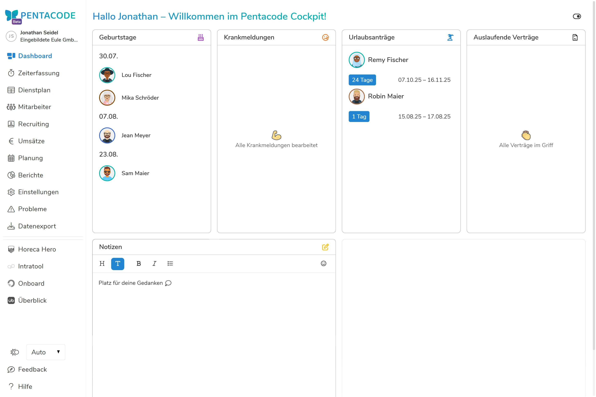

Das Dashboard in Pentacode dient als Ihr zentrales "Cockpit" für **Ihren** Betrieb und verschafft Ihnen einen schnellen Überblick über die wichtigsten Vorgänge in Ihrem Personalmanagement. Hier finden Sie **relevante** Informationen auf einen Blick und können direkt agieren.





Das Dashboard präsentiert Ihnen verschiedene Informationskacheln und macht Sie auf wichtige Deadlines aufmerksam:

## Geburtstage

Hier werden Ihnen die nächsten Geburtstage Ihrer Mitarbeiter angezeigt – so können Sie sicher sein, keinen mehr zu vergessen!

## Krankenmeldungen

Auf der Kachel für **Krankenmeldungen** sehen Sie alle vorliegenden Krankenmeldungen Ihrer Mitarbeiter.
Klicken Sie auf den Zeitraum einer Krankenmeldung in der Kachel, um diese **direkt im Cockpit zu öffnen**. Sie können die Meldung sofort genehmigen, ablehnen oder bearbeiten und wie gewohnt mit einem Kommentar versehen.

## Urlaubsanträge

Die Kachel für **Urlaubsanträge** zeigt Ihnen auf einen Blick alle offenen Urlaubsanträge Ihrer Mitarbeiter.
Klicken Sie auf den Zeitraum eines **Antrags**, öffnen Sie diesen direkt im Cockpit. Hier haben Sie die Möglichkeit, den Antrag umgehend zu genehmigen, abzulehnen oder zu bearbeiten und einen Kommentar hinzuzufügen.

## Auslaufende Verträge

Die Kachel "Auslaufende Verträge" hilft Ihnen, den Überblick über die anstehenden Vertragsenden zu behalten.
Sie sehen den Namen des Mitarbeiters und die verbleibende Restlaufzeit des Vertrages. Fahren Sie mit der Maus über den Eintrag, um das genaue Ablaufdatum zu sehen.
Klicken Sie auf den **Mitarbeiternamen**, um sofort in dessen Profil zum Bereich Verträge zu gelangen. Dort können Sie einen neuen Vertrag hinterlegen, den aktuellen Vertrag verlängern oder den Vertrag auslaufen lassen.

## Notizen

Die Notizen bieten Platz für Ihre privaten Gedanken, Checklisten oder To-Do's. Diese werden automatisch gespeichert und stehen jedem Manager individuell bereit – es haben also nur Sie Einblick in Ihre Notizen!

## Schichten des Tages
Die Kachel für **Schichten des Tages** zeigen alle geplanten Schichten des heutigen Tages sortiert nach ihrer Startzeit. So haben Sie einen schnellen Überblick über Lücken oder zu starke Überlappungen im Dienstplan. 
Klicken Sie auf einen Mitarbeiter und Sie landen im Dienstplan bei diesem Mitarbeiter - halten Sie dabei  gedrückt und Sie landen im Arbeitszeitblatt des Mitarbeiters.

## Dashboard anpassen

Über das -**Icon** können Sie selbst festlegen, welche Kacheln angezeigt werden sollen. Wählen Sie dazu einfach die Häkchen neben den Kachelnamen an- und ab. So behalten Sie stets den Fokus auf die für Sie relevantesten Informationen.
Sie können ebenfalls die Anordnung der Kacheln ändern, indem Sie das -**Icon** mit der Maus festhalten und den jeweiligen Eintrag in eine neue Position ziehen. 

>  **Wichtig:** Die angezeigten Kacheln unterliegen stets den Ihnen als Manager zugewiesenen Zuständigkeitsbereichen und Berechtigungen.

## Das Dashboard wächst mit!

Das Dashboard wird kontinuierlich weiterentwickelt und um zusätzliche Funktionen und Kacheln erweitert, um Ihnen zukünftig noch mehr Kontrolle und Übersicht zu bieten!

Sie haben Ideen für eine hilfreiche Kachel? Reichen Sie ihre Idee gerne in unserem [Feedback-Tool](/feedback) ein!