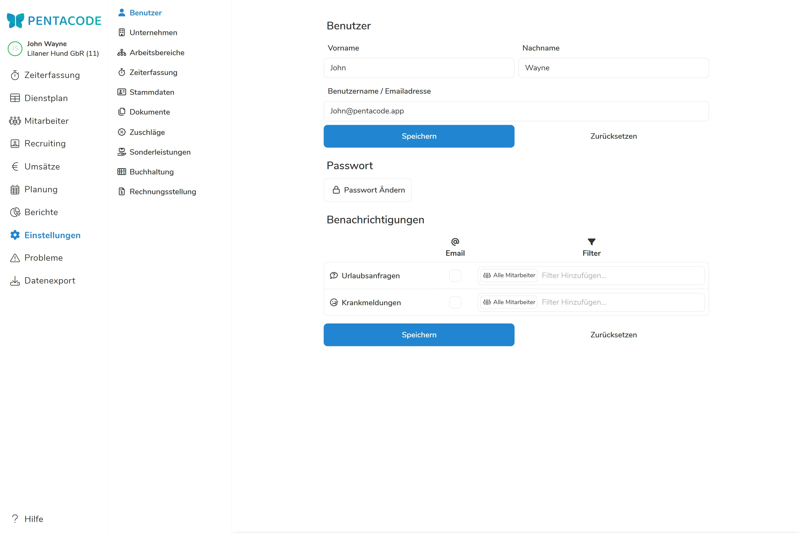

Im Benutzerkonto wird der Zugang zu Pentacode verwaltet. Sofern ein Administrator Zugang zum "Benutzerkonto" hat, kann er in diesem Menüpunkt seine Email-Adresse wie auch sein Passwort ändern und einstellen, welche Benachrichtigungen er erhalten möchte.





Hat ein Administrator sein Passwort vergessen, kann er lediglich auf der Startseite von Pentacode über "**Passwort Vergessen**" ein neues Passwort anfordern.

## Benachrichtigungen anpassen

Sie können einstellen, welche Benachrichtigungen Sie von Pentacode per Mail erhalten. Wählen Sie dazu die Kästchen unter 'Email' an. 
- **Urlaubsanfragen:** Sie werden benachrichtigt, wenn einer Ihrer Mitarbeiter eine Urlaubsanfrage stellt.
- **Krankmeldungen:** Sie werden benachrichtigt, wenn einer Ihrer Mitarbeiter sich krank meldet

### Benachrichtigungen nach Mitarbeitern filtern

Wenn Sie nur Benachrichtigungen bei Urlaubsanfragen oder Krankmeldungen einzelner Mitarbeiter oder Abteilungen möchten, können Sie diese unter 'Filter' auswählen. Klicken Sie dazu in das Feld 'Filter Hinzufügen...' und wählen die Mitarbeiter aus. Ohne zusätzliche Filter, sind automatisch **alle Mitarbeiter ausgewählt!**.

