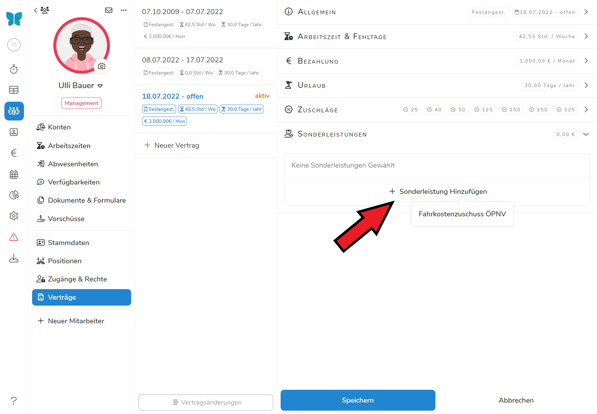

Sonderleistungen sind eine Möglichkeit einer Gruppe an Mitarbeitern gesondert vom normalen Lohn zusätzliche Zahlungen zukommen zu lassen. Dabei können Sie individuelle Kategorien anlegen, um die lohn- und steuerrechtlichen Eigenschaften der Zusatzzahlungen zu definieren. Sie finden die Sonderleistungen unter  / . 

>  **Achtung: Die Einstellungen die Sie hier für die Sonderleistungen vornehmen bestimmen wie Pentacode Abgaben und Lohn berechnet! Sollten Sie sich nicht sicher sein welche Einstellungen für eine Sonderleistung eingestellt werden müssen, treten Sie vorher mit Ihrem Steuerberater in Kontakt!**

## Mitarbeiteressen

Hier können Sie den monetären Wert von Mitarbeiteressen definieren. Es wird zwischen Frühstück, Mittagessen und Abendessen unterschieden. Der hier angegebene Wert wird bei der Lohnabrechnung, sowie bei der Berechnung der Personalkosten berücksichtigt.

>  Sie können hier beliebe Werte eingeben, aber im Normalfall gelten die vom Gesetzgeber vorgegeben Sachbezugswerte: **2,17 € für Frühstück** und **4,13 € für Mittag- und Abendessen**.

## Neue Sonderleistung erstellen

Klicken Sie auf , um im erscheinenden Bearbeitungsdialog die Eigenschaften der Zusatzzahlung zu bestimmen. Dabei können Sie folgende Einstellungen treffen (**Wenn der Slider neben einer Option blau erscheint ist sie angewählt**):

- **Name der Sonderleistung:** Geben Sie hier den Namen der Zusatzleistung ein.
- **Beitragsfrei:** Soll die Zusatzleistungen beitragsfrei angerechnet werden wie etwa SFN-Zuschläge? Wenn ja, wählen Sie diese Option an, dass der Slider blau erscheint.
- **Auf Mindestlohn Anrechenbar:** Kann die Zusatzleistung als Teil des Grundlohns berechnet werden und damit zum Mindestlohn zählen?
- **Bei Zuschlagszahlungen Berücksichtigen:** Soll die Sonderleistung zum Grundsatz hinzugerechnet werden, auf dessen Höhe Zuschläge berechnet werden?

## Sonderleistungen bearbeiten und löschen

Um die Sonderleistung zu bearbeiten, klicken Sie auf  neben der Sonderleistung. Wählen Sie  aus, kommen Sie wieder in den gleichen Bearbeitungsdialog wie beim Erstellen einer neuen Sonderleistung. Wählen Sie  aus, um die Sonderleistung zu löschen.

## Sonderleistungen Mitarbeitern zuordnen

Um die Sonderleistungen Mitarbeitern zuzuteilen, wählen Sie unter dem Reiter  den gewünschten Angestellten aus und navigieren dann zu . Wenn Sie einen neuen Vertrag erstellen oder einen bestehenden bearbeiten, haben Sie nun die Option aus den erstellten Sonderleistungen die gewünschten auszuwählen und **die Höhe der Sonderleistung zu bestimmen**.





> ** Die Sonderleistungen werden den Mitarbeitern jeden Monat zusätzlich zum Grundlohn angerechnet.**
