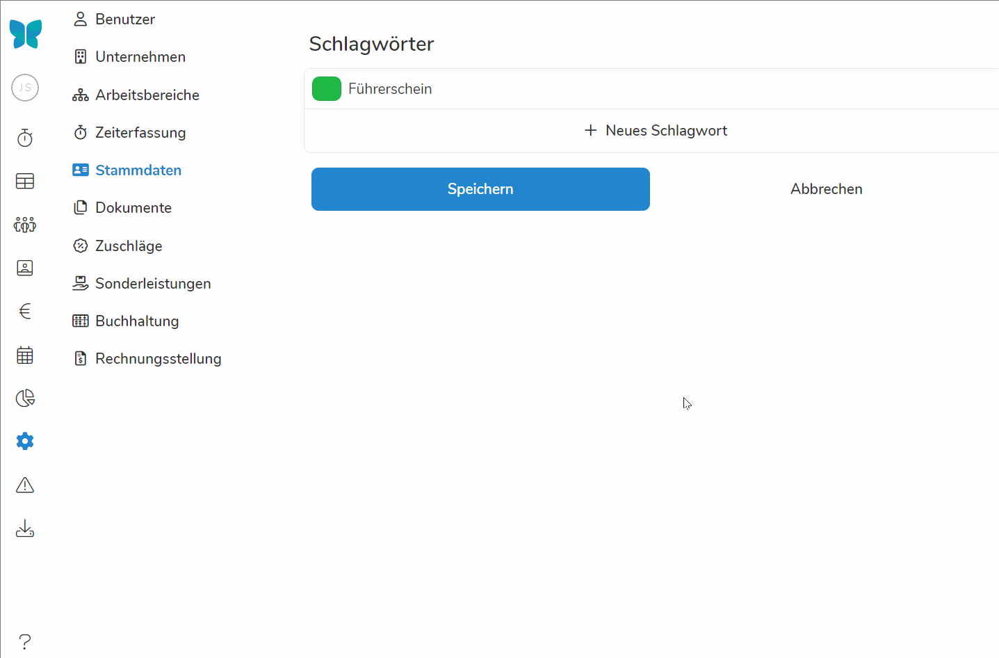

Unter "Stammdaten" können Sie individuelle Kategorien erstellen, welche Sie Mitarbeitern zuordnen können. So können Sie Pentacode individualisieren und Mitarbeiter nach gewissen Eigenschaften und Schlagwörtern sortieren und filtern. 

## Schlagwörter

Schlagwörter stellen Eigenschaften und Gruppenzugehörigkeiten von Mitarbeitern dar und können diesen unter [Mitarbeiter>Stammdaten]\(/handbuch/mitarbeiter/stammdaten/) zugeordnet werden. Später können wir dann im Dienstplan und der Mitarbeiterübersicht nach diesen Schlagwörtern filtern und sortieren. 

Je nach Betrieb könnte es viele Gründe geben zusätzliche Schlagwörter zu erstellen. Eine klassische Anwendung wäre **Mitarbeiter mit einem Führerschein oder Dienstwagen mit einen Schlagwort zu markieren**. Der Anwendung sind aber natürlich keine Grenzen gesetzt.

### Schlagwörter erstellen

Um ein neues Schlagwort zu erstellen klicken Sie auf . Geben Sie anschließend den Namen des Schlagwortes ein und klicken auf **Speichern**. 





### Schlagwort bearbeiten

Wenn Sie den Namen oder die Farbe eines Schlagwortes verändern wollen, klicken Sie dazu einfach auf den Namen des Schlagwortes und auf die farbige Box daneben. Vergessen Sie nicht nach jeder Änderung auf **Speichern** zu klicken. 