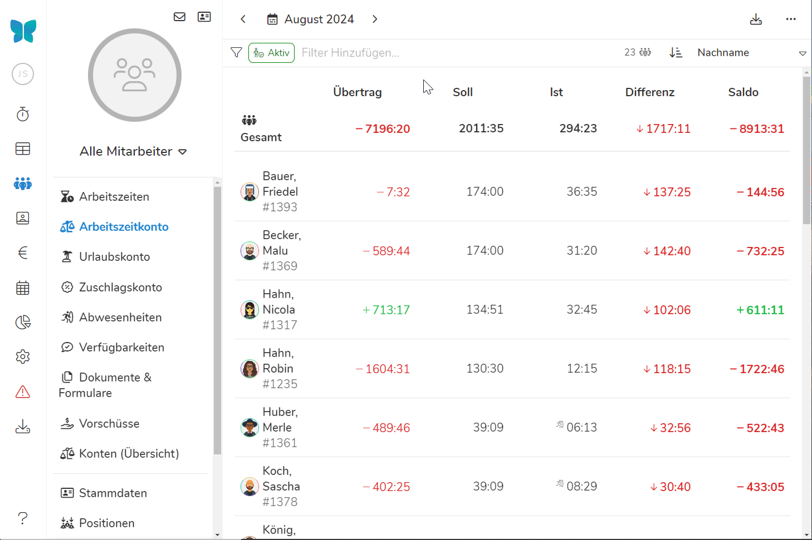
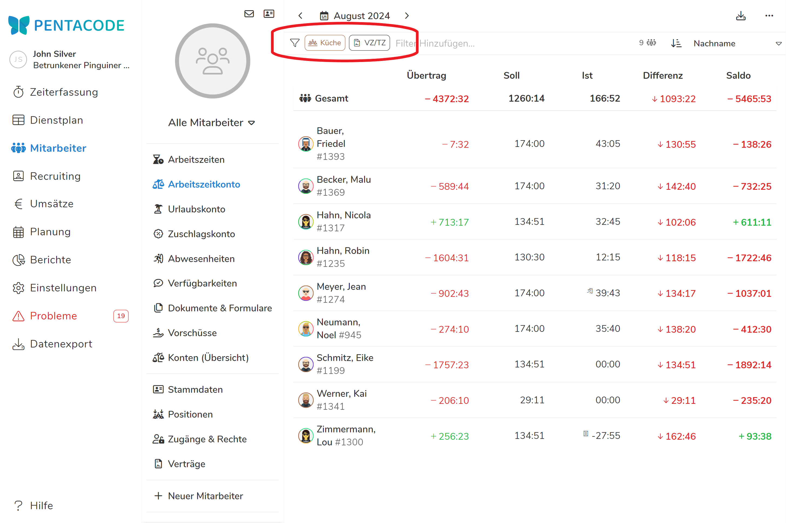
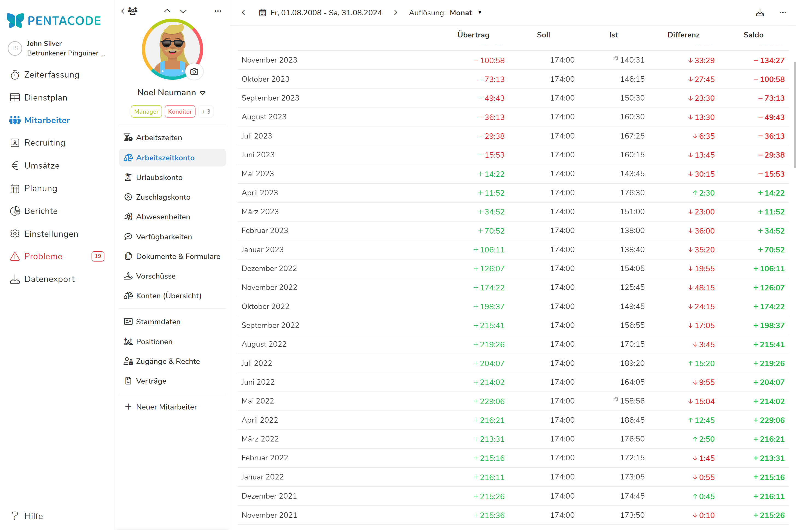
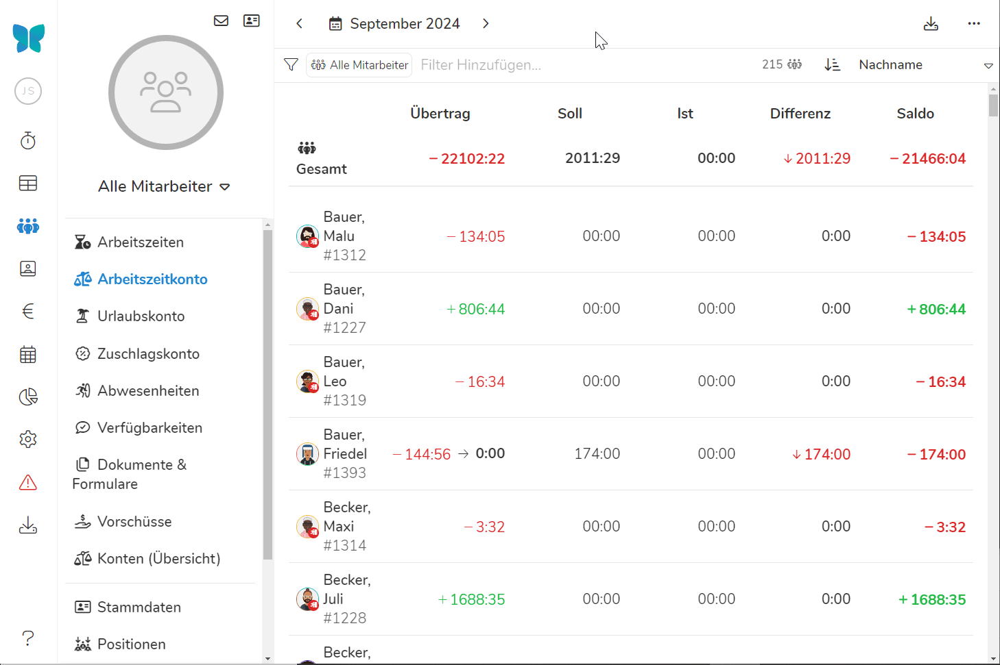

Im Arbeitszeitkonto werden die vertraglich vereinbarten, den tatsächlich geleisteten Arbeitszeiten gegenübergestellt und Über- oder Minderstunden ausgewiesen.

Die Gegenüberstellung erfolgt nur auf Basis der zum aktuellen Zeitpunkt erfassten Arbeitszeiten. **Geplante Arbeitszeiten werden im Arbeitszeitkonto nicht berücksichtigt**.

Unter [Konten (Übersicht)]\(/handbuch/mitarbeiter/konten/) wird das Arbeitszeitkonto gemeinsam mit dem Zuschlagskonto und Urlaubskonto in einer gemeinsamen Übersicht zusammengefasst. 

Sofern nicht anders erfasst, werden die Über- oder Minderstunden am Ende eines Jahres immer automatisch in das Folgejahr übertragen. Wie Sie diese Überträge bearbeiten können, erfahren Sie [weiter unten](#übertrag-bearbeiten--konten-zurücksetzen)

## Übersicht

In der Übersicht können Sie die Arbeitszeiten all ihrer Mitarbeiter über einen selbst gewählten Zeitraum einsehen. Dabei werden fünf Werte im Format Stunden:Minuten angezeigt:

*Übertrag -* sind die Über- oder Minderstunden, welche zu Beginn des ausgewählten Zeitraums vom Mitarbeiter angesammelt sind. 

*Soll -* sind die über die [Vertragsbedingungen]\(/handbuch/mitarbeiter/vertrag/) kalkulierten Soll-Stunden des Mitarbeiters für den Zeitraum. 

*Ist -* sind die tatsächlich erarbeiteten Stunden des Mitarbeiters.

*Differenz -* sind die Ist-Stunden abzüglich der Soll-Stunden - dieser Wert gibt an ob Planung und Durchführung von Arbeitszeiten sich decken. 

*Saldo -* sind die insgesamt angesammelten Über- und Minderstunden.

>  Positive Werte sind stets Überstunden - negative Werte stets Minderstunden.

### Zeitraum wählen

In der Übersicht sehen Sie die Arbeitszeiten ihrer Mitarbeiter **standardmäßig für den aktuellen Monat**. Sie können jedoch auch **jeden beliebigen Zeitraum** auswählen.

Klicken Sie dazu auf den  Button in der **linken oberen Ecke**. Mit den Pfeiltasten wählen Sie zwischen einzelnen Monaten. 

Dort können Sie auch zwischen ganzen Wochen, Monaten und Jahren auswählen. Durch den linken Kalender kann man zudem einen beliebigen Startzeitpunkt und im Rechten einen beliebigen Endzeitpunkt wählen. Dann wird der Zeitraum dazwischen angezeigt. 





Ihnen werden die [Arbeitszeitwerte](#übersicht) immer für den ganzen Zeitraum zusammengefasst angezeigt. 

>  Werden zukünftige Monate mit ausgewählt, sind geplante Schichten in den Soll-Stunden enthalten!

### Nach Mitarbeitern filtern

Wie in anderen Übersichten können Sie auch im Arbeitszeitkonto nach **Positionen, Beschäftigungsverhältnis und einzelnen Mitarbeitern** filtern. Klicken Sie dazu einfach auf die Leiste mit dem  Symbol und wählen aus der Liste die gewünschten Kategorien aus. 

>  Der Filter beeinflusst nur, welche Mitarbeiter angezeigt werden! Die Stunden werden für die Mitarbeiter aber stets aus allen Positionen berechnet. 

Filter aus der gleichen Klasse (z.B zwei Abteilungen wie 'Küche' und 'Manager') werden additiv verwendet - es werden also Mitarbeiter der Abteilung 'Küche' und der Abteilung Manager 'angezeigt'. Werden Filter aus verschiedenen Klassen verwendet (z.B das Arbeitsverhältnis 'Vollzeit/Teilzeit' und die Abteilung 'Küche') werden sie exklusiv verwendet - es werden nur Mitarbeiter aus der Abteilung Küche mit dem Arbeitsverhältnis 'Vollzeit/Teilzeit' aufgelistet.





## Einzelansicht

Klicken Sie auf einen Mitarbeiter in der Übersicht erreichen Sie dessen Einzelansicht. Sie können auf [gleiche Weise wie in der Übersicht](#zeitraum-wählen) auch hier den Zeitraum wählen für den Soll- und Ist-Stunden angezeigt werden. 

Mit der Einstellung **'Auflösung'** neben dem Kalender können Sie einstellen ob der gewählte Zeitraum in Wochen, Monats oder Jahresblöcke geteilt wird. 





Wenn Sie Arbeitszeiten händisch eintragen oder kontrollieren möchten, tun Sie dies unter [Arbeitszeiten]\(/handbuch/mitarbeiter/arbeitszeiten/)!

## Übertrag Bearbeiten / Konten Zurücksetzen

Solange Sie der Software keine abweichenden Anweisungen geben, führt Pentacode
die Konten eines Mitarbeiters über den gesamten Zeitraum des
Beschäftigungsverhältnis saldierend fort. Das Arbeitszeitkonto eines Jahres wird
immer automatisch in das Folgejahr übertragen.

In vielen Fällen ist es allerdings notwendig, korrigierend in die Saldierung von
Konten einzugreifen, zum Beispiel wenn die Konten eines Mitarbeiters nach langer
Abwesenheit zurückgesetzt werden sollen.

Pentacode bietet Ihnen hierfür die Möglichkeit, den Übertrag eines Monats für
eines oder alle Konten eines Mitarbeiters zu bearbeiten.

### Kontenübertrag eines einzelnen Mitarbeiters Bearbeiten

Um einen abweichenden Kontenübertrag in einem Monat für einen bestimmten Mitarbeiter zu **erstellen**, verfahren Sie wie folgt:

1. Navigieren Sie zunächst zur [Einzelansicht](#einzelansicht) des Arbeitszeitkontos.
2. Klicken Sie auf das  Symbol in der rechten oberen Ecke
   und auf 'Konten zurücksetzen'.
3. Wählen Sie unter 'Datum' den Zeitpunkt aus, an dem das Konto bearbeitet werden soll.
4. Füllen Sie die angezeigten Felder für die jeweiligen Konten mit dem
   **gewünschten Betrag für das Saldokonto** aus. Sie können Felder für bestimmte Konten leer lassen,
   um für diese Konten den "normalen" Übertrag beizubehalten. Wenn Sie also zum
   Beispiel nur den Urlaubsübertrag zurücksetzen wollen, füllen Sie die Spalte
   "Urlaub" aus und lassen den Rest leer.
5. Klicken Sie auf  um die Änderungen zu speichern

Um den eingetragenen Übertrag im Nachhinein zu **bearbeiten**, fahren Sie mit
der Maus über die entsprechende Zeile und klicken den Eintrag an. Nun können Sie
die entsprechenden Änderungen wie bei einem neuen Kontenübertrag bearbeiten.

Um den eingetragenen Übertrag zu **entfernen**, bearbeiten Sie den Übertrag und löschen Ihre ursprünglichen Änderungen.





### Kontenüberträge mehrerer Mitarbeiter Bearbeiten

Um die Kontenüberträge für mehrere (oder alle) Mitarbeiter "in einem Schwung" zu ändern oder zurückzusetzen, gehen Sie genau wie [oben](#kontenübertrag-eines-einzelnen-mitarbeiters-bearbeiten) beschrieben vor, starten nur im ersten Schritt bei der [Übersicht](#übersicht).



