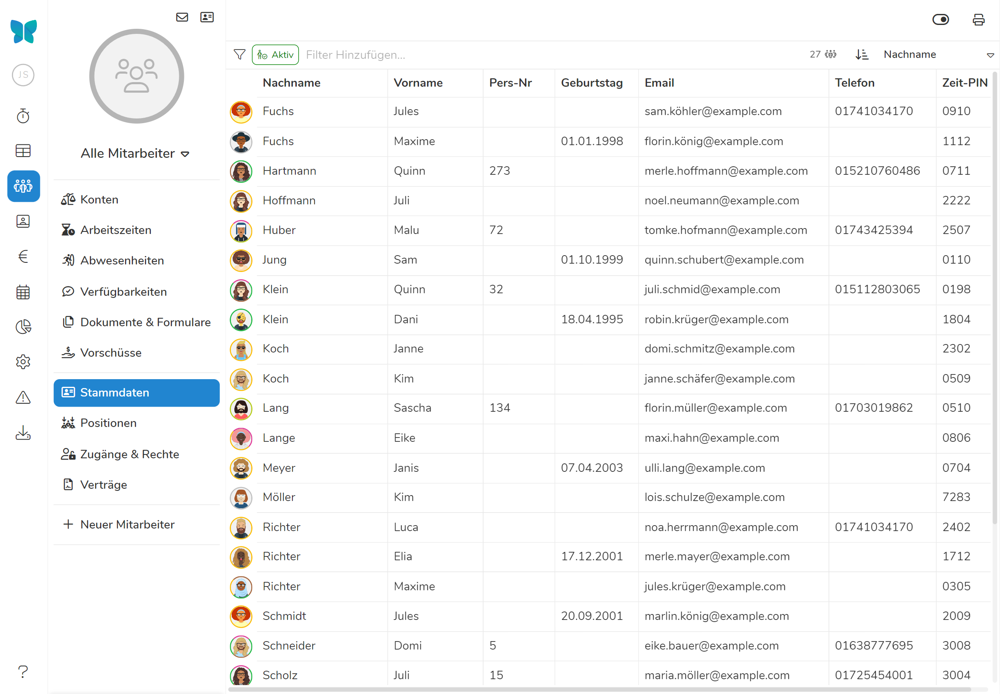
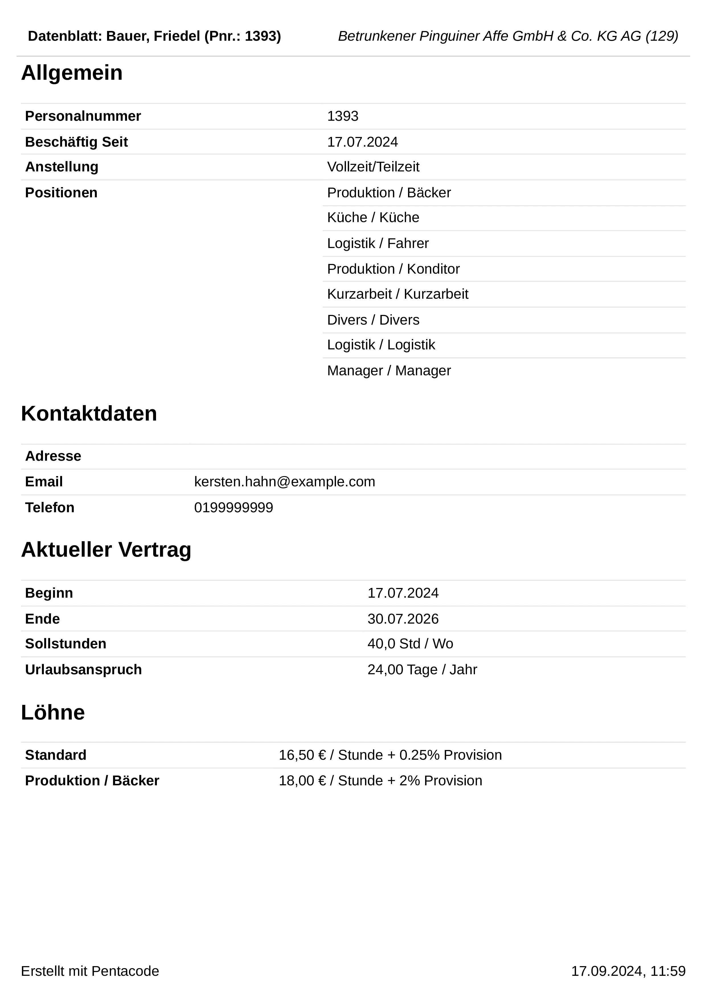

## Stammdaten-Übersicht

Die Stammdaten-Übersicht zeigt die Stammdaten aller Ihrer Mitarbeiter in tabellarischer Form. Um zur
Stammdaten-Übersicht zu gelangen, wählen Sie den Punkt **Mitarbeiter** aus dem Hauptmenü und dort den Unterpunkt
**Stammdaten**.





### Spaltenwahl

Sie interessieren sich nur für bestimmte Informationen? Über den  Button können Sie einzelne Spalten zur Anzeige an- oder abwählen.

### Stammdaten-Liste Drucken

Über den  Button können Sie die aktuell angezeigte Tabelle drucken.

>  **Tipp:** Ihr Ausdruck passt nicht auf ein DIN-A4
> Blatt? Über die [Spaltenwahl](#spaltenwahl) können Sie unwichtige Information
> von der Anzeige ausschließen. Falls dies noch nicht ausreicht, versuchen Sie
> die Druckeinstellungen auf Querformat zu ändern oder die Skalierung zu
> reduzieren. Die Druckeinstellungen finden Sie für gewöhnlich im Druckdialog
> Ihres Browsers.

## Stammdaten Bearbeiten

Um die Stammdaten eines Mitarbeiters zu bearbeiten, gehen Sie wie folgt vor:

1. Navigieren Sie zur [Stammdaten-Übersicht](#stammdaten-übersicht) und wählen dort den gewünschten Mitarbeiter durch einen Klick auf die entsprechende Zeile.
2. Nehmen Sie die gewünschten Änderungen vor.
3. Klicken Sie  um Ihre Änderungen zu übernehmen.

## Schlagwörter

Ähnlich wie Dokumenten, können Sie auch ihren Mitarbeitern Schlagwörter zuordnen. Das hilft Ihnen dabei Mitarbeiter mit gewissen Kenntnissen oder Eigenschaften (bspw. einem Führerschein) schnell herauszufiltern. Um Schlagwörter zu erstellen, navigieren Sie in die [Einstellungen / Stammdaten]\(/handbuch/einstellungen/stammdaten/). 





## Datenblatt Drucken

Das Datenblatt eines Mitarbeiters enthält Informationen wie Name, Adresse und
Kontaktdaten, sowie grundlegende Informationen zum Beschäftigungsverhältnis.

Um das Datenblatt **aller Mitarbeiter** zu drucken, navigieren Sie zunächst zur
[Stammdaten-Übersicht](stammdaten-übersicht) und klicken dann auf den  Button in der linken oberen Ecke des
Mitarbeitermenüs. Dieser verweist sie in den Reiter
[Datenexport]\(/handbuch/datenexport/). 

Um das Datenblatt **eines einzelnen Mitarbeiters** zu drucken, navigieren Sie
zunächst zur [Stammdaten-Übersicht](stammdaten-übersicht) und wählen den
gewünschten Mitarbeiter aus. Klicken Sie auf den  Button
rechts über dem Profilbild (bzw. den Initialen, falls kein Profilbild vorhanden)
und anschließend auf . Sie werden wieder in den Reiter [Datenexport]\(/handbuch/datenexport/)
verwiesen. 
