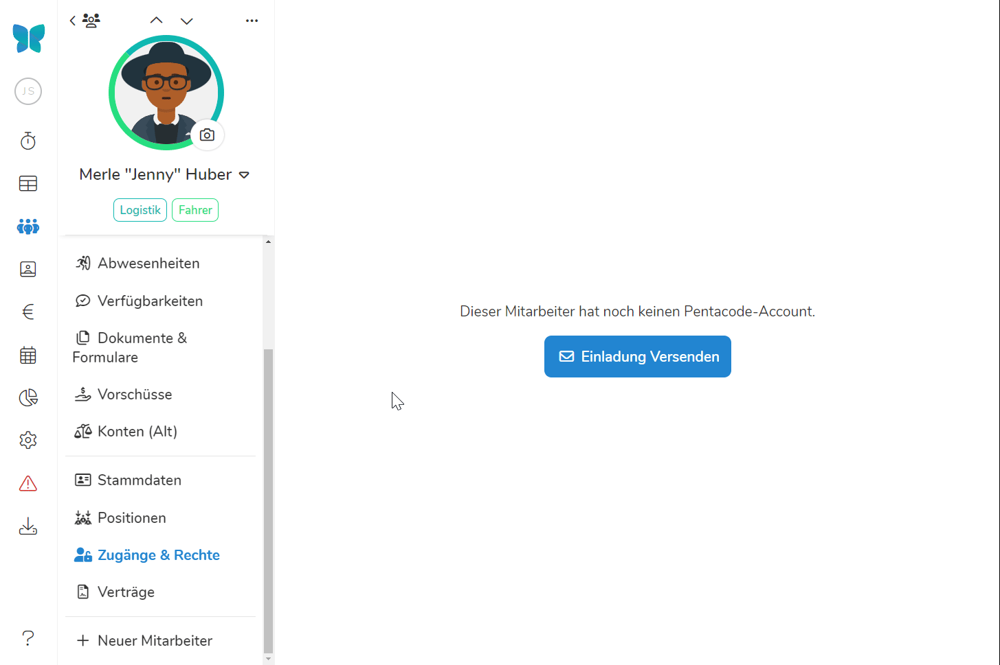
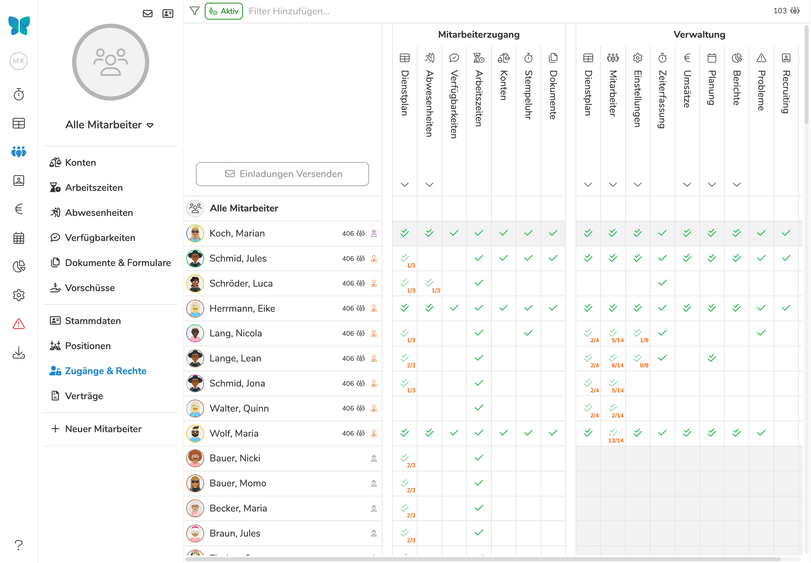

Über Pentacodes einfaches und flexibles Zugangs- und Berechtigungssystem können Sie definieren, **welche Ihrer
Mitarbeiter Zugang zur Mitarbeiterapp oder Verwaltungsebene haben sollen und auf welche Bereiche und Funktionen jeder
Person Zugriff gewährt wird**. So können Sie zum Beispiel einzelnen Mitarbeitern die Berechtigung erteilen, Dienstpläne
zu schreiben, Personaldaten zu verwalten oder einfach ihre Dienstpläne, Urlaubsansprüche und Ähnliches über die
Mitarbeiterapp einzusehen.

## Zugang Einrichten

Bevor ein Mitarbeiter Zugang zur Mitarbeiter-App oder Verwaltungsebene erhalten kann, muss für diesen zunächst ein
Mitarbeiterzugang eingerichtet werden. Hierfür ist die Wahl eines Benutzernamens (die Emailadresse des Mitarbeiters) und
Passworts erforderlich.

Der erste Schritt zur Einrichtung eines Mitarbeiterzugangs ist die Versendung einer **Einladung** an die Emailadresse des Mitarbeiters:

1. Wählen Sie den Punkt **Mitarbeiter** aus dem Hauptmenü und dort den Unterpunkt **Zugänge & Rechte**.
2. Wählen Sie den gewünschten Mitarbeiter aus dem Dropdown-Menü in der linken oberen Ecke oder indem Sie in der
   Listenansicht auf dessen Namen klicken.
3. Klicken Sie auf den Button .
4. Geben Sie die Emailadresse des Mitarbeiters ein. Falls bereits eine Emailadresse in den Stammdaten des Mitarbeiters
   hinterlegt ist, wird diese automatisch für Sie eingefügt. Sie können diese Adresse beibehalten oder eine abweichende
   Emailadresse eingeben (**Achtung:** Die Emailadresse in den Stammdaten des Mitarbeiters wird dann mit der neuen
   Adresse ersetzt.).
5. (Optional) Geben Sie eine Nachricht ein, welche in der Einladungsemail angezeigt werden soll.
6. Weisen Sie dem Mitarbeiter die gewünschte [Rolle](#rollen-zuweisen) und [Berechtigungen](#berechtigungen-vergeben) zu.

Der Mitarbeiter erhält nun eine Email mit einem Aktivierungslink, über den er
die Einladung akzeptieren und ein Passwort wählen kann. Zusammen mit der Email
des Mitarbeiters kann dieses Passwort zum Login in die
[Mitarbeiter-App]\(/handbuch/mitarbeiter-app) (https://perso.pentacode.app)
oder (falls die entsprechende Berechtigung vorliegt) in den Verwaltungszugang
(https://manage.pentacode.app) verwendet werden.

>  **Tipp:** Das Eingeben einer Nachricht mit dem Versand der Einladung ist optional -
> allerdings empfehlen wir eine kurze Erklärung beizufügen, um zu vermeiden,
> dass die Einladung fälschlicherweise für eine Spam oder Phishing-Email
> verwechselt wird.





### Mehrere Mitarbeiter Einladen

Sie können eine Einladung an **mehrere Mitarbeiter** auf einmal versenden.

1. Wählen Sie den Punkt **Mitarbeiter** aus dem Hauptmenü und dort den Unterpunkt **Zugänge & Rechte**.
2. Klicken Sie auf den Button  in der linken oberen Ecke der
   Listenansicht.
3. Wählen Sie die gewünschten Empfänger durch Anwählen
   des  Buttons in der entsprechenden Zeile oder verwenden Sie den  Button, um alle Mitarbeiter zu selektieren.
4. Geben Sie die Emailadressen der Empfänger ein. Falls bereits eine Emailadresse in den Stammdaten des Mitarbeiters
   hinterlegt ist, wird diese automatisch für Sie eingefügt. Sie können diese Adresse beibehalten oder eine abweichende
   Emailadresse eingeben (**Achtung:** Die Emailadresse in den Stammdaten des Mitarbeiters wird dann mit der neuen
   Adresse ersetzt.).
5. (Optional) Geben Sie eine Nachricht ein, welche in der Einladungsemail angezeigt werden soll.
6. Weisen Sie Ihren Mitarbeiter die gewünschte [Rolle](#rollen-zuweisen) und [Berechtigungen](#berechtigungen-vergeben)
   zu.

## Rollen Zuweisen

Die **Rolle** eines Mitarbeiters bestimmt, ob der Mitarbeiter auf die Verwaltungsebene Ihres Unternehmens Zugriff haben
soll oder ausschließlich auf die Mitarbeiter-App. Um die Rolle eines Mitarbeiters zu bearbeiten, gehen Sie wie folgt
vor:

1. Wählen Sie den Punkt **Mitarbeiter** aus dem Hauptmenü und dort den Unterpunkt **Zugänge & Rechte**.
2. Wählen Sie den gewünschten Mitarbeiter aus dem Dropdown-Menü in der linken oberen Ecke oder indem Sie in der
   Listenansicht auf dessen Namen klicken.
3. Wählen Sie die gewünschte Rolle aus dem Dropdown-Menü in der linken oberen Ecke.
4. Klicken Sie auf 

Pentacode unterscheidet zwischen drei verschiedenen Zugangsebenen:

### Mitarbeiter

Die "Mitarbeiter"-Rolle ist die "niedrigste" Berechtigungsstufe und erteilt dem Mitarbeiter ausschließlich Zugang zur [Mitarbeiter-App]\(/handbuch/mitarbeiter-app).

### Manager

Mitarbeiter mit der "Manager"-Rolle haben zusätzlich zur Mitarbeiter-App Zugriff auf die Verwaltungsebene von Pentacode
(https://manage.pentacode.app) und können dort auf alle Bereiche und Funktionen zugreifen, für die ihnen die
entsprechende Berechtigung erteilt wurde.

### Besitzer

Der Besitzer eines Unternehmens hat grundsätzlich Zugriff auf alle Bereiche und Funktionen der Software. Für jedes Unternehmen gibt es immer genau einen Mitarbeiter mit der "Besitzer"-Rolle.

## Zuständigkeitsbereiche Einschränken

Die Zuständigkeitsbereiche eines Managers bestimmen, auf welche Standorte
und Abteilungen der Manager Zugriff hat. Um die Zuständigkeit auf **bestimmte Arbeitsbereich einzuschränken**, klicken Sie in das
Feld "Filter Hinzufügen" und wählen Sie ein oder mehrere Standorte und/oder
Abteilungen. Oder lassen Sie die Filter leer, um dem Mitarbeiter Zugriff auf das
gesamte Unternehmen zu geben. 

>  Die Zahl neben dem 
Symbol gibt an, wie viele Mitarbeiter der Zuständigkeitsbereich eines Managers beinhaltet.

<figure>

<figcaption>Wählen Sie ein oder mehrere Standorte und/oder Abteilungen um den Zugriff des Mitarbeiters auf diese Arbeitsbereiche einzuschränken.</figcaption>
</figure>

## Berechtigungen Vergeben

Die **Berechtigungen** eines Mitarbeiters bestimmt, auf welche Bereiche der Software der Mitarbeiter Zugang haben soll. Um die Berechtigungen eines Mitarbeiters zu bearbeiten, gehen Sie wie folgt vor:

1. Wählen Sie den Punkt **Mitarbeiter** aus dem Hauptmenü und dort den Unterpunkt **Zugänge & Rechte**.
2. Wählen Sie den gewünschten Mitarbeiter aus dem Dropdown-Menü in der linken oberen Ecke oder indem Sie in der
   Listenansicht auf dessen Namen klicken.
3. Wählen Sie Berechtigungen an oder ab, indem Sie auf den Namen oder das -Element
   klicken. (Über das Menü in der rechten oberen Ecke können Sie zwischen Berechtigungen für Mitarbeiter- und Verwaltungszugang wechseln).
4. Klicken Sie auf 

## Berechtigungen Übersicht

In der Zugänge & Rechte Übersicht sehen Sie auf einen Blick, wer auf welche Bereiche der Software Zugriff hat und können schnell und bequem Anpassungen vornehmen.

Um in die Übersicht zu gelangen, wählen Sie den Punkt **Mitarbeiter** im Hauptmenü und dort den Unterpunkt **Zugänge & Rechte**.

<figure>

<figcaption>In der Zugänge & Rechte Übersicht sehen Sie auf einen Blick, wer auf welche Bereiche der Software Zugriff hat.</figcaption>
</figure>

## Zugang Entziehen

So entziehen Sie einem Mitarbeiter den Zugang zu Ihrem Unternehmen:

1. Wählen Sie den Punkt **Mitarbeiter** aus dem Hauptmenü und dort den Unterpunkt **Zugänge & Rechte**.
2. Wählen Sie den gewünschten Mitarbeiter aus dem Dropdown-Menü in der linken oberen Ecke oder indem Sie in der
   Listenansicht auf dessen Namen klicken.
3. Klicken Sie auf den  Button in der rechten oberen Ecke.
4. Wählen Sie .

Es werden dann alle aktiven Sitzungen des Mitarbeiters beendet und es ist kein weiterer Login möglich.
