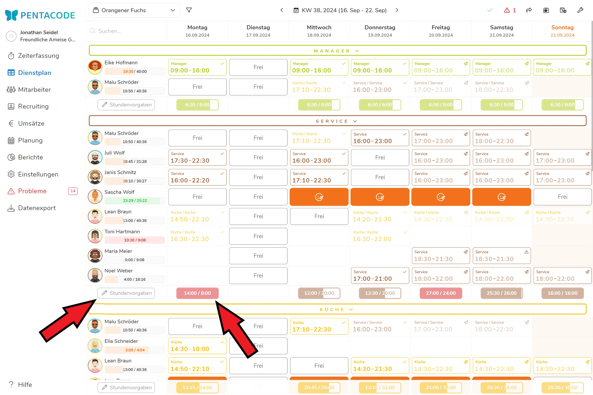
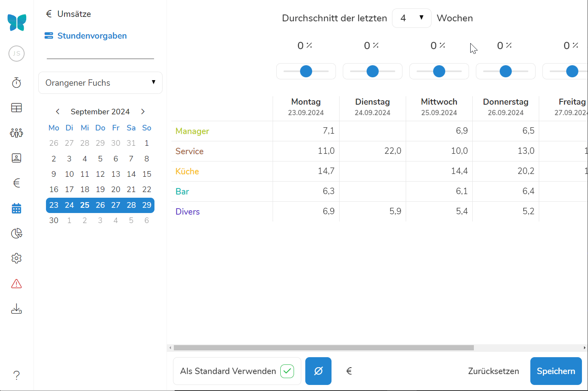
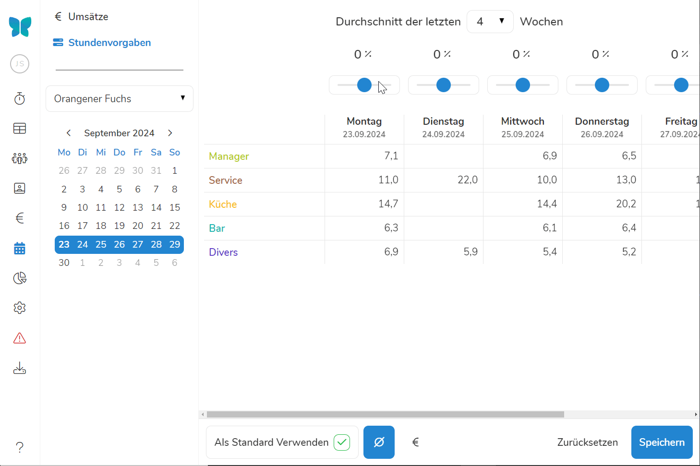
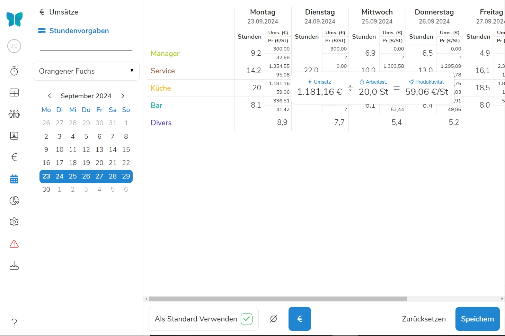

Um die Wirksamkeit der Dienstplanung zu erhöhen (und dadurch die Personalkosten spürbar zu senken), sollten Sie Ihrem Dienstplaner für jede Abteilung Stundenvorgaben machen. Navigieren Sie dazu in den Reiter **Planung** und wählen links oben **Stundenvorgaben** aus.

## Stundenvorgaben im Dienstplan

Wenn Sie im Dienstplan [die Stundenvorgaben]\(/handbuch/dienstplan/#planungshilfen) aktiviert haben, wird Ihnen zu jeder Abteilung ein **Fortschrittsbalken** angezeigt. Dieser vergleicht Stundenvorgaben und tatsächlich eingeteilte Schichten. **Überschreiten** die im Dienstplan eingeteilten Schichten das Planungsziel, wird das Feld am jeweiligen Tag in **Rot** gekennzeichnet.

Mit einem Klick auf  werden Sie in den Planungsreiter verwiesen. Von dort können Sie ihr Planungsziel anpassen. 





## Stundenvorgaben aus dem Durchschnitt

Wenn Sie auf das **Ø**-Symbol klicken, erscheint die **durchschnittliche Anzahl der Stunden**, die an den Wochentagen, in der jeweiligen Abteilung tatsächlich angefallen sind. Standardmäßig wird dieser Durchschnitt aus den **letzten 4 Wochen** berechnet - über das Dropdown mittig oben können Sie jedoch jederzeit einen anderen Zeitraum bestimmen.





Die durchschnittlichen Vorgaben sollen Ihrer ersten Orientierung dienen und eine Idee bieten, welche Stundenvorgaben für Ihre Abteilungen realistisch sein könnten. 

## Stundenvorgaben anpassen

Es gibt viele Gründe Ihre Stundenvorgaben abzuändern und damit die Dienstplanung bewusst zu verändern. 

Mit den **Schiebereglern über den Wochentagen** können Sie ihre Stundenvorgaben **prozentual** anpassen. Bei dieser Vorgehensweise werden die Stunden aller Abteilungen gleichmäßig erhöht. 

>  **Beispiel:** Sie betreiben im Sommer einen zusätzlichen Biergarten? Nun könnten Sie erwarten, dass Sie bis zu 30% mehr Personal in allen Abteilungen brauchen, als der Durchschnitt der letzten Wochen es erwarten lässt. 





>  **Tipp:** Mit den Pfeiltasten auf Ihrer Tastatur können Sie die Prozente bei der Umsatzplanung genauer anpassen!

Sie können die Stundenvorgaben auch **direkt überschreiben**. Klicken Sie dazu in das Feld einer Abteilung an einem Wochentag und tragen die gewünschte Stundenzahl ein, an der sich die Dienstplanung orientieren soll. 

## Als Standard verwenden

Die Stundenangaben beziehen sich immer auf die Woche, in der Sie sich im Moment befinden. Wenn Sie den Haken bei "**Als Standard Verwenden**" setzen, werden diese Vorgaben für alle folgenden Wochen angewendet.

>  **Tipp:** Wenn Sie einen Wert an einem Tag überschreiben, gilt dieser nur für diesen einen Tag. Wenn der neue Wert dauerhaft für kommende Wochen verwendet werden soll, wählen Sie "Als Standard Verwenden" an. Er wird dann dauerhaft auch in Zukunft gelten.

## Stundenvorgaben nach Umsatz-Zielen

Sie können Ihre **Ziele** noch **genauer definieren**, indem Sie die Stundenvorgaben an Ihren [**Umsatzerwartungen**]\(/handbuch/planung/umsatzplanung/) orientieren. Voraussetzung ist dabei, dass Sie bereits eine Umsatzplanung aufgestellt haben.

Durch das Anklicken des **€**-Symbols in der Fußleiste werden Ihren Stundenvorgaben die Planumsätze hinzugefügt und die daraus resultierende **Produktivität** ermittelt. Produktivität ist hier definiert als **Umsatz pro Arbeitsstunde** und wird für jede Abteilung und Tag einzeln berechnet. 

Durch einen Mouse-over über die einzelnen Planungstage wird Ihnen der Rechenweg gezeigt, der zur Feststellung der Produktivität führt.





Im oben gezeigten Beispiel wurde für die Abteilung Küche am Montag ein Umsatz von 1.181 € geplant. Der Stundenaufwand im Standard liegt für diesen Tag bei 20 Arbeitsstunden. Dies würde zu einer Produktivität von 59 €/Std. führen.

Soll z.B eine Produktivität von ca. 80 € / Stunde erreicht werden, muss die Stundenanzahl von 20 auf ca. 16 gekürzt werden. Die von Ihnen auf diese Weise vorgegebene Stundenanzahl erscheint entsprechend im Dienstplan.

Wenn Sie mehr über die Produktivität als Kennzahl in der Planung erfahren möchten - [Hier](/blog/dienstplanung_2/) beschreiben wir, wie wir Pentacode für die Dienstplanung am liebsten verwenden!

