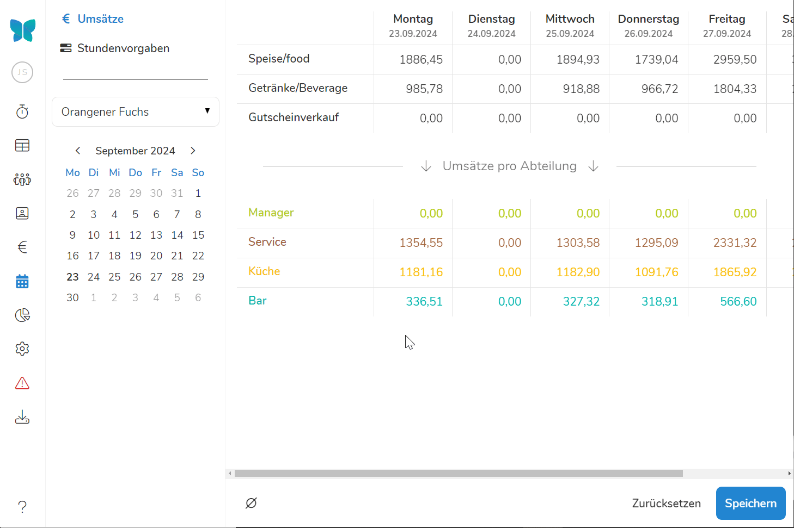
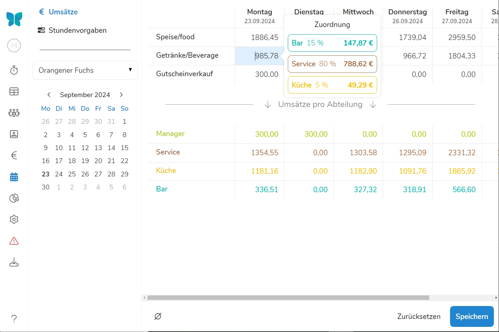

Klicken Sie unter dem Reiter **Planung** auf **Umsätze**, landen Sie in der Umsatzplanung. Diese zeigt Ihnen die **Umsätze**, die Ihr Unternehmen **an den verschiedenen Wochentagen durchschnittlich** erzielt hat und erlaubt Ihnen die Planung zukünftiger Umsätze anhand dieser. Zusätzlich wird durch die Erlöszuordnung gezeigt, welcher Abteilungen, welcher Anteil des Umsatzes zugeschrieben wird. 

 **Voraussetzung** für die Umsatzplanung ist, dass Sie Umsatzgruppen angelegt und diese den Abteilungen zugeordnet haben. Erfahren Sie hierzu mehr unter [**Umsatzgruppen** ]\(/handbuch/umsaetze/umsatzgruppen/)und [**Erlöszuordnung**]\(/handbuch/umsaetze/erloeszuordnung/).

>  Die Umsatzplanung ist nötig, damit Sie bei der [Planung der Stundenvorgaben]\(/handbuch/planung/stundenvorgaben/) die Produktivität ihrer Mitarbeiter als weitere Kenngröße nutzen können!

## Umsätze nach Durchschnitt planen

Zu Beginn der Planung orientieren Sie sich am besten am Durchschnitt der vergangenen Wochen und Monate. Sind diese gut gelaufen und "repräsentativ", haben Sie bereits eine **Orientierungsgröße**, anhand derer Sie Ihren zukünftigen Umsatz planen können.

Klicken Sie auf das **Ø**-Symbol, wird Ihnen der **durchschnittliche Umsatz pro Wochentag** der letzten **4 Wochen** gezeigt. Dieser ist dabei aufgeschlüsselt in Umsatzarten und Abteilungen. 

Über das Dropdown-Menü mittig oben können Sie jederzeit einen anderen Zeitraum bestimmen, anhand dessen der durchschnittliche Umsatz berechnet werden soll. 

## Umsatzplanung anpassen

Wenn Sie Grund dazu haben einen anderen Umsatz zu erwarten, als er aus dem Durchschnitt der letzten Wochen berechnet wird, können Sie ihn einfach anpassen.

Mit den **Schiebereglern über den Wochentagen** können Sie ihre Umsatzerwartung prozentual anpassen. Bei dieser Vorgehensweise werden mit dem Gesamtumsatz sowohl die einzelnen Umsatzarten, als auch die Umsätze der einzelnen Abteilungen im gleichbleibenden Verhältnis zueinander linear erhöht oder herabgesetzt.

>  **Beispiel:** Ihr Betrieb ist im Sommer umsatzstärker? Nun könnten Sie erwarten, dass zu Beginn der Hauptsaison der Durchschnitt der letzten Wochen nicht mehr aktuell ist und um 30% gehoben werden muss. Wenn dann noch die Wochenenden durch einen Biergarten besonders umsatzstark sind, können Sie diese Tage noch mehr heben.





>  **Tipp:** Mit den Pfeiltasten auf Ihrer Tastatur können Sie die Prozente bei der Umsatzplanung genauer anpassen!

Sollten Sie nur mit einem veränderten Umsatz in einzelnen Einnahmequellen rechnen, können Sie auch die Umsatzerwartungen einzelner Umsatzgruppen händisch verändern. 

>  **Beispiel:** Ihr Betrieb hat im Sommer zwar keinen allgemein gesteigerten Umsatz, es kommt aber eine neue Einnahmequelle bspw. aus Gutscheinverkäufen hinzu? Erhöhen Sie händisch den zu erwartenden Umsatz in dieser Umsatzgruppe. 





**Änderungen an der Umsatzplanung aktualisieren automatisch die relativen Umsatzanteile der einzelnen Abteilungen!**

## Umsatz nach Abteilungen

Wenn Sie auf einen Umsatz klicken, erscheint ein Menü, das Ihnen zeigt, in welchem Verhältnis dieser Umsatz auf die Abteilungen verteilt wird. Die Aufteilung wird von Ihnen durch die [**Erlöszuordnung**]\(/handbuch/umsaetze/erloeszuordnung/) bestimmt. 

{% figure caption="Durch Anklicken des Umsatzes sehen Sie dessen Verteilung in % und in €." %}



Unter den Umsätzen finden Sie die **Abteilungen**, denen Sie die Umsätze zugeordnet haben.

Mit **Mouse-over** über den Umsatz einer Abteilung erscheint ein Menü, das Ihnen zeigt wie sich der Umsatz am jeweiligen Wochentag zusammensetzt.

