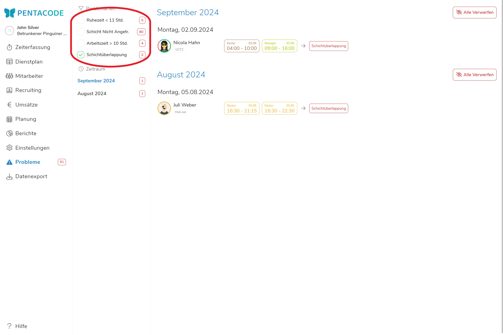
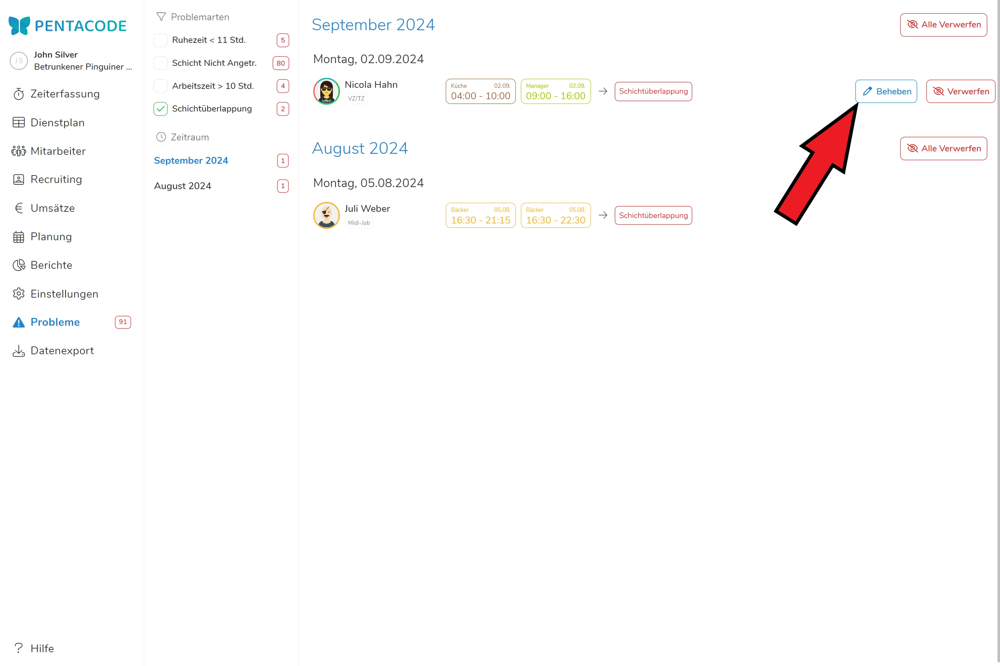

    **"Irren ist menschlich" - und die Fülle gesetzlicher Bestimmungen enorm.**

So gerne wir auch auf Anhieb den perfekten Dienstplan erstellen oder alle
Schichten im Blick haben würden - Fehler schleichen sich immer ein. Besonders
wenn man dabei die diversen **Arbeitsrichtlinien und Vertragsvereinbarungen** im
Blick behalten muss. Die **Problemberichte** in Pentacode helfen Ihnen den
Überblick zu behalten und **Probleme zu vermeiden bevor sie überhaupt
entstehen**.

## Problemarten

Pentacode zeigt Ihnen in der Problemübersicht **acht Arten von
Problemberichten** an. Um diese möglichst schnell beheben zu können, sollten Sie
wissen, wo der Ursprung jedes dieser Probleme liegt. Wie unter [Problem
beheben](#problem-beheben) beschrieben, bringt Sie der  Button immer direkt zum Kern des Problems.  

- **Arbeitszeit >10 Stunden:** Die maximale Arbeitszeit an einem Stück darf nur
  10 Stunden betragen - sollte einem Mitarbeiter eine Schicht zugeteilt werden,
  welche länger dauert, wird dieses Problem angezeigt. Sie müssen die betroffene
  Schicht kürzen, um das Problem zu beheben. 

- **Ruhezeit <11 Stunden:** Zwischen Schichten müssen Angestellte mindestens 11
  Stunden arbeitsfreie Ruhezeit haben. Sollten zwei Schichten zu nah aneinander
  liegen, wird dieses Problem angezeigt. Löschen oder verschieben Sie die
  Schichten so, dass diese 11 Stunden Abstand haben.

  > Die Problemmeldungen 'Arbeitszeit > 10 Stunden' und 'Ruhezeit < 11 Stunden'
  > können auch erscheinen, wenn der Mitarbeiter zu viele Überstunden gestempelt hat. In
  > diesem Fall werden die Problemmeldungen erst nach der Schichtdurchführung angezeigt.

- **Schichtüberlappung:** Sollten zwei Schichten eines Mitarbeiters sich
  zeitlich überlappen wird dieses Problem angezeigt. Da ihr Mitarbeiter sich
  nicht zweiteilen kann, müssen Sie eine der Schichten verschieben oder löschen.

- **Gesetzliche Pause unterschritten:** Jedem Mitarbeiter stehen nach 6 Stunden
  Schicht 30 Minuten und nach 9 Stunden Schicht 45 Minuten Pause zu. Sollte ein
  Mitarbeiter seine Pause nicht gestempelt haben, wird Ihnen dieser
  Problembericht angezeigt. Sie sollten den Mitarbeiter darauf aufmerksam
  machen, seine Pausen zu stempeln.

- **Schicht nicht angetreten:** Sollten Sie die Stempeluhrfunktion von Pentacode
  nutzen, müssen sich Mitarbeiter zum Beginn ihrer Schicht stets einstempeln.
  Sollte dies nicht geschehen wird Ihnen dieser Problembericht angezeigt. Das bedeutet 
  entweder, dass ein Mitarbeiter tatsächlich nicht zu einer Schicht
  angetreten ist oder 'nur' vergessen hat sich anzumelden. Sie sollten allenfalls den
  Ursprung dieses Problems aufklären, um Wiederholungen zu vermeiden. 

- **Schicht nicht ausgestempelt:** Sollte ein Mitarbeiter einstempeln, jedoch
  vergessen wieder auszustempeln, wird Ihnen dieses Problem angezeigt. In den
  [Einstellungen](hilfe/handbuch/einstellungen/zeiterfassung/#automatische-abmeldung)
  können Sie einstellen, ab welcher Länge einer Schicht Pentacode diese als
  'nicht ausgestempelt' erkennt. Auch hier sollten Sie ihren Mitarbeiter darauf
  aufmerksam machen, zukünftig das Ausstempeln zu beachten und **die Länge der
  Schicht korrigieren**.

- **Mindestlohnunterschreitung:** Sollte ein Mitarbeiter auf einen Stundenlohn
  unter dem Mindestlohn fallen, wird Ihnen dieses Problem angezeigt. Dies kann
  passieren, wenn Sie vertraglich einen **monatlichen Lohn** festgelegt haben
  und der Mitarbeiter eine zu hohe Stundenanzahl erreicht. Dieses Problem können
  Sie nur beheben, indem Sie den Arbeitsvertrag des Mitarbeiters aktualisieren
  um Arbeitsstunden und Lohn wieder ins Lot zu bringen.

>  Nach einer **gesetzlichen Erhöhung des Mindestlohns** kann es passieren, dass bei vielen Mitarbeiter die Mindestlohnunterschreitung angezeigt wird. 

- **Überschreitung Lohngrenze:** Sollte ein Mitarbeiter die vertraglich
  festgelegte Lohngrenze überschreiten, wird Ihnen dieses Problem angezeigt.
  Dieser Problembericht ist für **geringfügig Beschäftigte** relevant, für die
  das maximale Gehalt im Monat gedeckelt ist. Sollten Sie dieses Problem haben,
  müssen Sie entweder Stundenlohn oder Arbeitsstunden anpassen, um wieder unter
  die Gehaltsgrenze zu kommen.

## Übersicht nach Monaten

Klicken Sie im Hauptmenü auf den Reiter , um in die Problemübersicht zu gelangen. Sie werden
anschließend eine **chronologische Auflistung** der von Pentacode erkannten
Problemmeldungen erhalten. Dabei werden die neusten Problemberichte ganz oben
angezeigt, beispielsweise von einem gerade erstellten Dienstplan. Sie können
entweder durch scrollen in abgeschlossene Monate gelangen oder den gewünschten Monat
direkt in der linken Leiste auswählen. Eine rot umrahmte Zahl zeigt
Ihnen dabei wie viele Probleme im betroffenen Monat aufgekommen sind. 

<figure>
    
    <figcaption> Wählen Sie den gewünschten Monat in der Liste aus. </figcaption>
</figure>

## Nach Art des Problems filtern

Sie können bestimmen welche der [oben](#verschiedene-arten-von-problemen)
beschriebenen Problemarten Ihnen angezeigt werden, indem Sie diese an- und abwählen. Standardmäßig werden Ihnen alle Probleme angezeigt.

<figure>
    
    <figcaption>Da alle anderen Problemberichte abgewählt sind, werden hier nur **Schichtüberlappungen** angezeigt.</figcaption>
</figure>

## Problem beheben

Pentacode zeigt Ihnen Probleme, damit Sie diese vorzeitig beheben können. Wenn
Sie mit der Maus über einen der Problemberichte fahren, erscheint auf der rechten
Seite der Button . Wenn Sie auf diesen
klicken, bringt Sie Pentacode automatisch zum Ursprung des Problems. 

<figure>
    
    <figcaption> Klicken Sie auf **Beheben**, um dem Ursprung eines Problems auf die Schliche zu kommen. </figcaption>
</figure>

## Problembericht verwerfen

Sollten vergangene Probleme nicht mehr zu lösen oder die **Problemberichte** aus
anderem Grund **nicht mehr relevant** sind, können Sie diese verwerfen, um die **Übersichtlichkeit
zu wahren**. Fahren Sie dazu über einen Problembericht und klicken auf den Button
. Bestätigen Sie anschließend, dass
Sie den Problembericht wirklich verwerfen wollen.
**Das Verwerfen eines Problemberichts löst das Problem nicht! Pentacode zeigt Ihnen das Problem nur nicht mehr an.**

>  **Achtung**: Das Verwerfen von Problemberichten ist nicht rückgängig zu machen!

### Alle Problemberichte verwerfen

Sollten Sie alle Problemberichte eines Monats verwerfen wollen, können Sie dies
in einem Klick tun. Klicken Sie dazu auf den Button  neben einem Monat und bestätigen Sie anschließend die Aktion.
Es werden anschließend alle Problemberichte des ausgewählten Monats verworfen. 

> Der Problembericht von **fehlenden Tagesabrechnungen** kann nicht verworfen
> werden! Da die Tagesabrechnung elementar für eine nachvollziehbare
> Buchführung und das Berichtswesen ist, muss diese immer durchgeführt werden!
