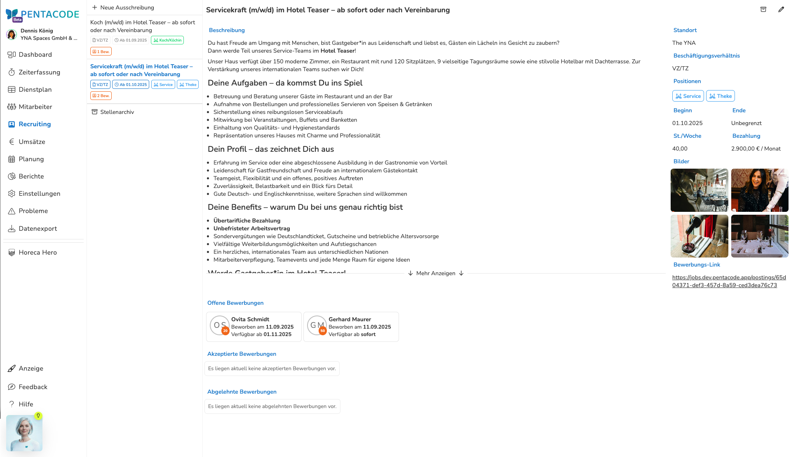
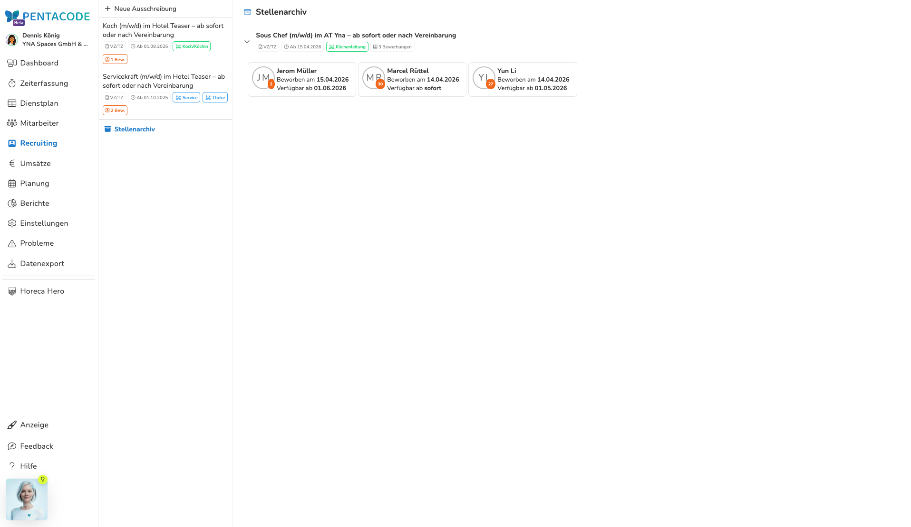
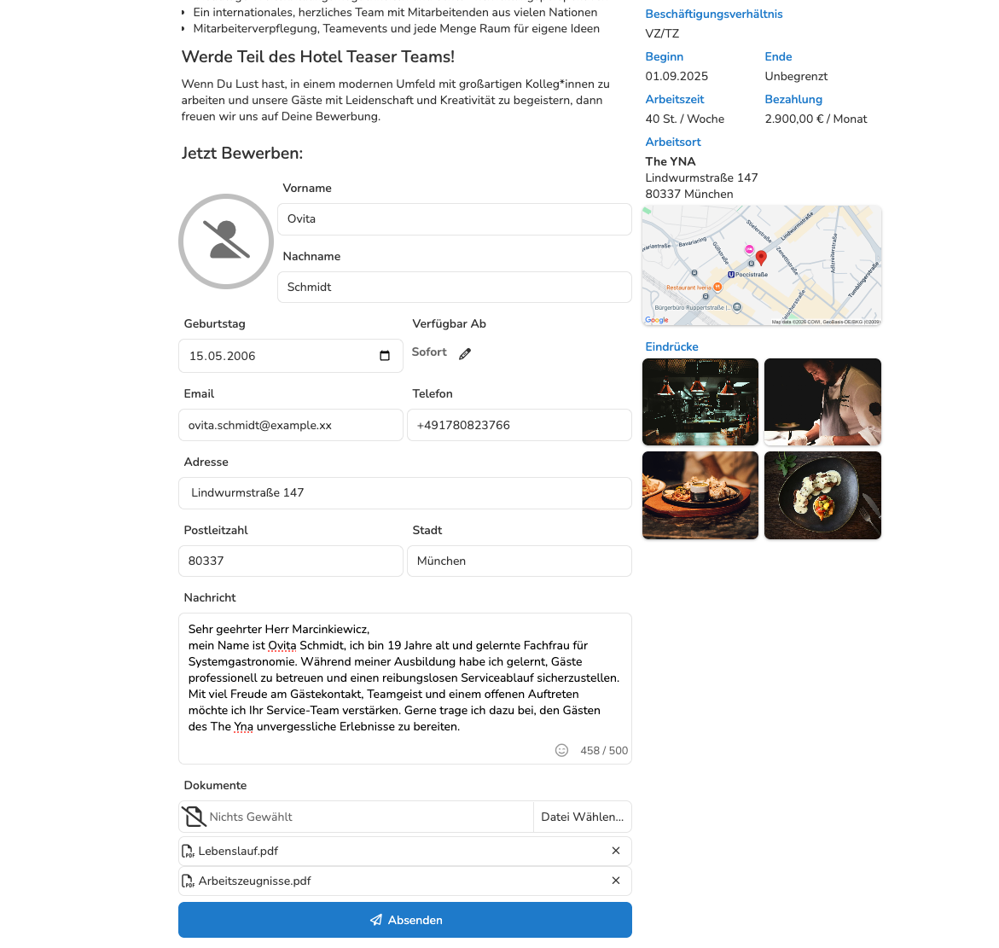
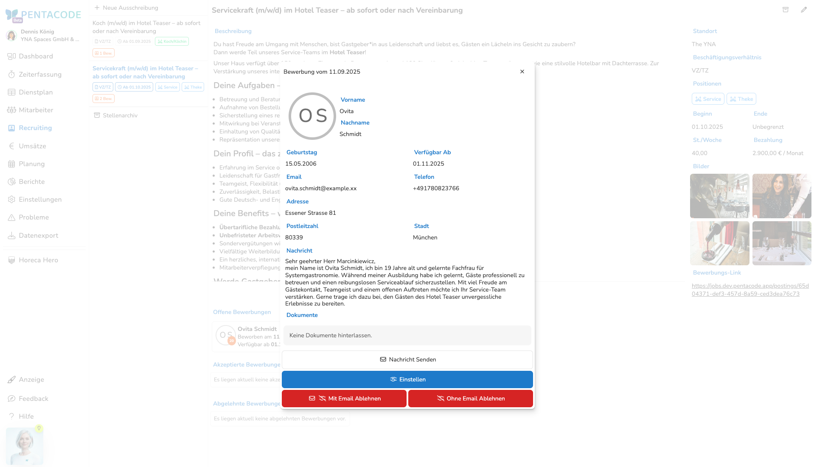

Die Recruiting Funktion hilft Ihnen dabei, Stellen auszuschreiben, Bewerber zu
verwalten und diese auch gleich einzustellen oder abzulehnen. Durch die direkte Integration in
Pentacode wird dabei der Bewerbungsprozess für Sie, als auch für den Bewerber
deutlich vereinfacht.

## Ausschreibungen Verwaltungsansicht

In die Ausschreibungsübersicht gelangen Sie über den Punkt  im Hauptmenü. Hier können Sie
nun auf einen Blick all ihre aktiven **Stellenausschreibungen** einsehen und verwalten.
Links sehen Sie eine Liste mit allen aktiven Stellenausschreibungen, wobei nur der Titel und
die wichtigsten Informationen angezeigt werden. Klicken Sie auf eine der
Ausschreibungen, öffnet sich diese im mittigen Fenster und Sie können den Text,
sowie alle Details der Ausschreibung einsehen.





## Ausschreibung erstellen

So erstellen Sie eine neue Ausschreibung:

1. Klicken Sie auf  über der
   Ausschreibungs-Liste.
2. Es öffnet sich das Formular zum Erstellen einer neuen Ausschreibung, wo Sie
   den Ausschreibungstitel, Beschreibung und verschiedene Konditionen zur Stelle
   angeben können. Zusätzlich können Sie pro Ausschreibung eine individuelle automatische Eingangsbestätigung oder vorbereitete Absage, sowie Bilder hinterlegen.
   Geben Sie die gewünschten Angaben ein und klicken Sie auf
   .

Eine Liste der verfügbaren Felder und deren Beschreibung finden Sie unter
[Felder & Eigenschaften](#felder-%26-eigenschaften).

## Ausschreibung bearbeiten

Nachdem Sie nun erfolgreich eine Ausschreibung erstellt haben, wollen Sie diese
eventuell korrigieren oder abändern. Dies tun Sie wie folgt:

1. Wählen Sie in der
   [Ausschreibungsübersicht](#ausschreibungen-verwaltungsansicht) eine
   Ausschreibung, indem Sie auf den entsprechenden Eintrag in der Liste auf der linken
   Seite klicken.
2. Klicken Sie den -**Button** in der rechten oberen Ecke.
3. Nehmen Sie die gewünschten Änderungen vor und klicken Sie auf .

## Ausschreibung archivieren

Wenn Sie eine Ausschreibung nicht mehr benötigen, etwa weil Sie einen geeigneten
Bewerber gefunden haben, lassen sich diese einfach archivieren. So behalten Sie den Überblick über abgelehnte Bewerbungen:





1. Wählen Sie in der
   [Ausschreibungsübersicht](#ausschreibungen-verwaltungsansicht) eine
   Ausschreibung, indem Sie auf den entsprechenden Eintrag in der Liste auf der linken
   Seite klicken.
2. Klicken Sie den -**Button** im der rechten oberen Ecke.
3. Bestätigen Sie die Aktion durch einen Klick auf .
4. Archivierte Ausschreibungen finden Sie im -**Stellenarchiv** auf der linken Seite unter der [Ausschreibungsübersicht](#ausschreibungen-verwaltungsansicht).
5. Im -**Stellenarchiv** können Sie über einen Klick auf eine archivierte Ausschreibung abgelehnte Bewerbungen erneut einsehen und kontaktieren.

## Felder & Eigenschaften

Eine Stellenausschreibung besteht im Wesentlichen aus einem
[Ausschreibungs-Titel](#titel) und einer frei formatierbaren
[Beschreibung](#beschreibung). Darüber hinaus können Sie verschiedene Details
wie [Arbeitsbeginn und -ende](#beginn-und-ende), [Wochenstunden](#wochenstunden)
und [Bezahlung](#bezahlung) angeben. Diese Angaben sind optional, können aber
potenziellen Bewerbern eine bessere Vorstellung von den Arbeitsbedingungen
geben. Darüber hinaus werden die hier getroffenen Angaben beim
[Einstellen](#bewerber-einstellen) eines Bewerbers direkt übernommen. Es lohnt
sich also, diese Angaben so vollständig wie möglich auszufüllen!

### Titel

Der **Ausschreibungs-Titel** dient als Überschrift sollte die Stelle mit wenigen
Stichworten zusammenfassen. Der Ausschreibungstitel ist auf 100 Zeichen
beschränkt - fassen Sie sich also kurz. Details wie
[Arbeitsbeginn](#beginn-und-ende), [Bezahlung](#bezahlung) etc. können Sie in
die in der Beschreibung oder in den vorgesehenen Feldern eintragen.

### Beschreibung

In dem Feld **Beschreibung** können Sie so viele Details über die
ausgeschriebene Stelle eintragen, wie Sie möchten. Dabei werden Ihnen
verschiedene [Formatierungsoptionen](#formatierungsoptionen) geboten, mit denen
Sie die Anzeige nach Ihren eigenen Wünschen gestalten können.

Nehmen Sie sich die Zeit, eine möglichst ansprechende und informative
Beschreibung zu erfassen. Sie sollte nicht nur auf die Details der Stelle eingehen,
sondern auch vermitteln, was Sie sich von Ihren Bewerbern erwarten und was Ihr
Unternehmen zu einem attraktiven Arbeitsplatz macht!

>  **Tipp:** Erwarten Sie bestimmte Angaben von Ihren
> Bewerbern, so wie etwa vorhandene Qualifikationen oder Berufserfahrung?
> Dann erwähnen Sie dies in der Beschreibung, damit Bewerbe Ihre Fragen direkt
> in der Bewerbung beantworten können!

#### Formatierungsoptionen

Oberhalb des Textfeldes für die Beschreibung der Stelle finden Sie mehrere
Buttons, um den Text zu formatieren und ansprechender zu gestalten. **Blau** dargestellt sind sie **aktiviert**, weiß hingegen deaktiviert.

- Mit dem **H-Button** können Sie **Unterüberschriften** in die Beschreibung
  einbauen - besonders nützlich um Teile der Beschreibung voneinander
  abzugrenzen.
- Mit dem **T-Button** wechseln Sie wieder auf normalen **Fließtext**, nachdem
  Sie eine Unterüberschrift eingefügt haben.
- Mit dem **B-Button** schreiben Sie Text **fett** um bestimmte Wörter oder
  Paragrafen besonders hervorzuheben.
- Mit dem **_I_-Button** schreiben Sie Text **_kursiv_**, damit der Leser ein
  besonderes Augenmerk auf diese Teile wirft.

### Standort

In der Leiste **Standort** können Sie auswählen für welchen Standort ihres
Unternehmens die Stelle ausgeschrieben werden soll. Klicken Sie dazu auf den
kleinen Pfeil und wählen Sie den gewünschten Standort aus.

### Beschäftigungsverhältnis

Hier können Sie die Vertragsart auswählen, die Sie mit dem gesuchten Mitarbeiter
abschließen wollen. Wenn Sie auf den kleinen Pfeil drücken, können Sie zwischen
Festangestellter, Aushilfe, Auszubildender, freier Mitarbeiter und
Saisonarbeiter wählen.

### Positionen

Unter Positionen können Sie auswählen in welcher Position der Angestellte
zukünftig arbeiten soll. Auch hier können Sie über das Drop-down Menü wieder die
gewünschten Positionen auswählen, wobei Sie einer Bewerbung mehrere Positionen
zuschreiben können. Mehr Informationen zum Thema Positionen und Abteilungen
finden Sie unter [Einstellungen/Arbeitsbereiche](../einstellungen/arbeitsbereiche/).

### Beginn und Ende

Bei Beginn können Sie den gewünschten **Anfang** des Arbeitsverhältnisses
angeben. Sollten Sie diese Stelle **ab sofort** füllen wollen, lassen Sie das
Textfeld einfach frei. Unter Ende können Sie zudem die Befristung des
Arbeitsverhältnisses angeben. Sollten Sie die Stelle **unbefristet**
ausschreiben wollen, lassen Sie auch dieses Feld frei.

### Wochenstunden

Hier können Sie angeben, wie viele Stunden der Mitarbeiter voraussichtlich
wöchentlich arbeiten wird.

### Bezahlung

Unter **St. / Woche** können Sie die geplanten Wochenstunden für diese Stelle
angeben. Während Sie unter **Bezahlung** den veranschlagten Lohn angeben. Geben
Sie dazu in das Textfeld, welches standardmäßig mit dem Mindestlohn gefüllt ist,
die gewünschte Entlohnung ein. Rechts davon können Sie nun entscheiden, ob dieser
Betrag **pro Stunde** oder **monatlich** ausgezahlt wird.

>  **Keine Panik:** Alle in der Ausschreibung
> spezifizierten Details können **nachträglich** noch bearbeitet werden. Sie
> dienen lediglich der ersten Information der Bewerber und dem schnellen
> Einstellen in Pentacode.

### Bilder

Bilder sagen mehr als tausende Worte! Visuelle Eindrücke können Sie ihre
Ausschreibung noch attraktiver gestalten und Bewerbern ein besseres Gefühl für
Ihr künftiges Arbeitsumfeld geben. Sie können bis zu 4 Bilder hochladen, wobei
das erste Bild als Titelbild für das veröffentlichte
[Bewerbungsformular](#das-bewerbungsformular) dient. Das Anhängen von Bildern
ist optional, aber wir empfehlen mindestens ein Bild zu Ausschreibung
hinzuzufügen, da dies die Anzeige visuell deutlich ansprechender macht.

So fügen Sie Ihrer Ausschreibung ein Bild hinzu:

1. Klicken Sie auf den  **Button** unter **Bilder**.
2. Wählen Sie die gewünschte Bilddatei von Ihrer Festplatte durch einen Doppelklick.

> **Achtung**  Achten Sie darauf während des Erstellens
> einer Ausschreibung nicht das **Recruiting** Fenster zu verlassen, da sonst
> die nicht gespeicherte Stelle gelöscht wird.

### Eingangsbestätigung

Passend zu Ihrer Stellenausschreibung können Sie eine Eingangsbestätigung hinterlegen. So werden Bewerber automatisch mit einer zur Ausschreibung passenden und von Ihnen definierten Mail über den Bewerbungseingang informiert. Zudem können Sie eine gesonderte Mailadresse hinterlegen, an die sich Bewerber bei Fragen wenden können.

1. Klicken Sie auf den  **Button** unter **Eingangsbestätigung**.
2. Hinterlegen Sie einen Titel und passenden Text für die automatische Eingangsbestätigung.
3. Klicken Sie auf .

### Automatische Absage

Nicht jede Bewerbung erfüllt Ihre Erwartungen oder Anforderungen. Damit Sie nicht jedesmal einen neue Absagemail formulieren müssen, können Sie eine auf die Ausschreibung angepasste Absage vorformulieren und bei Absage einer Bewerbung direkt an den Bewerber senden.

1. Klicken Sie auf den  **Button** unter **Automatische Absage**.
2. Hinterlegen Sie einen Titel und passenden Text für die Absage.
3. Klicken Sie auf .

## Bewerbungsprozess

Nachdem Sie eine Ausschreibung [erstellt](#ausschreibung-erstellen) haben, geht
es nun darum die Stelle zu veröffentlichen und die Bewerber zu verwalten. Dazu
bietet ihnen Pentacode praktische Link zum Publizieren der Ausschreibung, ein
eigenes Bewerbungsformular und eine Funktion zum Einstellen auf Probe.

### Bewerbungslink teilen

Sobald Sie eine Ausschreibung erstellt haben generiert Pentacode automatisch
einen Bewerbungslink. Über diesen können sich potenzielle Bewerber die Stelle
anschauen und sich bei Interesse gleich bewerben. Sie können den Link sehen,
indem sie in der Ausschreibungsübersicht eine Ausschreibung auswählen. Nun wird
in der rechten unteren Ecke unter **Bewerbungs-Link** der Link angezeigt. Mit einem
Rechtsklick und der Option _Adresse des Links kopieren_ können Sie diesen
zwischenspeichern und mit der Tastenkombination  + 
nun beliebig einfügen.

>  **Tipp:** Posten Sie den Bewerbungslink am Ende ihrer
> Ausschreibungen auf ihrem Social-Media Kanälen, Jobbörsen oder per QR-Code
> direkt in ihrem Betrieb. **Pentacode macht den Rest - den Link müssen Sie aber
> noch selbst publizieren**.

### Das Bewerbungsformular

Nachdem ein interessierter Bewerber auf ihre Ausschreibung gestoßen ist und den
Bewerbungslink angeklickt oder eingescannt hat, gelangt er in die
Bewerberansicht. Hier sieht er zum einen Titel, Inhalt und Details der Stelle,
zum anderen kann er sich über ein Formular direkt bewerben. In diesem Formular
wird er gebeten seine Daten anzugeben - darunter zählen Vor- und Nachnamen,
Geburtsdatum, Email Adresse, Telefonnummer, Verfügbarkeit und Wohnadresse. Zudem
kann er einen kurzen Text und weitere Bewerbungsunterlagen wie z.B. einen Lebenslauf oder Arbeitszeugnisse hochladen, um diese der Bewerbung beizufügen. Mit einem
Klick auf  landet die Bewerbung nun direkt in ihrem
Pentacode Verwaltungszugang.





### Bewerber einsehen

Nachdem Sie den [Bewerbungslink](#bewerbungslink-teilen) publiziert haben,
sollten Sie schnell die ersten Bewerbungen erhalten. Diese finden Sie in
der entsprechenden Ausschreibung unterhalb der Beschreibung, wo Sie
Namen, Alter, die Verfügbarkeit Anschreiben und Bewerbungsunterlagen des
Mitarbeiters sehen. Klicken Sie auf einen Bewerber, um dessen Detailansicht zu öffnen.





### Bewerber einstellen

Sie haben den perfekten Bewerber gefunden? Dann ist es an der Zeit, diesen in
Pentacode als Mitarbeiter anzulegen! Dazu öffnen Sie einfach die
[Detailansicht](#bewerber-einsehen) des Bewerbers und klicken auf .

Es öffnet sich nun der Dialog zum [Erstellen eines neuen
Mitarbeiters](../mitarbeiter/allgemein/#neuen-mitarbeiter-anlegen), wo alle
verfügbaren Daten des Bewerbers (Namen und Adresse, Email, Telefon etc.) so wie
die Beschäftigungsdetails aus der Ausschreibung (Positionen, Wochenstunden etc.)
bereits ausgefüllt sind. In der Bewerbung enthaltene Dokumente werden direkt in die [Digitale Personalakte](../mitarbeiter/dokumente/index.md#dokumentenübersicht) übernommen Sie müssen also nur noch die fehlenden Daten nachtragen
und der Mitarbeiter ist im Handumdrehen angelegt!

>  **Tipp:** In vielen Fällen möchten Sie den Kandidaten
> vermutlich erst zu einem Probearbeitstag einladen, bevor Sie ihn endgültig
> einstellen. Hierfür können Sie die Funktion [Mitarbeiter auf
> Probe](../mitarbeiter/allgemein/#mitarbeiter-auf-probe) perfekt geeignet!

### Bewerber ablehnen

Nicht jeder Bewerber ist für die ausgeschriebene Stelle geeignet. Um ungeeignete
Kandidaten auszusortieren, öffnen Sie einfach deren [Detailansicht](#bewerber-einsehen)
und klicken Sie auf  um die hinterlegte automatische Absagemail zu versenden oder auf  um die Bewerbung ohne Antwort abzulehnen.
Die Bewerbung wird dann unter **Abgelehnte Bewerbungen** angezeigt.

>  **Tipp:** Abgelehnte Bewerber können Sie unter **Abgelehnte Bewerbungen** der aktiven Stellenanzeige oder im [Stellenarchiv] weiterhin einsehen.
