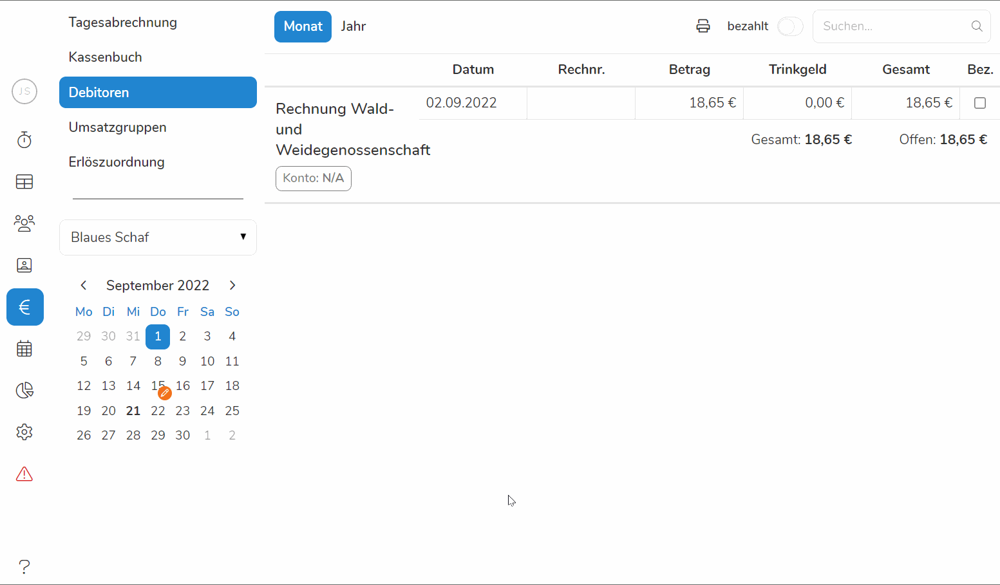

Besonders bei großen Aufträgen ist ein "auf Rechnung" zahlen in vielen Betrieben
nicht unüblich. Unter dem Reiter **Debitoren** führt Pentacode eine Auflistung
aller Rechnungen, welche über die
[Tagesabrechnung](hilfe/handbuch/umsaetze/tagesabrechnung/index) gebucht wurden.
So können Sie stets nachvollziehen wie es um ihre Schuldner steht und welche
Rechnungen noch zu begleichen sind. 

## Übersicht

Sobald Sie den Reiter **Debitoren** auswählen, erscheint eine Liste der Rechnungen. Hier sind alle Daten mit angegeben, welche in der
Tagesabrechnung angegeben wurden. Darunter Name des Schuldners, Konto, Datum,
Betrag sowie Trinkgeld und der offene Restbetrag. 





## Debitoren filtern

Sie können die Liste der Debitoren auf verschiedene Weise filtern:

-  **Nach Namen** - Klicken Sie dazu in das **Suchen... Dialogfeld** in der
   oberen rechten Ecke und geben den Namen des gesuchten Debitors ein.
-  **Rechnungsdatum** - Sie können nach spezifischen Jahren oder
   Monaten filtern. Wählen Sie dazu erst die Zeitspanne aus, indem Sie in der
   oberen rechten Ecke auf **Monat** oder **Jahr** klicken. Nun können Sie
   spezifizieren nach welchem Monat oder Jahr Sie suchen, indem Sie links im
   Kalender einen Monat aussuchen. Wenn Sie zuvor "Jahr" ausgewählt haben,
   werden alle Debitoren des kompletten Jahres angezeigt.
-  **bezahlt und unbezahlt** - normalerweise werden Ihnen nur unbeglichene
   Rechnungen angezeigt, wollen Sie jedoch auch die bezahlten mit
   einsehen, klicken Sie auf den Regler  in der oberen rechten Ecke
   neben dem Suchen... Dialogfeld





### Rechnung als bezahlt markieren

Sobald ein Debitor eine Rechnung beglichen hat, markieren Sie diese als bezahlt.
Suchen Sie dazu einfach mit der Filteroption den Debitor und markieren die Rechnung
als **bezahlt**, indem Sie auf das **Kästchen auf der rechten Seite** klicken. Der
Betrag der Rechnung wird anschließend vom offenen Schuldenkonto des Debitors
abgezogen. 