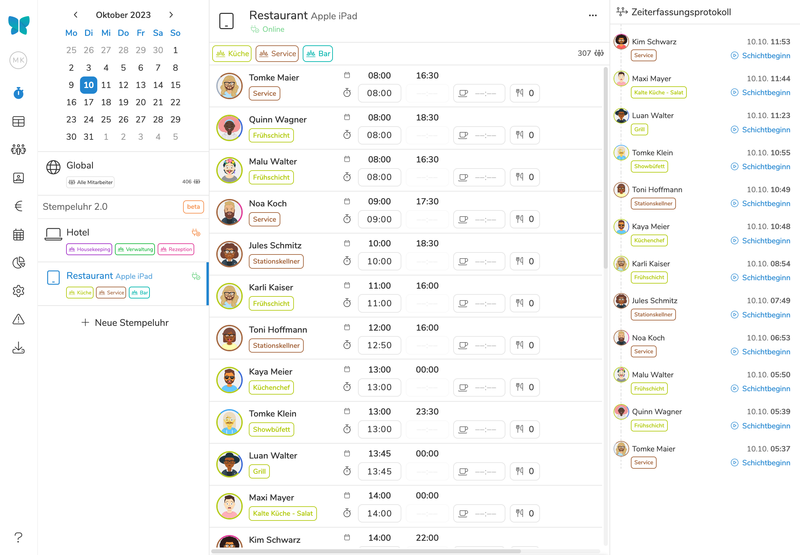
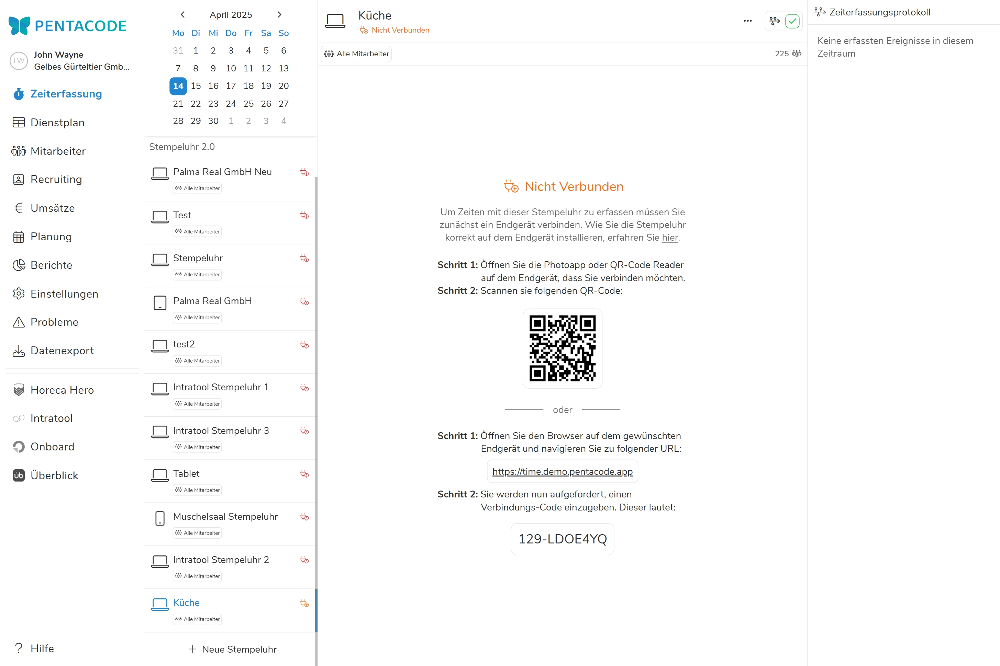
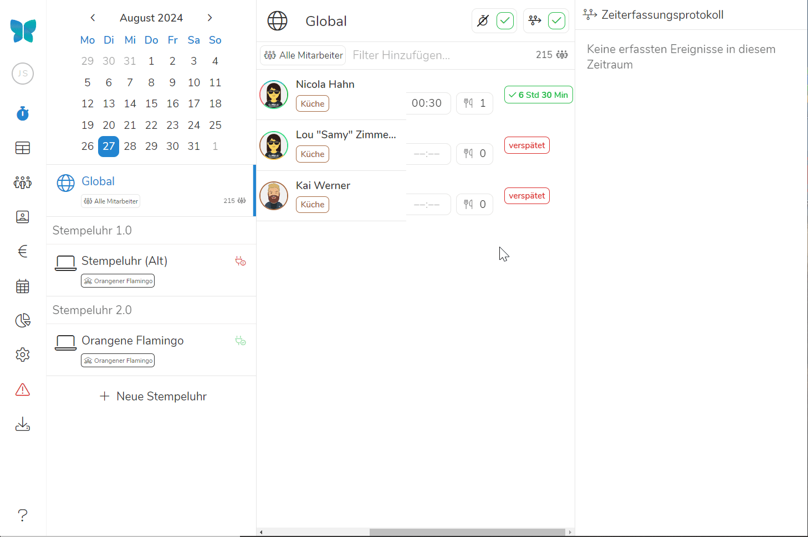

Das Erfassen von Arbeitszeiten ist in vielen Betrieben nicht nur eine der wichtigsten, sondern auch eine der zeitraubendsten und fehleranfälligsten Aufgaben im Bereich Personalmanagement. Aber keine Sorge - mit Pentacode wird diese Arbeit fast schon zum Selbstläufer! Es stehen Ihnen drei grundlegende Arten der Zeiterfassung zu Verfügung:

- **Digitale Stempeluhr:** Ihre Mitarbeiter erfassen ihre Zeiten selbstständig über eine [digitale Stempeluhr](/stempeluhr/), die als Webapp auf jedes beliebige Tablet, Smartphone oder Desktopgerät geladen werden kann und am Arbeitsplatz zur Verfügung gestellt wird. Die Mitarbeiter können sich dann vor Ort per individueller Zeiterfassungs-PIN zur Arbeit an- und abmelden, sowie Pausen und Mitarbeiteressen erfassen.
- **Mitarbeiter-App:** Als Alternative zur Stempeluhr vor Ort können Mitarbeiter ihre Zeiten auch direkt über ihr eigenes Smartphone, Tablet oder Desktopcomputer erfassen. Dies ist vor allem für die Arbeit im Homeoffice oder bei ständig wechselnden Arbeitsorten hilfreich! Mehr zum Thema [Zeiterfassung über die Mitarbeiter-App]\(/handbuch/mitarbeiter-app/#zeiterfassung) können Sie im entsprechenden Hilfeartikel nachlesen.
- **Manuelle Erfassung:** Zu guter Letzt bleibt Ihnen selbstverständlich immer noch die manuelle Erfassung von Arbeitszeiten. Das manuelle Bearbeiten oder Nachtragen von Zeiten ist vor allem dann hilfreich, wenn ein Mitarbeiter vergessen hat, sich an- oder abzumelden. In manchen Betrieben kann aber auch eine vollständig manuelle Zeiterfassung ausreichen (zum Beispiel bei Vertrauensarbeitszeit). Zeiten manuell bearbeiten, können Sie direkt im [Zeiterfassungs-Dashboard](#zeiten-erfassen-und-bearbeiten) und im [Arbeitszeitblatt]\(/handbuch/mitarbeiter/arbeitszeiten/) des Mitarbeiters.

## Das Zeiterfassungs-Dashboard

Unter dem Hauptmenüpunkt  finden Sie das **Zeiterfassungs-Dashboard**. Hier haben Sie immer einen Überblick über alle geplanten und erfassten Arbeitszeiten. Außerdem können Sie hier Stempeluhren einrichten und verwalten, deren Verbindungsstatus überwachen und das Zeiterfassungs-Ereignisprotokoll einsehen. 

<figure>

<figcaption>Mit dem Zeiterfassungs-Dashboard haben Sie immer einen Überblick über alle geplanten und erfassten Arbeitszeiten.</figcaption>
</figure>

## Stempeluhren Verwalten

Die [digitale Stempeluhr](/stempeluhr/) ist eine Webapp, die auf jedes beliebige Tablet, Smartphone oder Desktopgerät geladen werden kann. Das eingerichtete Endgerät steht dann am Arbeitsplatz zur selbstständigen Erfassung von Arbeitszeiten, Pausen und Mahlzeiten zur Verfügung.

Je nach Bedarf können Sie eine einzelne Stempeluhr für Ihren gesamten Betrieb oder mehrere Stempeluhren für Ihre verschiedenen Standorte oder Abteilungen verwenden. 

>  **Info:** Der Verbindungscode der Stempeluhr **ändert sich mit jedem erfolgreich eingeloggten Gerät** - wollen Sie ein weiteres Gerät als Stempeluhr verbinden, müssen Sie den aktualisierten Verbindungscode unter **Stempeluhr Bearbeiten** einsehen!

### Stempeluhr Einrichten

Bevor Sie die Stempeluhr auf einem Endgerät nutzen können, muss diese erst eingerichtet werden. Das ist mit einigen wenigen Schritten erledigt:

1. Klicken Sie den Button  auf der linken Seite.
2. Es öffnet sich ein Eingabeformular, in dem Sie den Namen des Tablets, sowie Arbeitsbereiche und verschiedene Funktionen bestimmen können. Die einzige Pflichtangabe ist das Namensfeld. Mehr Informationen zu den restlichen Feldern finden Sie unter [Stempeluhr Bearbeiten](#stempeluhr-bearbeiten). Klicken Sie abschließend auf .
3. Die neu angelegte Stempeluhr sollte nun in der Liste auf der linken Seite angezeigt werden. Auf der rechten Seite sehen Sie die Anweisungen, um die Einrichtung der Stempeluhr abzuschließen.

<figure>

<figcaption>Die digitale Stempeluhr ist in wenigen Schritten eingerichtet und innerhalb von Sekunden einsetzbar.</figcaption>
</figure>

### Stempeluhr Bearbeiten

Bereits angelegte Stempeluhren können selbstverständlich auch im Nachhinein noch bearbeitet werden. Dies tun Sie wie folgt:

1. Navigieren Sie zum [Zeiterfassungs-Dashboard](#das-zeiterfassungs-dashboard)
2. Wählen Sie die Stempeluhr durch einen Klick aus der Liste aus.
3. Klicken Sie den  Button in der rechten oberen Ecke und wählen Sie .
4. Nehmen Sie die gewünschten Änderungen an Namen, [Arbeitsbereichen](#arbeitsbereiche) und [Funktionen](#funktionen) vor. Um die Änderungen zu übernehmen, klicken Sie den  Button.

>  **Info:** Unter **Stempeluhr Bearbeiten** können Sie auch den **Verbindungscode** erneut einsehen - dieser wird automatisch erstellt.

#### Arbeitsbereiche

**Hier können Sie einschränken, in welchen Arbeitsbereichen die Stempeluhr eingesetzt werden soll.** Wenn hier nichts gewählt wird, kann die Stempeluhr für das gesamte Unternehmen genutzt werden. Wählen Sie eine oder mehrere Abteilungen oder Standorte, um die Erfassung von Arbeitszeiten nur in den ausgewählten Arbeitsbereichen zuzulassen.

#### Funktionen

Hier können Sie verschiedene Einstellungen vornehmen, um Funktionen und Anzeige der Stempeluhr am Endgerät anzupassen.

- **Dienstplan:** Wählen Sie diese Option, um **das Anzeigen des Dienstplans** zu erlauben. Es erscheint dann ein  Button, mit dem der Dienstplan aufgerufen werden kann. Die Anzeige des Dienstplans ist auf die in den Einstellungen der Stempeluhr gewählten [Arbeitsbereiche](#arbeitsbereiche) eingeschränkt.

- **Ausstehende Schichten:** Die Option ausstehende Schichten bestimmt, ob **geplante Schichten auf der Stempeluhr angezeigt** werden sollen. Deaktivieren Sie diese Funktion, falls Sie nicht wollen, dass man das geplante Personal des Tages und Verspätungen sehen kann.

- **Aktive Schichten:** Die Option aktive Schichten bestimmt, ob **aktive Schichten auf der Stempeluhr angezeigt** werden sollen. Deaktivieren Sie diese Funktion, falls Sie nicht wollen, dass man einsehen kann, wer seine Schicht bereits angetreten hat. 

### Stempeluhr Löschen

Das Löschen von Stempeluhren ist genauso einfach, wie das Erstellen:

1. Navigieren Sie zum [Zeiterfassungs-Dashboard](#das-zeiterfassungs-dashboard)
2. Wählen Sie die Stempeluhr durch einen Klick aus der Liste auf der linken Seite.
3. Klicken Sie den  Button in der rechten oberen Ecke und wählen Sie .

> ** Achtung:** Durch das Löschen der Stempeluhr im Zeiterfassungs-Dashboard wird das verbundene Endgerät automatisch getrennt und es sind keine Arbeitszeiten mehr darüber erfassbar! Aber keine Sorge: Es werden weder Arbeitszeiten noch Zeiterfassungsereignisse gelöscht.

## Zeiten Erfassen und Bearbeiten

Selbst wenn Ihre Mitarbeiter Arbeitszeiten in der Regel selbstständig über die digitale Stempeluhr oder Mitarbeiterapp erfassen, ist ein gelegentliches manuelles Eingreifen leider oft nicht vermeidbar, zum Beispiel wenn Mitarbeiter sich vergessen, ein- oder auszustempeln. Kein Problem: Über das Zeiterfassungs-Dashboard können Sie Arbeitszeiten, Pausen und Mitarbeiteressen ganz einfach nachtragen oder bearbeiten. Der Prozess ist im Wesentlichen der gleiche wie im [Arbeitszeitblatt]\(/handbuch/mitarbeiter/arbeitszeiten/#arbeitszeit-bearbeiten). 

<figure>

<figcaption>Arbeitszeiten können mit wenigen Klicks nachgetragen werden.</figcaption>
</figure>

## Das Zeiterfassungsprotokoll

Beim Öffnen des Dashboards sehen Sie auf der rechten Seite das Zeiterfassungsprotokoll. Hier können Sie genau nachvollziehen, wer wann Zeiten gestempelt oder Pausen erfasst hat. Darüber hinaus können Sie sich weiter Informationen anzeigen lassen, wie etwa vom Mitarbeiter hinterlassene Nachrichten, das "Beweisfoto" (falls eingestellt) und den Standort zu Zeitpunkt des Ereignisses.