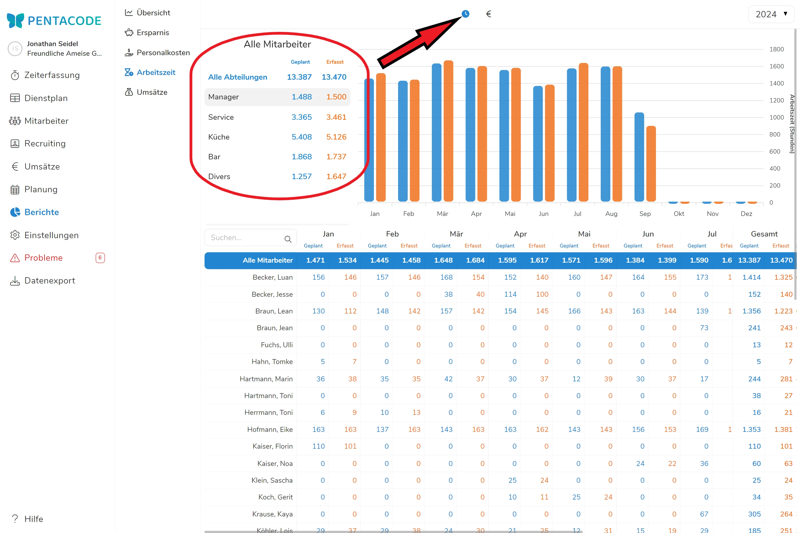
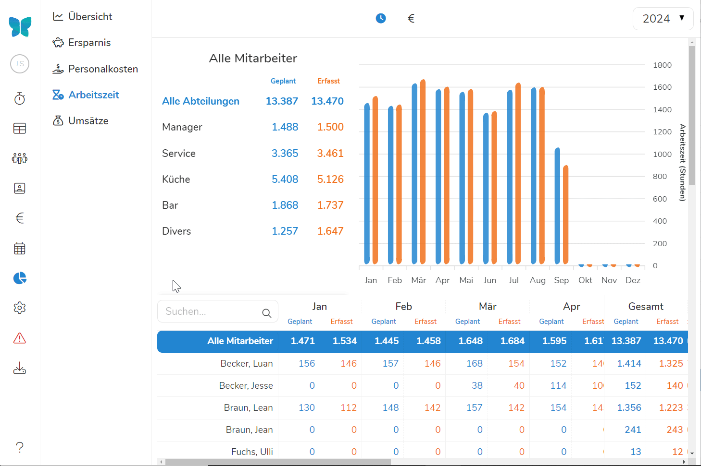
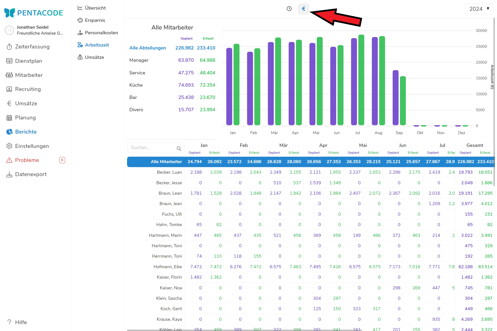
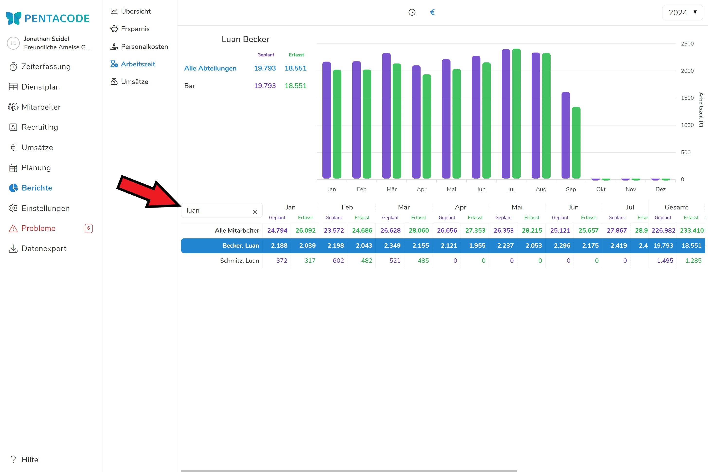

Im **Dienstplan** von Pentacode haben Sie die Möglichkeit, die **geplanten** Arbeitszeiten mit den tatsächlich **geleisteten** Arbeitszeiten **täglich** zu vergleichen. Unter "**Berichte**" werden die Arbeitszeiten **monatlich** zum Vergleich zusammengefasst.

In die Zusammenfassung fließen ausschließlich **abgeschlossene** Arbeitstage ein. Geplante Arbeitszeiten werden hierbei **nicht** berücksichtigt.

## Stundenangabe

Wenn Sie den Bericht öffnen, sehen Sie in der Standardeinstellung die Arbeitszeiten in **Stundenangabe**. In einem Balkendiagramm werden die geplanten Arbeitszeiten in blau den tatsächlich geleisteten Arbeitszeiten in orange gegenübergestellt. 

Zusätzlich werden neben dem Balkendiagramm in zwei Kolonnen geplante und geleistete Arbeitszeiten **für das gesamte Jahr** getrennt nach Abteilung und in Zahlen dargestellt.





>  **Tipp:** Wenn Sie mit der Mouse über die Balken eines Monats fahren, können Sie die genauen Angaben der geplanten und geleisteten Stunden sehen.

### Berichte einzelner Abteilungen

Durch Anklicken einer **Abteilung** wird die Grafik neu berechnet und stellt die Arbeitszeiten der gewählten Abteilung zur Ansicht





>  **Tipp:** Mit der Betrachtung einzelner Abteilungen können Sie sehen, ob es große Differenzen zwischen geplanter und durchgeführter Arbeitszeit gibt. Ob "Ausreißer" an einzelnen Tagen oder eher durchgängig stattfanden, lässt sich durch einen Blick auf die [**Plan-Ist-Vergleich**](/hilfe/handbuch/dienstplan/plan-ist-vergleich/) im Dienstplan des entsprechenden Zeitraums erkennen

## Lohnangabe

Indem Sie auf das **€-Symbol** in der Kopfzeile klicken, werden die Arbeitsstunden mitarbeitergenau in **Geldwert** umgerechnet. Wie in allen anderen Bereichen handelt es sich auch bei diesen Angaben um Gesamtlohn-Angaben, welche die Arbeitgeberanteile beinhalten.





Wie bei den Stundenangaben erhalten Sie durch Anklicken eine Darstellung einzelner Abteilungen.

## Einzelne Mitarbeiter

Um **einzelne Mitarbeiter** auswählen, geben Sie einfach den Namen in das **Suchfeld** ein. Durch die Verschlagwortung reichen meist wenige Anfangsbuchstaben, um nach dem gewünschten Mitarbeiter zu filtern.





## Zeitraum wählen

Der in diesen Grafiken angezeigte Zeitraum ist immer das **Kalenderjahr**. Beim Öffnen des Berichts sehen Sie in der Standardeinstellung das **laufende Jahr**. 

Zurückliegende Zeiträume können Sie über das Dropdown-Menü in der rechten oberen Ecke auswählen. 

