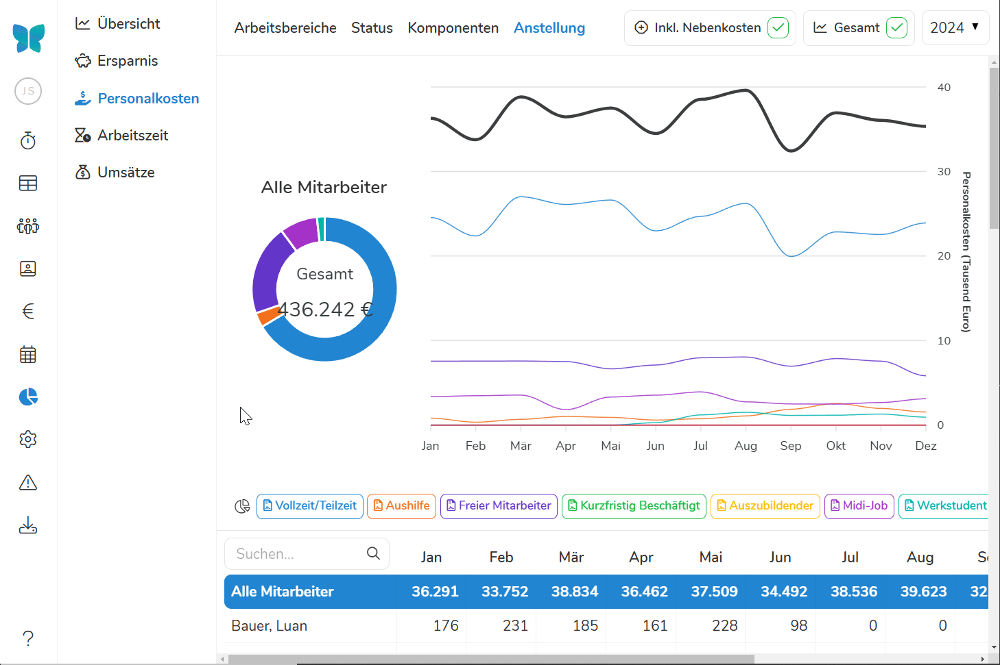

Der Menüpunkt "**Personalkosten**" zeigt Ihnen grafisch Ihrer Aufwendungen für Lohn und Gehalt in **Summe** und in der **Zusammensetzung**. Die Lohnkosten beinhalten die **Arbeitgeberbeiträge** zur Sozialversicherung, nicht jedoch die Umlagen U1 und U2 und die Beiträge zur Berufsgenossenschaft.

## Ansicht

Sie können als Ansicht zwischen "**Status**", "**Anstellung**" und "**Abteilung**" wählen.

"Status" zeigt die Lohnkosten in ihrer Zusammensetzung, "Anstellung" die Verteilung der Lohnkosten nach [Beschäftigungsverhältnis](/hilfe/handbuch/mitarbeiter/vertrag/) und "Abteilung" die Verteilung der Lohnkosten auf die Abteilungen in Ihrem Unternehmen.





## Jahres-Summe

Die "Tortengrafik" zeigt die während des Jahres fortlaufend **auflaufende Jahreslohn-Summe**. Ein "Mouse over" über die farbig abgesetzten Tortenstücke zeigt Ihnen die Summe der einzelnen [**Lohnarten**](/hilfe/handbuch/einstellungen/buchhaltung/), die Sie in Pentacode angelegt haben.





## Monats-Summen

In dieser Grafik werden die verschiedenen Lohnarten in ihrem **Jahresverlauf** mit eigenen Werten für jeden Monat gezeigt. Durch "Mouse over" erfahren Sie die Zusammensetzung in €-Beträgen.





## Einzelne Mitarbeiter

In der Standardeinstellung werden immer die Lohnkosten für **alle** Mitarbeiter gezeigt.

Unter dem Graphen wird Ihnen eine Liste aller Mitarbeiter und ihrer individuellen Lohnkosten angezeigt. Durch Anklicken eines einzelnen Mitarbeiters erhalten Sie nur die Darstellung seiner Lohnkosten als Graphen. Wenn Sie einen bestimmten Mitarbeiter suchen, können Sie zudem dessen Namen in die Suchleiste über der Mitarbeiterliste eingeben. 

