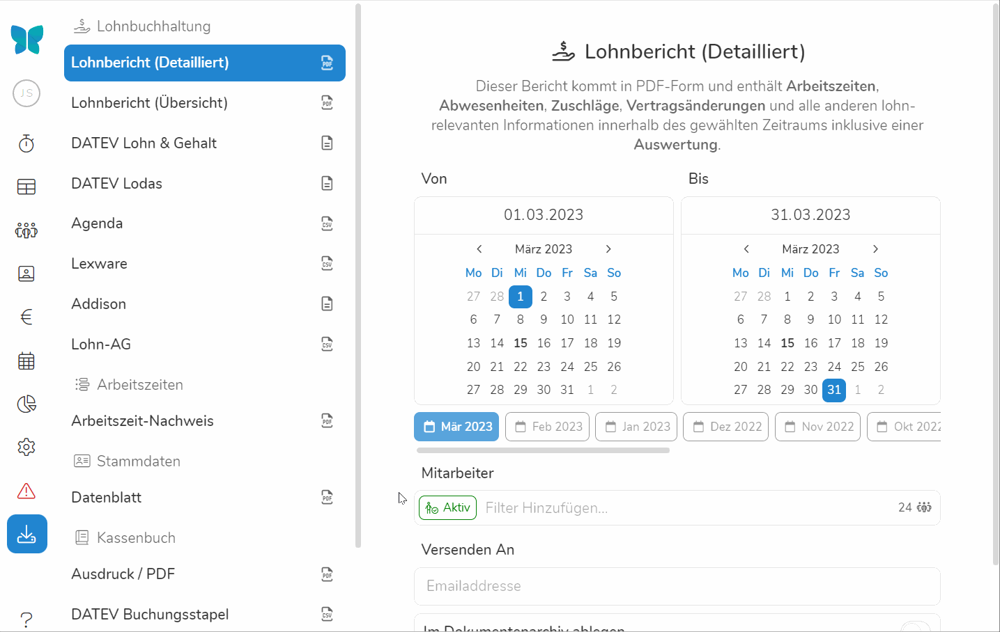
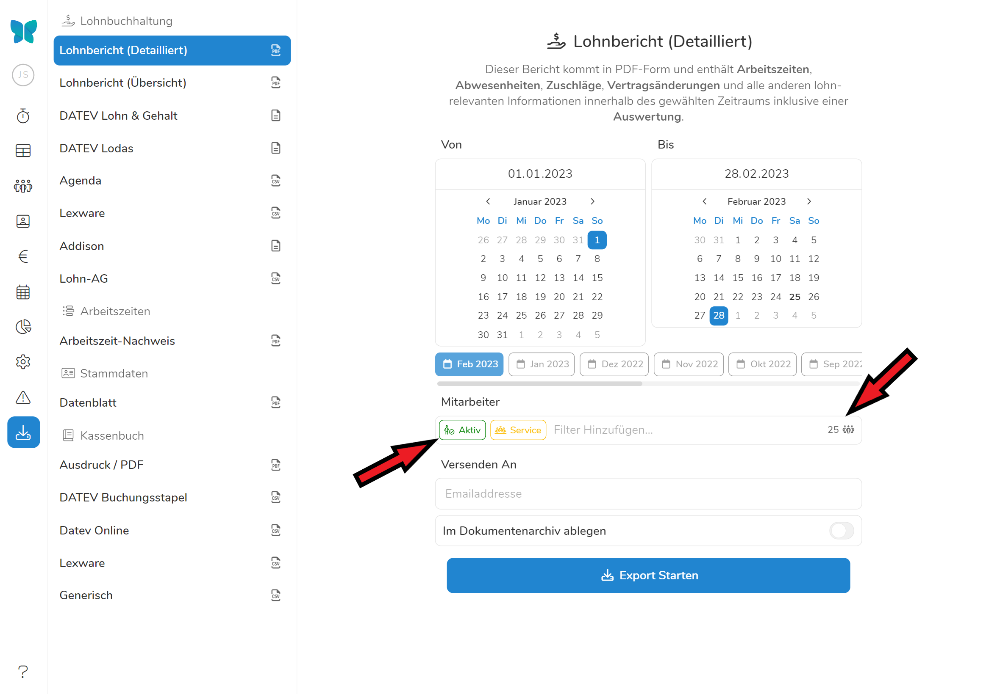
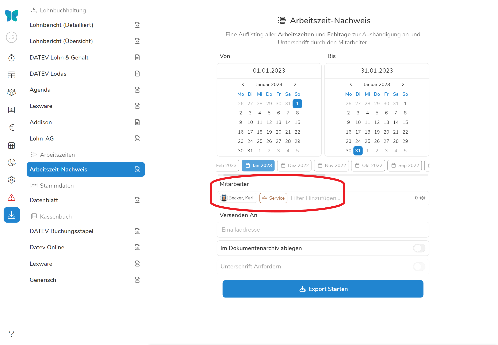
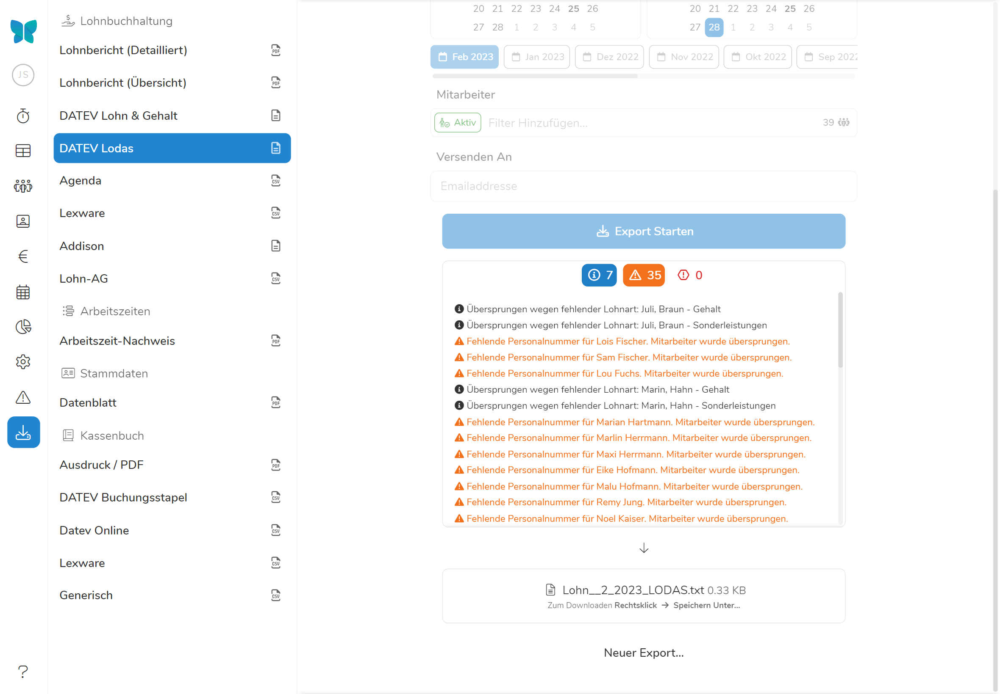

Unter dem Menüpunkt  sind alle in Pentacode verfügbaren Datenexporte an einem Ort zusammengefasst. Hier finden Sie verschiede Optionen zum Export von Arbeitszeiten, Lohnberichten und mehr.

> **In den verschiedenen Bereichen von Pentacode finden Sie öfters das -Symbol, dieses verweist Sie stets in den hier beschriebenen Reiter.**

## Exportformat

Sie können über den -Reiter verschiedene Dateien mit unterschiedlichen Inhalten exportieren. Je nach Inhalt und Zweck werden die Dateien dabei in unterschiedlichem Dateienformat exportiert, die verschiedenen Icons neben der Exportfunktion geben dabei Auskunft über das Format:

-  Der Export findet in ein PDF-Format statt.
-  Der Export findet als Textdatei statt, die extern eingelesen werden muss.
-  Der Export findet in ein CSV-Format statt. 

### Lohnbuchhaltung

Hier finden Sie alle Exportoptionen, die der Lohnvorbereitung und -dokumentation dienen. Die verschiedenen Optionen umfassen dabei: 

- *Lohnbericht (Übersicht):* In der Lohnbericht-Übersicht sind die Arbeitsstunden und -tage, sowie Zuschlagsstunden, Mitarbeiteressen und das aktuelle Gehalt in einer tabellarischen Ansicht zusammengefasst. Dieser Ausdruck ist vor allem für die Übermittlung an Ihr Lohnbüro gut geeignet und dient als Alternative zum direkten Export/Import in Ihr Lohnbuchhaltungs-Programm.

- *Lohnabrechnung (Detailliert):* Die detaillierte Lohnübersicht fasst die Inhalte des Lohnberichts mit allen Arbeits- und Abwesenheitszeiten, sowie Änderungen am Vertrag sowie dem Arbeitszeitkonto zusammen. **So haben Sie in einem Dokument alle relevanten Lohn- und Bewegungsdaten zusammengefasst!**

- *Export in Buchhaltungsprogramme:* Neben den Berichten in PDF-Form können Sie lohnabrechnungsrelevante Bewegungsdaten auch in verschiedene Lohnbuchhaltungsprogramme exportieren. 
Aktuell unterstützte Formate sind:
    - Agenda
    - Datev Lodas
    - Datev Lohn & Gehalt
    - Addison
    - Lexware
    - LohnAG

## Arbeitszeitennachweis

Unter  werden alle geleisteten Schichten für die [ausgewählten Mitarbeiter](#mitarbeiterfilter) im [ausgewählten Zeitraum](#zeitraum) mit Pausen und Gesamtdauer, sowie der Stand des Arbeitszeitkontos aufgeführt. Der Arbeitszeitennachweis ist besonders dafür sinnvoll, die Arbeitszeiten durch den Mitarbeiter [gegenzeichnen zu lassen](#unterschrift-anfordern) um Dokumentationsfehler frühzeitig aufzudecken und im Falle einer Prüfung die Bewegungsdaten der Mitarbeiter vorlegen zu können. 

## Stammdatenblatt

Unter  werden alle unter [Stammdaten](/hilfe/handbuch/mitarbeiter/stammdaten/) aufgeführten Daten des Mitarbeiters auf einer übersichtlichen PDF-Seite aufgeführt. 
Die kann nützlich sein um Mitarbeiterdaten zu übertragen - **achten Sie dabei aber immer darauf, dass es sich hierbei um sensible Daten handelt!**

### Kassenbuch

Auf die gleiche Art und Weise wie die Lohn- und Mitarbeiterdaten können Sie auch die Inhalte des Kassenbuchs übertragen. Dies dient dem einfachen Export des in Pentacodes geführten Kassenbuch in die Lohnbuchhaltungssoftware ihrer Wahl. Die verschiedenen Formate, die Ihnen zur Verfügung stehen umfassen neben einem einfachen Ausdruck als PDF:

- DATEV Buchungsstapel
- DATEV online
- Lexware
- Generisch (Alle Kasssenbucheinträge als standardmäßige CSV-Datei für den Import in verschiedene Programme)

## Exportoptionen

Nachdem Sie [das gewünschte Exportformat](#exportformat) ausgewählt haben, können Sie durch weitere Optionen den Export personalisieren. 

## Zeitraum

Im vorgegebenen Kalender können Sie auf der linken Seite das Anfangsdatum und auf der rechten Seite das Enddatum des Zeitraums auswählen, für den die Dateien exportiert werden sollen. Sollten Sie einen Export für **einen ganzen Monat** erstellen wollen, können Sie diesen aus der Liste vergangener Monate unter dem Kalender auswählen. 





## Mitarbeiterfilter

Im Mitarbeiterfilter können wir auswählen für welche Mitarbeitergruppen wir einen Export erstellen wollen. Dazu können wir über die Filterleiste die gewünschten Mitarbeiter über Abteilungen oder einzeln auswählen. Dabei ist zu beachten, dass Filteroptionen sich **untereinander weiter beschränken.**

Hierzu ein Beispiel: Wir wählen im Filter die Vertragsart 'Festangestellt' und die Abteilung 'Küche' aus. Nun werden nur die Mitarbeiter ausgewählt, die **sowohl festangestellt, als auch in der Küche tätig sind.** Wählen wir nun zusätzlich die Abteilung 'Service', werden alle Festangestellten angezeigt, welche in **Küche, Service oder in beiden Abteilungen tätig sind.**





> **Tipp:** Durch die Auswahl einer Abteilung und eines spezifischen Mitarbeiters werden nur die Arbeitszeiten und Lohndaten exportiert, die dieser Mitarbeiter **innerhalb der gewählten Abteilung** besitzt.





## Per Email versenden

Bei sämtlichen Exporten steht Ihnen die Option zur Verfügung im Feld **Versenden an...** eine Email-Adresse einzutragen, an die Sie eine Kopie des Exports verschicken wollen. Dies kann bspw. nützlich sein, um ihrer Buchhaltung vereinfacht Lohndaten zukommen zu lassen. 
**Einmal eingegeben wird die Email Adresse automatisch ausgefüllt und stets eine Kopie sämtlicher Exporte verschickt!**
-- Option für mehrere Emails

## Im Dokumentenarchiv ablegen

Für den Arbeitszeitennachweis sowie den detaillierten Lohnbericht bietet Pentacode Ihnen die Möglichkeit die exportierte Datei zusätzlich im Dokumentenarchiv des Mitarbeiters zu speichern. Wählen Sie dazu die Option  an. 

### Kategorie auswählen

Sobald Sie **Im Dokumentenarchiv ablegen** angewählt haben, erscheint zusätzlich die Option das Dokument mit einer Kategorie zu versehen. Diese hilft Ihnen die gewünschte Datei schneller ausfindig zu machen. Weitere Informationen zu den Dokumentenkategorien finden Sie [hier](/hilfe/handbuch/einstellungen/dokumente). 

> Sie sollten die gleiche Art von Dokument am besten stets mit der gleichen Kategorie versehen - Also etwa alle Arbeitszeitnachweise mit **'Arbeitszeiten'**. 

### Unterschrift anfordern

Wenn Sie **Im Dokumentenarchiv ablegen** angewählt haben erscheint für Arbeitszeitnachweise zusätzlich die Möglichkeit ihren Mitarbeiter aufzufordern diese gegenzuzeichnen und zu bestätigen. Dieser wird anschließend eine Nachricht in seiner [Mitarbeiterapp](/hilfe/handbuch/mitarbeiter-app/ bekommen welche Ihn auf die Anfrage aufmerksam macht. Einmal unterzeichnet wird das Dokument anschließend so im Dokumentenarchiv des Mitarbeiters hinterlegt. 

> Wir empfehlen Ihnen ihre Mitarbeiter stets dazu aufzufordern den Arbeitszeitennachweis mit einer Unterschrift zu bestätigen - dies gibt Ihnen Sicherheit im Falle einer Prüfung und deckt Missverständnisse frühzeitig auf. Nutzen Sie dazu wie oben beschrieben die Funktion **Unterschrift anfordern**. Dazu muss der Mitarbeiter jedoch einen [Zugang besitzen](/hilfe/handbuch/mitarbeiter/allgemein/)

## Fehlermeldungen

Da der korrekte Export in ihr Buchhaltungsprogramm auf einige Daten wie **Personalnummern und Lohnarten** angewiesen ist, werden Sie eventuell darauf aufmerksam gemacht, sollten Daten unvollständig sein. Pentacode unterscheidet dabei drei verschiedene Meldungen:

-  Hier werden Ihnen Informationen bspw. zu fehlenden Lohnarten angegeben. Diese können in der Regel übersprungen werden, geben Ihnen aber Hinweise, für welche Mitarbeiter Personaldaten fehlen.
-  Sind **Warnungen**, die Sie darauf aufmerksam machen, dass der Lohnbericht so nicht von ihrer Lohnbuchhaltung zu verwenden ist. Diese Punkte sollten Sie möglichst beheben.
-  Sind Fehlermeldungen, die den Export des Lohnberichts verhindern. Bis diese behoben sind, ist ein Export nicht möglich. 





## Dateien herunterladen und drucken

Sobald Sie auf  klicken, bietet Ihnen Pentacode mehrere Optionen an:

-  *Öffnen* Hier wird eine Vorschau der Datei in ihrem Browser oder in Excel geöffnet.
-  *Downloaden* Sie laden die Dateien zusammengefasst in einem Ordner herunter. Dabei wir für die Nachweise und Berichte jedes Mitarbeiters eine eigene Datei innerhalb des Ordners erstellt.
-  *Drucken* Die Durckvorschau wird geöffnet, mit einem für den Druck optimierten Format der Datei. 
