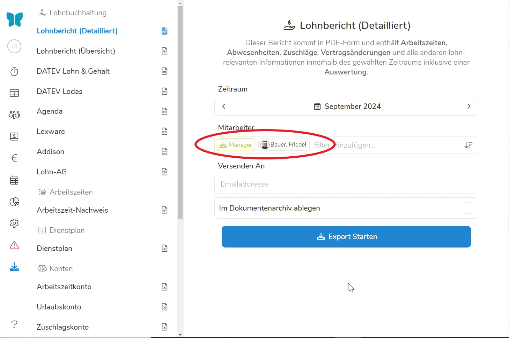

Unter Datenexport können Sie Daten von Pentacode zusammengefasst herunterladen. In den verschiedenen Gebieten von Pentacode finden Sie öfters das **-Symbol**, dieses verweißt Sie stets zum Reiter Datenexport von dem Sie die Daten zusammengefasst herunterladen können. 

-- Datenexport bis jetzt lokalisieren
-- 

## Lohnbuchhaltung

### Lohnbericht Übersicht

In der Lohnbericht-Übersicht, sind die Arbeitsstunden und -tage, sowie Zuschlagsstunden, Mitarbeiteressen und das aktuelle Gehalt in einer tabellarischen Ansicht zusammengefasst. Dieser Ausdruck ist vor allem für die Übermittlung an Ihr Lohnbüro gut geeignet und dient als Alternative zum direkten Export/Import in Ihr Lohnbuchhaltungs-Programm.
Wählen Sie dazu unter **Lohnbericht (Übersicht)** den gewünschten Zeitraum aus. Unter **Mitarbeiter** können Sie nun auswählen für wen Sie die Lohnberichtübersicht erstellen wollen - dabei können Sie ganze Abteilungen oder einzelne Mitarbeiter auswählen. Wählen Sie eine **Abteilung und einen Mitarbeiter werden Ihnen nur die Lohndaten der Schichten des Mitarbeiters in dieser Abteilung angezeigt**.
Geben Sie eine Email Adresse in das Feld über  ein, um die Lohnberichtsübersicht direkt zu verschicken. 

{% figure caption="Hier Exportieren wir die Lohnberichte aller Manager - wie das -**Symbol** zeigt ist davon nur ein Mitarbeiter betroffen" %}



### Lohnabrechnung Detailliert

> Im Falle einer Prüfung ist es empfehlenswert, dem Prüfer für eine Stichprobenkontrolle einzelne Ausdrucke der "Lohnabrechnung" zu überlassen. Die offensichtliche Transparenz, Richtigkeit und Glaubwürdigkeit Ihrer Dokumentation durch Pentacode kann den Prüfungsvorgang u.U. erheblich beschleunigen.

### Export In Buchhaltungsprogramme

Neben den oben genannten Ausdrucken können Sie lohnabrechnungs-relevante Bewegungsdaten auch in verschieden Lohnbuchhaltungs-Programme exportieren. Wählen Sie dazu das gewünschte Format unter **Lohnbuchhaltung** aus und gehen Sie gleich vor wie bei der normalen Lohnabrechnung.
Aktuell unterstützte Formate sind:

- Agenda
- Datev Lodas
- Datev Lohn & Gehalt
- Addison
- Lexware
- LohnAG

-- 

>  **Hinweis:** Mit der Ausnahme von **LohnAG** erfordert der Export in Buchhaltungsprogramme
> die Erstellung von **Lohnartensätzen**. Mehr Informationen zur Konfiguration von Lohnarten finden Sie unter
> [Einstellungen/Buchhaltung](/hilfe/handbuch/einstellungen/buchhaltung#lohnarten).

## Arbeitszeiten Exportieren

Pentacode bietet Ihnen einige Optionen, die Arbeitszeiten einzelner Mitarbeiter oder ganzer Abteilungen zu exportieren, sei es für Archivierungszwecke, zur Überprüfung durch den Mitarbeiter oder für die Übermittlung in die Lohnbuchhaltung.

### Nachweis erstellen

Um den Arbeitszeitennachweis zu erstellen navigieren Sie in den Reiter **Datenexport** und klicken auf . Wählen Sie nun im Kalender erst einmal den Zeitraum aus, für den Sie den Nachweis erstellen wollen. Soll es ein **Monatsnachweis** sein, können Sie auch gleich einen ganzen Monat unter dem Kalender auswählen. 
Wählen Sie nun unter **Mitarbeiter** aus, für wen Sie den Nachweis erstellen wollen. Sie können dabei alle Mitarbeiter, bestimmte Anstellungsverhältnisse, ganze Abteilungen oder einzelne Mitarbeiter auswählen. Wenn Sie **eine Abteilung und einen Mitarbeiter auswählen, werden nur die Arbeitszeiten des Mitarbeiters in dieser Abteilung exportiert!**





Sollten Sie **den Nachweis direkt per Email verschicken** wollen - können Sie die Empfängeradresse direkt beim Exportieren mit angeben.

**Im Dokumentenarchiv ablegen** sichert eine Kopie des Arbeitszeitennachweises im Dokumentenarchiv des Mitarbeiters und gewährt diesem auch Zugriff darauf. So, dass mit dem Anwählen von **Unterschrift anfordern** der Mitarbeiter den Nachweis auch direkt bestätigen kann, und Ihnen die Absicherung gibt - ganz ohne das Dokument jemals audrucken zu müssen. 

Klicken Sie nun auf  werden Ihnen die Arbeitszeitnachweise zum **herunterladen bereitgestellt**. Sollten Sie mehrere Mitarbeiter ausgewählt haben finden Sie diese als einzelne Dokumente in einem Ordner. 

### Der Nachweis

Der "**Arbeitszeiten Nachweis**" listet die täglichen Arbeitszeiten mit ihrem jeweiligen Anfang und Ende, den Ruhepausen und die bezahlten Arbeitsstunden.





Sie können das jeweilige **Datum** und die **Position des Mitarbeiters** auf der linken Seite des Dokuments sehen. Normalerweise ist in der **Dauer** der Schicht die Pause bereits abgezogen, bezahlen Sie hingegen Pausen werden diese nicht von der Dauer abgezogen. 

> Wir empfehlen Ihnen, die Arbeitszeitnachweise jedes Monats auszudrucken und von Ihren Mitarbeitern **unterzeichnen** zu lassen. Dieser Ausdruck dient zum einen als **Nachweis** bei Überprüfungen durch die jeweiligen Prüfungsbehörden. Zum anderen bestätigt der Mitarbeiter mit der Unterschrift die Richtigkeit der Dokumentation. Dies dient Ihrem Schutz vor späteren Anfechtungen.





### Lohnabrechnung Individuell

Der Ausdruck "**Lohnabrechnung Individuell**" weist neben den Angaben des "Arbeitszeiten Nachweis" auch die eventuellen Sonn-,
Feiertags- und Nachtarbeitsstunden, sowie die Anzahl eventueller Mahlzeiten aus. Am Fußende sehen Sie die
**Zusammenfassung** nach Stunden und die daraus resultierenden jeweiligen **Euro**-Beträge. Die Lohnangaben beziehen
sich dabei auf das **Arbeitgeber-Brutto**. Dieser Nachweis dient vor allem Ihrer **internen** Dokumentation und ist
nicht zwingend geeignet, den Mitarbeitern ausgehändigt zu werden.

Um die indviduelle Lohnabrechnung eines **einzelnen Mitarbeiters** auszudrucken, gehen Sie in das
[Arbeitszeitblatt](#das-arbeitszeitblatt) des Mitarbeiters, klicken den -Button in
der linken unteren Ecke und wählen die Option "Lohnabrechnung".

Um die indivuellen Lohnabrechnungen **aller Mitarbeiter** auszudrucken, gehen Sie in die
[Arbeitszeiten-Übersicht](#arbeitszeiten-übersicht), klicken den -Button in
der rechten oberen Ecke und wählen die Option "Lohnabrechnung Individuell".

> Im Falle einer Prüfung ist es empfehlenswert, dem Prüfer für eine Stichprobenkontrolle einzelne Ausdrucke der "Lohnabrechnung" zu überlassen. Die offensichtliche Transparenz, Richtigkeit und Glaubwürdigkeit Ihrer Dokumentation durch Pentacode kann den Prüfungsvorgang u.U. erheblich beschleunigen.

## Datenblatt exportieren

Im Datenexportmenü können Sie auch eine übersichtliche Kopie der Stammdaten ihrer Mitarbeiter anfordern. Klicken Sie dazu auf  und wählen wieder die Abteilungen oder einzelnen Mitarbeiter deren Daten Sie exportieren möchten. Auch hier haben Sie wieder die Möglichkeit das **Datenblatt direkt an eine Email Adresse zu verschicken**. Geben Sie dazu die Empfängeradresse in das Textfeld unter **Versenden an** ein. Mit einem Klick auf  stehen Ihnen die Daten dann wieder zum Download bereit. 

## Kassenbuch

## 